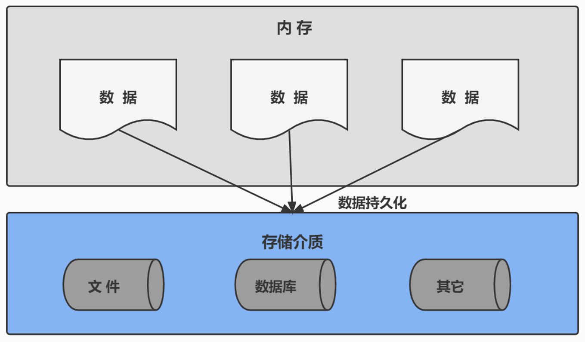

# 1. 为什么要使用数据库

> 所属章节：MySQL 基礎篇 / 第一章_數據庫概述
> 建議回查情境：想确认为什么不能只把数据放在内存里、想比较数据库和文件存储差异、想回顾数据持久化概念时

## 本节导读

这一节主要说明：为什么应用中的数据不能只放在内存里，以及数据库在持久化、统一管理、查询效率和数据一致性方面能解决什么问题。

如果你是第一次学数据库，建议先理解“数据为什么会丢”“为什么文件存储不够用”这两个问题；如果是复习，可以先看 `关键字`，再回到正文中的例子和对比。

## 关键字

- `数据库`：用于长期保存和管理数据
- `数据持久化`：把数据从内存保存到外部存储
- `persistence`：持久化的英文术语
- `内存`：程序运行时临时保存数据的位置
- `硬盘`：常见的持久化存储设备
- `长期保存`：数据库的重要价值之一
- `统一管理`：数据库可集中组织大量数据
- `快速查询`：数据库支持按条件检索和统计
- `并发访问`：多个用户或程序可同时使用数据
- `数据安全`：数据库在安全和一致性方面更有优势
- `一致性`：减少数据重复、错误和冲突
- `文本文件` `Excel` `XML`：数据库之外的常见数据存储方式
- `订单数据` `成绩数据`：数据库常见应用场景示例

## 你会在这篇学到什么

- 为什么程序运行时的数据不能只放在内存中。
- 数据库相比文本文件、Excel、XML 的优势。
- 什么是数据持久化，以及数据库为什么常用于实现持久化。
- 哪些业务数据通常需要交给数据库管理。

## 建议阅读顺序

- 第一次学习时，先看 `1.1` 理解“为什么数据会丢”，再看 `1.2` 认识数据库解决的问题，最后结合 `1.3` 建立“持久化”的概念。
- 快速复习时，可以优先回看 `1.2` 和 `1.5`，先抓住数据库的核心价值，再按需查看例子。
- 如果你接下来要学习 `DB`、`DBMS` 和 `SQL` 的关系，可以在读完本节后继续看 [2 数据库与数据库管理系统](./2%20数据库与数据库管理系统.md)。

## 1.1 为什么应用数据不能只放在内存中

在开发应用时，数据不能只保存在内存中。因为一旦程序关闭、电脑断电，内存中的数据就会丢失。  
例如：用户信息、商品信息、订单记录、成绩数据，这些内容都需要被**长期保存**，并且能够随时查询、修改和管理。

这就是为什么要使用数据库。

## 1.2 数据库能解决哪些问题

数据库不仅能保存数据，还能帮助我们更高效地处理数据，例如：

- 持久化存储：程序关闭后，数据仍然存在。
- 统一管理：把大量数据集中组织起来，避免混乱。
- 快速查询：可以按条件查找、排序、统计数据。
- 方便共享：多个用户或多个程序可以共同访问同一份数据。
- 保证一致性：减少数据重复、错误和互相冲突的问题。

如果只是把数据零散地写进文本文件、Excel 或 XML 文件中，虽然也能保存内容，但在查询、共享、修改和统一维护上通常会越来越困难。数据库的价值，就在于它不仅“能存”，而且“更适合长期管理和使用”。

## 1.3 什么是数据持久化

> 持久化（persistence）：**把数据保存到可掉电式存储设备中，以供之后使用。**

大多数情况下，特别是在企业级应用中，数据持久化指的是：  
**将原本存放在内存中的数据，保存到硬盘等外部存储设备中。**

而数据库正是实现数据持久化的常见方式之一。相比直接写入文本文件、Excel 或 XML 文件，数据库在**数据管理、查询效率、并发访问、数据安全**等方面更有优势。

上图说明了数据从程序运行时的内存，保存到外部存储中的过程。

## 1.4 哪些场景通常需要数据库

生活中的例子：

- 电商平台需要保存用户、商品、订单数据。
- 学校系统需要保存学生、课程、成绩信息。
- 银行系统需要保存账户余额和交易记录。

这些数据都不能丢失，而且还需要被频繁查询和更新，因此通常会交给数据库来管理。

## 1.5 小结

数据库的核心价值不只是“保存数据”，更重要的是让数据能够被长期保存、统一管理、快速查询，并在多人或多个程序同时访问时保持相对安全和一致。

理解这一点后，再继续学习 [2 数据库与数据库管理系统](./2%20数据库与数据库管理系统.md)，会更容易分清 `数据库`、`DBMS` 和 `SQL` 分别扮演什么角色。

## 延伸阅读

- [2 数据库与数据库管理系统](./2%20数据库与数据库管理系统.md)
- [返回课程总目录](../../README.md)
