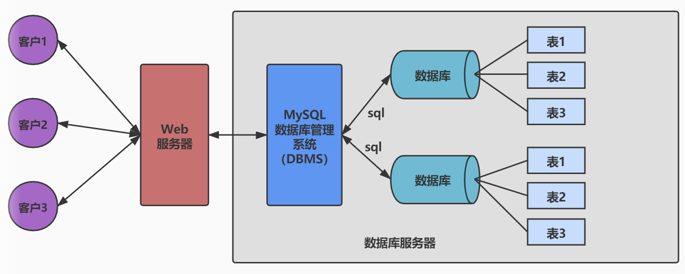
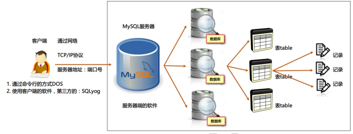

# 2. 数据库与数据库管理系统

> 所属章节：MySQL 基礎篇 / 第一章_數據庫概述
> 建議回查情境：分不清 `DB`、`DBMS`、`SQL` 时，想确认数据库层级关系时，或需要快速回顾 MySQL 到底属于哪一类概念时
> 上一节：[1 为什么要使用数据库](./1%20为什么要使用数据库.md)
> 下一节：[3 MySQL 介绍](./3%20MySQL%20介绍.md)

## 本节导读

这一节主要用来区分三个最容易混在一起的基础概念：`数据库（DB）`、`数据库管理系统（DBMS）` 和 `SQL`，并建立它们之间的层级关系。

学习这节时，重点不是死记缩写，而是弄清楚“数据放在哪里”“谁负责管理”“我们靠什么命令去操作”这三个角色分别是谁。

如果你是第一次学习，建议先看 `2.1` 和 `2.2`，先把三个概念和它们之间的层级关系分清楚；如果你是复习，可以先看 `快速定位`、`关键字` 和 `2.5 常见混淆点`。

## 你会在这篇学到什么

- `数据库（DB）`、`数据库管理系统（DBMS）` 和 `SQL` 的角色差异。
- `DBMS > DB > Table > Row` 这条层级关系。
- 为什么通常要通过 DBMS 管理数据库，而不是直接操作数据库文件。
- MySQL、Oracle、SQL Server、PostgreSQL、SQLite 这类名称为什么通常指 DBMS 产品。

## 快速定位

- `2.1` 什么是数据库、DBMS 和 SQL
- `2.2` 三者之间的关系
- `2.3` 为什么需要数据库管理系统
- `2.4` 常见的数据库管理系统
- `2.5` 常见混淆点
- `2.6` 小结与下一步

## 关键字

- `数据库`：用来存放数据的有组织空间
- `DB`：`Database` 的缩写
- `数据库管理系统`：管理数据库的软件
- `DBMS`：`Database Management System` 的缩写
- `SQL`：操作数据库的结构化查询语言
- `表`：数据库中组织数据的基本结构
- `记录`：表中的一行数据
- `Row` `Table`：表和记录的常见英文术语
- `DBMS > DB > Table > Row`：数据库层级关系
- `MySQL`：常见的数据库管理系统
- `Oracle` `SQL Server` `PostgreSQL` `SQLite`：常见 DBMS 产品
- `权限管理` `备份恢复`：DBMS 的常见职责
- `数据管理`：DBMS 的核心作用

## 建议阅读顺序

- 第一次学习时，先读 `2.1` 分清三个基础概念，再读 `2.2` 建立层级关系，最后看 `2.3` 理解为什么数据库通常要搭配 DBMS 使用。
- 快速复习时，可以先看 `2.5`，确认自己最容易混淆的点，再回到前面的定义和例子。
- 如果你读完后想继续认识 MySQL 本身，可以接着看 [3 MySQL 介绍](./3%20MySQL%20介绍.md)；如果你想先认识 SQL 这门语言，可以继续看 [第三章：1 SQL 概述](../第三章_基本的SELECT语句/1%20SQL%20概述.md)。

在学习 MySQL 之前，先分清楚三个最基础的概念：**数据库（DB）**、**数据库管理系统（DBMS）** 和 **SQL**。很多初学者会把它们混在一起，但它们其实不是同一个东西。

## 2.1 什么是数据库、DBMS 和 SQL

- **数据库（DB，Database）**：用来存放数据的地方。你可以把它理解为一个有组织的数据仓库。
- **数据库管理系统（DBMS，Database Management System）**：用来创建、管理和维护数据库的软件。
- **SQL（Structured Query Language）**：用来和数据库打交道的语言，例如查询、插入、修改、删除数据。

### 一个直观类比

可以用一个简单的类比来理解：

- 数据库像是一个仓库。
- DBMS 像是仓库管理员。
- SQL 像是你和管理员沟通时使用的指令。

也就是说，**用户通常不是直接操作数据库文件，而是通过 DBMS，使用 SQL 来管理数据。**

## 2.2 三者之间的关系

在实际开发中，我们通常先安装一个数据库管理系统，例如 MySQL。然后由 MySQL 帮我们创建数据库，再在数据库中创建表，最后把数据存到表中。

关系可以简单理解为：

**DBMS > 数据库（DB） > 表（Table） > 记录（Row）**

### 用电商系统做例子

例如，一个电商系统中：

- MySQL 是数据库管理系统。
- `shop` 是一个数据库。
- `users`、`products`、`orders` 是数据库中的表。
- 每一条用户资料、商品资料、订单资料，都是表中的一条记录。

上图可以帮助你理解：一个 DBMS 可以管理多个数据库，而一个数据库中又可以包含多张表。

这张图进一步说明了数据库、表和数据之间的层级关系。

## 2.3 为什么需要数据库管理系统

如果只有数据库文件，没有 DBMS，那么数据虽然存在，但我们很难方便地完成以下工作：

- 创建和删除数据库、表
- 查询、插入、更新、删除数据
- 控制多个用户同时访问数据
- 做权限管理、备份恢复和安全控制

因此，**数据库负责存数据，DBMS 负责把这些数据管理起来。**

### 可以这样记

- `数据库` 偏向“数据放在哪里”。
- `DBMS` 偏向“谁来管理这些数据”。
- `SQL` 偏向“我们用什么方式操作这些数据”。

## 2.4 常见的数据库管理系统

常见的 DBMS 有很多，学习时先知道它们的定位即可：

- **MySQL**：开源、常见，适合教学、中小型项目和互联网应用。
- **Oracle**：商业数据库，常见于大型企业系统。
- **SQL Server**：微软推出，常用于 .NET 生态。
- **PostgreSQL**：功能完整、标准支持好，适合对数据能力要求较高的场景。
- **SQLite**：轻量级嵌入式数据库，常见于移动端或本地应用。

本课程后续主要学习的是 **MySQL**。

如果你想继续了解 MySQL 本身是什么、为什么常被用来入门，可以接着阅读 [3 MySQL 介绍](./3%20MySQL%20介绍.md)。如果你想先对 SQL 建立整体认识，可以继续阅读 [第三章：1 SQL 概述](../第三章_基本的SELECT语句/1%20SQL%20概述.md)。

## 2.5 常见混淆点

- **数据库 vs DBMS**：数据库偏向“存放数据的地方”，DBMS 偏向“管理数据库的软件”。
- **DBMS vs SQL**：DBMS 是软件系统，SQL 是和 DBMS 沟通、操作数据时使用的语言。
- **MySQL vs 某个具体数据库**：MySQL 通常指数据库管理系统；`shop`、`school` 这类才更像某个具体数据库的名称。
- **表 vs 记录**：表是组织数据的结构，记录是表中的一行具体数据。

## 2.6 小结

学完这一节，你需要记住：

- **数据库（DB）** 是存放数据的地方。
- **数据库管理系统（DBMS）** 是管理数据库的软件。
- **SQL** 是操作数据库时使用的语言。

以后提到 MySQL 时，要明确它通常指的是一个 **DBMS**，而不是单独某一个数据库。

## 延伸阅读

- [1 为什么要使用数据库](./1%20为什么要使用数据库.md)
- [3 MySQL 介绍](./3%20MySQL%20介绍.md)
- [第三章：1 SQL 概述](../第三章_基本的SELECT语句/1%20SQL%20概述.md)
- [返回课程总目录](../../README.md)
