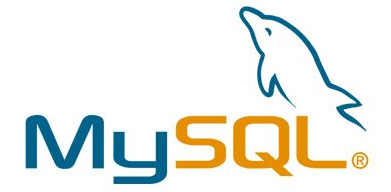
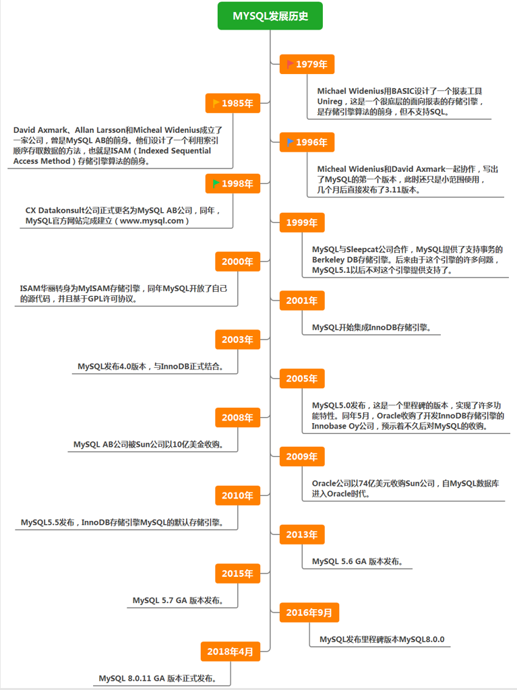

# 3. MySQL 介绍

## 关键字

- `MySQL`：常见的关系型数据库管理系统
- `RDBMS`：关系型数据库管理系统的缩写
- `开源`：MySQL 的重要特点之一
- `SQL`：操作 MySQL 数据的核心语言
- `表`：MySQL 组织数据的基本方式
- `主键`：表中用于唯一标识记录的重要字段
- `MySQL 5.7` `MySQL 8.0`：常见主流版本
- `Oracle`：MySQL 后期归属的公司
- `社区版`：MySQL 常见免费版本
- `跨平台`：MySQL 可运行于多种操作系统
- `生态成熟`：MySQL 广泛流行的重要原因
- `PostgreSQL` `Oracle` `SQLite`：常见对比数据库
- `数据库入门`：MySQL 的典型学习定位

在前面我们已经知道，**数据库**是存放数据的地方，**DBMS** 是管理数据库的软件。  
而 **MySQL**，就是目前非常常见的一种**关系型数据库管理系统（RDBMS）**。

## 3.1 什么是 MySQL

MySQL 是一个开源的关系型数据库管理系统，最早由 MySQL AB 公司开发，后来经历了 Sun 和 Oracle 的收购。  
它的主要作用，是帮助我们创建数据库、建立数据表，并使用 SQL 对数据进行增删改查。

之所以说 MySQL 是“关系型”数据库，是因为它通常以**表（Table）**的形式组织数据，并通过字段、主键等方式描述数据之间的关系。

上图可以帮助你建立一个直观印象：MySQL 是一个数据库软件，而不是某一张具体的数据表。

## 3.2 MySQL 有哪些特点

MySQL 之所以被广泛使用，通常是因为它具备以下特点：

- **开源且使用成本较低**：社区版可以免费使用，适合学习和很多实际项目。
- **容易上手**：安装、使用和维护门槛相对较低。
- **性能较好**：在常见 Web 应用和中小型业务场景中表现稳定。
- **生态成熟**：资料多、社区活跃，遇到问题更容易找到解决方案。
- **支持标准 SQL**：便于学习数据库基础知识，也方便后续迁移到其他数据库系统。
- **跨平台**：可以运行在多种操作系统上，并能配合多种开发语言使用。

对于初学者来说，MySQL 很适合作为学习数据库的第一站。

## 3.3 为什么很多项目会选择 MySQL

一个项目选择数据库时，通常会考虑成本、性能、维护难度和社区支持。  
MySQL 在这些方面比较均衡，因此在教学环境、个人项目、中小型网站以及许多互联网系统中都很常见。

常见原因包括：

- 使用成本低
- 学习资料丰富
- 部署和维护相对简单
- 足以满足大量常见业务场景

这张图主要表达的是：MySQL 兼顾了易用性、稳定性和普及度，因此长期受到开发者欢迎。

## 3.4 MySQL 的发展背景

MySQL 的发展和互联网应用的成长密切相关。随着网站、社交、电商和企业系统的数据量不断增加，开发者对数据库提出了更高要求，例如：

- 查询要更快
- 并发能力要更强
- 运行要更稳定
- 管理和维护要更方便

这些需求推动了 MySQL 不断演进。

这张图可以作为了解 MySQL 发展历程的参考，帮助你知道它为什么会成为主流数据库之一。

## 3.5 关于 MySQL 8.0

在实际学习和工作中，你经常会听到 MySQL 5.7 和 MySQL 8.0。  
其中，**MySQL 8.0 是目前较新的主流大版本**，在功能、性能和易用性方面都比旧版本更完善。

对于入门者来说，最重要的不是记住版本细节，而是先掌握这些核心能力：

- 如何创建数据库和数据表
- 如何使用 SQL 查询和修改数据
- 如何理解表结构、主键、约束等基础概念

等基础打稳后，再去关注不同版本之间的差异会更容易。

## 3.6 MySQL 与其他数据库的简单对比

不同数据库有不同定位，没有绝对“最好”，只有是否适合当前场景。

- **MySQL**：常见、易学、生态成熟，适合入门与大量常见业务场景。
- **Oracle**：更常见于大型企业级系统，商业属性更强。
- **PostgreSQL**：功能完整，标准支持较好，适合对数据库能力要求更高的场景。
- **SQLite**：轻量、嵌入式，适合本地应用或移动端场景。

本课程选择 MySQL，是因为它既有代表性，也足够适合初学者上手。

## 3.7 小结

这一节你需要记住：

- **MySQL 是一种关系型数据库管理系统。**
- 它使用表来组织数据，并通过 SQL 操作数据。
- 它之所以流行，是因为开源、易学、稳定、生态成熟。
- 对初学者来说，MySQL 是理解数据库基础概念的很好入口。
