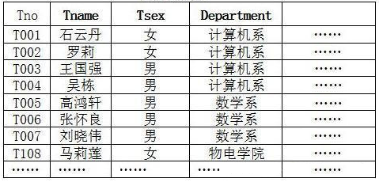
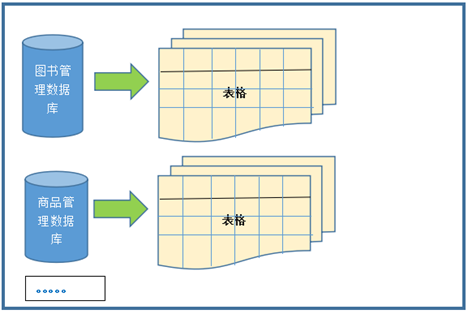
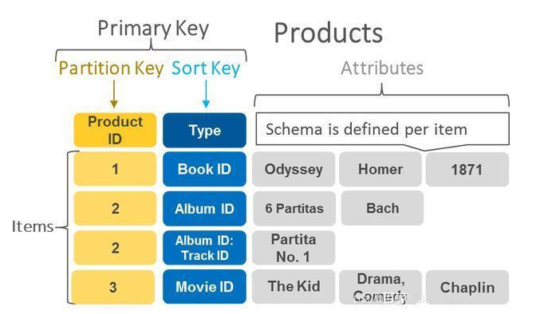
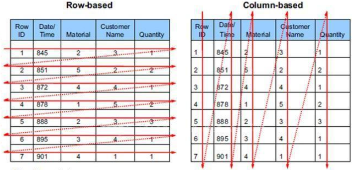

# 4. RDBMS 与非 RDBMS

## 关键字

- `RDBMS`：关系型数据库管理系统
- `NoSQL`：非关系型数据库的统称
- `二维表`：关系型数据库的典型数据组织方式
- `SQL`：关系型数据库常用查询与管理语言
- `事务`：RDBMS 常见优势之一
- `强一致性`：关系型数据库适合的重要场景特征
- `键值型`：NoSQL 的常见类型，如 `Redis`
- `文档型`：NoSQL 的常见类型，如 `MongoDB`
- `列式存储`：NoSQL 的常见类型，如 `HBase`
- `图数据库`：NoSQL 的常见类型，如 `Neo4j`
- `全文检索`：搜索引擎数据库的典型能力
- `Redis` `MongoDB` `Elasticsearch` `HBase` `Neo4j`：常见代表产品
- `复杂查询`：RDBMS 更擅长的典型场景
- `高扩展性`：NoSQL 更常见的优势方向

学习数据库时，常会遇到两个词：**RDBMS** 和 **NoSQL**。  
它们都能用来存数据，但设计思路、擅长场景和操作方式并不一样。

这一节的重点不是记住所有产品名称，而是先理解：**什么时候更适合用关系型数据库，什么时候更适合用非关系型数据库。**

## 4.1 什么是 RDBMS

**RDBMS** 的全称是 **Relational Database Management System**，也就是**关系型数据库管理系统**。  
像 MySQL、Oracle、SQL Server、PostgreSQL，都属于这一类。

关系型数据库最典型的特点是：**使用二维表来组织数据**。

- 一张表由行（Row）和列（Column）组成。
- 多张表之间可以通过字段建立关联关系。
- 通常使用 SQL 来查询和管理数据。

例如，在一个电商系统中：

- `users` 表保存用户信息
- `products` 表保存商品信息
- `orders` 表保存订单信息

这些表之间可以通过用户编号、商品编号等字段建立联系。

上图展示了关系型数据库中“表”的基本结构。

这张图更适合说明：一个数据库中通常会包含多张表。  
至于表与表之间的“关系”，通常需要通过主键、外键等字段建立，这也是“关系型数据库”名称的来源。

## 4.2 RDBMS 的优势

关系型数据库特别适合**结构清晰、规则明确、需要强一致性**的数据场景。

它的常见优势有：

- **适合复杂查询**：可以使用 SQL 做筛选、排序、分组、聚合、多表关联。
- **事务支持较好**：适合订单、转账、库存等不能出错的业务。
- **数据结构明确**：表结构固定，数据更容易统一管理。
- **生态成熟**：理论体系、工具链和实践经验都很完整。

所以，当业务非常重视**准确性、完整性和关联关系**时，RDBMS 往往是优先选择。

## 4.3 什么是非 RDBMS

非关系型数据库通常也被称为 **NoSQL**。  
这里的重点不是“完全没有 SQL”，而是指它**不以传统关系型表结构为核心**。

和 RDBMS 相比，NoSQL 往往更加灵活，通常会根据不同场景采用不同的数据组织方式，例如：

- 键值型（Key-Value）
- 文档型（Document）
- 列式存储（Column-family）
- 图数据库（Graph）

这类数据库通常更强调：

- 高性能
- 高扩展性
- 灵活的数据结构

## 4.4 常见的 NoSQL 类型

### 1. 键值型数据库

键值型数据库用 `Key -> Value` 的方式存数据，读取速度通常很快。  
典型场景是缓存、会话信息、排行榜等。

常见产品：**Redis**

这类数据库适合按 Key 快速取值，但不擅长复杂条件查询。

### 2. 文档型数据库

文档型数据库常用 JSON 这类结构来存储数据。  
它适合字段不固定、结构变化较频繁的业务场景。

常见产品：**MongoDB**

### 3. 搜索引擎数据库

这类数据库擅长全文检索，例如搜索文章、商品、日志内容。  
它的核心优势不是事务，而是搜索能力和检索效率。

常见产品：**Elasticsearch、Solr**

### 4. 列式数据库

列式数据库按“列”而不是按“行”来组织数据，更适合海量数据分析和统计场景。

常见产品：**HBase**

这张图可以帮助你理解“按行存储”和“按列存储”的差别。

### 5. 图数据库

图数据库专门处理“关系特别复杂”的数据，例如社交网络、推荐系统、路径分析等。

常见产品：**Neo4j**

图数据库更擅长处理节点与节点之间的复杂关系。

## 4.5 RDBMS 与 NoSQL 的简单对比

可以先这样理解两者的区别：

- **RDBMS**：表结构清楚，适合强一致性、复杂查询、事务型业务。
- **NoSQL**：结构更灵活，适合高并发、快速读写、特定类型的数据场景。

举例来说：

- 银行转账、订单系统、学籍管理，更适合 RDBMS。
- 缓存、日志、全文搜索、社交关系图，更适合 NoSQL。

它们不是互相取代的关系，而是**经常配合使用**。  
一个大型系统里，可能同时使用 MySQL 和 Redis，也可能同时使用 MySQL 和 Elasticsearch。

## 4.6 小结

这一节你需要记住：

- **RDBMS** 以表为核心，擅长结构化数据管理。
- **NoSQL** 不拘泥于传统表结构，擅长解决特定场景下的性能和扩展问题。
- 两者没有绝对优劣，关键在于是否适合当前业务需求。
- 本课程后续以 **MySQL 这样的关系型数据库** 为主，因为它最适合打数据库基础。
