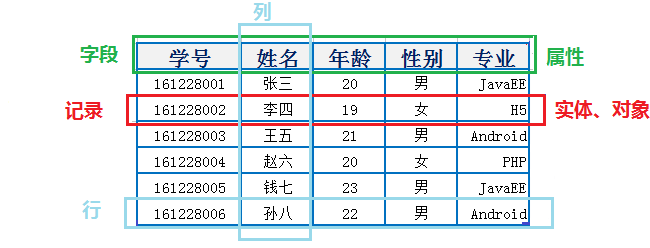
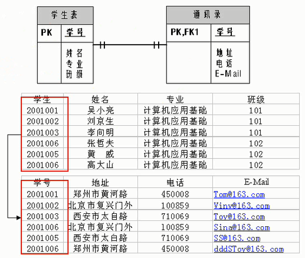
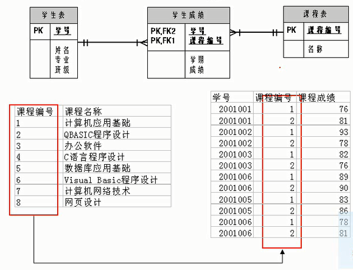
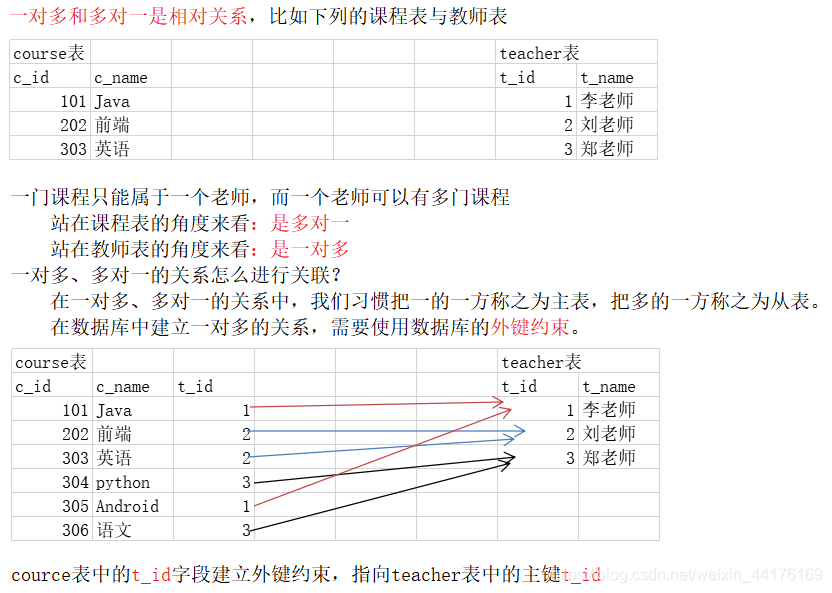
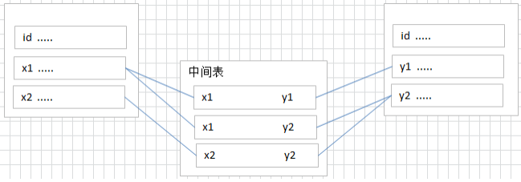
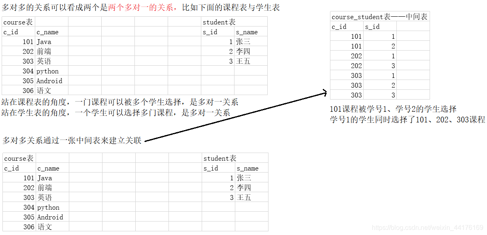
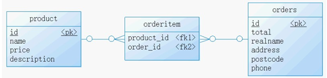
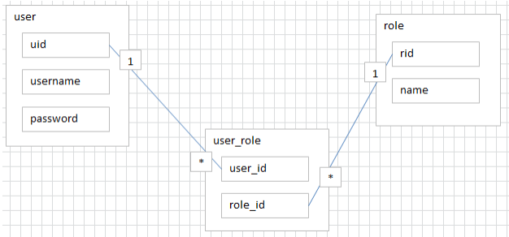
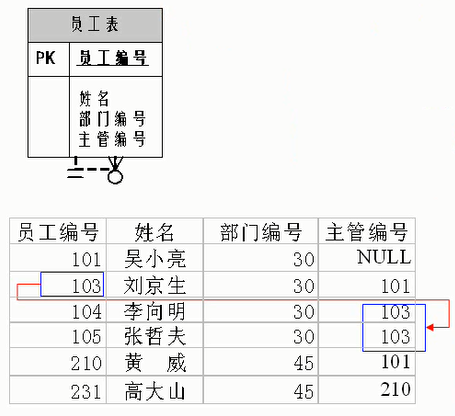

# 5. 关系型数据库设计规则

## 本节导读

这一节主要说明关系型数据库如何用表来表达现实世界中的对象，以及一对一、一对多、多对多、自我引用这些常见表关系该怎样理解。

如果你后面想真正看懂建表语句、主键和外键设计，这一节最好完整读一遍；复习时则可以优先回看各类关系的定义和建表规则。

## 关键字

- `关系型数据库`：以表为核心组织数据的数据库模型
- `表` `记录` `字段`：关系型数据库的基本组成单位
- `实体` `实体实例` `属性`：现实世界到数据表的映射概念
- `ORM`：对象关系映射的基础思路
- `表关系`：多张表之间的数据关联方式
- `一对一`：一条记录只对应另一张表中的一条记录
- `一对多`：最常见的表关系设计
- `多对多`：通常需要中间表拆解实现
- `自我引用`：同一张表中的字段关联本表主键
- `主键`：唯一标识一条记录
- `外键`：建立表与表之间关联的字段
- `中间表`：处理多对多关系的常见设计方式
- `parent_id`：自关联层级结构中的常见字段名

前面我们已经知道，关系型数据库是用“表”来组织数据的。  
这一节要解决的问题是：**一张表应该怎么看？多张表之间又该如何设计关系？**

掌握这些规则后，后面学习建表、主键、外键时会更容易理解。

## 5.1 表、记录、字段分别是什么

在关系型数据库中，最基本的数据结构就是**表（Table）**。

- **表**：用来存放同一类数据。
- **记录（Record / Row）**：表中的一行，表示一条具体数据。
- **字段（Field / Column）**：表中的一列，表示某个属性。

例如，在“学生表”中：

- 表：`student`
- 一条记录：某一个学生的信息
- 字段：学号、姓名、班级、手机号



上图展示了表、行、列之间的基本关系。

## 5.2 如何把现实世界映射到数据表

设计数据库时，通常会先从现实中的“对象”出发，再把它们转换成表结构。

可以先这样理解：

- 一个**实体**，通常对应数据库中的一张表。
- 一个**实体实例**，通常对应表中的一条记录。
- 一个**属性**，通常对应表中的一个字段。

例如：

- “学生”可以设计成一张表
- “某位具体学生”是一条记录
- “姓名”“学号”“联系电话”是字段

如果你学过 Java 或 Python，也可以这样类比：

- 数据库中的一张表，对应程序中的一个类
- 表中的一条记录，对应类的一个对象
- 表中的一个字段，对应类的一个属性

这种思想通常叫做 **ORM（Object Relational Mapping）** 的基础映射思路。

## 5.3 为什么表与表之间需要关联

现实业务中，数据通常不是孤立存在的。  
例如：

- 一个部门有多个员工
- 一个客户可以有多个订单
- 一个学生可以选多门课程

如果把所有信息都塞进一张大表，数据会重复很多，也不方便维护。  
因此，关系型数据库常常会把不同类型的数据拆成多张表，再通过字段把它们关联起来。

常见的表关系主要有四种：

- 一对一（One-to-One）
- 一对多（One-to-Many）
- 多对多（Many-to-Many）
- 自我引用（Self Reference）

## 5.4 一对一关系

一对一表示：**一张表中的一条记录，只对应另一张表中的一条记录。**

这种设计在实际开发中不算最常见，但在“把一张大表拆成两张表”时很有用。  
例如，一个学生的信息可以拆成：

- `学生基础信息表`：学号、姓名、班级、手机号
- `学生档案信息表`：学号、身份证号、家庭住址、紧急联系人

这样做的好处是：常用信息和不常用信息分开，结构更清楚。



常见做法有两种：

- 在从表中设置一个唯一外键，指向主表主键
- 让从表主键同时也是外键

## 5.5 一对多关系

一对多表示：**主表中的一条记录，可以对应从表中的多条记录。**

这是最常见的表关系之一，例如：

- 一个部门对应多个员工
- 一个分类对应多个商品
- 一个客户对应多个订单

例如，在“部门”和“员工”这个场景中：

- `department` 表保存部门信息
- `employee` 表保存员工信息
- 一个部门可以有很多员工

设计规则是：**把主表的主键，放到从表中作为外键。**





也就是说，一对多关系通常在“多的一方”保存外键。

## 5.6 多对多关系

多对多表示：**两张表中的一条记录，都可能对应对方的多条记录。**

例如：

- 一个学生可以选多门课程
- 一门课程也可以被多个学生选择

这时不能直接在任一方表中硬塞一个字段来解决，通常需要**第三张中间表**。



中间表的作用是：把原本的多对多，拆成两个一对多。

常见规则：

- 新建一张中间表
- 中间表至少包含两个字段
- 这两个字段分别作为外键，指向两边表的主键



例如“学生选课”场景：

- `student`：学生信息
- `course`：课程信息
- `student_course`：选课关系

示意数据如下：

```text
学号    课程编号
1       1001
2       1001
1       1002
```

这表示：

- 学号为 1 的学生选了两门课
- 课程编号为 1001 的课程被两个学生选择

另一个常见例子是“订单”和“商品”的关系，它们通常通过“订单明细表”关联：



用户与角色的关系，也常常是多对多：



## 5.7 自我引用关系

自我引用表示：**一张表中的字段，关联到这张表自己的主键。**

这种设计适合表达层级关系，例如：

- 员工与上级
- 分类与父分类
- 部门与上级部门



例如，在分类表中可以增加 `parent_id` 字段，指向同一张表中的分类编号，用来表示“谁是谁的上级分类”。

## 5.8 小结

这一节你需要记住：

- 关系型数据库以表为基本单位。
- 表由记录（行）和字段（列）组成。
- 现实世界中的对象，通常会被拆解成多张表来设计。
- 常见表关系有一对一、一对多、多对多、自我引用。
- 其中最常见的是一对多，多对多通常需要借助中间表实现。
