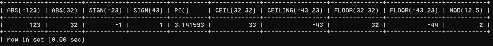
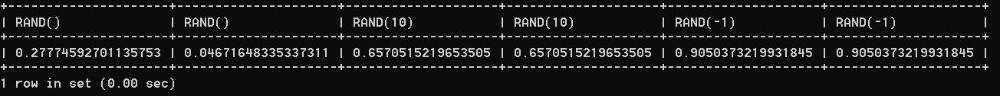
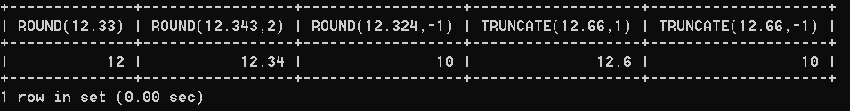
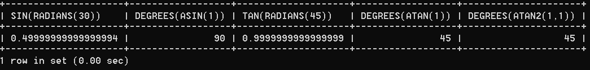

# 2 数值函数

> 所属章节：[第七章_单行函数](./README.md)
> 关键字：数值函数、ABS、ROUND、TRUNCATE、RAND、三角函数、对数函数、进制转换
> 建议回查情境：忘了常见数值函数怎么分组、需要快速确认某个函数用途，或想比较 `ROUND()`、`TRUNCATE()`、`RAND()`、`LOG()` 这类函数时

## 本节导读

这一节把 MySQL 中最常见的数值函数按用途整理成五组：基础函数、角度与弧度互换函数、三角函数、指数与对数函数，以及进制转换函数。

第一次阅读时，建议先看 `2.1 基本函数`，把最常见的取整、绝对值、随机数和四舍五入函数建立起来，再按需要继续看三角函数、对数函数和进制转换。复习时如果只想快速查函数用途，可以直接使用下方的“快速定位”和各节中的函数表。

## 你会在这篇学到什么

- 常见基础数值函数分别解决什么问题。
- `ROUND()` 和 `TRUNCATE()` 的差别。
- `RADIANS()` 与 `DEGREES()` 如何在角度和弧度之间转换。
- 三角函数、指数对数函数和进制转换函数各自适合什么场景。
- 阅读函数表时，如何先按类别缩小查找范围。

## 快速定位

- `2.1 基本函数`：看绝对值、符号、圆周率、取整、取余、随机数、四舍五入和截断。
- `2.2 角度与弧度互换函数`：看 `RADIANS()` 和 `DEGREES()`。
- `2.3 三角函数`：看 `SIN()`、`COS()`、`TAN()`、`ASIN()`、`ACOS()`、`ATAN()`、`ATAN2()`、`COT()`。
- `2.4 指数与对数`：看 `POW()`、`EXP()`、`LN()`、`LOG10()`、`LOG2()`。
- `2.5 进制间的转换`：看 `BIN()`、`HEX()`、`OCT()`、`CONV()`。

## 快速回查表

| 场景 | 优先看什么 | 说明 |
| --- | --- | --- |
| 想取绝对值、判断正负或做取整 | `2.1 基本函数` | 这是最常用的一组数值函数 |
| 想控制保留几位小数 | `ROUND()`、`TRUNCATE()` | 一个会四舍五入，一个是直接截断 |
| 想生成随机数 | `RAND()` | 指定种子后可重复得到相同随机结果 |
| 想做角度与弧度互换 | `2.2 角度与弧度互换函数` | 三角函数经常要先配合这组函数 |
| 想做三角运算 | `2.3 三角函数` | 注意输入通常是弧度值 |
| 想算幂、指数或对数 | `2.4 指数与对数` | 对数函数在参数小于等于 `0` 时通常返回 `NULL` |
| 想看二进制、八进制、十六进制表示 | `2.5 进制间的转换` | 适合做编码表示与进制换算 |

## 建议阅读顺序

- 第一次学习时，建议按 `2.1 -> 2.2 -> 2.3 -> 2.4 -> 2.5` 的顺序阅读，先掌握高频函数，再看偏数学化的函数类别。
- 如果你现在只是忘了“某个函数怎么用”，可以直接从对应的小节函数表开始查。
- 如果你最常混淆的是小数处理方式，优先回看 `ROUND()` 和 `TRUNCATE()`。

## 2.1 基本函数

这一组是最常用的数值函数，主要用来处理绝对值、符号、取整、取余、随机数和小数位控制。

| 函数 | 用法 |
| --- | --- |
| `ABS(x)` | 返回 `x` 的绝对值 |
| `SIGN(x)` | 返回 `x` 的符号。正数返回 `1`，负数返回 `-1`，`0` 返回 `0` |
| `PI()` | 返回圆周率的值 |
| `CEIL(x)` / `CEILING(x)` | 返回大于或等于某个值的最小整数 |
| `FLOOR(x)` | 返回小于或等于某个值的最大整数 |
| `LEAST(e1,e2,e3...)` | 返回列表中的最小值 |
| `GREATEST(e1,e2,e3...)` | 返回列表中的最大值 |
| `MOD(x,y)` | 返回 `x` 除以 `y` 后的余数 |
| `RAND()` | 返回 `0` 到 `1` 之间的随机值 |
| `RAND(x)` | 返回 `0` 到 `1` 之间的随机值，其中 `x` 作为种子值；相同种子会产生相同结果 |
| `ROUND(x)` | 对 `x` 做四舍五入，返回最接近 `x` 的整数 |
| `ROUND(x,y)` | 对 `x` 做四舍五入，并保留小数点后 `y` 位 |
| `TRUNCATE(x,y)` | 将数字 `x` 直接截断为 `y` 位小数 |
| `SQRT(x)` | 返回 `x` 的平方根；当 `x` 为负数时返回 `NULL` |

### 示例

```sql
SELECT
    ABS(-123),
    ABS(32),
    SIGN(-23),
    SIGN(43),
    PI(),
    CEIL(32.32),
    CEILING(-43.23),
    FLOOR(32.32),
    FLOOR(-43.23),
    MOD(12, 5)
FROM DUAL;
```



```sql
SELECT
    RAND(),
    RAND(),
    RAND(10),
    RAND(10),
    RAND(-1),
    RAND(-1)
FROM DUAL;
```



```sql
SELECT
    ROUND(12.33),
    ROUND(12.343, 2),
    ROUND(12.324, -1),
    TRUNCATE(12.66, 1),
    TRUNCATE(12.66, -1)
FROM DUAL;
```



### 使用提醒

- `ROUND()` 会四舍五入，`TRUNCATE()` 不会，它只是直接截断。
- `RAND(x)` 在种子值相同的情况下会得到相同结果，适合做可重复演示或测试。
- `CEIL()` 与 `FLOOR()` 在处理负数时特别容易记错，建议结合示例一起记忆。

## 2.2 角度与弧度互换函数

这组函数通常是三角函数的前置工具，因为很多三角函数都要求参数使用弧度值。

| 函数 | 用法 |
| --- | --- |
| `RADIANS(x)` | 将角度转换为弧度，其中参数 `x` 为角度值 |
| `DEGREES(x)` | 将弧度转换为角度，其中参数 `x` 为弧度值 |

```sql
SELECT
    RADIANS(30),
    RADIANS(60),
    RADIANS(90),
    DEGREES(2 * PI()),
    DEGREES(RADIANS(90))
FROM DUAL;
```

## 2.3 三角函数

三角函数主要处理正弦、余弦、正切及其反函数。使用这类函数时，最需要先确认的是：输入值到底是角度还是弧度。

| 函数 | 用法 |
| --- | --- |
| `SIN(x)` | 返回 `x` 的正弦值，其中参数 `x` 为弧度值 |
| `ASIN(x)` | 返回 `x` 的反正弦值；如果 `x` 不在 `-1` 到 `1` 之间，则返回 `NULL` |
| `COS(x)` | 返回 `x` 的余弦值，其中参数 `x` 为弧度值 |
| `ACOS(x)` | 返回 `x` 的反余弦值；如果 `x` 不在 `-1` 到 `1` 之间，则返回 `NULL` |
| `TAN(x)` | 返回 `x` 的正切值，其中参数 `x` 为弧度值 |
| `ATAN(x)` | 返回 `x` 的反正切值 |
| `ATAN2(m,n)` | 返回两个参数的反正切值 |
| `COT(x)` | 返回 `x` 的余切值，其中参数 `x` 为弧度值 |

### `ATAN2(m,n)` 为什么单独值得注意

`ATAN2(m,n)` 返回两个参数的反正切值。和 `ATAN(x)` 相比，`ATAN2(m,n)` 需要两个参数。

例如有两个点 `point(x1,y1)` 和 `point(x2,y2)`：

- 使用 `ATAN(x)` 时，通常会写成 `ATAN((y2-y1)/(x2-x1))`
- 使用 `ATAN2(m,n)` 时，则可以写成 `ATAN2(y2-y1, x2-x1)`

从这里可以看出，当 `x2 - x1 = 0` 时，`ATAN(x)` 的表达式可能会出现除以 `0` 的问题，而 `ATAN2(m,n)` 仍然可以计算，因此在处理坐标、方向或夹角时更稳妥。

### 示例

```sql
SELECT
    SIN(RADIANS(30)),
    DEGREES(ASIN(1)),
    TAN(RADIANS(45)),
    DEGREES(ATAN(1)),
    DEGREES(ATAN2(1, 1))
FROM DUAL;
```



## 2.4 指数与对数

这一组函数主要用来处理幂运算、指数运算和不同底数的对数运算。

| 函数 | 用法 |
| --- | --- |
| `POW(x,y)` / `POWER(x,y)` | 返回 `x` 的 `y` 次方 |
| `EXP(x)` | 返回 `e` 的 `x` 次方，其中 `e` 是常数 `2.718281828459045` |
| `LN(x)` / `LOG(x)` | 返回以 `e` 为底的 `x` 的对数；当 `x <= 0` 时返回 `NULL` |
| `LOG10(x)` | 返回以 `10` 为底的 `x` 的对数；当 `x <= 0` 时返回 `NULL` |
| `LOG2(x)` | 返回以 `2` 为底的 `x` 的对数；当 `x <= 0` 时返回 `NULL` |

```sql
SELECT
    POW(2, 5),
    POWER(2, 4),
    EXP(2),
    LN(10),
    LOG10(10),
    LOG2(4)
FROM DUAL;

+----------+------------+------------------+-------------------+-----------+---------+
| POW(2,5) | POWER(2,4) | EXP(2)           | LN(10)            | LOG10(10) | LOG2(4) |
+----------+------------+------------------+-------------------+-----------+---------+
|       32 |         16 | 7.38905609893065 | 2.302585092994046 |         1 |       2 |
+----------+------------+------------------+-------------------+-----------+---------+
```

## 2.5 进制间的转换

这一组函数用来查看数值在不同进制下的表示方式，或直接做进制转换。

| 函数 | 用法 |
| --- | --- |
| `BIN(x)` | 返回 `x` 的二进制编码 |
| `HEX(x)` | 返回 `x` 的十六进制编码 |
| `OCT(x)` | 返回 `x` 的八进制编码 |
| `CONV(x,f1,f2)` | 将 `f1` 进制的数转换为 `f2` 进制 |

```sql
SELECT
    BIN(10),
    HEX(10),
    OCT(10),
    CONV(10, 2, 8)
FROM DUAL;

+---------+---------+---------+--------------+
| BIN(10) | HEX(10) | OCT(10) | CONV(10,2,8) |
+---------+---------+---------+--------------+
| 1010    | A       | 12      | 2            |
+---------+---------+---------+--------------+
```

## 常见混淆点

- `ROUND()` 是四舍五入，`TRUNCATE()` 是直接截断，两者结果可能不同。
- 三角函数大多默认接收弧度值，不是角度值；如果你手上是角度，通常要先用 `RADIANS()`。
- `ATAN2(m,n)` 和 `ATAN(x)` 不只是“参数个数不同”，它们在处理坐标关系时的稳定性也不同。
- `LN()` / `LOG()`、`LOG10()`、`LOG2()` 在参数小于等于 `0` 时通常不会报普通数值结果，而是返回 `NULL`。
