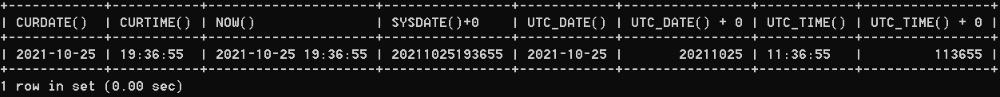

# 4.1 获取当前日期与时间

> 所属章节：[第七章_单行函数 / 4 日期和时间函数](./README.md)
> 关键字：CURDATE、CURTIME、NOW、SYSDATE、UTC_DATE、UTC_TIME
> 建议回查情境：忘了当前日期和当前时间该用哪个函数，或分不清“只要日期”“只要时间”“日期时间一起要”时

## 本节导读

这一节整理最基础的一组日期时间函数，重点是分清楚：哪些函数只返回日期，哪些只返回时间，哪些会同时返回日期与时间，以及 UTC 时间和本地系统时间的区别。

## 你会在这篇学到什么

- `CURDATE()`、`CURTIME()`、`NOW()`、`SYSDATE()` 各自返回什么
- 哪些函数只取日期，哪些只取时间
- UTC 时间函数和本地时间函数的差别

## 快速定位

- 只想拿当前日期：看 `CURDATE()` / `CURRENT_DATE()`
- 只想拿当前时间：看 `CURTIME()` / `CURRENT_TIME()`
- 想拿当前日期和时间：看 `NOW()`、`SYSDATE()`、`CURRENT_TIMESTAMP()`
- 想拿 UTC 标准时间：看 `UTC_DATE()`、`UTC_TIME()`

## 函数表

| 函数 | 用法 |
| --- | --- |
| `CURDATE()` / `CURRENT_DATE()` | 返回当前日期，只包含年、月、日 |
| `CURTIME()` / `CURRENT_TIME()` | 返回当前时间，只包含时、分、秒 |
| `NOW()` / `SYSDATE()` / `CURRENT_TIMESTAMP()` / `LOCALTIME()` / `LOCALTIMESTAMP()` | 返回当前系统日期和时间 |
| `UTC_DATE()` | 返回 UTC（世界标准时间）日期 |
| `UTC_TIME()` | 返回 UTC（世界标准时间）时间 |

## 示例

```sql
SELECT
    CURDATE(),
    CURTIME(),
    NOW(),
    SYSDATE() + 0,
    UTC_DATE(),
    UTC_DATE() + 0,
    UTC_TIME(),
    UTC_TIME() + 0
FROM DUAL;
```



## 使用提醒

- `CURDATE()` 和 `CURTIME()` 只返回一部分，不包含完整日期时间。
- `NOW()` 与 `SYSDATE()` 都常被用来取当前时间，但在某些执行语义上存在差异；入门阶段先把它们理解成“当前日期时间函数”即可。
- 处理跨时区场景时，要先确认你要的是本地时间还是 UTC 时间。

## 返回导航

- [回到 4 日期和时间函数](./README.md)
- [下一节：02 日期与时间戳的转换](./02%20日期与时间戳的转换.md)
