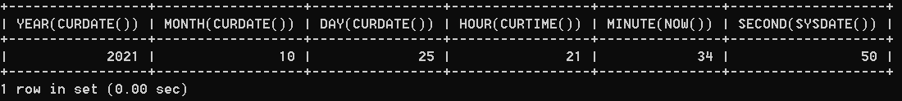
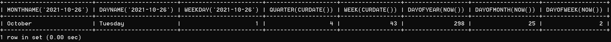

# 4.3 获取月份星期天数等信息

> 所属章节：[第七章_单行函数 / 4 日期和时间函数](./README.md)
> 关键字：YEAR、MONTH、DAY、MONTHNAME、DAYNAME、WEEK、DAYOFYEAR、DAYOFWEEK
> 建议回查情境：需要从日期里取出年、月、日、星期、季度、周数或一年中的第几天时

## 本节导读

这一节关注的是“拆日期”。当你已经拿到一个日期或时间值，接下来常见需求往往不是直接显示它，而是拆出年份、月份、星期、季度、周数或当天在一年中的序号。

## 函数表

| 函数 | 用法 |
| --- | --- |
| `YEAR(date)` / `MONTH(date)` / `DAY(date)` | 返回具体的日期值 |
| `HOUR(time)` / `MINUTE(time)` / `SECOND(time)` | 返回具体的时间值 |
| `MONTHNAME(date)` | 返回月份名称，如 `January` |
| `DAYNAME(date)` | 返回星期名称，如 `MONDAY`、`TUESDAY` |
| `WEEKDAY(date)` | 返回周几，注意周一是 `0`，周日是 `6` |
| `QUARTER(date)` | 返回日期对应的季度，范围为 `1` 到 `4` |
| `WEEK(date)` / `WEEKOFYEAR(date)` | 返回一年中的第几周 |
| `DAYOFYEAR(date)` | 返回日期是一年中的第几天 |
| `DAYOFMONTH(date)` | 返回日期位于所在月份的第几天 |
| `DAYOFWEEK(date)` | 返回周几，注意周日是 `1`，周六是 `7` |

## 示例

```sql
SELECT
    YEAR(CURDATE()),
    MONTH(CURDATE()),
    DAY(CURDATE()),
    HOUR(CURTIME()),
    MINUTE(NOW()),
    SECOND(SYSDATE())
FROM DUAL;
```



```sql
SELECT
    MONTHNAME('2021-10-26'),
    DAYNAME('2021-10-26'),
    WEEKDAY('2021-10-26'),
    QUARTER(CURDATE()),
    WEEK(CURDATE()),
    DAYOFYEAR(NOW()),
    DAYOFMONTH(NOW()),
    DAYOFWEEK(NOW())
FROM DUAL;
```



## 常见混淆点

- `WEEKDAY()` 和 `DAYOFWEEK()` 的编号规则不同，最容易记错。
- `MONTHNAME()`、`DAYNAME()` 返回的是英文名称，不是数字。
- `WEEK()` 的结果会受周起始定义影响，跨系统时要留意规则一致性。

## 返回导航

- [回到 4 日期和时间函数](./README.md)
- [上一节：02 日期与时间戳的转换](./02%20日期与时间戳的转换.md)
- [下一节：04 日期字段提取与 EXTRACT](./04%20日期字段提取与%20EXTRACT.md)
