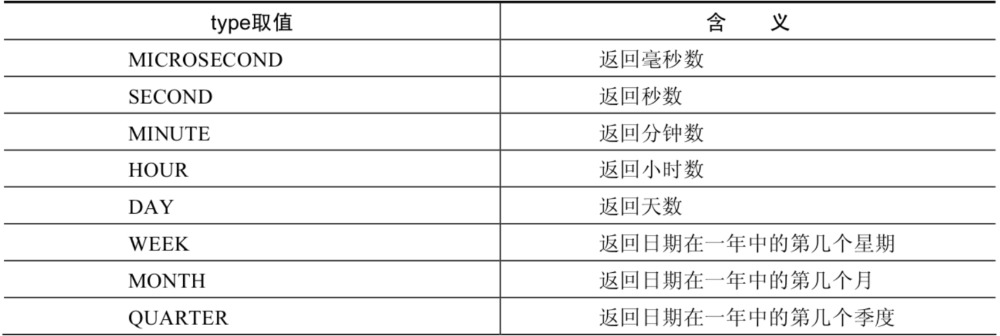
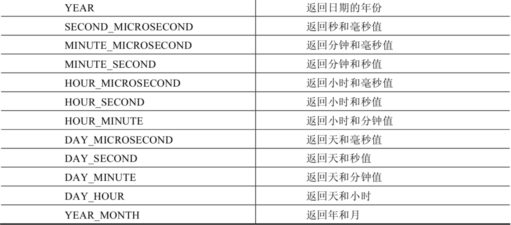

# 4.4 日期字段提取与 EXTRACT

> 所属章节：[第七章_单行函数 / 4 日期和时间函数](./README.md)
> 关键字：EXTRACT、YEAR、WEEK、QUARTER、MINUTE_SECOND
> 建议回查情境：需要从日期中提取指定部分，或要一次取出复合时间字段时

## 本节导读

`EXTRACT(type FROM date)` 是日期函数中很实用的一类写法。它的特点是：你不需要记很多独立函数名，只要指定要提取的部分，就能从日期时间值中拿到对应结果。

## 函数表

| 函数 | 用法 |
| --- | --- |
| `EXTRACT(type FROM date)` | 返回指定日期中特定的部分，`type` 决定返回的值 |

## `type` 的取值与含义





## 示例

```sql
SELECT
    EXTRACT(MINUTE FROM NOW()),
    EXTRACT(WEEK FROM NOW()),
    EXTRACT(QUARTER FROM NOW()),
    EXTRACT(MINUTE_SECOND FROM NOW())
FROM DUAL;
```

## 使用提醒

- `EXTRACT()` 很适合统一风格的日期提取写法。
- 当你需要提取复合字段时，例如 `MINUTE_SECOND`，`EXTRACT()` 往往比单独组合多个函数更直接。

## 返回导航

- [回到 4 日期和时间函数](./README.md)
- [上一节：03 获取月份星期天数等信息](./03%20获取月份星期天数等信息.md)
- [下一节：05 时间与秒数转换](./05%20时间与秒数转换.md)
