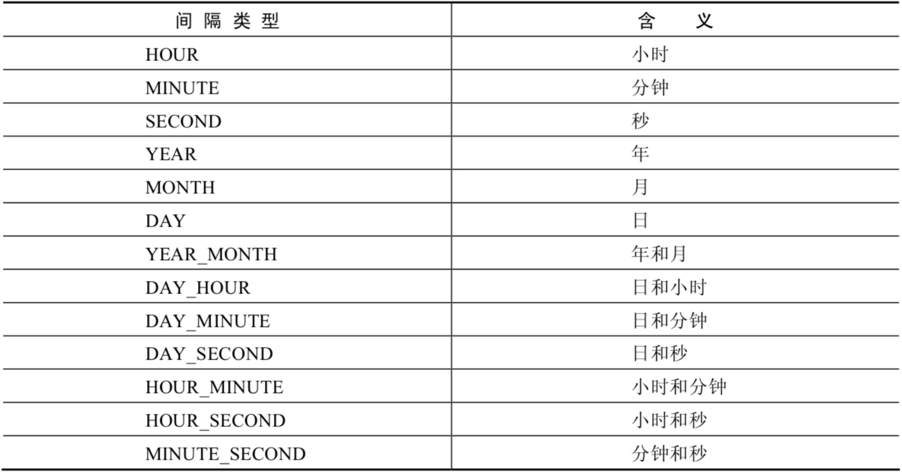

# 4.6 日期时间的加减与计算

> 所属章节：[第七章_单行函数 / 4 日期和时间函数](./README.md)
> 关键字：DATE_ADD、DATE_SUB、ADDTIME、SUBTIME、DATEDIFF、TIMEDIFF、LAST_DAY、TO_DAYS
> 建议回查情境：需要做日期加减、时间加减、区间差值计算，或统计最近几天数据时

## 本节导读

这一节是日期时间函数里最偏“实战”的部分。前面几节偏向获取和拆解，这一节则开始真正做运算，例如往后推一天、往前减一个月、计算两个日期差几天，或判断某个用户是不是最近 7 天内注册。

## 快速定位

- 想给日期加减指定间隔：看 `DATE_ADD()`、`ADDDATE()`、`DATE_SUB()`、`SUBDATE()`
- 想给时间值加减秒数或时分秒：看 `ADDTIME()`、`SUBTIME()`
- 想计算相差几天或相差多久：看 `DATEDIFF()`、`TIMEDIFF()`
- 想拿月底日期、某年第几天对应日期、某个时间组合：看 `LAST_DAY()`、`MAKEDATE()`、`MAKETIME()`
- 想用天数做快速区间判断：看 `TO_DAYS()`

## 4.6.1 第 1 组：按时间间隔做日期加减

| 函数 | 用法 |
| --- | --- |
| `DATE_ADD(datetime, INTERVAL expr type)` / `ADDDATE(date, INTERVAL expr type)` | 返回与给定日期时间相差 `INTERVAL` 时间段的日期时间 |
| `DATE_SUB(date, INTERVAL expr type)` / `SUBDATE(date, INTERVAL expr type)` | 返回与 `date` 相差 `INTERVAL` 时间间隔的日期 |



### 示例

```sql
SELECT
    DATE_ADD(NOW(), INTERVAL 1 DAY) AS col1,
    DATE_ADD('2021-10-21 23:32:12', INTERVAL 1 SECOND) AS col2,
    ADDDATE('2021-10-21 23:32:12', INTERVAL 1 SECOND) AS col3,
    DATE_ADD('2021-10-21 23:32:12', INTERVAL '1_1' MINUTE_SECOND) AS col4,
    DATE_ADD(NOW(), INTERVAL -1 YEAR) AS col5,
    DATE_ADD(NOW(), INTERVAL '1_1' YEAR_MONTH) AS col6
FROM DUAL;
```

```sql
SELECT
    DATE_SUB('2021-01-21', INTERVAL 31 DAY) AS col1,
    SUBDATE('2021-01-21', INTERVAL 31 DAY) AS col2,
    DATE_SUB('2021-01-21 02:01:01', INTERVAL '1 1' DAY_HOUR) AS col3
FROM DUAL;
```

## 4.6.2 第 2 组：差值计算与日期辅助函数

| 函数 | 用法 |
| --- | --- |
| `ADDTIME(time1,time2)` | 返回 `time1` 加上 `time2` 后的时间；当 `time2` 为数字时表示秒，可以为负数 |
| `SUBTIME(time1,time2)` | 返回 `time1` 减去 `time2` 后的时间；当 `time2` 为数字时表示秒，可以为负数 |
| `DATEDIFF(date1,date2)` | 返回 `date1 - date2` 的日期间隔天数 |
| `TIMEDIFF(time1,time2)` | 返回 `time1 - time2` 的时间间隔 |
| `FROM_DAYS(n)` | 返回从 `0000-01-01` 起第 `n` 天之后的日期 |
| `TO_DAYS(date)` | 返回日期 `date` 距离 `0000-01-01` 的天数 |
| `LAST_DAY(date)` | 返回 `date` 所在月份的最后一天 |
| `MAKEDATE(year,n)` | 针对给定年份与该年中的第 `n` 天返回日期 |
| `MAKETIME(hour,minute,second)` | 将给定的小时、分钟和秒组合成时间并返回 |
| `PERIOD_ADD(time,n)` | 返回 `time` 加上 `n` 后的结果 |

### 示例

```sql
SELECT
    ADDTIME(NOW(), 20),
    SUBTIME(NOW(), 30),
    SUBTIME(NOW(), '1:1:3'),
    DATEDIFF(NOW(), '2021-10-01'),
    TIMEDIFF(NOW(), '2021-10-25 22:10:10'),
    FROM_DAYS(366),
    TO_DAYS('0000-12-25'),
    LAST_DAY(NOW()),
    MAKEDATE(YEAR(NOW()), 12),
    MAKETIME(10, 21, 23),
    PERIOD_ADD(20200101010101, 10)
FROM DUAL;
```

```sql
SELECT ADDTIME(NOW(), 50);
+---------------------+
| ADDTIME(NOW(), 50)  |
+---------------------+
| 2019-12-15 22:17:47 |
+---------------------+
1 row in set (0.00 sec)

SELECT ADDTIME(NOW(), '1:1:1');
+-------------------------+
| ADDTIME(NOW(), '1:1:1') |
+-------------------------+
| 2019-12-15 23:18:46     |
+-------------------------+
1 row in set (0.00 sec)
```

```sql
SELECT SUBTIME(NOW(), '1:1:1');
+-------------------------+
| SUBTIME(NOW(), '1:1:1') |
+-------------------------+
| 2019-12-15 21:23:50     |
+-------------------------+
1 row in set (0.00 sec)

SELECT SUBTIME(NOW(), '-1:-1:-1');
+----------------------------+
| SUBTIME(NOW(), '-1:-1:-1') |
+----------------------------+
| 2019-12-15 22:25:11        |
+----------------------------+
1 row in set, 1 warning (0.00 sec)
```

```sql
SELECT FROM_DAYS(366);
+----------------+
| FROM_DAYS(366) |
+----------------+
| 0001-01-01     |
+----------------+
1 row in set (0.00 sec)
```

```sql
SELECT MAKEDATE(2020, 1);
+------------------+
| MAKEDATE(2020,1) |
+------------------+
| 2020-01-01       |
+------------------+
1 row in set (0.00 sec)

SELECT MAKEDATE(2020, 32);
+-------------------+
| MAKEDATE(2020,32) |
+-------------------+
| 2020-02-01        |
+-------------------+
1 row in set (0.00 sec)
```

```sql
SELECT MAKETIME(1, 1, 1);
+-----------------+
| MAKETIME(1,1,1) |
+-----------------+
| 01:01:01        |
+-----------------+
1 row in set (0.00 sec)
```

```sql
SELECT PERIOD_ADD(20200101010101, 1);
+------------------------------+
| PERIOD_ADD(20200101010101,1) |
+------------------------------+
|               20200101010102 |
+------------------------------+
1 row in set (0.00 sec)
```

```sql
SELECT TO_DAYS(NOW());
+----------------+
| TO_DAYS(NOW()) |
+----------------+
|         737773 |
+----------------+
1 row in set (0.00 sec)
```

### 实战示例：查询 7 天内的新增用户数

```sql
SELECT COUNT(*) AS num
FROM new_user
WHERE TO_DAYS(NOW()) - TO_DAYS(regist_time) <= 7;
```

## 使用提醒

- `DATE_ADD()` / `DATE_SUB()` 的 `INTERVAL` 类型很多，写错单位很常见。
- `DATEDIFF()` 只关心日期差，不会返回具体时分秒。
- 用 `TO_DAYS()` 做“最近 N 天”统计时，写法很直接，适合做简单区间过滤。

## 返回导航

- [回到 4 日期和时间函数](./README.md)
- [上一节：05 时间与秒数转换](./05%20时间与秒数转换.md)
- [下一节：07 日期格式化与解析](./07%20日期格式化与解析.md)
