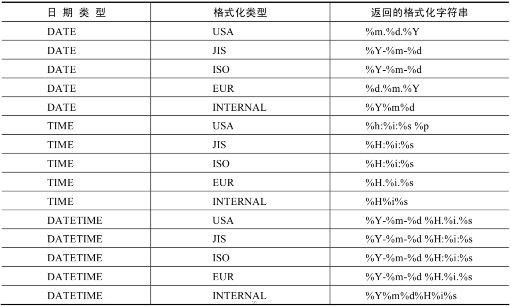

# 4.7 日期格式化与解析

> 所属章节：[第七章_单行函数 / 4 日期和时间函数](./README.md)
> 关键字：DATE_FORMAT、TIME_FORMAT、GET_FORMAT、STR_TO_DATE、格式符
> 建议回查情境：需要把日期输出成指定格式，或把字符串解析成日期时间值时

## 本节导读

这一节处理“日期怎么显示”和“字符串怎么还原成日期”。在实际开发里，这两类需求很常见：数据库里可能存的是标准日期，但页面想显示成特定格式；或者输入进来的原始字符串，需要先解析成日期后才能继续处理。

## 函数表

| 函数 | 用法 |
| --- | --- |
| `DATE_FORMAT(date,fmt)` | 按照字符串 `fmt` 格式化日期 `date` |
| `TIME_FORMAT(time,fmt)` | 按照字符串 `fmt` 格式化时间 `time` |
| `GET_FORMAT(date_type,format_type)` | 返回日期字符串的显示格式 |
| `STR_TO_DATE(str,fmt)` | 按照字符串 `fmt` 对 `str` 进行解析，转换成日期 |

## 常用格式符

| 格式符 | 说明 | 格式符 | 说明 |
| --- | --- | --- | --- |
| `%Y` | 4 位数字表示年份 | `%y` | 2 位数字表示年份 |
| `%M` | 月名表示月份（January, ...） | `%m` | 两位数字表示月份（`01`、`02`...） |
| `%b` | 缩写月名（Jan.、Feb. ...） | `%c` | 数字表示月份（`1`、`2`、`3`...） |
| `%D` | 英文后缀表示月中的天数（`1st`、`2nd`...） | `%d` | 两位数字表示月中的天数 |
| `%e` | 数字形式表示月中的天数 |  |  |
| `%H` | 两位数字表示小时，24 小时制 | `%h` / `%I` | 两位数字表示小时，12 小时制 |
| `%k` | 数字形式表示小时，24 小时制 | `%l` | 数字形式表示小时，12 小时制 |
| `%i` | 两位数字表示分钟 | `%S` / `%s` | 两位数字表示秒 |
| `%W` | 一周中的星期名称 | `%a` | 一周中的星期缩写 |
| `%w` | 数字表示周中的天数（`0 = Sunday`） |  |  |
| `%j` | 3 位数字表示年中的天数 | `%U` | 数字表示年中的第几周，其中 Sunday 为第一天 |
| `%u` | 数字表示年中的第几周，其中 Monday 为第一天 |  |  |
| `%T` | 24 小时制时间 | `%r` | 12 小时制时间 |
| `%p` | `AM` 或 `PM` | `%%` | 表示 `%` 本身 |

## `GET_FORMAT()` 参数取值



## 示例

```sql
SELECT DATE_FORMAT(NOW(), '%H:%i:%s');
+--------------------------------+
| DATE_FORMAT(NOW(), '%H:%i:%s') |
+--------------------------------+
| 22:57:34                       |
+--------------------------------+
1 row in set (0.00 sec)
```

```sql
SELECT STR_TO_DATE('09/01/2009', '%m/%d/%Y') FROM DUAL;
SELECT STR_TO_DATE('20140422154706', '%Y%m%d%H%i%s') FROM DUAL;
SELECT STR_TO_DATE('2014-04-22 15:47:06', '%Y-%m-%d %H:%i:%s') FROM DUAL;
```

```sql
SELECT GET_FORMAT(DATE, 'USA');
+-------------------------+
| GET_FORMAT(DATE, 'USA') |
+-------------------------+
| %m.%d.%Y                |
+-------------------------+
1 row in set (0.00 sec)

SELECT DATE_FORMAT(NOW(), GET_FORMAT(DATE, 'USA'))
FROM DUAL;
```

```sql
SELECT STR_TO_DATE('2020-01-01 00:00:00', '%Y-%m-%d');
+-----------------------------------------------+
| STR_TO_DATE('2020-01-01 00:00:00','%Y-%m-%d') |
+-----------------------------------------------+
| 2020-01-01                                    |
+-----------------------------------------------+
1 row in set, 1 warning (0.00 sec)
```

## 常见混淆点

- `DATE_FORMAT()` 是“日期转字符串”，`STR_TO_DATE()` 是“字符串转日期”，方向相反。
- 解析格式如果和原字符串不完全匹配，可能会得到 `NULL` 或 warning。
- `GET_FORMAT()` 适合拿预定义格式模板，但你仍然需要知道它返回的具体格式符内容。

## 返回导航

- [回到 4 日期和时间函数](./README.md)
- [上一节：06 日期时间的加减与计算](./06%20日期时间的加减与计算.md)
