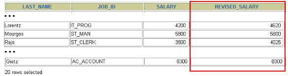

# 5 流程控制函数

> 所属章节：[第七章_单行函数](./README.md)
> 关键字：流程控制函数、IF、IFNULL、CASE WHEN、CASE expr WHEN、NULL 处理、条件分类
> 建议回查情境：忘了 SQL 里条件判断该写 `IF()` 还是 `CASE()`、想把 `NULL` 替换成默认值，或需要按状态码、薪资区间输出不同结果时

## 本节导读

这一节整理 MySQL 中最常见的流程控制函数。它们的核心作用，是让查询结果可以根据不同条件走不同分支，不再只是“把字段原样查出来”，而是能在 `SELECT` 中直接做条件判断、空值兜底和分类输出。

第一次阅读时，建议先分清三件事：`IF()` 适合简单二选一、`IFNULL()` 适合处理空值、`CASE()` 适合多条件分类。复习时如果只是想确认“这个场景该用哪一种写法”，可以直接看下面的“快速定位”和“快速回查表”。

## 你会在这篇学到什么

- `IF()`、`IFNULL()` 和 `CASE()` 分别适合什么场景。
- `CASE WHEN 条件 THEN ...` 和 `CASE 表达式 WHEN 值 THEN ...` 的差别。
- 如何在查询结果中直接输出文字标签、状态说明或计算后的工资。
- 为什么 `IFNULL()` 常用来避免计算结果因为 `NULL` 而变成空值。

## 快速定位

- 想做简单的“条件成立 / 不成立”二选一：看 `IF()`
- 想把 `NULL` 替换成默认值：看 `IFNULL()`
- 想按区间或多个条件输出不同分类：看 `CASE WHEN 条件 THEN 结果`
- 想把状态码、部门号、职位编号映射成固定结果：看 `CASE 表达式 WHEN 值 THEN 结果`
- 想看流程控制函数在工资、订单状态中的实际用法：看“典型查询场景”

## 快速回查表

| 场景 | 优先看什么 | 说明 |
| --- | --- | --- |
| 只有两个结果，成立回传 A，不成立回传 B | `IF()` | 写法最短，适合简单判断 |
| 字段可能为 `NULL`，想改成 `0` 或默认文字 | `IFNULL()` | 很常用在佣金、备注、补充说明等字段 |
| 条件是区间判断或多个不同布尔条件 | `CASE WHEN` | 比 `IF()` 更适合多分支分类 |
| 条件是固定代码映射，例如 `1/2/3/4` 对应不同状态 | `CASE expr WHEN` | 结构接近 `switch...case...` |
| 想避免计算过程因为 `NULL` 而得到空结果 | `IFNULL()` | 先把 `NULL` 转成 `0` 再计算 |

## 建议阅读顺序

- 第一次学习时，建议按 `IF() -> IFNULL() -> CASE WHEN -> CASE expr WHEN` 的顺序阅读。
- 如果你现在常遇到的是“字段有空值，算出来整列都变空”，优先回看 `IFNULL()`。
- 如果你最容易混淆的是两种 `CASE` 写法，直接看“先分清两种 `CASE()` 写法”。

## 流程控制函数总表

| 函数 | 用法 |
| --- | --- |
| `IF(value, value1, value2)` | 如果 `value` 的值为 `TRUE`，返回 `value1`，否则返回 `value2` |
| `IFNULL(value1, value2)` | 如果 `value1` 不为 `NULL`，返回 `value1`，否则返回 `value2` |
| `CASE WHEN 条件1 THEN 结果1 WHEN 条件2 THEN 结果2 ... [ELSE 结果n] END` | 按条件依次判断，类似 `if ... else if ... else` |
| `CASE expr WHEN 常量值1 THEN 值1 WHEN 常量值2 THEN 值2 ... [ELSE 值n] END` | 先比较同一个表达式，再返回对应结果，类似 `switch ... case` |

## 先分清两种 `CASE()` 写法

### `CASE WHEN 条件 THEN 结果`

这一种适合“每个分支的判断条件都不一样”的情况，例如：

- 薪资大于等于 `15000` 算高薪
- 薪资大于等于 `10000` 算潜力股
- 薪资大于等于 `8000` 算一般水平

这种写法的重点是：每个 `WHEN` 后面跟的是一个完整条件。

### `CASE expr WHEN 值 THEN 结果`

这一种适合“拿同一个字段去对比不同固定值”的情况，例如：

- `status = 1` 表示未付款
- `status = 2` 表示已付款
- `status = 3` 表示已发货

这种写法的重点是：`CASE` 后先放一个表达式，后面每个 `WHEN` 再写要比较的常量值。

## `IF()`

`IF()` 适合最简单的二选一场景。条件成立就返回一个结果，不成立就返回另一个结果。

```sql
SELECT IF(1 > 0, '正确', '错误');
-> 正确
```

如果判断逻辑开始变多，通常就该考虑改用 `CASE()`，可读性会更好。

## `IFNULL()`

`IFNULL()` 专门用来处理空值。它的思路很直接：如果前面的值不是 `NULL`，就返回原值；如果是 `NULL`，就返回备用值。

```sql
SELECT IFNULL(NULL, 'Hello Word');
-> Hello Word
```

这类函数在做数值运算时尤其常见，因为只要参与运算的值里有 `NULL`，结果通常也会变成 `NULL`。

## `CASE WHEN`

这种写法适合多个条件分支依次判断。

```sql
SELECT
    CASE
        WHEN 1 > 0 THEN '1 > 0'
        WHEN 2 > 0 THEN '2 > 0'
        ELSE '3 > 0'
    END;
-> 1 > 0
```

```sql
SELECT
    CASE
        WHEN 1 > 0 THEN 'yes'
        WHEN 1 <= 0 THEN 'no'
        ELSE 'unknown'
    END;

+---------------------------------------------------------------------+
| CASE WHEN 1 > 0 THEN 'yes' WHEN 1 <= 0 THEN 'no' ELSE 'unknown' END |
+---------------------------------------------------------------------+
| yes                                                                 |
+---------------------------------------------------------------------+
1 row in set (0.00 sec)

SELECT
    CASE
        WHEN 1 < 0 THEN 'yes'
        WHEN 1 = 0 THEN 'no'
        ELSE 'unknown'
    END;

+--------------------------------------------------------------------+
| CASE WHEN 1 < 0 THEN 'yes' WHEN 1 = 0 THEN 'no' ELSE 'unknown' END |
+--------------------------------------------------------------------+
| unknown                                                            |
+--------------------------------------------------------------------+
1 row in set (0.00 sec)
```

### 典型场景：按薪资区间打标签

```sql
SELECT
    employee_id,
    salary,
    CASE
        WHEN salary >= 15000 THEN '高薪'
        WHEN salary >= 10000 THEN '潜力股'
        WHEN salary >= 8000 THEN '屌丝'
        ELSE '草根'
    END AS "描述"
FROM employees;
```

这个例子体现了 `CASE WHEN` 最典型的用途：按不同条件把查询结果分类成几个层级。

## `CASE expr WHEN`

这种写法适合同一个字段和多个固定值做比较。

```sql
SELECT
    CASE 1
        WHEN 1 THEN '我是1'
        WHEN 2 THEN '我是2'
        ELSE '你是谁'
    END AS result;
```

```sql
SELECT
    CASE 1
        WHEN 0 THEN 0
        WHEN 1 THEN 1
        ELSE -1
    END;

+------------------------------------------------+
| CASE 1 WHEN 0 THEN 0 WHEN 1 THEN 1 ELSE -1 END |
+------------------------------------------------+
|                                              1 |
+------------------------------------------------+
1 row in set (0.00 sec)

SELECT
    CASE -1
        WHEN 0 THEN 0
        WHEN 1 THEN 1
        ELSE -1
    END;

+-------------------------------------------------+
| CASE -1 WHEN 0 THEN 0 WHEN 1 THEN 1 ELSE -1 END |
+-------------------------------------------------+
|                                              -1 |
+-------------------------------------------------+
1 row in set (0.00 sec)
```

### 典型场景：状态码映射

```sql
SELECT
    oid,
    `status`,
    CASE `status`
        WHEN 1 THEN '未付款'
        WHEN 2 THEN '已付款'
        WHEN 3 THEN '已发货'
        WHEN 4 THEN '确认收货'
        ELSE '无效订单'
    END AS `订单状态`
FROM t_order;
```

当你手上是订单状态、部门编号、等级代码这类“固定代码值”时，这种写法通常最直观。

## 典型查询场景

### 计算年工资时避免 `NULL` 干扰

```sql
SELECT
    employee_id,
    12 * salary * (1 + IFNULL(commission_pct, 0)) AS annual_salary
FROM employees;
```

这里如果不先把 `commission_pct` 的 `NULL` 转成 `0`，有佣金为空的员工就可能算不出结果。

### 按职位调整工资

```sql
SELECT
    last_name,
    job_id,
    salary,
    CASE
        WHEN job_id = 'IT_PROG' THEN 1.10 * salary
        WHEN job_id = 'ST_CLERK' THEN 1.15 * salary
        WHEN job_id = 'SA_REP' THEN 1.20 * salary
        ELSE salary
    END AS "REVISED_SALARY"
FROM employees;
```



这个例子原本也可以写成 `CASE job_id WHEN ...`，但写成 `CASE WHEN job_id = ...` 后，比较容易和“条件判断型 `CASE`”联系起来。

## 练习

**题目：查询部门号为 `10`、`20`、`30` 的员工信息。若部门号为 `10`，则打印其工资的 `1.1` 倍；部门号为 `20`，则打印其工资的 `1.2` 倍；部门号为 `30`，则打印其工资的 `1.3` 倍。**

```sql
SELECT
    e.employee_id,
    e.last_name,
    e.salary,
    e.department_id,
    CASE e.department_id
        WHEN 10 THEN e.salary * 1.1
        WHEN 20 THEN e.salary * 1.2
        WHEN 30 THEN e.salary * 1.3
        ELSE e.salary
    END AS `新工資`
FROM employees e
WHERE e.department_id IN (10, 20, 30);
```

这个练习适合拿来区分两种思路：

- 如果是“同一个字段对不同固定值做映射”，优先想到 `CASE expr WHEN`
- 如果是“不同条件分别判断”，优先想到 `CASE WHEN`

## 使用提醒

- `IF()` 适合简单分支；条件一多时，`CASE()` 通常更清楚。
- `IFNULL()` 只处理“是否为 `NULL`”，不处理大小比较或复杂条件。
- `CASE WHEN` 是按顺序判断的，命中第一个满足条件的分支后就不会继续往下走。
- 写区间判断时，要留意条件顺序，通常应先写范围更严格的条件。

## 常见混淆点

- `IFNULL()` 只看是不是 `NULL`，不是“如果条件成立就返回某值”。
- `CASE WHEN` 和 `CASE expr WHEN` 看起来像，但一个比较的是条件，一个比较的是固定值。
- `CASE` 里的 `ELSE` 不是必须，但如果省略，没命中任何条件时通常会返回 `NULL`。
- 当字段本身可能为 `NULL` 时，直接参与数值运算容易得到空结果，通常要先用 `IFNULL()` 兜底。

## 延伸阅读

- [1 函数的理解](./1%20函数的理解.md)
- [3 字符串函数](./3%20字符串函数.md)
- [4 日期和时间函数](./4%20日期和时间函数/README.md)
