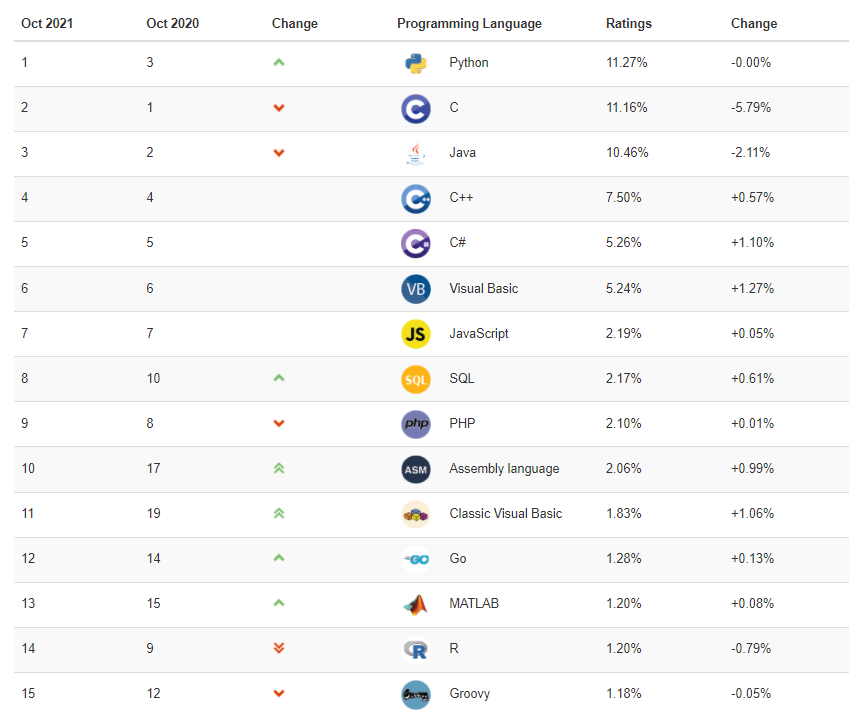

# 1 SQL 概述

> 所属章节：MySQL 基礎篇 / 第三章_基本的SELECT语句
> 建议回查情境：想快速确认 SQL 是什么、SQL 标准的发展背景、`DDL` / `DML` / `DCL` / `DQL` / `TCL` 分别代表什么，以及 `SELECT` 为什么是后续学习重点时
> 下一节：[2 SQL语言的规则与规范](./2%20SQL语言的规则与规范.md)

## 本节导读

这一节主要建立 SQL 的整体认识，包括它的历史背景、在关系型数据库中的作用，以及 `DDL`、`DML`、`DCL`、`DQL`、`TCL` 等常见分类。

如果你后面要正式进入 `SELECT` 查询，这一节的价值在于先把“SQL 到底是什么、解决什么问题、常见语句属于哪一类”这些基础框架搭起来。第一次学习时，建议按“背景 -> 排行热度 -> 分类”顺序阅读；复习时则可以直接看 `1.3 SQL 分类` 和文末的混淆点。

如果你想先看最基础的 SQL 实际操作例子，例如 `create database`、`use`、`select`、`insert into`，可以搭配阅读 [第二章：4 MySQL 演示使用](../第二章_MySQL環境搭建/4%20MySQL%20演示使用.md)。

## 你会在这篇学到什么

- SQL 的基本含义：结构化查询语言。
- SQL 为什么会长期存在于关系型数据库体系中。
- SQL 标准与不同数据库厂商实现之间的关系。
- SQL 常见分类：`DDL`、`DML`、`DCL`、`DQL`、`TCL`。
- 为什么 `SELECT` 是 SQL 学习中的核心语句。

## 快速定位

- `1.1 SQL 背景知识`：先理解 SQL 的历史与使用场景
- `1.2 SQL 语言排行榜`：了解 SQL 为什么至今仍然高频出现
- `1.3 SQL 分类`：掌握 `DDL`、`DML`、`DCL`、`DQL`、`TCL` 的分工
- `分类回查表`：快速对照分类、作用与关键字
- `常见混淆点`：处理最容易搞混的分类边界

## 关键字

- `SQL`：Structured Query Language，结构化查询语言
- `关系模型`：SQL 主要服务于关系型数据库
- `IBM`：SQL 早期由 IBM 在 20 世纪 70 年代推动发展
- `ANSI`：美国国家标准局，参与制定 SQL 标准
- `SQL-86` `SQL-89` `SQL-92` `SQL-99`：常见 SQL 标准版本
- `DDL`：数据定义语言，如 `CREATE`、`DROP`、`ALTER`
- `DML`：数据操作语言，如 `INSERT`、`DELETE`、`UPDATE`、`SELECT`
- `DCL`：数据控制语言，如 `GRANT`、`REVOKE`
- `DQL`：数据查询语言，通常指 `SELECT`
- `TCL`：事务控制语言，如 `COMMIT`、`ROLLBACK`、`SAVEPOINT`

## 建议阅读顺序

- 如果你是第一次学 SQL，先看 `1.1` 和 `1.3`，先建立“SQL 是什么”和“SQL 怎么分类”这两个最关键的认知。
- 如果你已经知道 SQL 是语言，但总分不清 `DDL`、`DML`、`DQL`、`TCL`，直接跳到 `1.3 SQL 分类` 和 `分类回查表`。
- 如果你只是想知道为什么课程会从 `SELECT` 开始深入，重点看 `DML` / `DQL` 相关说明即可。

## 1.1 SQL 背景知识

这一小节先从 SQL 的历史和使用场景切入，帮助你理解为什么后续学习数据库时一定绕不开 SQL。

- 1946 年，世界上第一台电脑诞生。之后几十年里，互联网和各种软件系统不断演进，但 SQL 一直没有退出主流视野。
- 1974 年，IBM 研究员发布了一篇与数据库技术发展密切相关的论文《SEQUEL：一门结构化的英语查询语言》。直到今天，这门结构化查询语言的核心思想仍然没有发生根本变化，所以常有人说：`SQL 的半衰期非常长`。
- 不论是前端工程师、后端工程师，还是数据分析师，只要需要和数据打交道，就绕不开“如何高效、准确地提取和处理数据”这个问题，而 SQL 正是最核心的工具之一。

SQL（Structured Query Language，结构化查询语言）是关系型数据库的应用语言，由 `IBM` 在 20 世纪 70 年代推动发展。后续由美国国家标准局 `ANSI` 参与制定标准，陆续形成了 `SQL-86`、`SQL-89`、`SQL-92`、`SQL-99` 等版本。

其中经常被提到的两个重要标准是：

- `SQL-92`
- `SQL-99`

我们今天使用的很多 SQL 语法，仍然延续了这些标准中的核心约定。

不过要注意：不同数据库厂商虽然都支持 SQL，但通常也会加入各自的扩展语法，因此“都支持 SQL”不代表“语法完全一模一样”。

## 1.2 SQL 语言排行榜

这一小节用排行榜说明 SQL 的使用热度。重点不是死记排名，而是理解：SQL 到今天依然是非常常用的数据库语言。

自从 SQL 被纳入 `TIOBE` 编程语言排行榜之后，长期都保持在 `Top 10` 范围内。这说明 SQL 虽然历史很久，但并没有因为新语言不断出现就失去价值。

## 1.3 SQL 分类

SQL 语言在功能上通常分为 3 大类：

- **DDL（Data Definition Language，数据定义语言）**
  - 用来定义数据库、表、视图、索引等数据库对象
  - 常见关键字：`CREATE`、`DROP`、`ALTER`
- **DML（Data Manipulation Language，数据操作语言）**
  - 用来增删改查数据库记录
  - 常见关键字：`INSERT`、`DELETE`、`UPDATE`、`SELECT`
  - 其中 `SELECT` 是后续学习最核心的语句之一
- **DCL（Data Control Language，数据控制语言）**
  - 用来控制访问权限与安全级别
  - 常见关键字：`GRANT`、`REVOKE`

在很多教材中，还会继续强调另外两类：

- `DQL`（Data Query Language，数据查询语言）
  - 通常专门指 `SELECT`
  - 因为查询语句使用频率非常高，所以很多资料会把它从 `DML` 中单独拿出来
- `TCL`（Transaction Control Language，事务控制语言）
  - 常见关键字：`COMMIT`、`ROLLBACK`、`SAVEPOINT`
  - 主要处理事务提交、回滚与保存点

### 分类回查表

| 分类 | 全称 | 主要作用 | 常见关键字 |
| --- | --- | --- | --- |
| `DDL` | Data Definition Language | 定义数据库对象结构 | `CREATE`、`DROP`、`ALTER` |
| `DML` | Data Manipulation Language | 增删改查数据库记录 | `INSERT`、`DELETE`、`UPDATE`、`SELECT` |
| `DCL` | Data Control Language | 控制权限与安全级别 | `GRANT`、`REVOKE` |
| `DQL` | Data Query Language | 查询数据 | `SELECT` |
| `TCL` | Transaction Control Language | 控制事务提交与回滚 | `COMMIT`、`ROLLBACK`、`SAVEPOINT` |

> 注意：不同教材对分类边界的处理可能略有差异。例如有的教材会把 `SELECT` 放在 `DML` 中，有的会单独拆成 `DQL`；有的会先把事务控制语句放进控制类语言，再单独强调 `TCL`。学习时重点不是死背分类名，而是知道这些关键字分别在解决什么问题。

## 常见混淆点

- `SQL` 不是某个数据库产品，而是一种用于操作关系型数据库的语言。
- MySQL、Oracle、SQL Server 等数据库都支持 SQL，但各厂商可能有自己的扩展语法。
- `SELECT` 可以归入 `DML`，也常被单独归为 `DQL`，因为查询在实际使用中非常高频。
- `COMMIT`、`ROLLBACK`、`SAVEPOINT` 常被单独归为 `TCL`，因为它们关注的是事务控制。

## 常见回查问题

- SQL 的完整英文名称是什么？
- SQL 与关系型数据库是什么关系？
- SQL 标准和数据库厂商特有语法之间是什么关系？
- `CREATE`、`DROP`、`ALTER` 属于哪一类？
- `INSERT`、`DELETE`、`UPDATE`、`SELECT` 属于哪一类？
- 为什么很多资料会把 `SELECT` 单独归为 `DQL`？
- `COMMIT`、`ROLLBACK`、`SAVEPOINT` 为什么常被归为 `TCL`？

## 延伸阅读

- [2 数据库与数据库管理系统](../第一章_數據庫概述/2%20数据库与数据库管理系统.md)
- [3 MySQL 介绍](../第一章_數據庫概述/3%20MySQL%20介绍.md)
- [2 SQL语言的规则与规范](./2%20SQL语言的规则与规范.md)
- [第二章：4 MySQL 演示使用](../第二章_MySQL環境搭建/4%20MySQL%20演示使用.md)
