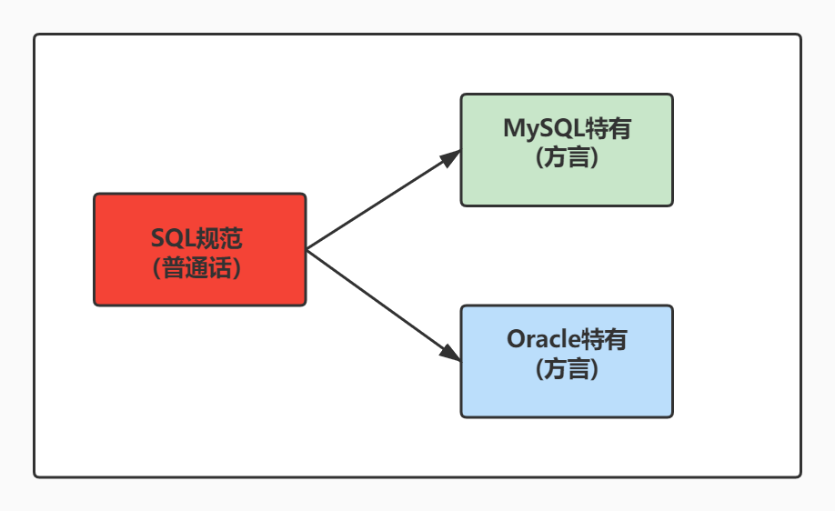

# 1 SQL 概述

> - 所属章节：MySQL 基础篇 / 第三章_基本的SELECT语句  
> - 建议回查情境：想快速确认 SQL 是什么、SQL 和关系型数据库是什么关系、SQL 标准和数据库厂商语法有什么区别、`DDL` / `DML` / `DCL` / `DQL` / `TCL` 分别代表什么，以及为什么课程会先重点学习 `SELECT` 时  
> - 下一节：[2 SQL语言的规则与规范](./2%20SQL语言的规则与规范.md)

## 本节导读

这一节不是教你立刻写复杂查询，而是先帮你建立一个最重要的底层认知：

**SQL 是操作关系型数据库的通用语言，而 `SELECT` 是其中最常用、最核心的入口。**

很多人一开始学 SQL，容易把注意力放在“语法怎么写”；但在真正开始写查询之前，更重要的是先搞清楚三件事：

1. SQL 到底是什么，解决什么问题  
2. SQL 标准和 MySQL、Oracle、SQL Server 这些数据库产品之间是什么关系  
3. 常见 SQL 语句大致分成哪些类别，为什么课程会先从 `SELECT` 开始  

如果这三件事先建立好，后面学习 `SELECT`、`WHERE`、排序、分组、多表查询时，你会更清楚每一种语句在整个数据库体系中的位置，而不是只会背语法。

## 你会在这篇学到什么

- SQL 的基本含义：结构化查询语言（Structured Query Language）
- SQL 与关系型数据库之间的关系
- SQL 标准与数据库厂商实现之间的关系
- SQL 常见分类：`DDL`、`DML`、`DCL`、`DQL`、`TCL`
- 为什么 `SELECT` 是 SQL 学习中的第一核心语句

## 快速定位

- `1.1 SQL 是什么`：先建立 SQL 的本质定位
- `1.2 SQL 标准与数据库产品`：理解“都会 SQL”不等于“语法完全相同”
- `1.3 SQL 为什么重要`：理解为什么几乎所有开发都绕不开 SQL
- `1.4 SQL 分类`：掌握常见 SQL 分类及其职责
- `分类回查表`：快速对照分类、作用与关键字
- `常见混淆点`：处理最容易搞混的边界问题

## 关键字

- `SQL`：Structured Query Language，结构化查询语言
- `关系型数据库`：以表结构组织数据的数据库体系
- `标准 SQL`：由标准组织制定的通用 SQL 规范
- `数据库厂商扩展`：不同数据库在标准 SQL 基础上的额外语法
- `DDL`：数据定义语言
- `DML`：数据操作语言
- `DCL`：数据控制语言
- `DQL`：数据查询语言
- `TCL`：事务控制语言
- `SELECT`：最常用的数据查询语句

## 建议阅读顺序

- **第一次学习**：按 `1.1 -> 1.2 -> 1.3 -> 1.4` 顺序阅读，先理解 SQL 的定位，再看分类
- **复习时**：优先看 `1.4 SQL 分类`、`分类回查表` 和文末 `常见混淆点`
- **如果你最关心为什么先学 `SELECT`**：重点看 `1.3 SQL 为什么重要` 和 `1.4 SQL 分类`

---

## 1.1 SQL 是什么

SQL 全称是 **Structured Query Language**，中文通常翻译为 **结构化查询语言**。

它不是某一个数据库产品的名字，而是一种**用来操作关系型数据库的语言**。  
你可以用 SQL 去完成很多事情，例如：

- 创建数据库、数据表
- 插入、修改、删除数据
- 查询想要的数据
- 管理权限
- 控制事务提交或回滚

也就是说，SQL 的角色很像你和数据库之间的“沟通语言”：

- 你告诉数据库：我要查什么
- 数据库根据 SQL 语句：返回结果或执行操作

所以，学习数据库时，真正绕不开的不是某个工具按钮，而是 **SQL 本身**。

### 一句话理解

**SQL 不是数据库；SQL 是操作关系型数据库的语言。**

---

## 1.2 SQL 标准与数据库产品

SQL 之所以重要，不只是因为它常用，更因为它具有“通用语言”的地位。

SQL 的核心语法经过长期发展，逐步形成了一套标准体系。很多数据库厂商都会支持 SQL，例如：

- MySQL
- Oracle
- SQL Server
- PostgreSQL

但这里一定要注意一个非常关键的事实：

> **“都支持 SQL” 不代表 “语法完全一模一样”。**

原因是：  
各家数据库通常都会在标准 SQL 的基础上，再加入自己的扩展语法、函数、限制或行为差异。

所以你可以这样理解：

- **标准 SQL**：大家共同遵守的基础规则
- **厂商扩展**：各家数据库为了功能或性能加入的特有写法

这也是为什么你以后会遇到这样的情况：

- 某条 SQL 在 MySQL 可以执行
- 换到 Oracle 或 SQL Server，语法可能就要调整

### 学习上的正确心态

在入门阶段，不需要一开始就死记所有标准版本。  
你真正要先建立的是这个认知：

1. SQL 是通用语言  
2. MySQL 是具体数据库产品  
3. 你现在学的是 **MySQL 环境下使用 SQL**

### 回查提示

以后如果你看到“这条 SQL 为什么在别的数据库不能直接跑”，先不要怀疑 SQL 学错了，优先想到：**可能是数据库厂商之间的语法差异。**

---

## 1.3 SQL 为什么重要

SQL 能长期存在，而且一直是开发、数据分析、测试、运维等岗位的高频技能，根本原因不是“它历史很久”，而是因为：

**只要系统要保存、读取、筛选、统计数据，就几乎一定会和 SQL 打交道。**

例如：

- 后端系统要查用户资料
- 前端页面要显示订单列表
- 报表系统要统计销售数据
- 数据分析要筛选特定条件的数据
- 管理后台要查询、修改、导出业务记录

这些工作表面上看起来不同，但底层都绕不开一个核心问题：

> **如何从数据库中准确取出自己要的数据？**

而 SQL 正是解决这个问题的核心工具。

在所有 SQL 语句里，`SELECT` 又是最重要的一类，因为：

- 查询是日常使用频率最高的操作
- 很多后续知识都建立在查询之上
- 过滤、排序、分组、多表连接，本质上都是在 `SELECT` 基础上逐步扩展

所以课程会从 `SELECT` 开始深入，不是巧合，而是因为它就是 SQL 学习的主轴。

### 一句话理解

**学 SQL，不是只为了“会写语法”，而是为了“会从数据里拿到答案”。**

---

## 1.4 SQL 分类

按照功能划分，SQL 常见可以分为以下几类。

> 注意：不同教材对分类边界的写法可能略有差异，尤其是 `SELECT` 有时会放在 `DML`，有时会单独归到 `DQL`。学习时重点不是死背分类名称，而是知道“这类语句在做什么事”。

### 1）DDL：Data Definition Language，数据定义语言

用于**定义或修改数据库对象结构**。

常见对象包括：

- 数据库
- 表
- 视图
- 索引

常见关键字：

- `CREATE`
- `ALTER`
- `DROP`

你可以把 DDL 理解成：  
**负责搭建数据库世界里的“骨架”和“结构”。**

---

### 2）DML：Data Manipulation Language，数据操作语言

用于**对表中的数据进行增删改**，很多教材也把查询一起放进来。

常见关键字：

- `INSERT`
- `UPDATE`
- `DELETE`
- `SELECT`（有些教材放这里）

你可以把 DML 理解成：  
**负责操作表中的“记录内容”。**

---

### 3）DCL：Data Control Language，数据控制语言

用于**控制访问权限和安全设置**。

常见关键字：

- `GRANT`
- `REVOKE`

它关注的问题不是“数据长什么样”，也不是“数据是什么”，而是：

- 谁能看
- 谁能改
- 谁有权限执行某些操作

---

### 4）DQL：Data Query Language，数据查询语言

用于**查询数据**，通常专门指：

- `SELECT`

很多教材会把 `SELECT` 单独拿出来，原因不是它和其他语句完全无关，而是因为：

- 它使用频率极高
- 它是后续学习最核心的主线
- 它的扩展内容特别多，例如过滤、排序、分组、聚合、多表查询、子查询等

所以你可以把 `DQL` 理解成：

**虽然查询本身也属于对数据的一种操作，但因为太重要，常常被单独强调。**

---

### 5）TCL：Transaction Control Language，事务控制语言

用于**控制事务的提交、回滚与保存点**。

常见关键字：

- `COMMIT`
- `ROLLBACK`
- `SAVEPOINT`

它关注的是：

- 一组操作要不要一起生效
- 出错时要不要退回
- 是否保留中间状态

后面学习事务时，这一类会变得非常重要。

---

## 分类回查表

| 分类 | 全称 | 主要作用 | 常见关键字 |
| --- | --- | --- | --- |
| `DDL` | Data Definition Language | 定义或修改数据库对象结构 | `CREATE`、`ALTER`、`DROP` |
| `DML` | Data Manipulation Language | 对数据做增删改 | `INSERT`、`UPDATE`、`DELETE` |
| `DCL` | Data Control Language | 控制权限与访问 | `GRANT`、`REVOKE` |
| `DQL` | Data Query Language | 查询数据 | `SELECT` |
| `TCL` | Transaction Control Language | 控制事务提交、回滚、保存点 | `COMMIT`、`ROLLBACK`、`SAVEPOINT` |

---

## 为什么这一章会先学 `SELECT`

因为在所有 SQL 语句里，`SELECT` 最适合作为入门主线。

原因有三点：

1. **使用最频繁**  
   实际开发中，“查数据”通常比“改结构”或“配权限”更常见。

2. **后续很多知识都建立在它上面**  
   例如 `WHERE`、`ORDER BY`、`GROUP BY`、聚合函数、多表连接、子查询，都是从查询一步步展开的。

3. **它最能训练数据库思维**  
   学 `SELECT` 的过程，本质上是在训练你：
   - 要查哪些列
   - 数据从哪张表来
   - 需要什么条件
   - 结果应该如何整理

所以，先学 `SELECT`，其实是在先学最核心的“数据提取思维”。

---

## 常见混淆点

- `SQL` 不是某个数据库产品，而是一种语言。
- MySQL、Oracle、SQL Server 等是数据库产品，它们都支持 SQL，但细节语法可能不同。
- `SELECT` 有时被归入 `DML`，有时被单独归入 `DQL`，两种写法都常见。
- 学习分类时，重点不是死背英文缩写，而是知道每类语句分别解决什么问题。
- 课程先学 `SELECT`，不是因为它最简单，而是因为它最核心、最常用。

---

## 常见回查问题

- SQL 的完整英文名称是什么？
- SQL 和 MySQL 是什么关系？
- 为什么不同数据库都会用 SQL，但语法又不完全一样？
- `CREATE`、`ALTER`、`DROP` 属于哪一类？
- `INSERT`、`UPDATE`、`DELETE` 属于哪一类？
- `SELECT` 为什么有时算 `DML`，有时算 `DQL`？
- `COMMIT`、`ROLLBACK`、`SAVEPOINT` 属于哪一类？
- 为什么 SQL 学习通常从 `SELECT` 开始？

---

## 一句话抓核心

**SQL 是操作关系型数据库的通用语言；学习这一节的目的，是先弄清 SQL 是什么、常见语句怎么分类，以及为什么后续学习会以 `SELECT` 为主线展开。**

---

## 小结

这一节你需要记住：

- SQL 是结构化查询语言，用来操作关系型数据库。
- SQL 是一种语言，MySQL 是一种数据库产品，两者不是同一个概念。
- 各数据库通常都支持 SQL，但会有各自的扩展语法。
- SQL 常见可分为 `DDL`、`DML`、`DCL`、`DQL`、`TCL`。
- `SELECT` 之所以被重点学习，是因为它最常用，也是后续查询能力的基础。

## 延伸阅读

- [2 数据库与数据库管理系统](../第一章_數據庫概述/2%20数据库与数据库管理系统.md)
- [3 MySQL 介绍](../第一章_數據庫概述/3%20MySQL%20介绍.md)
- [2 SQL语言的规则与规范](./2%20SQL语言的规则与规范.md)
- [第二章：4 MySQL 演示使用](../第二章_MySQL環境搭建/4%20MySQL%20演示使用.md)

---