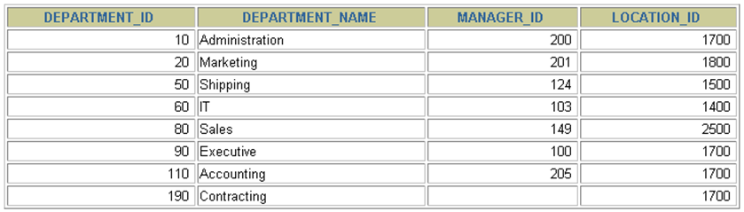
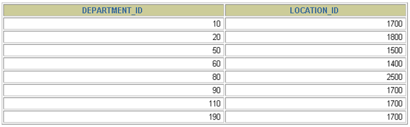
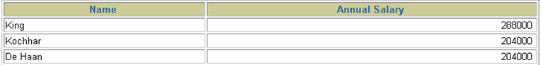
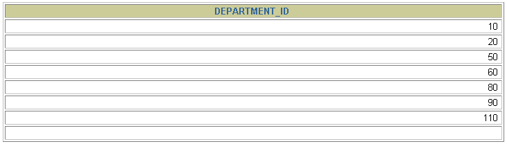

# 3 基本的 SELECT 语句

> 所属章节：[第三章_基本的SELECT语句](./README.md)
> 建议回查情境：忘记 `SELECT` 的基本写法、`SELECT *` 的使用限制、列别名、`DISTINCT` 去重、`NULL` 运算结果、着重号或查询常数写法时

## 本节导读

这一节开始正式进入 `SELECT` 查询语句，重点是掌握最基础的查询结构：可以不带 `FROM` 查询常量表达式，也可以通过 `SELECT ... FROM ...` 从表中选择全部列或指定列。

第一次阅读时，建议先理解 `SELECT` 和 `FROM` 各自负责什么，再依次看列别名、`DISTINCT`、`NULL` 运算、着重号和查询常数。之后写查询时，如果只是忘了某个细节，可以直接回到对应小节查语法。

## 你会在这篇学到什么

- `SELECT` 不带 `FROM` 时可以查询常量或表达式。
- `SELECT ... FROM` 如何从指定表中查询全部列或特定列。
- 为什么生产环境中不建议随意使用 `SELECT *`。
- 如何使用列别名改善结果展示或表达式命名。
- `DISTINCT` 是对后续所有列的组合去重。
- `NULL` 参与运算时，运算结果通常仍为 `NULL`。
- 当表名或字段名与保留字冲突时，如何使用着重号。
- 如何在查询结果中增加固定的常数列。

## 关键字

- `SELECT`：指定要查询的列、表达式或常量。
- `FROM`：指定查询数据来自哪张表。
- `*`：通配符，表示查询表中的全部列。
- `AS`：为列或表达式指定别名，可省略。
- `DISTINCT`：去除重复行，作用于后续所有列的组合。
- `NULL`：空值，参与运算时需要特别注意。
- 着重号：`` ` ``，用于包裹与保留字冲突的对象名。
- 查询常数：在查询结果中增加固定值列。

## 快速回查表

| 场景 | 写法 | 需要注意 |
| --- | --- | --- |
| 查询常量或表达式 | `SELECT 1;` | 不需要 `FROM` 子句 |
| 查询全部列 | `SELECT * FROM departments;` | 方便但不建议在生产环境中滥用 |
| 查询指定列 | `SELECT department_id, location_id FROM departments;` | 更明确，也更利于性能和维护 |
| 设置列别名 | `SELECT last_name AS name FROM employees;` | `AS` 可以省略，别名建议简短清楚 |
| 去重 | `SELECT DISTINCT department_id FROM employees;` | `DISTINCT` 放在所有列名前面 |
| 处理保留字冲突 | ``SELECT * FROM `order`;`` | 更好的做法是命名时避开保留字 |
| 查询常数 | `SELECT '尚硅谷' AS corporation, last_name FROM employees;` | 常用于标记数据来源或整合数据 |

## 3.1 SELECT ...

`SELECT` 可以不带任何子句，直接查询常量或表达式。

```sql
SELECT 1; # 没有任何子句
SELECT 9/2; # 没有任何子句
```

这种写法适合快速验证表达式、函数或常量结果。后续从表中查询数据时，就需要搭配 `FROM` 指定数据来源。

## 3.2 SELECT ... FROM

`SELECT ... FROM` 是最基础的表查询结构：

```sql
SELECT   标识选择哪些列
FROM     标识从哪个表中选择
```

### 选择全部列

使用 `*` 可以选择表中的全部列。



```sql
SELECT *
FROM   departments;
```

> 一般情况下，除非需要使用表中所有的字段数据，最好不要使用通配符 `*`。使用通配符虽然可以节省输入查询语句的时间，但是获取不需要的列数据通常会降低查询和所使用的应用程序的效率。
>
> 通配符的优势是，当不知道所需要的列名时，可以通过它获取它们。在生产环境下，不推荐直接使用 `SELECT *` 进行查询。

### 选择特定的列

实际开发中更推荐明确写出需要查询的列。



```sql
SELECT department_id, location_id
FROM   departments;
```

MySQL 中的 SQL 语句不区分大小写，因此 `SELECT` 和 `select` 的作用相同。但是许多开发人员习惯将关键字大写、数据列和表名小写，这样写出来的代码更容易阅读和维护。

## 3.3 列的别名

列别名可以用来重命名查询结果中的列名，也常用于给计算表达式一个更容易理解的名称。

使用列别名时需要注意：

- 别名紧跟在列名或表达式后面。
- 也可以在列名和别名之间加入关键字 `AS`。
- `AS` 可以省略。
- 如果别名中包含空格或特殊字符，可以使用双引号包裹。
- 建议别名简短、见名知意。

示例：


```sql
SELECT last_name AS name, commission_pct comm
FROM   employees;
```




```sql
SELECT last_name "Name", salary*12 "Annual Salary"
FROM   employees;
```

## 3.4 去除重复行

默认情况下，查询会返回全部行，包括重复行。


```sql
SELECT department_id
FROM   employees;
```

在 `SELECT` 语句中使用关键字 `DISTINCT` 可以去除重复行：

```sql
SELECT DISTINCT department_id
FROM   employees;
```

如果查询多列，`DISTINCT` 会对后面所有列的组合进行去重。




```sql
SELECT DISTINCT department_id, salary
FROM employees;
```

这里有两点需要注意：

1. `DISTINCT` 需要放到所有列名的前面。如果写成 `SELECT salary, DISTINCT department_id FROM employees` 会报错。
2. `DISTINCT` 是对后面所有列名的组合进行去重。也就是说，只有当 `department_id` 和 `salary` 的组合完全相同时，才会被视为重复。如果只想查看有哪些不同的部门，只需要写 `DISTINCT department_id`，后面不需要再加其他列名。

## 3.5 空值参与运算

所有运算符或列值遇到 `NULL` 值，运算的结果通常都为 `NULL`。

```sql
SELECT employee_id,salary,commission_pct,
12 * salary * (1 + commission_pct) "annual_sal"
FROM employees;
```

这里一定要注意：在 MySQL 中，空值不等于空字符串。空字符串的长度是 `0`，而空值表示没有值。而且，在 MySQL 中，空值是占用空间的。

## 3.6 着重号

如果表名、字段名等对象名与保留字、数据库系统关键字或常用方法冲突，就可能导致 SQL 语法错误。

错误写法：

```sql
mysql> SELECT * FROM ORDER;
ERROR 1064 (42000): You have an error in your SQL syntax; check the manual that corresponds to your MySQL server version for the right syntax to use near 'ORDER' at line 1
```

正确写法：

```sql
mysql> SELECT * FROM `ORDER`;
+----------+------------+
| order_id | order_name |
+----------+------------+
|        1 | shkstart   |
|        2 | tomcat     |
|        3 | dubbo      |
+----------+------------+
3 rows in set (0.00 sec)

mysql> SELECT * FROM `order`;
+----------+------------+
| order_id | order_name |
+----------+------------+
|        1 | shkstart   |
|        2 | tomcat     |
|        3 | dubbo      |
+----------+------------+
3 rows in set (0.00 sec)
```

结论：需要保证表中的字段、表名等没有和保留字、数据库系统或常用方法冲突。如果确实相同，请在 SQL 语句中使用一对着重号 `` ` `` 包裹起来。

## 3.7 查询常数

### 为什么查询常数？

SQL 允许在 `SELECT` 语句中查询常数，即在查询结果中增加一列固定的常数列。这列的取值是我们指定的，而不是从数据表中动态获取的。

通常，查询数据时不需要额外增加一个常数列。但在某些情况下，比如整合不同的数据源，可以使用常数列作为标识。

### 查询常数的应用示例

假设我们有一个 `employees` 表，希望查询所有员工的 `last_name`，并为每条记录添加一个固定的 `corporation` 字段，例如 `"尚硅谷"`。可以这样写：

```sql
SELECT '尚硅谷' AS corporation, last_name FROM employees;
```

查询结果示例：

| corporation | last_name |
| --- | --- |
| 尚硅谷 | 张三 |
| 尚硅谷 | 李四 |
| 尚硅谷 | 王五 |

这样，每一行都增加了一个固定值 `"尚硅谷"` 作为 `corporation`，这在数据合并、数据标记或导出时很有用。

### 结合 UNION 进行数据整合

如果有两个不同来源的数据集，可以用常数列进行标记，并通过 `UNION` 进行整合。例如：

```sql
SELECT '公司A' AS corporation, last_name FROM employees_A
UNION ALL
SELECT '公司B' AS corporation, last_name FROM employees_B;
```

这样，查询结果会包含两家公司员工的数据，并带有公司标识：

| corporation | last_name |
| --- | --- |
| 公司A | 张三 |
| 公司A | 李四 |
| 公司B | 赵六 |
| 公司B | 孙七 |

## 常见混淆点

- `SELECT *` 可以快速查看全部字段，但不适合在生产查询中默认使用。
- `DISTINCT` 不是只作用于离它最近的一列，而是作用于后续所有列的组合。
- `NULL` 不等于空字符串，空字符串长度为 `0`，`NULL` 表示没有值。
- 着重号 `` ` `` 用来包裹对象名，不要和单引号、双引号混用。
- 列别名可以改善结果可读性，但别名最好简短、清楚，避免让查询结果更难理解。

## 常见回查问题

- 不带 `FROM` 的 `SELECT` 可以做什么？
- `SELECT *` 为什么不建议在生产环境中滥用？
- 查询指定列时，列名之间如何分隔？
- `AS` 在列别名中是否可以省略？
- `DISTINCT department_id, salary` 到底是按哪几列去重？
- `NULL` 参与算术运算时，结果会怎样？
- 表名或字段名和保留字冲突时应该怎么写？
- 查询结果中为什么要增加一个固定的常数列？

## 一句话抓核心

基本 `SELECT` 语句的核心是先明确“查什么”和“从哪查”：用 `SELECT` 指定列、表达式或常数，用 `FROM` 指定表，再根据场景补上别名、去重、着重号或常数列等细节。

## 小结

这一节你需要记住：

- `SELECT` 可以不带 `FROM` 查询常量或表达式。
- 从表中查询数据时，基本结构是 `SELECT 列名 FROM 表名`。
- 不建议在生产环境中默认使用 `SELECT *`，应优先明确列名。
- 列别名可以用 `AS` 指定，`AS` 也可以省略。
- `DISTINCT` 需要放在所有列名前面，并对后续列的组合去重。
- `NULL` 参与运算时，结果通常仍为 `NULL`，且 `NULL` 不等于空字符串。
- 对象名与保留字冲突时，可以用着重号 `` ` `` 包裹。
- 查询常数常用于为结果集增加固定标识，尤其适合多来源数据整合。

## 延伸阅读

- [1 SQL 概述](./1%20SQL%20概述.md)
- [2 SQL语言的规则与规范](./2%20SQL语言的规则与规范.md)
- [第三章导航](./README.md)
