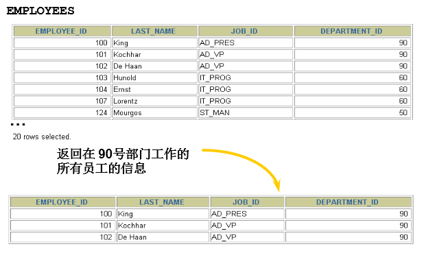
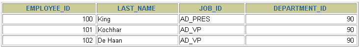

# 5 过滤数据

> 所属章节：[第三章_基本的SELECT语句](./README.md)
> 建议回查情境：忘记 `WHERE` 子句写在哪里、如何按条件筛选行，或需要快速确认过滤条件基本写法时

## 本节导读

这一节主要说明如何在 `SELECT` 查询中使用 `WHERE` 子句过滤数据。前面学习的 `SELECT ... FROM ...` 会从表中取出指定列，而 `WHERE` 的作用是进一步筛选行，只保留满足条件的记录。

第一次阅读时，建议先记住语法顺序：`SELECT` 指定查询哪些字段，`FROM` 指定从哪张表查询，`WHERE` 紧跟在 `FROM` 之后指定过滤条件。之后写查询时，如果结果集太大或只想查看某一类记录，就可以回到这一节确认 `WHERE` 的基本位置和写法。

## 你会在这篇学到什么

- `WHERE` 子句在 `SELECT` 语句中的位置。
- `WHERE` 如何把不满足条件的行过滤掉。
- 如何使用等值条件筛选指定部门的员工。
- 为什么 `WHERE` 是控制查询结果范围的关键子句。

## 关键字

- `WHERE`：用于指定过滤条件，只返回满足条件的行。
- 过滤条件：写在 `WHERE` 后面的判断表达式。
- 行过滤：过滤的是记录行，不是显示列。
- `department_id = 90`：等值过滤条件示例，表示只查询部门编号为 `90` 的记录。

## 快速回查表

| 需求 | 写法 | 说明 |
| --- | --- | --- |
| 查询指定列 | `SELECT employee_id, last_name FROM employees;` | 只控制结果中显示哪些列 |
| 按条件过滤行 | `WHERE department_id = 90` | 只保留满足条件的记录 |
| 基本过滤查询 | `SELECT 字段1, 字段2 FROM 表名 WHERE 过滤条件;` | `WHERE` 紧随 `FROM` 子句之后 |

## 5.1 背景

实际查询时，通常不会总是查看表中的全部记录，而是会根据业务条件筛选需要的行。例如，只查看某个部门的员工、某个状态的订单，或某个时间范围内的数据。



在 `SELECT` 语句中，`WHERE` 子句就是用来表达这些过滤条件的。

## 5.2 基本语法

```sql
SELECT 字段1,字段2
FROM 表名
WHERE 过滤条件
```

使用 `WHERE` 子句时需要记住：

- 使用 `WHERE` 子句，将不满足条件的行过滤掉。
- `WHERE` 子句紧随 `FROM` 子句。
- `SELECT` 后面的字段列表决定结果中显示哪些列，`WHERE` 决定哪些行可以进入结果集。

## 5.3 示例

下面的例子查询 `employees` 表中部门编号为 `90` 的员工，只返回 `employee_id`、`last_name`、`job_id` 和 `department_id` 这几列。



```sql
SELECT employee_id, last_name, job_id, department_id
FROM   employees
WHERE  department_id = 90 ;
```

这条语句可以拆成三部分理解：

| 子句 | 作用 |
| --- | --- |
| `SELECT employee_id, last_name, job_id, department_id` | 指定结果中显示哪些字段 |
| `FROM employees` | 指定数据来自 `employees` 表 |
| `WHERE department_id = 90` | 只保留 `department_id` 等于 `90` 的员工记录 |

## 常见混淆点

- `WHERE` 过滤的是行，`SELECT` 字段列表控制的是列，两者作用不同。
- `WHERE` 要写在 `FROM` 后面，而不是写在 `SELECT` 字段列表中间。
- `department_id = 90` 是过滤条件，表示只查询部门编号等于 `90` 的记录。
- 如果省略 `WHERE`，查询会返回表中所有符合其他子句要求的行。

## 常见回查问题

- `WHERE` 子句应该写在 SQL 的哪个位置？
- `WHERE` 是过滤行还是过滤列？
- 想查询某个部门的员工，基本写法是什么？
- `SELECT` 字段列表和 `WHERE` 过滤条件分别控制什么？

## 一句话抓核心

过滤数据的核心是：用 `SELECT` 指定要显示的列，用 `FROM` 指定数据来源，再用 `WHERE` 写过滤条件，只返回满足条件的行。

## 小结

这一节你需要记住：

- `WHERE` 子句用于过滤数据行。
- `WHERE` 子句紧随 `FROM` 子句。
- 基本写法是 `SELECT 字段1, 字段2 FROM 表名 WHERE 过滤条件;`。
- `SELECT` 控制显示哪些列，`WHERE` 控制返回哪些行。

## 延伸阅读

- [3 基本的 SELECT 语句](./3%20基本的%20SELECT%20语句.md)
- [4 显示表结构](./4%20显示表结构.md)
- [第三章导航](./README.md)
