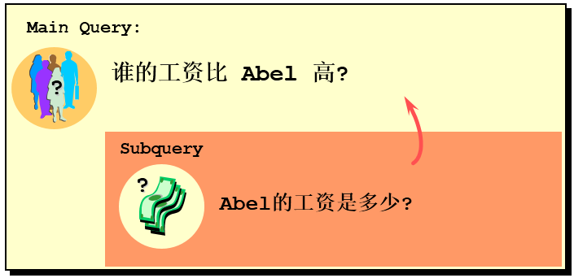
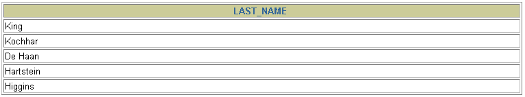

# 1 需求分析与问题解决

> 所属章节：[第九章_子查询](./README.md)  
> 上一节：[前言](./前言.md)  
> 建议回查情境：想知道为什么需要子查询、想比较分步查询 / 自连接 / 子查询的差异，或想先建立子查询的基本分类框架时

## 本节导读

前言已经先说明：子查询的核心是「先得到一个中间结果，再让外层查询继续使用这个结果」。

这一节会把这个观念放进一个具体需求中：

> 查询工资高于 `Abel` 的员工。

这个需求看起来很简单，但它刚好可以引出学习子查询时最重要的几个问题：

- 为什么有些查询不能只靠一个固定条件完成？
- 为什么同一个需求可以写成分步查询、自连接或子查询？
- 什么情况下子查询更贴近题意？
- 子查询返回一个值、一组值、一行多列、多行多列时，写法有什么差异？
- 子查询是否依赖外层查询，又会影响什么？

学习这一节时，不要只背 SQL 语法，而要练习把查询需求拆成：

1. 最终要查什么？
2. 中间需要先得到什么？
3. 这个中间结果会返回几行几列？
4. 外层查询要用什么方式使用这个结果？

这四个问题想清楚之后，后面学习单行子查询、多行子查询、行子查询、表子查询、相关子查询时，会比较容易判断该用哪一种写法。

## 你会在这篇学到什么

- 为什么有些查询需求适合用子查询解决。
- 如何从实际需求中拆出「外层查询」和「内层查询」。
- 分步查询、自连接、子查询分别适合什么场景。
- 子查询的基本语法结构与使用注意事项。
- 如何按返回结果区分标量子查询、列子查询、行子查询、表子查询。
- 如何按是否依赖外层查询区分不相关子查询与相关子查询。
- 为什么不能简单认为「子查询一定先执行」或「自连接一定比子查询快」。
- 看到查询题时，如何先判断应该使用哪一种子查询思路。

## 快速定位

- `1.1 实际问题`：从“查询工资高于 Abel 的员工”理解为什么会引出子查询。
- `1.2 三种解决方式`：比较分步查询、自连接、子查询的差异。
- `1.3 子查询的基本使用`：建立子查询的语法骨架与阅读方式。
- `1.4 子查询的分类一：按返回结果分类`：区分标量、列、行、表子查询。
- `1.5 子查询的分类二：按是否依赖外层查询分类`：区分不相关子查询与相关子查询。
- `1.6 看到题目时如何判断写法`：整理从需求到 SQL 的判断流程。
- `1.7 常见误区`：整理初学子查询最容易误解的地方。

## 关键字

- `子查询`：嵌套在另一个 SQL 语句内部的查询。
- `内层查询`：被包在内部、负责提供中间结果的查询。
- `外层查询`：使用子查询结果继续筛选、比较、连接或返回数据的查询。
- `标量子查询`：返回 `1` 行 `1` 列结果的子查询。
- `列子查询`：返回多行 `1` 列结果的子查询。
- `行子查询`：返回 `1` 行多列，或搭配 `IN` 返回多行多列组合的子查询。
- `表子查询`：返回多行多列结果，通常放在 `FROM` 中作为派生表使用。
- `派生表`：由 `FROM` 子查询产生的临时结果表。
- `不相关子查询`：可以独立执行，不依赖外层查询当前行的数据。
- `相关子查询`：子查询中引用了外层查询当前行的数据，因此会随着外层当前行而变化。
- `自连接`：同一张表自己和自己连接，用来比较同表中的不同记录。

## 1.1 实际问题：为什么会需要子查询

下面这个案例要解决的问题是：

> 查询工资高于 `Abel` 的员工。



这个需求可以先拆成两层：

| 层次 | 要解决的问题 |
| --- | --- |
| 中间结果 | 先查出 `Abel` 的工资是多少 |
| 最终结果 | 再查出工资高于这个工资的员工 |

也就是说，外层查询需要的条件不是一个一开始就知道的固定值，而是需要先从资料表中查出来。

如果用自然语言表达，就是：

> 先找出 `Abel` 的工资，再找出工资比这个值高的员工。

这就是子查询很适合处理的典型场景：

> 外层查询需要使用另一个查询产生的结果。

## 1.2 三种解决方式

同一个需求可以有不只一种 SQL 写法。这里先比较三种常见方式：

1. 分两步查询。
2. 自连接。
3. 子查询。

重点不是背哪一种一定最好，而是理解每一种写法背后的思路。

## 1.2.1 方式一：分两步查询

先查出 `Abel` 的工资：

```sql
SELECT salary
FROM employees
WHERE last_name = 'Abel';
```

假设查到的工资是 `11000`，再把这个值带入第二条 SQL：

```sql
SELECT last_name, salary
FROM employees
WHERE salary > 11000;
```

### 这种写法的思路

这其实是把需求拆成两个动作：

1. 先人工执行第一条 SQL，得到 `Abel` 的工资。
2. 再把这个工资值写进第二条 SQL 中。

### 优点

- 思路很直观。
- 适合刚开始分析需求时使用。
- 可以帮助你确认中间结果是否正确。

### 缺点

- 需要人工或程序先拿到第一步结果。
- 无法在一条 SQL 中完整表达需求。
- 如果 `Abel` 的工资变动，第二条 SQL 中写死的 `11000` 就需要重新取得。
- 不适合真实系统中需要自动执行的查询逻辑。

### 小结

分步查询适合用来帮助理解问题，但如果要让数据库自动完成整个查询流程，就应该考虑把中间查询嵌进主查询中。

## 1.2.2 方式二：自连接

也可以把同一张 `employees` 表当成两份资料来比较：

```sql
SELECT e2.last_name, e2.salary
FROM employees e1
JOIN employees e2
ON e2.salary > e1.salary
WHERE e1.last_name = 'Abel';
```

### 这种写法的思路

这条 SQL 把同一张表分成两个角色：

| 表别名 | 角色 |
| --- | --- |
| `e1` | 代表 `Abel` 那一笔员工资料 |
| `e2` | 代表其他员工资料 |

条件：

```sql
e2.salary > e1.salary
```

表示：

> 找出工资比 `Abel` 高的员工。

### 优点

- 可以在一条 SQL 中完成需求。
- 适合表达「同一张表中，不同记录之间互相比对」的需求。
- 如果题目本质是两笔资料互相关联，自连接会很自然。

### 缺点

- 对初学者来说，两个表别名可能比较绕。
- 如果需求本质只是「先求一个值，再拿这个值比较」，自连接不一定是最直观的表达方式。
- 如果 `last_name = 'Abel'` 查到多笔资料，结果可能会重复或变得难以判断，需要额外确认资料唯一性。

### 小结

自连接不是错误写法，而且很多时候很好用。  
但在这个需求中，如果你的思考方式是「先查出 Abel 的工资，再拿来比较」，子查询会更贴近自然语言。

## 1.2.3 方式三：子查询

可以把「查询 Abel 工资」这件事直接放进外层查询中：

```sql
SELECT last_name, salary
FROM employees
WHERE salary > (
    SELECT salary
    FROM employees
    WHERE last_name = 'Abel'
);
```



### 这种写法的思路

这条 SQL 可以拆成两层：

内层查询：

```sql
SELECT salary
FROM employees
WHERE last_name = 'Abel'
```

负责找出 `Abel` 的工资。

外层查询：

```sql
SELECT last_name, salary
FROM employees
WHERE salary > Abel的工资;
```

负责找出工资高于这个值的员工。

### 为什么这个写法更接近需求

因为它几乎是把题目翻译成 SQL：

> 查询工资高于 `Abel` 工资的员工。

写成 SQL 就是：

```sql
WHERE salary > (
    SELECT salary
    FROM employees
    WHERE last_name = 'Abel'
)
```

所以当需求本质是：

> 先查出一个值，再拿这个值继续筛选。

就可以优先考虑子查询。

### 重要提醒：这个子查询必须只返回一个值

因为外层使用的是：

```sql
salary > (...)
```

这里的 `>` 是单行比较符，右侧子查询必须稳定返回 `1` 行 `1` 列。

如果 `last_name = 'Abel'` 查到多位员工，子查询就会返回多行，外层查询可能会报错。

更严谨的写法通常会使用唯一字段，例如：

```sql
SELECT last_name, salary
FROM employees
WHERE salary > (
    SELECT salary
    FROM employees
    WHERE employee_id = 174
);
```

或者明确使用聚合函数，让子查询稳定返回一个值：

```sql
SELECT last_name, salary
FROM employees
WHERE salary > (
    SELECT MAX(salary)
    FROM employees
    WHERE last_name = 'Abel'
);
```

不过第二种写法的语意已经变成：

> 工资高于所有名为 Abel 的员工中的最高工资。

所以使用聚合函数时，要确认它是否符合题目本意。

## 1.2.4 三种写法对比

| 写法 | 核心思路 | 优点 | 缺点 | 适合场景 |
| --- | --- | --- | --- | --- |
| 分两步查询 | 先查中间值，再手动带入第二条 SQL | 容易理解，适合分析问题 | 需要人工或程序传值，不是一条完整 SQL | 学习分析、验证中间结果 |
| 自连接 | 把同一张表当成两份资料互相比对 | 适合表达同表记录之间的关系 | 初学时较绕，别名要清楚 | 同表资料互相比对 |
| 子查询 | 内层先提供中间结果，外层再使用 | 贴近“先求值，再比较”的题意 | 要注意子查询返回行数与比较符是否匹配 | 用查询结果当作查询条件 |

### 判断重点

不要死背「哪一种一定比较好」。

更好的判断方式是：

- 如果你想先求出一个值或一组值，再拿来筛选，子查询通常更直观。
- 如果你想比较同一张表中的不同记录，自连接也很自然。
- 如果只是学习拆解题目，分步查询可以帮助你确认中间结果。
- 如果要讨论性能，要看具体资料量、索引、MySQL 优化器与执行计划，而不是只看 SQL 外观。

## 1.3 子查询的基本使用

子查询的基本语法结构如下：

```sql
SELECT 查询字段
FROM 表名
WHERE 字段 比较符 (
    SELECT 查询字段
    FROM 表名
    WHERE 条件
);
```

可以先抓住两个核心概念：

| 概念 | 作用 |
| --- | --- |
| 内层查询 | 负责先产生中间结果 |
| 外层查询 | 负责使用中间结果继续筛选、比较、连接或返回资料 |

例如：

```sql
SELECT last_name, salary
FROM employees
WHERE salary > (
    SELECT AVG(salary)
    FROM employees
);
```

这条 SQL 的内层查询是：

```sql
SELECT AVG(salary)
FROM employees
```

外层查询使用这个平均工资继续筛选：

```sql
WHERE salary > 平均工资
```

## 1.3.1 逻辑理解顺序与实际执行顺序

学习初期可以先这样理解：

1. 子查询先得到一个结果。
2. 外层查询再使用这个结果完成最终查询。

但要注意：

> 这主要是逻辑理解顺序，不一定代表 MySQL 实际执行时永远先跑子查询。

实际运行时，MySQL 优化器可能会改写 SQL，例如：

- 把某些子查询改写成连接。
- 把某些 `IN` 子查询改写成半连接。
- 把某些派生表合并到外层查询。
- 根据索引、统计信息、资料量选择不同执行策略。

所以学习阶段可以先记：

> 语意上，子查询提供结果给外层查询使用；  
> 实务上，真实执行方式要看执行计划。

## 1.3.2 使用注意事项

写子查询时，先记住下面几条规则。

### 1. 子查询要写在括号内

```sql
WHERE salary > (
    SELECT AVG(salary)
    FROM employees
)
```

括号可以帮助 SQL 引擎识别这一段是一个完整的查询，也能让阅读者快速看出内层查询范围。

### 2. 子查询本身必须是一条完整的 `SELECT`

也就是说，括号里面应该能单独看成一条查询语句。

例如：

```sql
SELECT AVG(salary)
FROM employees
```

本身就是一条完整的查询。

### 3. 比较符要和子查询返回结果匹配

如果子查询返回一个值，可以使用：

```sql
=、<>、>、>=、<、<=
```

如果子查询返回多行一列，通常要使用：

```sql
IN、NOT IN、ANY、ALL
```

错误示例：

```sql
SELECT employee_id, last_name
FROM employees
WHERE salary = (
    SELECT MIN(salary)
    FROM employees
    GROUP BY department_id
);
```

这段 SQL 的问题是：

- 子查询因为 `GROUP BY department_id`，会返回每个部门的最低工资。
- 结果是多行。
- 外层却使用 `=` 当成单值比较。
- 因此会发生多行子查询误用单行比较符的问题。

### 4. `FROM` 子查询通常要取别名

如果子查询放在 `FROM` 中作为派生表，必须给它一个别名：

```sql
SELECT e.last_name, e.salary, dept_avg.avg_salary
FROM employees e
JOIN (
    SELECT department_id, AVG(salary) AS avg_salary
    FROM employees
    GROUP BY department_id
) AS dept_avg
ON e.department_id = dept_avg.department_id;
```

这里的 `dept_avg` 就是派生表别名。

### 5. 多表或多层查询时，字段最好加上表别名

尤其是相关子查询，字段来源要写清楚：

```sql
SELECT e1.last_name, e1.salary, e1.department_id
FROM employees e1
WHERE e1.salary > (
    SELECT AVG(e2.salary)
    FROM employees e2
    WHERE e2.department_id = e1.department_id
);
```

这样可以清楚看出：

- `e1` 是外层员工表。
- `e2` 是内层员工表。
- `e2.department_id = e1.department_id` 是内外层的关联条件。

## 1.3.3 阅读子查询的步骤

看到一段子查询 SQL，可以按下面顺序读：

1. 先找最里面的 `SELECT`。
2. 判断子查询返回什么结果。
3. 看外层用什么操作符接住这个结果。
4. 判断子查询有没有引用外层查询的字段。
5. 再判断它属于哪一种子查询。

例如：

```sql
SELECT last_name, salary
FROM employees e1
WHERE salary > (
    SELECT AVG(salary)
    FROM employees e2
    WHERE e2.department_id = e1.department_id
);
```

可以这样分析：

| 判断点 | 结果 |
| --- | --- |
| 子查询返回什么 | 当前部门的平均工资 |
| 返回几行几列 | 1 行 1 列 |
| 外层怎么使用 | 用 `salary > (...)` 比较 |
| 是否引用外层字段 | 有，引用 `e1.department_id` |
| 属于哪一种 | 标量子查询 + 相关子查询 |

## 1.4 子查询的分类一：按返回结果分类

子查询可以先按返回结果分成四类：

| 子查询类型 | 返回结果 | 常见使用位置 | 常见搭配 |
| --- | --- | --- | --- |
| 标量子查询 | 1 行 1 列 | `WHERE`、`HAVING`、`SELECT`、`SET` | `=`、`>`、`<`、`>=`、`<=`、`<>` |
| 列子查询 | 多行 1 列 | `WHERE`、`HAVING` | `IN`、`NOT IN`、`ANY`、`ALL` |
| 行子查询 | 1 行多列，或多行多列组合 | `WHERE` | `(col1, col2) = (...)`、`(col1, col2) IN (...)` |
| 表子查询 | 多行多列 | `FROM` | 作为派生表再连接或筛选 |

判断时不要只看 SQL 长相，而要问：

> 子查询最终返回的是几行几列？

这是选择操作符的关键。

## 1.4.1 标量子查询：返回一个值

标量子查询返回 `1` 行 `1` 列，可以把它当成一个单独值使用。

示例：查询最高薪资的员工。

```sql
SELECT name, salary
FROM employees
WHERE salary = (
    SELECT MAX(salary)
    FROM employees
);
```

内层查询：

```sql
SELECT MAX(salary)
FROM employees
```

返回一个值，例如 `7200`。

外层查询就变成：

```sql
WHERE salary = 7200
```

### 适合场景

- 查询工资高于平均工资的员工。
- 查询工资等于最高工资的员工。
- 查询某个员工编号对应的部门。
- 用某个统计结果作为比较条件。

### 注意事项

标量子查询必须稳定返回一个值。

| 子查询结果 | 外层判断 |
| --- | --- |
| 返回 1 行 1 列 | 可以正常比较 |
| 返回 0 行 | 结果通常会当成 `NULL` 处理，比较结果可能不成立 |
| 返回多行 | 使用单行比较符时可能报错 |

## 1.4.2 列子查询：返回一组值

列子查询返回多行 `1` 列，通常搭配 `IN`、`NOT IN`、`ANY`、`ALL` 使用。

示例：查询所有在 `IT` 或 `HR` 部门的员工。

```sql
SELECT name, department_id
FROM employees
WHERE department_id IN (
    SELECT id
    FROM departments
    WHERE name IN ('IT', 'HR')
);
```

内层查询返回的是部门编号集合：

```text
1
2
```

外层查询判断：

```sql
department_id IN (1, 2)
```

### 适合场景

- 查询属于某一组部门的员工。
- 查询员工编号是否在某个结果集中。
- 查询某个字段是否落在另一张表查出的集合中。

### 注意事项

如果使用 `NOT IN`，要特别注意子查询结果中是否包含 `NULL`。

例如：

```sql
SELECT last_name
FROM employees
WHERE employee_id NOT IN (
    SELECT manager_id
    FROM employees
);
```

如果子查询中的 `manager_id` 包含 `NULL`，可能导致结果和直觉不一致。

更安全的写法通常会先排除 `NULL`：

```sql
SELECT last_name
FROM employees
WHERE employee_id NOT IN (
    SELECT manager_id
    FROM employees
    WHERE manager_id IS NOT NULL
);
```

或者改用 `NOT EXISTS`，这个后面会在相关子查询中继续学习。

## 1.4.3 行子查询：多个字段作为一组比较

行子查询用于把多个字段当成一个整体进行比较。

示例：

```sql
SELECT name, department_id, salary
FROM employees
WHERE (salary, department_id) = (
    SELECT 7200, 2
);
```

这里比较的不是单独的 `salary`，也不是单独的 `department_id`，而是：

```sql
(salary, department_id)
```

这一整组值。

也就是说，只有当员工同时满足：

```text
salary = 7200
department_id = 2
```

才会被查出来。

### 适合场景

- 多个字段必须成组匹配。
- 比较 `(manager_id, department_id)` 这种组合条件。
- 避免把两个字段拆开比较后产生错误匹配。

### 成组匹配与分开匹配的差异

成组匹配：

```sql
WHERE (manager_id, department_id) IN (
    SELECT manager_id, department_id
    FROM employees
    WHERE employee_id IN (141, 174)
)
```

表示：

> `manager_id` 和 `department_id` 必须作为同一组组合一起匹配。

分开匹配：

```sql
WHERE manager_id IN (
    SELECT manager_id
    FROM employees
    WHERE employee_id IN (141, 174)
)
AND department_id IN (
    SELECT department_id
    FROM employees
    WHERE employee_id IN (141, 174)
)
```

表示：

> `manager_id` 和 `department_id` 各自落在对应集合中即可，不要求原本就是同一组组合。

这两个写法的结果可能不同。

## 1.4.4 表子查询：返回一张临时结果表

表子查询返回多行多列，通常放在 `FROM` 中作为派生表使用。

示例：查询薪资高于本部门平均薪资的员工。

```sql
SELECT e.name, e.salary, e.department_id, dept_avg.avg_salary
FROM employees e
JOIN (
    SELECT department_id, AVG(salary) AS avg_salary
    FROM employees
    GROUP BY department_id
) AS dept_avg
ON e.department_id = dept_avg.department_id
WHERE e.salary > dept_avg.avg_salary;
```

这里的内层查询：

```sql
SELECT department_id, AVG(salary) AS avg_salary
FROM employees
GROUP BY department_id
```

会产生一张临时结果表：

| department_id | avg_salary |
| --- | --- |
| 1 | 5250 |
| 2 | 7100 |

外层查询再把员工表和这张临时结果表连接起来。

### 适合场景

- 先分组统计，再和原表连接。
- 先筛选出一批资料，再继续查询。
- 先产生中间表，再让外层查询做二次处理。

### 注意事项

`FROM` 子查询必须取别名：

```sql
) AS dept_avg
```

否则外层查询无法引用这张派生表。

## 1.4.5 按返回结果分类小结

| 类型 | 返回结果 | 可以先这样理解 | 常见例子 |
| --- | --- | --- | --- |
| 标量子查询 | 1 行 1 列 | 一个值 | 平均工资、最高工资、某员工工资 |
| 列子查询 | 多行 1 列 | 一组值 | 多个部门编号、多个员工编号 |
| 行子查询 | 1 行多列，或多行多列组合 | 一组字段组合 | `(manager_id, department_id)` |
| 表子查询 | 多行多列 | 一张临时表 | 每个部门的平均工资表 |

## 1.5 子查询的分类二：按是否依赖外层查询分类

除了按返回结果分类，子查询也可以按是否依赖外层查询分成：

1. 不相关子查询。
2. 相关子查询。

判断关键是：

> 子查询能不能脱离外层查询单独执行？

## 1.5.1 不相关子查询

不相关子查询不依赖外层查询当前行的数据，可以单独执行。

示例：查询工资高于公司平均工资的员工。

```sql
SELECT last_name, salary
FROM employees
WHERE salary > (
    SELECT AVG(salary)
    FROM employees
);
```

内层查询：

```sql
SELECT AVG(salary)
FROM employees;
```

可以单独执行，完全不需要外层查询提供任何字段。

所以它是不相关子查询。

### 特点

- 子查询可以单独执行。
- 子查询结果不会随着外层当前行变化。
- 逻辑上通常可以先得到一个固定结果，再交给外层使用。
- 常用于计算最大值、最小值、平均值、某个固定 ID 对应的数据等。

### 注意

学习时可以理解成「子查询先算出固定值」。  
但实际执行时，MySQL 优化器仍然可能根据执行计划进行改写或优化。

## 1.5.2 相关子查询

相关子查询会引用外层查询当前行的数据。

示例：查询工资高于本部门平均工资的员工。

```sql
SELECT e1.last_name, e1.salary, e1.department_id
FROM employees e1
WHERE e1.salary > (
    SELECT AVG(e2.salary)
    FROM employees e2
    WHERE e2.department_id = e1.department_id
);
```

子查询中出现了：

```sql
e1.department_id
```

这个字段来自外层查询。

所以内层查询不能独立执行，它必须依赖外层当前员工的 `department_id`。

### 这条 SQL 的逻辑

对于外层每一位员工：

1. 取得当前员工的 `department_id`。
2. 子查询计算这个部门的平均工资。
3. 外层比较当前员工工资是否高于本部门平均工资。
4. 如果高于，就保留这位员工。

### 特点

- 子查询引用了外层查询的字段。
- 子查询结果会随着外层当前行变化。
- 适合处理「每一笔资料都要和自己所属群组比较」的需求。
- 常见于部门内比较、同类资料比较、是否存在对应资料等场景。

## 1.5.3 不相关子查询与相关子查询对比

| 类型 | 是否依赖外层当前行 | 能否单独执行 | 逻辑特点 | 典型场景 |
| --- | --- | --- | --- | --- |
| 不相关子查询 | 否 | 可以 | 先得到固定中间结果，再给外层使用 | 公司平均工资、最高工资、某固定员工资料 |
| 相关子查询 | 是 | 不可以 | 外层每处理一行，内层就根据这一行重新判断或计算 | 本部门平均工资、是否存在订单、同组比较 |

### 快速判断方法

看到子查询时，检查里面有没有外层表别名。

例如：

```sql
WHERE e2.department_id = e1.department_id
```

如果 `e1` 是外层表别名，而子查询内部引用了 `e1.department_id`，就可以判断它是相关子查询。

## 1.6 看到题目时如何判断写法

遇到子查询题，不要马上写 SQL，可以先按下面流程判断。

## 1.6.1 第一步：确认最终要查什么

也就是外层查询要输出什么。

例如：

> 查询工资高于 `Abel` 的员工。

最终要查的是：

```sql
SELECT last_name, salary
FROM employees
```

## 1.6.2 第二步：确认中间结果是什么

这个题目的中间结果是：

> `Abel` 的工资。

所以内层查询可以先写：

```sql
SELECT salary
FROM employees
WHERE last_name = 'Abel'
```

## 1.6.3 第三步：确认中间结果返回几行几列

`Abel` 的工资理论上应该是一个值。

所以这是：

```text
1 行 1 列
```

对应标量子查询。

## 1.6.4 第四步：确认外层要怎么使用这个结果

题目说：

> 工资高于 Abel。

所以外层要用：

```sql
salary > (...)
```

于是组合成：

```sql
SELECT last_name, salary
FROM employees
WHERE salary > (
    SELECT salary
    FROM employees
    WHERE last_name = 'Abel'
);
```

## 1.6.5 第五步：检查是否有潜在问题

写完后要检查：

1. 子查询是否真的只返回一个值？
2. 如果返回多行，是否应该改用 `IN`、`ANY`、`ALL`？
3. 如果子查询可能返回 `NULL`，外层判断是否会受影响？
4. 是否需要使用唯一字段，例如 `employee_id`？
5. 字段来源是否清楚，是否需要补表别名？
6. 如果放在 `FROM` 中，派生表是否有别名？

## 1.6.6 题目语言与写法对照表

| 题目语言 | 常见中间结果 | 优先想到的写法 |
| --- | --- | --- |
| 高于某个查询结果 | 一个值 | 标量子查询 + `>` |
| 等于某个查询结果 | 一个值 | 标量子查询 + `=` |
| 属于某一组查询结果 | 一组值 | 列子查询 + `IN` |
| 不属于某一组查询结果 | 一组值 | `NOT IN`，但要注意 `NULL` |
| 比任意一个值大 / 小 | 一组值 | `ANY` |
| 比所有值都大 / 小 | 一组值 | `ALL` |
| 多个字段要成组匹配 | 一组字段组合 | 行子查询 |
| 先统计每组资料，再和原表比较 | 一张临时表 | `FROM` 子查询 / 派生表 |
| 每一笔资料都要和自己所属群组比较 | 依赖外层当前行 | 相关子查询 |
| 检查是否存在对应资料 | 是否返回行 | `EXISTS` |
| 检查是否不存在对应资料 | 是否返回行 | `NOT EXISTS` |

## 1.7 常见误区

## 1.7.1 误区一：以为子查询一定实际先执行

学习时可以用「内层结果给外层使用」来理解 SQL 语意。

但在真实执行时，MySQL 优化器可能会改写 SQL。

所以要分清楚：

| 角度 | 说明 |
| --- | --- |
| 逻辑理解 | 子查询提供结果给外层查询使用 |
| 实际执行 | 要看优化器和执行计划 |

## 1.7.2 误区二：以为 `=` 后面可以随便放子查询

`=`、`>`、`<` 这类单行比较符要求子查询返回一个值。

如果子查询返回多行，就应该改用多行比较操作符，例如：

```sql
IN
ANY
ALL
```

## 1.7.3 误区三：忽略子查询返回 0 行的情况

如果标量子查询没有返回任何行，外层比较通常无法成立。

例如：

```sql
SELECT last_name, job_id
FROM employees
WHERE job_id = (
    SELECT job_id
    FROM employees
    WHERE last_name = 'Haas'
);
```

如果没有 `last_name = 'Haas'` 的员工，子查询没有结果，外层查询通常也查不到资料。

## 1.7.4 误区四：忽略 `NOT IN` 和 `NULL`

`NOT IN` 遇到 `NULL` 很容易出现和直觉不同的结果。

如果子查询结果可能有 `NULL`，要先排除：

```sql
SELECT last_name
FROM employees
WHERE employee_id NOT IN (
    SELECT manager_id
    FROM employees
    WHERE manager_id IS NOT NULL
);
```

或者考虑使用 `NOT EXISTS`。

## 1.7.5 误区五：以为自连接一定比子查询快

自连接和子查询都只是 SQL 的表达方式。

性能会受到很多因素影响：

- MySQL 版本。
- 优化器策略。
- 表资料量。
- 索引设计。
- 统计信息。
- SQL 是否能被改写。
- 实际执行计划。

所以不要直接记：

> 自连接一定比子查询快。

更稳妥的判断方式是：

1. 先写出语意清楚、容易维护的 SQL。
2. 如果真的有性能问题，再使用 `EXPLAIN` 看执行计划。
3. 根据索引、资料量与执行计划调整写法。

## 1.8 本节总结

这一节的重点不是让你一次背完所有子查询语法，而是建立一个判断框架。

看到子查询题时，先问自己：

1. 最终要查什么？
2. 中间需要先得到什么？
3. 中间结果返回几行几列？
4. 外层要用什么操作符接住它？
5. 子查询是否依赖外层当前行？
6. 有没有多行、空值、别名或性能方面的注意点？

只要这几个问题能回答出来，子查询就不会只是死背语法，而是可以从需求一步一步推导出来。

## 常见回查问题

- 为什么“工资高于 Abel 的员工”适合用子查询？
- 分步查询、自连接、子查询有什么差别？
- 子查询一定会实际先执行吗？
- 子查询为什么要写在括号内？
- 单行比较符为什么要求子查询返回一个值？
- 标量子查询、列子查询、行子查询、表子查询分别返回什么？
- 不相关子查询和相关子查询怎么判断？
- 相关子查询为什么会依赖外层当前行？
- 什么时候子查询比自连接更直观？
- 什么时候应该考虑用 `FROM` 子查询或自连接？
- 为什么讨论性能时不能只看 SQL 长相？

## 一句话抓核心

子查询的核心用法是：先让内层查询得到一个值、一组值、一组字段组合或一张临时结果表，再让外层查询基于这个结果继续比较、筛选或连接；学习时先从需求拆解和返回结果形态判断写法，实务上再结合执行计划评估性能。

## 延伸阅读

- [前言](./前言.md)
- [2 单行子查询](./2%20单行子查询.md)
- [3 多行子查询](./3%20多行子查询.md)
- [4 相关子查询](./4%20相关子查询.md)
- [5 抛一个思考题](./5%20抛一个思考题.md)
- [小技巧](./小技巧.md)
- [第九章导航](./README.md)
- [回到 README](../../README.md)

---