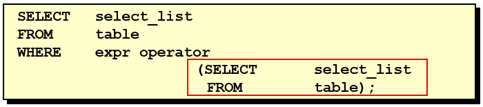

# 1 需求分析与问题解决

> 所属章节：[第九章_子查询](./README.md)
> 上一节：[前言](./前言.md)
> 建议回查情境：想知道为什么需要子查询、想比较分步查询、自连接与子查询的差异，或想先建立子查询的基本分类框架时

## 本节导读

这一节先从一个实际查询需求切入，说明为什么会从普通查询走到子查询。接着会整理子查询的基本使用方式，以及两种常见分类方法：按返回结果分类、按是否依赖外层查询分类。

第一次学习时，建议先看 `1.1 实际问题`，理解子查询到底解决了什么；再看 `1.2 子查询的基本使用` 建立语法骨架；最后看 `1.3 子查询的分类`，把后续章节会遇到的不同子查询类型先分清楚。

## 你会在这篇学到什么

- 为什么有些查询需求适合用子查询解决。
- 子查询与分步查询、自连接相比，各自的特点是什么。
- 子查询的基本语法和使用注意事项。
- 如何按返回结果区分标量、列、行、表子查询。
- 如何按执行方式区分不相关子查询与相关子查询。

## 快速定位

- `1.1 实际问题`：看一个“查询工资高于 Abel 的员工”案例，理解为什么会引出子查询。
- `1.2 子查询的基本使用`：看子查询的基本语法结构与使用注意事项。
- `1.3.1 按返回结果分类`：看标量子查询、列子查询、行子查询、表子查询的差异。
- `1.3.2 按是否依赖外层查询分类`：看不相关子查询与相关子查询的区别。

## 关键字

- `子查询`：嵌套在另一个查询语句中的查询。
- `内查询`：先提供结果给外层查询使用的子查询。
- `外查询`：使用子查询结果的主查询。
- `标量子查询`：返回 `1` 行 `1` 列结果的子查询。
- `列子查询`：返回多行 `1` 列结果的子查询。
- `行子查询`：返回 `1` 行多列结果的子查询。
- `表子查询`：返回多行多列结果，常作为派生表使用。
- `相关子查询`：依赖外层查询当前行数据的子查询。
- `不相关子查询`：可独立执行、通常只需计算一次的子查询。

## 1.1 实际问题

下面这个案例要解决的问题是：查询工资高于 `Abel` 的员工。


可以先看三种常见思路：

**方式一：分两步查询**

先查出 `Abel` 的工资，再把这个值带入第二条 SQL：

```sql
SELECT salary
FROM   employees
WHERE  last_name = 'Abel';

SELECT last_name, salary
FROM   employees
WHERE  salary > 11000;
```

这种方式能解决问题，但需要人工或程序先拿到第一步结果，再去写第二步条件。

**方式二：自连接**

```sql
SELECT e2.last_name, e2.salary
FROM   employees e1,
       employees e2
WHERE  e1.last_name = 'Abel'
AND    e1.salary < e2.salary;
```

这种方式把两次比较写进同一条 SQL 中，但当问题本质只是“先求一个值，再拿这个值比较”时，自连接不一定是最直观的写法。

**方式三：子查询**

```sql
SELECT last_name, salary
FROM   employees
WHERE  salary > (
           SELECT salary
           FROM   employees
           WHERE  last_name = 'Abel'
       );
```

这条 SQL 的思路更接近需求本身：

1. 先通过内层查询找到 `Abel` 的工资。
2. 再让外层查询找出工资高于这个值的员工。


### 回查提示

当需求本质是“先查出一个值或一组值，再拿这个结果继续筛选”时，就可以开始考虑子查询。

## 1.2 子查询的基本使用

子查询的基本语法结构如下：



可以先抓住两个核心概念：

- 子查询是内查询，负责先计算出一个结果。
- 主查询是外查询，负责使用这个结果继续筛选、比较或返回数据。

在这个学习阶段，可以先这样理解执行顺序：

- 子查询通常先得到结果。
- 外查询再使用这个结果完成最终查询。

### 使用注意事项

- 子查询要写在括号内。
- 常见写法是把子查询放在比较条件的右侧。
- 单行操作符通常对应单行子查询，多行操作符通常对应多行子查询。

### 回查提示

如果你一时分不清一段 SQL 里哪部分是子查询，先看有没有一段被括号包住、而且它本身也是一条完整的 `SELECT`。

## 1.3 子查询的分类

子查询常见有两种整理角度：

- 按返回结果的形态分类。
- 按是否依赖外层查询分类。

### 1.3.1 按返回结果分类

如果按内查询最终返回的是一条还是多条记录、是一列还是多列，可以把子查询分为 `标量子查询`、`列子查询`、`行子查询`、`表子查询`。

| 子查询类型 | 返回结果 | 典型应用场景 |
| --- | --- | --- |
| **标量子查询** | **1 行 1 列** | `=`、`<>`、`>`、`<`、`>=`、`<=` 比较 |
| **列子查询** | **多行 1 列** | `IN`、`NOT IN` |
| **行子查询** | **1 行 多列** | `(col1, col2) = (SELECT col1, col2 FROM ...)` |
| **表子查询** | **多行 多列** | `FROM` 子句中的派生表 |

#### 标量子查询（Scalar Subquery）

特点：

- 只返回 `1` 行 `1` 列结果。
- 可以用在 `SELECT`、`WHERE`、`HAVING` 或 `SET` 等语句位置。
- 结果通常可直接用于计算或比较。

示例：查询最高薪资的员工

```sql
CREATE TABLE employees (
    id INT PRIMARY KEY AUTO_INCREMENT,
    name VARCHAR(50),
    department_id INT,
    salary DECIMAL(10,2)
);

INSERT INTO employees (name, department_id, salary) VALUES
('Alice', 1, 5000),
('Bob', 2, 7000),
('Charlie', 1, 5500),
('David', 2, 7200);

SELECT name, salary
FROM employees
WHERE salary = (SELECT MAX(salary) FROM employees);
```

解释：

- 内层查询 `SELECT MAX(salary) FROM employees` 返回单个值，也就是最高薪资。
- 外层查询再找出薪资等于这个值的员工。

结果：

| name | salary |
| --- | --- |
| David | 7200.00 |

#### 列子查询（Column Subquery）

特点：

- 返回多行 `1` 列结果。
- 常与 `IN`、`NOT IN` 搭配使用。
- 常见于 `WHERE` 或 `HAVING` 中做集合匹配。

示例：查询所有在 `IT` 或 `HR` 部门的员工

```sql
CREATE TABLE departments (
    id INT PRIMARY KEY AUTO_INCREMENT,
    name VARCHAR(50)
);

INSERT INTO departments (id, name) VALUES
(1, 'HR'),
(2, 'IT'),
(3, 'Sales');

SELECT name, department_id
FROM employees
WHERE department_id IN (
    SELECT id
    FROM departments
    WHERE name IN ('IT', 'HR')
);
```

解释：

- 内层查询返回 `IT` 与 `HR` 对应的部门编号集合。
- 外层查询再找出 `department_id` 落在这个集合中的员工。

结果：

| name | department_id |
| --- | --- |
| Alice | 1 |
| Bob | 2 |
| Charlie | 1 |
| David | 2 |

#### 行子查询（Row Subquery）

特点：

- 返回 `1` 行多列结果。
- 常搭配行比较语法一起使用。
- 适合把多个字段当成一个整体进行比较。

示例：查询同时匹配某组字段组合的记录

```sql
SELECT name, department_id
FROM employees
WHERE (salary, department_id) = (
    SELECT 7200, 2
);
```

解释：

- 子查询返回一行两列的结果 `(7200, 2)`。
- 外层查询把 `(salary, department_id)` 作为一个整体，与这组结果进行比较。

结果：

| name | department_id |
| --- | --- |
| David | 2 |

#### 表子查询（Table Subquery）

特点：

- 返回多行多列结果。
- 常写在 `FROM` 子句中，作为派生表（Derived Table）。
- 必须为子查询结果提供别名，否则会报错。

示例：查询薪资高于部门平均薪资的员工

```sql
SELECT e.name, e.salary, e.department_id
FROM employees e
JOIN (
    SELECT department_id, AVG(salary) AS avg_salary
    FROM employees
    GROUP BY department_id
) AS dept_avg
ON e.department_id = dept_avg.department_id
WHERE e.salary > dept_avg.avg_salary;
```

解释：

- 内层查询先计算每个部门的平均薪资。
- 外层查询再把员工表与这张“部门平均薪资表”连接起来，找出高于本部门平均值的员工。

结果：

| name | salary | department_id |
| --- | --- | --- |
| Bob | 7000 | 2 |
| David | 7200 | 2 |

#### 小结

按返回结果分类时，可以这样快速记忆：

| 子查询类型 | 结果集 | 适用场景 |
| --- | --- | --- |
| **标量子查询** | 1 行 1 列 | `WHERE` 条件、赋值运算 (`=`) |
| **列子查询** | N 行 1 列 | `IN`、`NOT IN` |
| **行子查询** | 1 行 N 列 | `(col1, col2) = (SELECT col1, col2 FROM ...)` |
| **表子查询** | N 行 N 列 | `FROM` 子句，创建派生表 |

### 1.3.2 按是否依赖外层查询分类

除了看返回结果，子查询也可以按是否依赖主查询当前行的数据，分成 `不相关子查询` 和 `相关子查询`。

#### 不相关子查询（Non-Correlated Subquery）

特点：

- 子查询通常只需要执行一次。
- 子查询可以独立运行，不依赖外层查询当前行的数据。

示例：查询工资高于平均工资的员工

```sql
SELECT emp_name, salary
FROM employees
WHERE salary > (
    SELECT AVG(salary)
    FROM employees
);
```

解释：

- 子查询先计算整张表的平均工资。
- 外层查询再找出工资高于这个平均值的员工。

这个子查询不会随着主查询每一行而变化，因此属于不相关子查询。

#### 相关子查询（Correlated Subquery）

特点：

- 子查询依赖外层查询当前行的数据。
- 子查询通常会随着外层查询的当前行而反复执行。

示例：查询比同一部门平均工资高的员工

```sql
SELECT emp_name, salary, dept_id
FROM employees e1
WHERE salary > (
    SELECT AVG(salary)
    FROM employees e2
    WHERE e1.dept_id = e2.dept_id
);
```

解释：

- 主查询先扫描员工数据。
- 子查询会根据当前员工所在的 `dept_id`，计算该部门的平均工资。
- 比较条件中的关联点是 `e1.dept_id = e2.dept_id`。

因为子查询依赖外层当前行的数据，所以这是相关子查询。

#### 小结

| 类型 | 是否依赖主查询 | 执行次数特点 | 适用场景 |
| --- | --- | --- | --- |
| **不相关子查询** | 否 | 通常只执行一次 | 计算固定值，如最大值、最小值、平均值或某个 ID 对应的数据 |
| **相关子查询** | 是 | 会随外层查询当前行多次执行 | 依赖外层当前行数据做比较，如部门内比较、同类数据比较 |

## 常见回查问题

- 为什么这个需求用子查询会比拆成两条 SQL 更自然？
- 子查询和自连接有什么差别？
- 子查询一定会先执行吗？
- 标量子查询、列子查询、行子查询、表子查询分别返回什么结果？
- 什么是不相关子查询？什么是相关子查询？

## 一句话抓核心

子查询的核心用法是：先让内层查询得到一个值、一个集合或一张临时结果表，再让外层查询基于这个结果继续比较、筛选或连接。

## 延伸阅读

- [前言](./前言.md)
- [第九章导航](./README.md)
- [回到 README](../../README.md)
