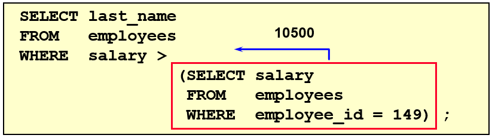
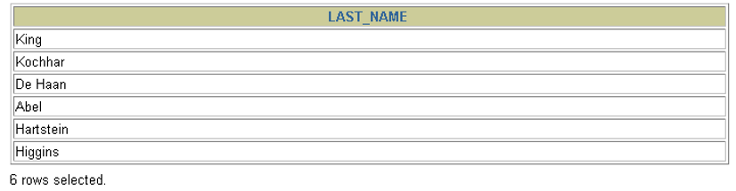
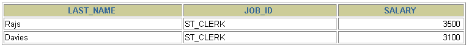

# 2 单行子查询

> 所属章节：[第九章_子查询](./README.md)
> 上一节：[1 需求分析与问题解决](./1%20需求分析与问题解决.md)
> 建议回查情境：想确认单行比较符怎么搭配子查询、想区分成对比较与不成对比较，或想排查“子查询不返回任何行”与“多行子查询误用单行比较符”这类问题时

## 本节导读

这一节聚焦在单行子查询，也就是内层查询只返回单个值的情况。重点不只是会写 `=`、`>`、`<` 这类比较，而是要看懂：什么时候子查询真的只会返回一行，什么时候虽然语法看起来像单行比较，实际上却可能因为返回多行而报错。

第一次学习时，建议先看 `2.1 单行比较操作符`，先建立和单行子查询搭配的比较符概念；再看 `2.2 代码示例`，理解单行子查询在典型筛选题中的用法；最后看 `2.3` 到 `2.7`，把成对比较、`HAVING`、`CASE`、空值问题与非法使用场景一次串起来。

## 你会在这篇学到什么

- 什么是单行子查询。
- 单行子查询通常会搭配哪些比较操作符。
- 如何理解成对比较与不成对比较。
- 单行子查询如何用在 `HAVING` 与 `CASE` 中。
- 子查询不返回任何行时会出现什么现象。
- 为什么多行子查询不能直接搭配单行比较符。

## 快速定位

- `2.1 单行比较操作符`：看 `=`、`>`、`>=`、`<`、`<=`、`<>` 的基本对应关系。
- `2.2`：看几个典型的单行子查询筛选题。
- `2.3`：看成对比较与不成对比较的差别。
- `2.4`：看 `HAVING` 中如何使用单行子查询。
- `2.5`：看 `CASE` 中如何嵌入单行子查询。
- `2.6`：看子查询不返回任何行时的表现。
- `2.7`：看多行子查询误用单行比较符时为什么会报错。

## 关键字

- `单行子查询`：只返回 `1` 行 `1` 列结果的子查询。
- `单行比较操作符`：`=`、`>`、`>=`、`<`、`<=`、`<>` 等比较符。
- `成对比较`：把多个字段当作一组整体进行比较。
- `不成对比较`：每个字段分开比较。
- `HAVING`：对分组结果继续筛选的子句。
- `CASE`：SQL 中的条件表达式。
- `空值问题`：子查询不返回任何行或返回空结果时带来的判断影响。

## 2.1 单行比较操作符

单行子查询常见会搭配以下比较操作符：

| 操作符 | 含义 |
| --- | --- |
| `=` | 等于 |
| `>` | 大于 |
| `>=` | 大于等于 |
| `<` | 小于 |
| `<=` | 小于等于 |
| `<>` | 不等于 |

这些操作符之所以能直接使用，是因为单行子查询返回的是一个单独值，外层查询可以把它当成普通常量来比较。

### 回查提示

如果子查询返回的不是单个值，而是多行结果，就不能直接用这组单行比较符，否則要改用 `IN`、`ANY`、`ALL` 這類多行比較方式。

## 2.2 代码示例

### 2.2.1 查询工资大于 149 号员工工资的员工





对应写法可以理解为：

```sql
SELECT last_name, salary
FROM   employees
WHERE  salary > (
           SELECT salary
           FROM   employees
           WHERE  employee_id = 149
       );
```

这条 SQL 的核心是：

- 子查询先找出 `149` 号员工的工资。
- 外层查询再筛出工资高于这个值的员工。

### 2.2.2 返回 `job_id` 与 141 号员工相同，且 `salary` 比 143 号员工高的员工

```sql
SELECT last_name, job_id, salary
FROM   employees
WHERE  job_id = (
           SELECT job_id
           FROM   employees
           WHERE  employee_id = 141
       )
AND    salary > (
           SELECT salary
           FROM   employees
           WHERE  employee_id = 143
       );
```

这条 SQL 同时用了两个单行子查询：

- 一个先取出 `141` 号员工的 `job_id`。
- 一个先取出 `143` 号员工的 `salary`。
- 外层再同时满足这两个条件。



### 2.2.3 返回公司工资最低的员工

```sql
SELECT last_name, job_id, salary
FROM   employees
WHERE  salary = (
           SELECT MIN(salary)
           FROM   employees
       );
```

这条 SQL 的思路是：

- 子查询先计算整张表的最低工资。
- 外层查询再找出工资等于这个最低值的员工。


## 2.3 成对比较和不成对比较

当题目需要同时比较多个字段时，容易混淆“每个字段分别比较”与“多个字段作为一组比较”。

可以先这样区分：

- 不成对比较：每个字段单独判断。
- 成对比较：把多个字段当成一个整体组合来判断。

### 2.3.1 不成对比较

题目：查询与 `141` 号或 `174` 号员工的 `manager_id` 和 `department_id` 相同的其他员工的 `employee_id`、`manager_id`、`department_id`。

```sql
SELECT employee_id, manager_id, department_id
FROM   employees
WHERE  manager_id IN (
           SELECT manager_id
           FROM   employees
           WHERE  employee_id IN (174, 141)
       )
AND    department_id IN (
           SELECT department_id
           FROM   employees
           WHERE  employee_id IN (174, 141)
       )
AND    employee_id NOT IN (174, 141);
```

这里的意思是：

- `manager_id` 只要落在目标员工的经理编号集合中即可。
- `department_id` 只要落在目标员工的部门编号集合中即可。
- 这两个条件彼此独立判断。

也就是说，这种写法不要求 `manager_id` 与 `department_id` 的组合一定原封不动地配對出现。

### 2.3.2 成对比较

同一题如果改成把两个字段当成一组整体比较，可以写成：

```sql
SELECT employee_id, manager_id, department_id
FROM   employees
WHERE  (manager_id, department_id) IN (
           SELECT manager_id, department_id
           FROM   employees
           WHERE  employee_id IN (141, 174)
       )
AND    employee_id NOT IN (141, 174);
```

这里的重点是：

- `manager_id` 和 `department_id` 不再分开判断。
- 外层会检查 `(manager_id, department_id)` 这个组合，是否完整出现在子查询返回的组合中。

因此，只有当两个字段的配对同时匹配时，记录才会被保留。

### 2.3.3 区别总结

- 不成对比较：每个字段各自比较，条件独立成立即可。
- 成对比较：多个字段作为一个整体比较，必须整组匹配。

## 2.4 `HAVING` 中的子查询

单行子查询也可以放在 `HAVING` 中，对分组结果继续比较。

例如：查询最低工资大于 `50` 号部门最低工资的部门编号及其最低工资。

```sql
SELECT department_id, MIN(salary)
FROM   employees
GROUP BY department_id
HAVING MIN(salary) > (
           SELECT MIN(salary)
           FROM   employees
           WHERE  department_id = 50
       );
```

可以这样理解：

- 子查询先算出 `50` 号部门的最低工资。
- `HAVING` 再把每个部门的最低工资拿来和这个值比较。

## 2.5 `CASE` 中的子查询

单行子查询也可以出现在 `CASE` 表达式中。

例如：显示员工的 `employee_id`、`last_name` 和 `location`。如果员工的 `department_id` 与 `location_id = 1800` 对应部门的 `department_id` 相同，则显示 `Canada`，否则显示 `USA`。

```sql
SELECT employee_id,
       last_name,
       CASE department_id
           WHEN (
               SELECT department_id
               FROM   departments
               WHERE  location_id = 1800
           )
           THEN 'Canada'
           ELSE 'USA'
       END AS location
FROM   employees;
```

这里的子查询先返回一个单独的 `department_id`，再交给 `CASE` 做条件分支判断。

## 2.6 子查询中的空值问题

如果子查询不返回任何行，外层条件虽然语法正确，但结果可能与你直觉不同。

例如：

```sql
SELECT last_name, job_id
FROM   employees
WHERE  job_id = (
           SELECT job_id
           FROM   employees
           WHERE  last_name = 'Haas'
       );
```


这里的重点是：

- 如果内层查询找不到 `last_name = 'Haas'` 的记录，就不会返回任何行。
- 外层条件因此无法得到一个实际可比较的值。

### 回查提示

看到“明明 SQL 能执行，但没有查出结果”时，要先确认子查询是不是根本没有返回任何行。

## 2.7 非法使用子查询

单行子查询的最大前提是：内层真的只能返回单个值。

例如下面这段 SQL 就是错误用法：

```sql
SELECT employee_id, last_name
FROM   employees
WHERE  salary = (
           SELECT MIN(salary)
           FROM   employees
           GROUP BY department_id
       );
```


原因是：

- `GROUP BY department_id` 之后，子查询会针对每个部门各返回一个最低工资。
- 这样得到的是多行结果，不再是单个值。
- 外层却仍然用 `salary = (...)` 这种单行比较写法，因此会报错。

### 回查提示

如果子查询里已经出现 `GROUP BY`、而且没有进一步压成单个结果，就要特别警觉：它很可能不再是单行子查询。

## 常见混淆点

- 单行子查询能用单行比较符的前提，是子查询真的只返回一个值。
- `GROUP BY` 很容易让原本看起来像单行子查询的写法变成多行结果。
- 不成对比较与成对比较的差别，不在字段数量，而在于是否把多个字段当作同一个组合来比较。
- 子查询不返回任何行时，不一定会报语法错，但结果可能为空。

## 常见回查问题

- 单行子查询为什么可以直接搭配 `=`、`>`、`<`？
- 成对比较和不成对比较到底差在哪里？
- `HAVING` 和 `CASE` 中能不能使用单行子查询？
- 子查询不返回任何行时会怎样？
- 为什么有些看起来像单行子查询的 SQL 会报错？

## 一句话抓核心

单行子查询的核心是：内层必须先稳定返回一个单独值，外层才能把它当成普通常量，用单行比较符继续判断。

## 延伸阅读

- [1 需求分析与问题解决](./1%20需求分析与问题解决.md)
- [3 多行子查询](./3%20多行子查询.md)
- [第九章导航](./README.md)
