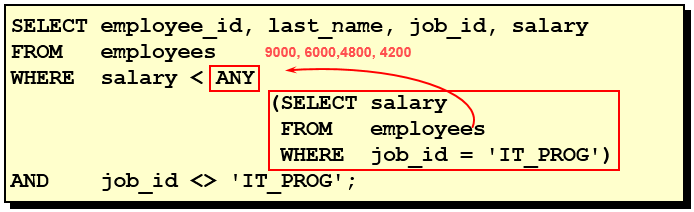
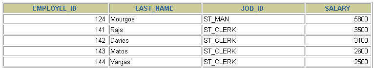
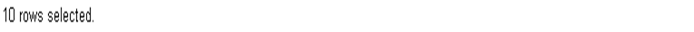
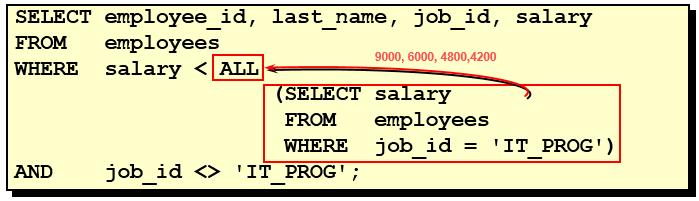
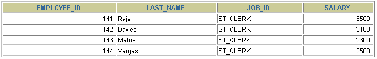

# 3 多行子查询

> 所属章节：[第九章_子查询](./README.md)
> 上一节：[2 单行子查询](./2%20单行子查询.md)
> 建议回查情境：想分清 `IN`、`ANY`、`ALL`、`SOME` 的差别，想处理“比某组值中的任意一个大 / 所有值都小”这类题型，或排查 `NOT IN` 搭配子查询时的空值问题时

## 本节导读

这一节聚焦在多行子查询，也就是内层查询会返回多行结果的情况。重点不是只记操作符名称，而是要建立“外层值到底是在跟集合里的任意一个值比较，还是跟全部值比较”的判断方式。

第一次学习时，建议先看 `3.1 多行比较操作符`，先分清 `IN`、`ANY`、`ALL`、`SOME` 的语意；再看 `3.2 代码示例`，把题目语言和 SQL 比较条件对应起来；最后看 `3.3 空值问题`，理解为什么 `NOT IN` 经常会因为 `NULL` 得到意外结果。

## 你会在这篇学到什么

- 什么是多行子查询，为什么也叫集合比较子查询。
- `IN`、`ANY`、`ALL`、`SOME` 分别在比较什么。
- 如何把“任意一个”“所有值都满足”这类题目翻成 SQL。
- `ANY` 和 `ALL` 在典型题型中的用法。
- 为什么 `NOT IN` 搭配子查询时要特别注意空值。

## 快速定位

- `3.1 多行比较操作符`：看 `IN`、`ANY`、`ALL`、`SOME` 的基本语意。
- `3.2.1`：看“比某组值中的任意一个还低”时如何写 `ANY`。
- `3.2.2`：看“比某组值中的所有值都低”时如何写 `ALL`。
- `3.2.3`：看 `ALL` 如何替代“先求最小值，再比较”的双层写法。
- `3.3 空值问题`：看 `NOT IN` 遇到 `NULL` 时为什么容易出错。

## 关键字

- `多行子查询`：内层查询返回多行结果的子查询。
- `集合比较子查询`：把外层值与子查询返回的一组值做比较。
- `IN`：等于集合中的任意一个值。
- `ANY`：与集合中的某一个值比较即可成立。
- `SOME`：`ANY` 的别名。
- `ALL`：必须与集合中的所有值比较都成立。
- `NOT IN`：不属于集合中的任何一个值，但会受 `NULL` 影响。

## 3.1 多行比较操作符

多行子查询也称为集合比较子查询。它的特点是：

- 内查询返回多行结果。
- 外查询要把某个值与这一组结果做比较。
- 需要使用多行比较操作符，而不是只用单行比较符。

常见操作符如下：

| 操作符 | 含义 |
| --- | --- |
| `IN` | 等于列表中的任意一个值 |
| `ANY` | 需要和单行比较操作符一起使用，表示与子查询结果中的某一个值比较 |
| `ALL` | 需要和单行比较操作符一起使用，表示与子查询结果中的所有值比较 |
| `SOME` | `ANY` 的别名，作用相同 |

可以先这样理解它们：

- `x IN (子查询)`：看 `x` 是否等于这组结果中的某一个值。
- `x < ANY (子查询)`：只要 `x` 小于这组结果中的某一个值就成立。
- `x < ALL (子查询)`：只有当 `x` 小于这组结果中的每一个值时才成立。

### 回查提示

题目里看到“任意一个”“其中一个”时，优先联想到 `IN` 或 `ANY`；看到“所有”“全部都满足”时，优先联想到 `ALL`。

## 3.2 代码示例

### 3.2.1 题型一：比 `IT_PROG` 中任意一个工资还低

题目：返回其它 `job_id` 中，比 `job_id = 'IT_PROG'` 的员工里任意一个工资都低的员工的 `employee_id`、`last_name`、`job_id` 和 `salary`。







对应写法可以是：

```sql
SELECT employee_id, last_name, job_id, salary
FROM   employees
WHERE  job_id <> 'IT_PROG'
AND    salary < ANY (
           SELECT salary
           FROM   employees
           WHERE  job_id = 'IT_PROG'
       );
```

这里的重点是：

- 子查询会先取出所有 `IT_PROG` 员工的工资，形成一个工资集合。
- `salary < ANY (...)` 表示外层员工的工资只要小于这个集合中的某一个值即可成立。

如果把题目换成“等于其中一个值”，通常就会写成 `IN`。

### 3.2.2 题型二：比 `IT_PROG` 中所有工资都低

题目：返回其它 `job_id` 中，比 `job_id = 'IT_PROG'` 的员工里所有工资都低的员工的 `employee_id`、`last_name`、`job_id` 和 `salary`。





对应写法可以是：

```sql
SELECT employee_id, last_name, job_id, salary
FROM   employees
WHERE  job_id <> 'IT_PROG'
AND    salary < ALL (
           SELECT salary
           FROM   employees
           WHERE  job_id = 'IT_PROG'
       );
```

这里和上一题的差别只有一个词，但语意完全不同：

- `salary < ANY (...)`：比其中某一个值小就够了。
- `salary < ALL (...)`：必须比集合里的每一个值都小才行。

因此，`ALL` 通常表示条件更严格。

### 3.2.3 题型三：查询平均工资最低的部门 ID

这个题目可以先用“两层聚合 + 再比较最小值”的方式解决：

```sql
SELECT department_id
FROM   employees
GROUP BY department_id
HAVING AVG(salary) = (
           SELECT MIN(avg_sal)
           FROM (
               SELECT AVG(salary) AS avg_sal
               FROM   employees
               GROUP BY department_id
           ) dept_avg_sal
       );
```

也可以改写成使用 `ALL` 的方式：

```sql
SELECT department_id
FROM   employees
GROUP BY department_id
HAVING AVG(salary) <= ALL (
           SELECT AVG(salary) AS avg_sal
           FROM   employees
           GROUP BY department_id
       );
```

第二种写法的核心是：

- 子查询先返回每个部门的平均工资集合。
- `AVG(salary) <= ALL (...)` 表示当前部门平均工资要小于或等于集合中的所有值。
- 也就是当前部门的平均工资必须是最小值。

### 小结

这几个操作符可以这样抓重点：

| 写法 | 语意 |
| --- | --- |
| `IN (子查询)` | 等于集合中的某一个值 |
| `< ANY (子查询)` | 小于集合中的至少一个值 |
| `< ALL (子查询)` | 小于集合中的每一个值 |
| `<= ALL (子查询)` | 小于或等于集合中的每一个值，常用来表达“最小” |

## 3.3 空值问题

多行子查询中最容易踩雷的地方之一，是 `NOT IN` 搭配 `NULL`。

例如：

```sql
SELECT last_name
FROM   employees
WHERE  employee_id NOT IN (
           SELECT manager_id
           FROM   employees
       );
```


这个查询乍看是在找“不是任何人经理的员工”，但如果子查询结果里包含 `NULL`，判断就会出问题。

原因是：

- `NOT IN` 本质上等价于“不等于集合中的每一个值”。
- 一旦集合里出现 `NULL`，某些比较会变成“未知”。
- 最终整条条件可能无法判断为 `TRUE`，导致结果和预期不一致，甚至查不到资料。

### 回查提示

看到 `NOT IN (子查询)` 时，先确认子查询结果里会不会出现 `NULL`。如果可能出现，就要额外处理空值，再决定是否继续使用 `NOT IN`。

## 常见混淆点

- `IN` 更像“是否属于这个集合”；`ANY` 和 `ALL` 则要搭配 `<`、`>`、`=` 这类比较符一起理解。
- `SOME` 和 `ANY` 没有本质差别，`SOME` 只是别名。
- `ANY` 代表“至少满足一个”，`ALL` 代表“必须满足全部”。
- `NOT IN` 一旦碰到 `NULL`，结果常会和直觉不同，不能只看字面意思判断。

## 常见回查问题

- 多行子查询为什么也叫集合比较子查询？
- `IN`、`ANY`、`ALL`、`SOME` 到底差在哪里？
- “任意一个”要写 `ANY` 还是 `ALL`？
- “所有值都满足”为什么通常要写 `ALL`？
- `NOT IN` 为什么常常查不出预期结果？

## 一句话抓核心

多行子查询的核心是：先让内层查询返回一组值，再决定外层条件是要与其中任意一个值比较，还是必须与全部值比较。

## 延伸阅读

- [2 单行子查询](./2%20单行子查询.md)
- [第九章导航](./README.md)
- [回到 README](../../README.md)
