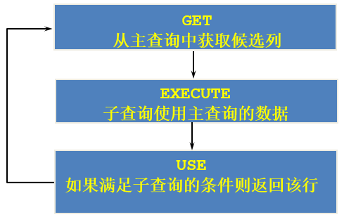
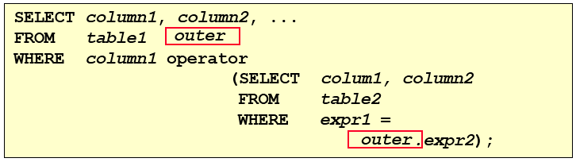
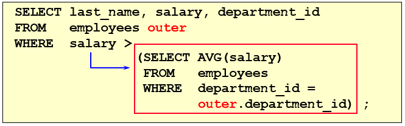

# 4 相关子查询

> 所属章节：[第九章_子查询](./README.md)
> 上一节：[3 多行子查询](./3%20多行子查询.md)
> 建议回查情境：想确认什么是相关子查询、想看它在 `WHERE`、`ORDER BY`、`EXISTS`、`UPDATE`、`DELETE` 中怎么使用，或想比较相关子查询与 `FROM` 子查询时

## 本节导读

这一节聚焦在相关子查询，也就是子查询会依赖外层查询当前行数据的情况。重点不是只记“会重复执行”这句结论，而是要看懂相关子查询到底依赖了外层哪一列，以及这种依赖为什么会让子查询随着外层每一行重新计算。

第一次学习时，建议先看 `4.1 相关子查询执行流程`，建立相关子查询的整体画面；再看 `4.2 代码示例`，观察它在 `WHERE`、`ORDER BY` 与 `FROM` 对照写法中的实际用法；最后看 `4.3 EXISTS 与 NOT EXISTS` 以及 `4.4`、`4.5`，理解相关子查询不只出现在 `SELECT`，也常用于更新与删除。

## 你会在这篇学到什么

- 什么是相关子查询，它和一般子查询有什么关键差别。
- 为什么相关子查询会随着外层查询当前行而重复执行。
- 相关子查询在 `WHERE`、`ORDER BY` 中的常见写法。
- `EXISTS` 与 `NOT EXISTS` 的判断逻辑与典型场景。
- 相关子查询在 `UPDATE`、`DELETE` 中的基本用法。

## 快速定位

- `4.1 相关子查询执行流程`：看相关子查询为什么会依赖外层查询。
- `4.2.1`：看“工资高于本部门平均工资”这类经典相关子查询题型。
- `4.2.2`：看相关子查询为什么可以出现在 `ORDER BY` 中。
- `4.2.3`：看 `WHERE` 中如何用相关子查询做计数过滤。
- `4.3`：看 `EXISTS` 与 `NOT EXISTS` 的语意与典型写法。
- `4.4`、`4.5`：看相关子查询在 `UPDATE`、`DELETE` 中的基本模式。

## 关键字

- `相关子查询`：依赖外层查询当前行数据的子查询。
- `外层查询`：驱动整条 SQL 主体流程的查询。
- `内层查询`：引用外层列并返回结果给外层使用的子查询。
- `EXISTS`：只要子查询返回至少一行，就判定为真。
- `NOT EXISTS`：只要子查询没有返回任何行，就判定为真。
- `FROM 子查询`：把子查询结果当成派生表使用的写法。
- `派生表`：由子查询产生、再当作临时表使用的结果集。

## 4.1 相关子查询执行流程

如果子查询的执行依赖外部查询，通常是因为子查询中使用了外层查询的列，并通过这些列建立条件关联，这样的子查询就称为相关子查询。

你可以先抓住两个核心特征：

- 子查询中会引用主查询当前行的某个列。
- 主查询每处理一行，子查询就会基于这一行重新计算一次。

因此，相关子查询通常是“外层一行一行扫描，内层跟着一行一行判断”的执行方式。





可以用一句话判断一段 SQL 是否是相关子查询：

> 子查询中是否使用了主查询中的列。

### 回查提示

看到子查询里出现外层表别名，例如 `e1.department_id = e2.department_id` 这种写法时，就可以高度怀疑它是相关子查询。

## 4.2 代码示例

### 4.2.1 经典题型：工资高于本部门平均工资的员工

题目：查询员工中工资大于本部门平均工资的员工 `last_name`、`salary` 和 `department_id`。

#### 方式一：相关子查询

```sql
SELECT last_name, salary, department_id
FROM   employees e1
WHERE  salary > (
           SELECT AVG(salary)
           FROM   employees e2
           WHERE  e1.department_id = e2.department_id
       );
```

这条 SQL 的关键在于：

- 外层查询当前处理的是 `employees e1` 的某一位员工。
- 子查询会根据这位员工所在的 `department_id`，重新计算该部门的平均工资。
- 比较条件中真正的关联点是 `e1.department_id = e2.department_id`。



#### 方式二：在 `FROM` 中使用子查询

同一个问题，也可以先把“每个部门的平均工资”算出来，再与员工表连接：

```sql
SELECT last_name, salary, e1.department_id
FROM   employees e1,
       (
           SELECT department_id, AVG(salary) AS dept_avg_sal
           FROM   employees
           GROUP BY department_id
       ) e2
WHERE  e1.department_id = e2.department_id
AND    e2.dept_avg_sal < e1.salary;
```

这里的重点是：

- `FROM` 子查询会先产生一张“部门平均工资”的临时结果表。
- 这张结果表需要取别名，才能在外层查询继续引用。
- 这种写法不是相关子查询本身，而是把子查询结果先物化成派生表再连接。

### 回查提示

如果问题本质是“每一行要和同组平均值比较”，常见写法通常是“相关子查询”或“先聚合再连接”这两种。

### 4.2.2 在 `ORDER BY` 中使用相关子查询

题目：查询员工的 `employee_id`、`salary`，并按照 `department_name` 排序。

```sql
SELECT employee_id, salary
FROM   employees e
ORDER BY (
           SELECT department_name
           FROM   departments d
           WHERE  e.department_id = d.department_id
         );
```

这段 SQL 之所以可行，是因为：

- `ORDER BY` 接受表达式作为排序依据。
- 这个子查询会针对 `employees` 的每一行，返回一个对应的 `department_name`。
- SQL 引擎就能拿这个返回值作为排序键。

也就是：

1. 先取出员工的 `employee_id` 和 `salary`。
2. 对每一位员工，根据 `department_id` 去子查询拿到对应的 `department_name`。
3. 最后按这个部门名称排序。

### 4.2.3 在 `WHERE` 中使用相关子查询做计数过滤

题目：如果 `employees` 表中的 `employee_id` 与 `job_history` 表中相同 `employee_id` 的记录数不少于 `2`，输出这些员工的 `employee_id`、`last_name` 和 `job_id`。

```sql
SELECT e.employee_id, e.last_name, e.job_id
FROM   employees e
WHERE  2 <= (
           SELECT COUNT(*)
           FROM   job_history
           WHERE  employee_id = e.employee_id
       );
```

这里的相关点是 `employee_id = e.employee_id`：

- 外层查询每取到一位员工。
- 子查询就去 `job_history` 统计这位员工对应的记录数。
- 只有当数量不少于 `2` 时，外层员工才会被保留。

## 4.3 EXISTS 与 NOT EXISTS 关键字

### 4.3.1 基本概念

在 MySQL 中，`EXISTS` 和 `NOT EXISTS` 常用于相关子查询，用来判断子查询是否返回任何结果。

你可以先这样记：

- `EXISTS`：只要子查询有返回行，就成立。
- `NOT EXISTS`：只有当子查询完全没有返回行时，才成立。

#### `EXISTS`

- `EXISTS` 用于检查子查询是否至少返回一行数据。
- 如果子查询有结果，条件为 `TRUE`。
- 如果子查询没有结果，条件为 `FALSE`。

示例：查询至少有下单记录的客户

```sql
CREATE TABLE customers (
    id INT PRIMARY KEY,
    name VARCHAR(50)
);

CREATE TABLE orders (
    id INT PRIMARY KEY,
    customer_id INT,
    total_amount DECIMAL(10,2),
    FOREIGN KEY (customer_id) REFERENCES customers(id)
);

SELECT name
FROM   customers c
WHERE  EXISTS (
           SELECT 1
           FROM   orders o
           WHERE  o.customer_id = c.id
       );
```

解释：

- 对 `customers` 的每一行，子查询都会去检查该客户是否存在对应订单。
- `SELECT 1` 只是表示“只关心有没有返回行”，不是在意具体返回什么值。
- 只要子查询返回至少一行，这位客户就会保留下来。

#### `NOT EXISTS`

- `NOT EXISTS` 用于检查子查询是否没有返回任何行。
- 如果子查询没有结果，条件为 `TRUE`。
- 如果子查询有结果，条件为 `FALSE`。

示例：查询没有下过订单的客户

```sql
SELECT name
FROM   customers c
WHERE  NOT EXISTS (
           SELECT 1
           FROM   orders o
           WHERE  o.customer_id = c.id
       );
```

解释：

- 这条 SQL 与前面的 `EXISTS` 相反。
- 只有当当前客户在 `orders` 中找不到任何对应记录时，才会被选出来。

#### 小结

| 关键字 | 作用 |
| --- | --- |
| `EXISTS` | 只要子查询返回至少一行数据，就返回 `TRUE` |
| `NOT EXISTS` | 只要子查询完全不返回数据，就返回 `TRUE` |

### 4.3.2 代码示例

#### 题型一：查询公司管理者

题目：查询公司管理者的 `employee_id`、`last_name`、`job_id`、`department_id`。

方式一：使用 `EXISTS`

```sql
SELECT employee_id, last_name, job_id, department_id
FROM   employees e1
WHERE  EXISTS (
           SELECT *
           FROM   employees e2
           WHERE  e2.manager_id = e1.employee_id
       );
```

方式二：自连接

```sql
SELECT DISTINCT e1.employee_id, e1.last_name, e1.job_id, e1.department_id
FROM   employees e1
JOIN   employees e2
ON     e1.employee_id = e2.manager_id;
```

方式三：`IN`

```sql
SELECT employee_id, last_name, job_id, department_id
FROM   employees
WHERE  employee_id IN (
           SELECT DISTINCT manager_id
           FROM   employees
       );
```

这个例子说明：`EXISTS` 不是唯一写法，但它很适合表达“是否存在对应记录”这种需求。

#### 题型二：查询没有员工的部门

题目：查询 `departments` 表中，不存在于 `employees` 表中的部门 `department_id` 和 `department_name`。

```sql
SELECT department_id, department_name
FROM   departments d
WHERE  NOT EXISTS (
           SELECT 'X'
           FROM   employees
           WHERE  department_id = d.department_id
       );
```

这条 SQL 的含义是：

- 对每个部门，去 `employees` 里检查是否有对应员工。
- 如果完全找不到对应员工，就保留这个部门。

## 4.4 相关更新

相关更新是指在 `UPDATE` 语句中使用相关子查询。

基本结构如下：

```sql
UPDATE table1 alias1
SET    column = (
           SELECT expression
           FROM   table2 alias2
           WHERE  alias1.column = alias2.column
       );
```

示例：更新每个员工的薪资

假设：

- `employees` 表包含 `id`、`name`、`salary`。
- `departments` 表包含 `id`、`name`、`avg_salary`。

现在想将 `employees` 表中每个员工的薪资调整为所在部门的平均薪资：

```sql
UPDATE employees e
SET    e.salary = (
           SELECT d.avg_salary
           FROM   departments d
           WHERE  e.department_id = d.id
       );
```

这里的关键就是：

- 外层正在更新 `employees` 当前这一行。
- 子查询会根据当前员工的 `department_id`，找到对应部门的 `avg_salary`。
- 因为子查询依赖 `e.department_id`，所以它是相关子查询。

## 4.5 相关删除

相关删除是指在 `DELETE` 语句中使用相关子查询。

基本结构如下：

```sql
DELETE FROM table1 alias1
WHERE  column operator (
           SELECT expression
           FROM   table2 alias2
           WHERE  alias1.column = alias2.column
       );
```

示例：删除没有订单的客户

假设：

- `customers` 表包含 `id`、`name`。
- `orders` 表包含 `id`、`customer_id`。

如果要删除 `customers` 表中没有订单的客户，可以写成：

```sql
DELETE FROM customers c
WHERE  NOT EXISTS (
           SELECT 1
           FROM   orders o
           WHERE  o.customer_id = c.id
       );
```

解释：

- `WHERE NOT EXISTS (...)` 负责筛选出没有对应订单的客户。
- 子查询中的 `o.customer_id = c.id` 使用了外层当前客户的 `id`。
- 所以这也是典型的相关子查询删除写法。

## 常见混淆点

- 只要子查询引用了外层查询当前行的列，就不是普通独立子查询，而是相关子查询。
- 相关子查询“通常会多次执行”是理解方向，但重点还是看它是否依赖外层当前行。
- `EXISTS` / `NOT EXISTS` 关心的是“有没有返回行”，不是子查询具体返回什么字段值。
- `FROM` 子查询和相关子查询可能都能解决同一题，但表达方式不同：前者更像先算出一张临时表，后者更像外层逐行判断。

## 常见回查问题

- 相关子查询和不相关子查询最关键的区别是什么？
- 为什么相关子查询会随着外层每一行重复执行？
- `EXISTS` 和 `IN` 有什么差别？
- `NOT EXISTS` 适合解决什么类型的问题？
- 相关子查询能不能用在 `UPDATE` 和 `DELETE` 中？

## 一句话抓核心

相关子查询的核心是：子查询依赖外层查询当前行的数据，因此外层每处理一行，内层就会根据这一行重新判断或计算一次。

## 延伸阅读

- [3 多行子查询](./3%20多行子查询.md)
- [第九章导航](./README.md)
- [回到 README](../../README.md)
