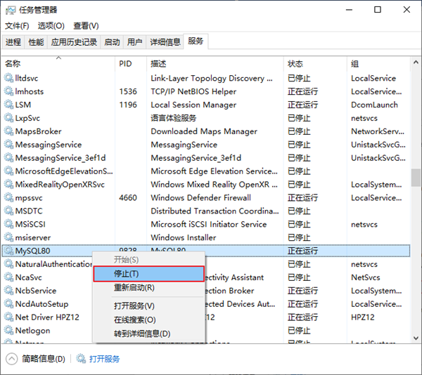
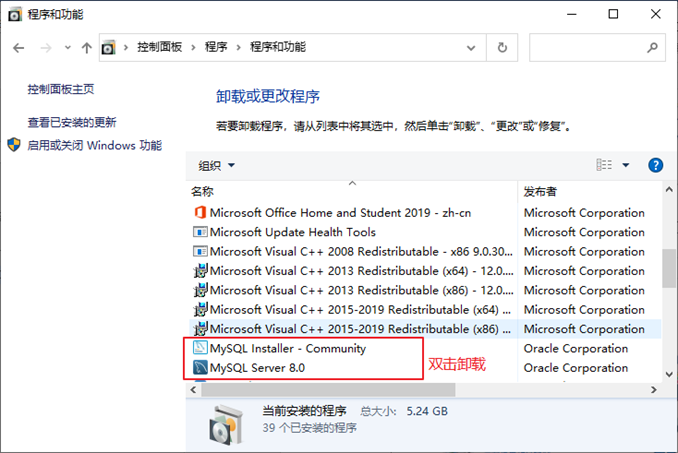
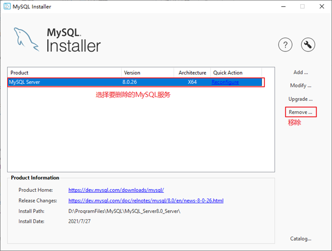
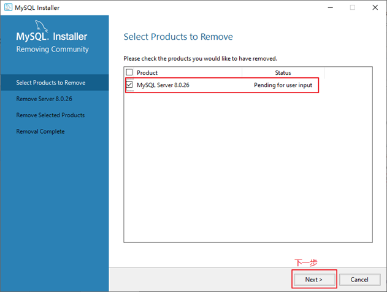
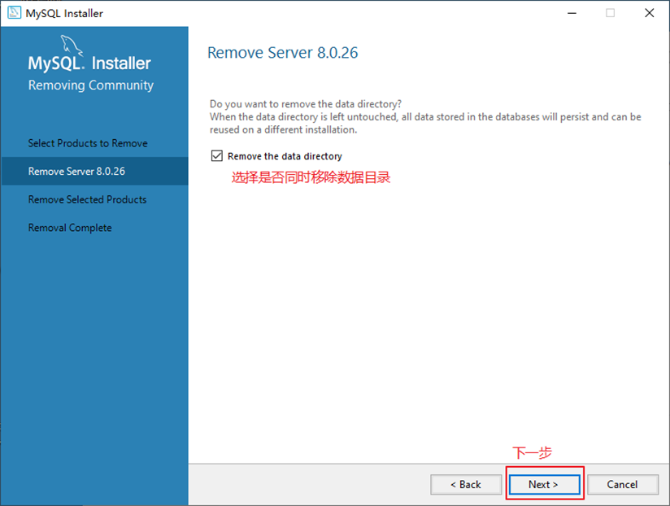
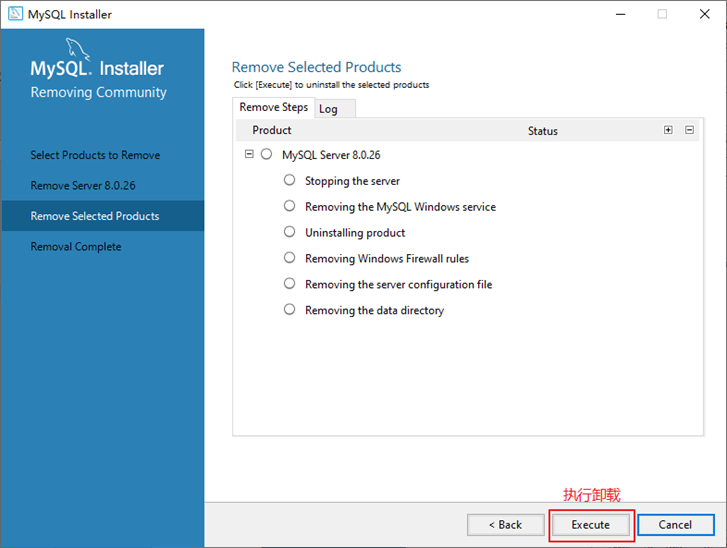
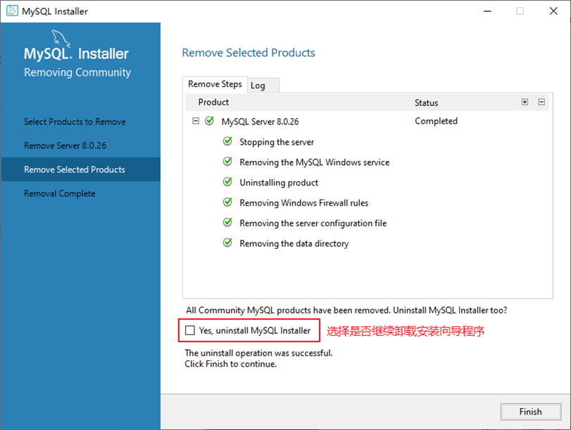
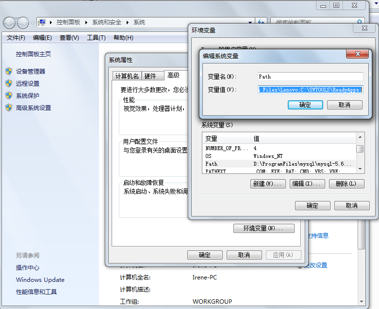

# 1. MySQL 的卸载

章節: 基础篇, 第 02 章 MySQL 环境搭建
Created time: 2026年1月26日 16:22
hasQuestions: No

# 步骤1：停止MySQL服务

在卸载之前，先停止 `MySQL8.0` 的服务。按键盘上的 **Ctrl + Alt + Delete** 组合键，打开 **任务管理器** 对话框，可以在 **服务** 列表找到 **MySQL8.0** 的服务，如果现在 **正在运行** 状态，可以右键单击服务，选择 **停止** 选项停止MySQL8.0的服务，如图所示。



---

# 步骤2：软件的卸载

## **方式1：通过控制面板方式**

卸载 `MySQL8.0` 的程序可以和其他桌面应用程序一样直接在 **控制面板** 选择 **卸载程序**，并在程序列表中找到 `MySQL8.0` 服务器程序，直接双击卸载即可，如图所示。这种方式删除，数据目录下的数据不会跟着删除。



## **方式2：通过安装包提供的卸载功能卸载**

你也可以通过安装向导程序进行 `MySQL8.0` 服务器程序的卸载。

- ① 再次双击下载的 `mysql-installer-community-8.0.26.0.msi` 文件，打开安装向导。安装向导会自动检测已安装的 MySQL 服务器程序。
- ② 选择要卸载的 MySQL 服务器程序，单击 **Remove**（移除），即可进行卸载。
    
    
    
- ③ 单击 **Next**（下一步）按钮，确认卸载。
    
    
    
- ④ 弹出是否同时移除数据目录选择窗口。如果想要同时删除 MySQL 服务器中的数据，则勾选 **Remove the data directory**，如图所示。
    
    
    
- ⑤ 执行卸载。单击 **Execute**（执行）按钮进行卸载。
    
    
    
- ⑥ 完成卸载。单击 **Finish**（完成）按钮即可。如果想要同时卸载 `MySQL8.0` 的安装向导程序，勾选 **Yes，Uninstall MySQL Installer** 即可，如图所示。
    
    
    
---

# 步骤3：残余文件的清理

如果再次安装不成功，可以卸载后对残余文件进行清理后再安装。

(1) 服务目录：mysql 服务的安装目录

(2) 数据目录：默认在 `C:\ProgramData\MySQL`

如果自己单独指定过数据目录，就找到自己的数据目录进行删除即可。

> ⚠️**注意：**
> - 请在卸载前做好数据备份
> - 在操作完以后，需要重启计算机，然后进行安装即可。**如果仍然安装失败，需要继续操作如下步骤4。**

---

# 步骤4：清理注册表（选做）

如果前几步做了，再次安装还是失败，那么可以清理注册表。

如何打开注册表编辑器：在系统的搜索框中输入 `regedit`

```bash
HKEY_LOCAL_MACHINE\\SYSTEM\\ControlSet001\\Services\\Eventlog\\Application\\MySQL服务 目录删除

HKEY_LOCAL_MACHINE\\SYSTEM\\ControlSet001\\Services\\MySQL服务 目录删除

HKEY_LOCAL_MACHINE\\SYSTEM\\ControlSet002\\Services\\Eventlog\\Application\\MySQL服务 目录删除

HKEY_LOCAL_MACHINE\\SYSTEM\\ControlSet002\\Services\\MySQL服务 目录删除

HKEY_LOCAL_MACHINE\\SYSTEM\\CurrentControlSet\\Services\\Eventlog\\Application\\MySQL服务目录删除

HKEY_LOCAL_MACHINE\\SYSTEM\\CurrentControlSet\\Services\\MySQL服务删除

```

> ✏️ **注册表中的 `ControlSet001`、`ControlSet002`，不一定是 `001` 和 `002`，可能是 `ControlSet005`、`ControlSet006` 之类**

---

# 步骤5：删除环境变量配置

找到 path 环境变量，将其中关于 mysql 的环境变量删除，**切记不要全部删除。**

例如：删除  `D:\develop_tools\mysql\MySQLServer8.0.26\bin;`  这个部分



---