# 2 MySQL 的下载、安装、配置

## 关键字

- `MySQL Community Server`：社区版，开源免费
- `MySQL Enterprise Edition`：企业版，付费并提供官方支持
- `MySQL Cluster`：MySQL 集群版本
- `MySQL Workbench`：MySQL 官方图形化管理工具
- `MSI安装程序`：Windows 下推荐的安装方式
- `mysql-installer-web-community`：联网安装包
- `mysql-installer-community`：离线安装包
- `Custom`：安装时可自定义组件和目录
- `3306`：MySQL 默认端口
- `root`：MySQL 默认常见管理员账户
- `SHA256`：MySQL 8 默认较新的密码加密方式
- `MySQL80`：Windows 下常见的 MySQL 服务名
- `Path`：配置后可直接在命令行使用 `mysql`
- `my.ini`：MySQL 主要配置文件
- `.NET Framework`：Windows 安装 MySQL 时常见依赖
- `Visual C++ 2015-2019`：Windows 安装 MySQL 时常见运行库依赖
- `sc delete`：删除残留 MySQL 服务

## 2.1 MySQL 的 4 大版本

- **MySQL Community Server 社区版本，开源免费，自由下载，但不提供官方技术支持，适用于大多数普通用户。**
- **MySQL Enterprise Edition 企业版本，需付费，不能在线下载，可以试用30天。提供了更多的功能和更完备的技术支持，更适合于对数据库的功能和可靠性要求较高的企业客户。**
- **MySQL Cluster 集群版，开源免费。用于架设集群服务器，可将几个MySQL Server封装成一个Server。需要在社区版或企业版的基础上使用。**
- **MySQL Cluster CGE 高级集群版，需付费。**
- 目前最新版本为`8.0.27`，发布时间`2021年10月`。此前，8.0.0 在 2016.9.12日就发布了。
- 本课程中使用`8.0.26版本`。

此外，官方还提供了`MySQL Workbench`（GUITOOL）一款专为 MySQL 设计的`图形界面管理工具`。

`MySQLWorkbench` 又分为两个版本，分别是:

1. `社区版`（MySQL Workbench OSS）
2. `商用版`（MySQL WorkbenchSE）。

---

## 2.2 软件的下载

## **1. 下载地址**

官网：[https://www.mysql.com](https://www.mysql.com/)

## **2. 打开官网，点击DOWNLOADS**

然后，点击`MySQL Community(GPL) Downloads`

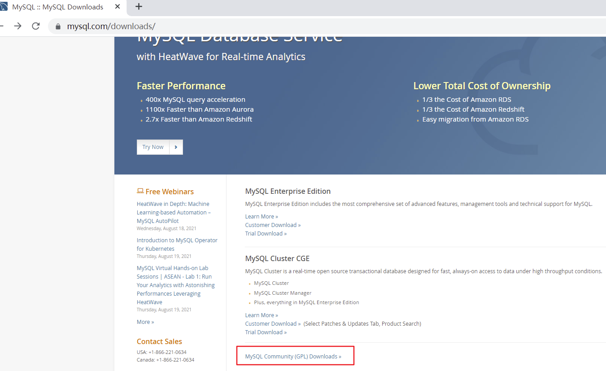

## **3. 点击 MySQL Community Server**

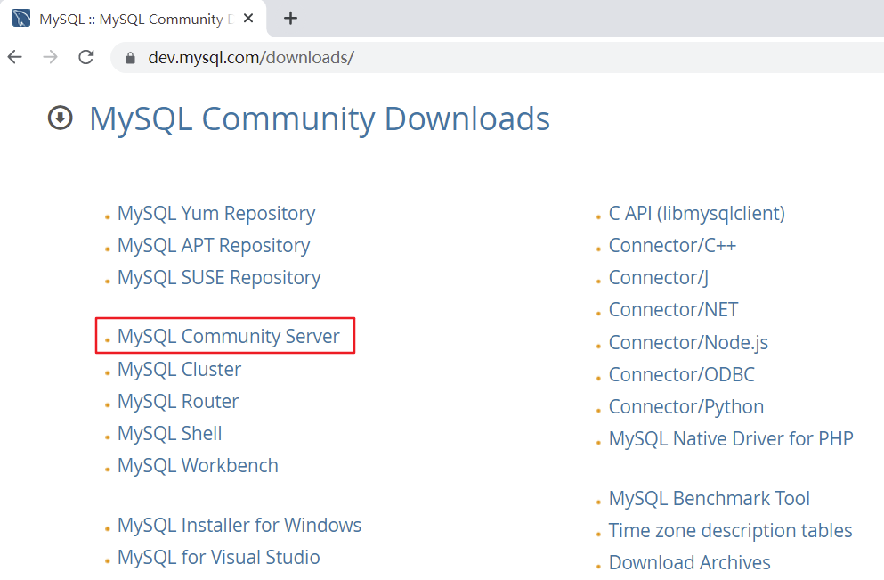

## **4. 在General Availability(GA) Releases中选择适合的版本**

Windows 平台下提供两种安装文件：MySQL 二进制分发版（.msi安装文件）和免安装版（.zip压缩文件）。一般来讲，应当使用二进制分发版，因为该版本提供了图形化的安装向导过程，比其他的分发版使用起来要简单，不再需要其他工具启动就可以运行 MySQL。

> ✏️ **这里在Windows 系统下推荐下载`MSI安装程序`；点击`Go to Download Page`进行下载即可**
> - 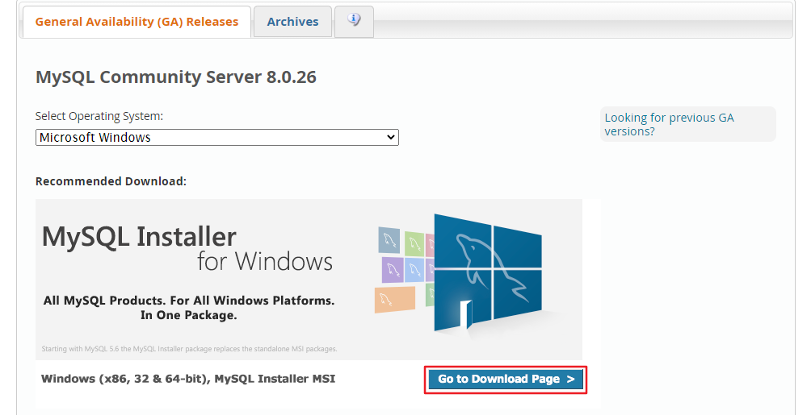
> - 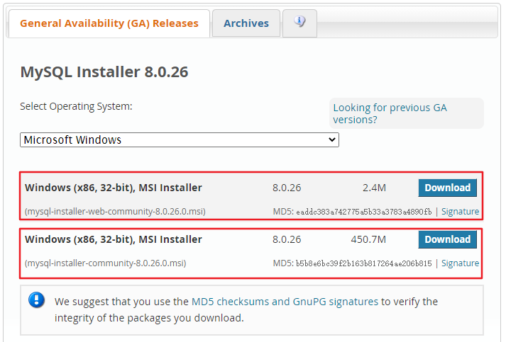

> ✏️ **Windows下的 `MySQL8.0` 安装有两种安装程序**
> - `mysql-installer-web-community-8.0.26.0.msi` 下载程序大小：2.4M；安装时需要联网安装组件。
> - `mysql-installer-community-8.0.26.0.msi` 下载程序大小：450.7M；安装时离线安装即可。**推荐。**

> ✏️**如果安装MySQL5.7版本的话，选择`Archives`，接着选择 `MySQL5.7` 的相应版本即可。这里下载最近期的 `MySQL5.7.34` 版本。**
> - 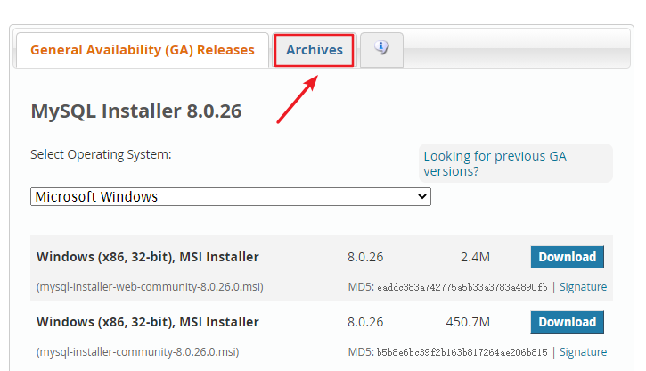
> - 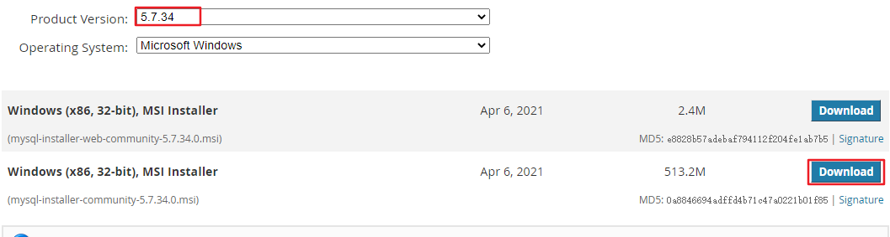

---

## 2.3 MySQL8.0 版本的安装

MySQL 下载完成后，找到下载文件，双击进行安装，具体操作步骤如下。

步骤1：双击下载的 `mysql-installer-community-8.0.26.0.msi` 文件，打开安装向导。

步骤2：打开「Choosing a Setup Type（选择安装类型）」窗口，在其中列出了 5 种安装类型，分别是 Developer Default（默认安装类型）、Server only（仅作为服务器）、Client only（仅作为客户端）、Full（完全安装）、Custom（自定义安装）。这里选择「Custom（自定义安装）」类型按钮，单击「Next(下一步)」按钮。

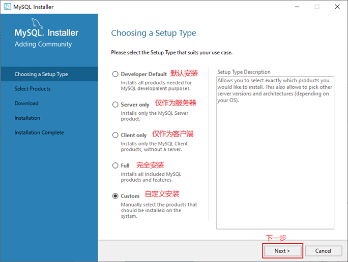

步骤3：打开「Select Products（选择产品）」窗口，可以定制需要安装的产品清单。例如，选择「MySQL Server 8.0.26-X64」后，单击「→」添加按钮，即可选择安装 MySQL 服务器，如图所示。采用通用的方法，可以添加其他你需要安装的产品。

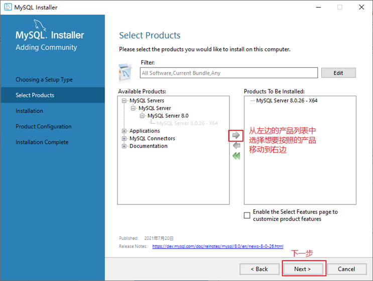

此时如果直接「Next（下一步）」，则产品的安装路径是默认的。如果想要自定义安装目录，则可以选中对应的产品，然后在下面会出现「Advanced Options（高级选项）」的超链接。

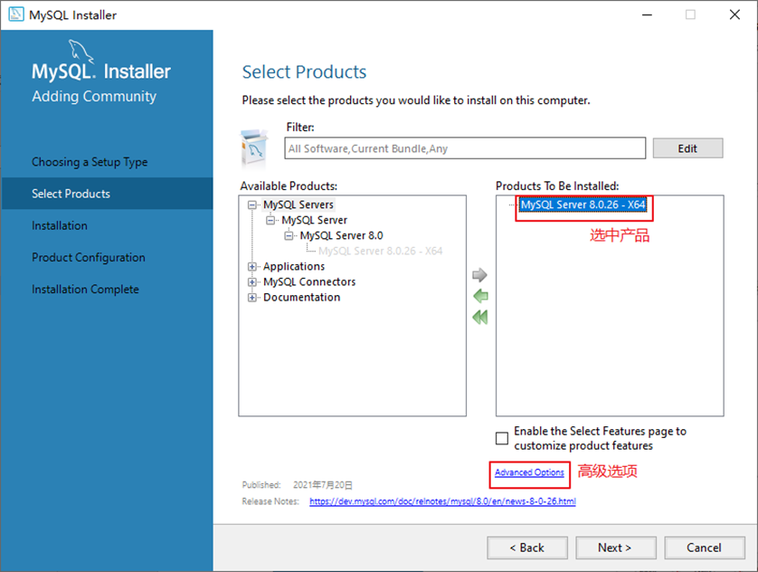

单击「Advanced Options（高级选项）」则会弹出安装目录的选择窗口，如图所示，此时你可以分别设置 MySQL 的服务程序安装目录和数据存储目录。如果不设置，默认分别在 C 盘的 Program Files 目录和 ProgramData 目录（这是一个隐藏目录）。如果自定义安装目录，请避免 **中文** 目录。另外，建议服务目录和数据目录分开存放。

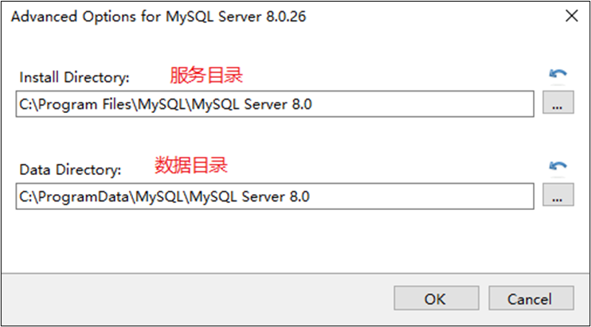

步骤4：在上一步选择好要安装的产品之后，单击「Next（下一步）」进入确认窗口，如图所示。单击「Execute（执行）」按钮开始安装。

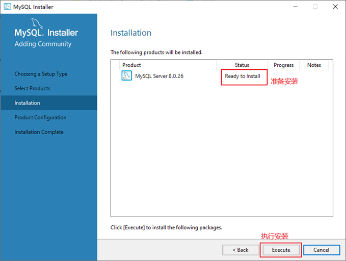

步骤5：安装完成后在「Status（状态）」列表下将显示「Complete（安装完成）」，如图所示。

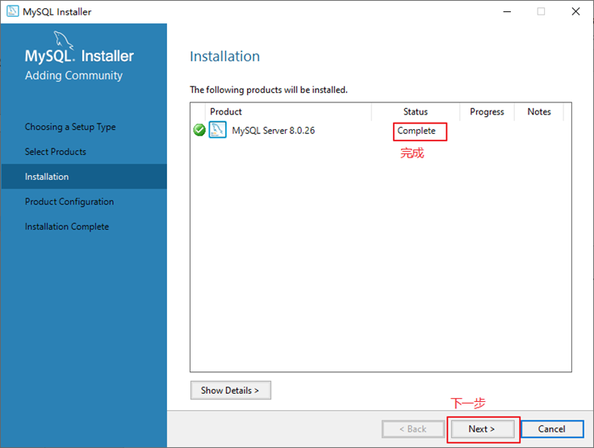

---

## 2.4 配置 MySQL8.0

MySQL 安装之后，需要对服务器进行配置。具体的配置步骤如下。

步骤1：在上一个小节的最后一步，单击「Next（下一步）」按钮，就可以进入产品配置窗口。

步骤2：单击「Next（下一步）」按钮，进入 MySQL 服务器类型配置窗口，如图所示。端口号一般选择默认端口号 3306。

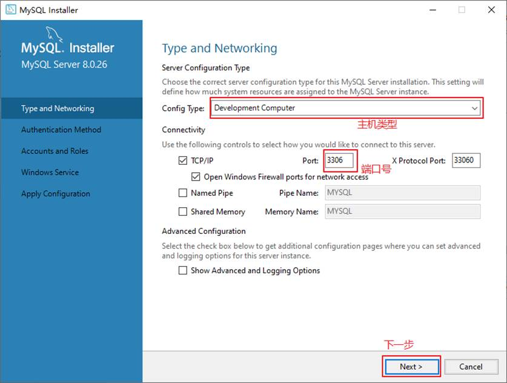

其中，「Config Type」选项用于设置服务器的类型。单击该选项右侧的下三角按钮，即可查看 3 个选项，如图所示。

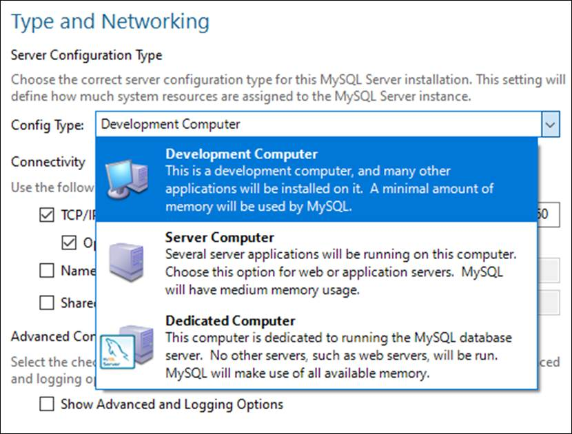

- `Development Machine（开发机器）`：该选项代表典型个人用桌面工作站。此时机器上需要运行多个应用程序，那么 MySQL 服务器将占用最少的系统资源。
- `Server Machine（服务器）`：该选项代表服务器，MySQL 服务器可以同其他服务器应用程序一起运行，例如 Web 服务器等。MySQL 服务器配置成适当比例的系统资源。
- `Dedicated Machine（专用服务器）`：该选项代表只运行 MySQL 服务的服务器。MySQL 服务器配置成使用所有可用系统资源。

步骤3：单击「Next（下一步）」按钮，打开设置授权方式窗口。其中，上面的选项是 `MySQL8.0` 提供的新的授权方式，采用 `SHA256`基础的密码加密方法；下面的选项是传统授权方法（保留 `5.x` 版本兼容性）。

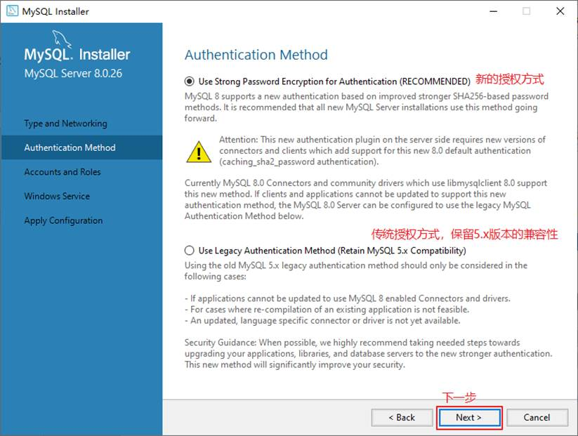

步骤4：单击「Next（下一步）」按钮，打开设置服务器 root 超级管理员的密码窗口，如图所示，需要输入两次同样的登录密码。也可以通过「Add User」添加其他用户，添加其他用户时，需要指定用户名、允许该用户名在哪台/哪些主机上登录，还可以指定用户角色等。此处暂不添加用户，用户管理在 MySQL 高级特性篇中讲解。

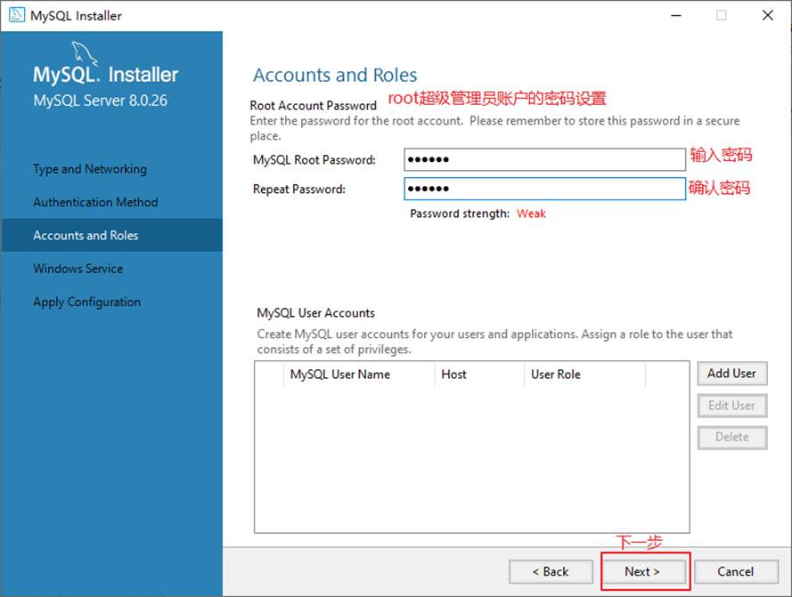

步骤5：单击「Next（下一步）」按钮，打开设置服务器名称窗口，如图所示。该服务名会出现在 Windows 服务列表中，也可以在命令行窗口中使用该服务名进行启动和停止服务。本书将服务名设置为「MySQL80」。如果希望开机自启动服务，也可以勾选「Start the MySQL Server at System Startup」选项（推荐）。

下面是选择以什么方式运行服务？可以选择「Standard System Account (标准系统用户)」或者「Custom User(自定义用户)」中的一个。这里推荐前者。

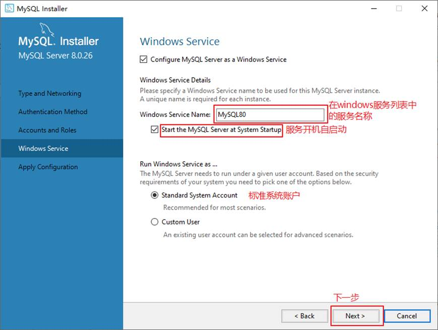

步骤6：单击「Next（下一步）」按钮，打开确认设置服务器窗口，单击「Execute（执行）」按钮。

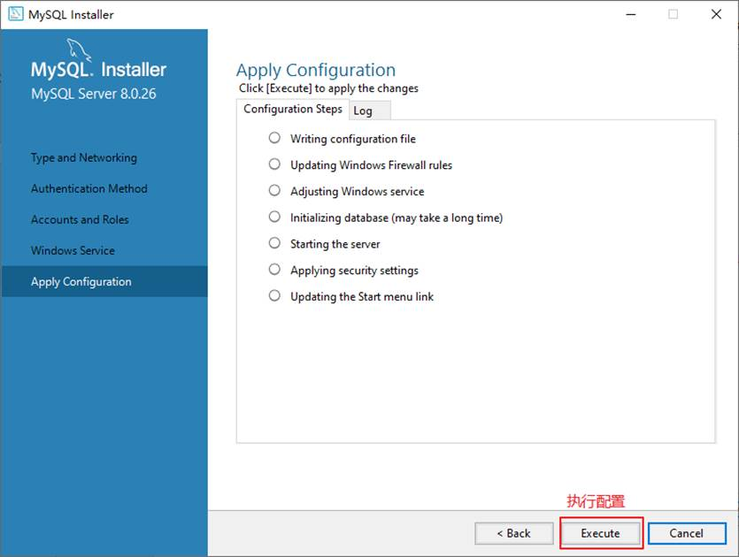

步骤7：完成配置，如图所示。单击「Finish（完成）」按钮，即可完成服务器的配置。

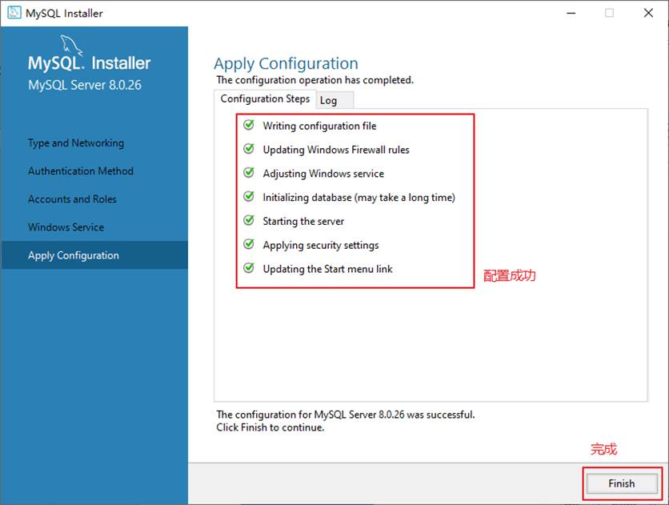

步骤8：如果还有其他产品需要配置，可以选择其他产品，然后继续配置。如果没有，直接选择「Next（下一步）」，直接完成整个安装和配置过程。

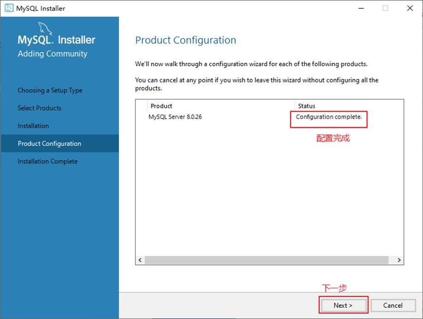

步骤9：结束安装和配置。

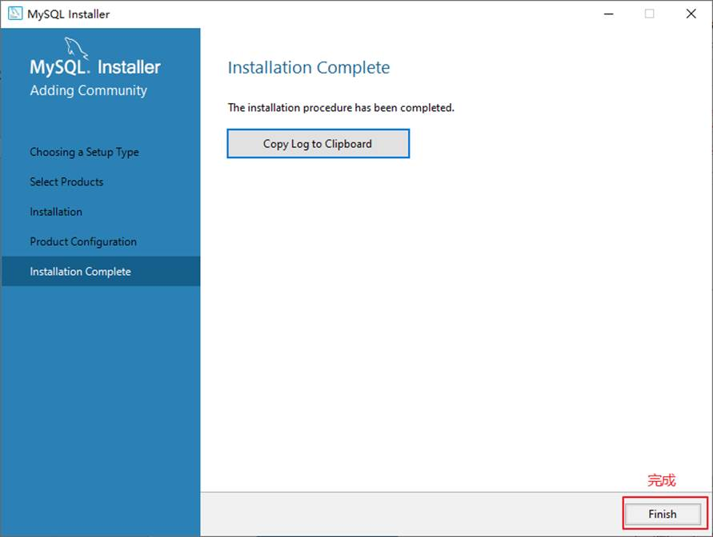

---

## 2.5 配置 MySQL8.0 环境变量

如果不配置 MySQL 环境变量，就不能在命令行直接输入 MySQL 登录命令。下面说如何配置 MySQL 的环境变量：

步骤1：在桌面上右击【此电脑】图标，在弹出的快捷菜单中选择【属性】菜单命令。

步骤2：打开【系统】窗口，单击【高级系统设置】链接。

步骤3：打开【系统属性】对话框，选择【高级】选项卡，然后单击【环境变量】按钮。

步骤4：打开【环境变量】对话框，在系统变量列表中选择 path 变量。

步骤5：单击【编辑】按钮，在【编辑环境变量】对话框中，将 MySQL 应用程序的 bin 目录（`C:\Program Files\MySQL\MySQL Server 8.0\bin`）添
加到变量值中，用分号将其与其他路径分隔开。

步骤6：添加完成之后，单击【确定】按钮，这样就完成了配置 path 变量的操作，然后就可以直接输入 MySQL 命令来登录数据库了。

---

## 2.6 MySQL5.7 版本的安装、配置

- **安装**
    
    此版本的安装过程与上述过程除了版本号不同之外，其它环节都是相同的。所以这里省略了 `MySQL5.7.34` 版本的安装截图。
    
- **配置**
    
    配置环节与 `MySQL8.0` 版本确有细微不同。大部分情况下直接选择「Next」即可，不影响整理使用。
    

> ✏️ **这里配置`MySQL5.7`时，重点强调：与前面安装好的`MySQL8.0`不能使用相同的端口号。**

---

## 2.7 安装失败问题

> 🧠**MySQL 的安装和配置是一件非常简单的事，但是在操作过程中也可能出现问题，特别是初学者。**

## **问题1：无法打开 `MySQL8.0` 软件安装包或者安装过程中失败，如何解决？**

在运行 `MySQL8.0` 软件安装包之前，用户需要确保系统中已经安装了 `.Net Framework` 相关软件，如果缺少此软件，将不能正常地安装`MySQL8.0`软件。

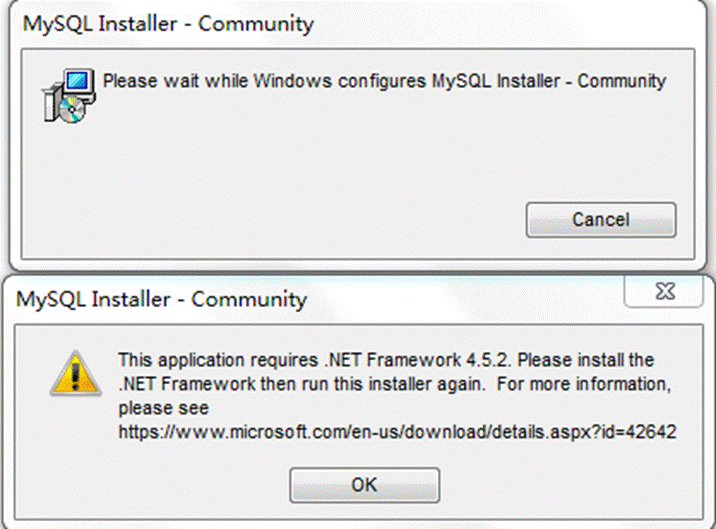

**✏️解决方案：**

到这个地址 [https://www.microsoft.com/en-us/download/details.aspx?id=42642](https://www.microsoft.com/en-us/download/details.aspx?id=42642) 下载 `Microsoft .NET Framework 4.5` 并安装后，再去安装 MySQL。

另外，还要确保 Windows Installer 正常安装。windows 上安装 `mysql8.0` 需要操作系统提前已安装好 Microsoft Visual C++ 2015-2019。

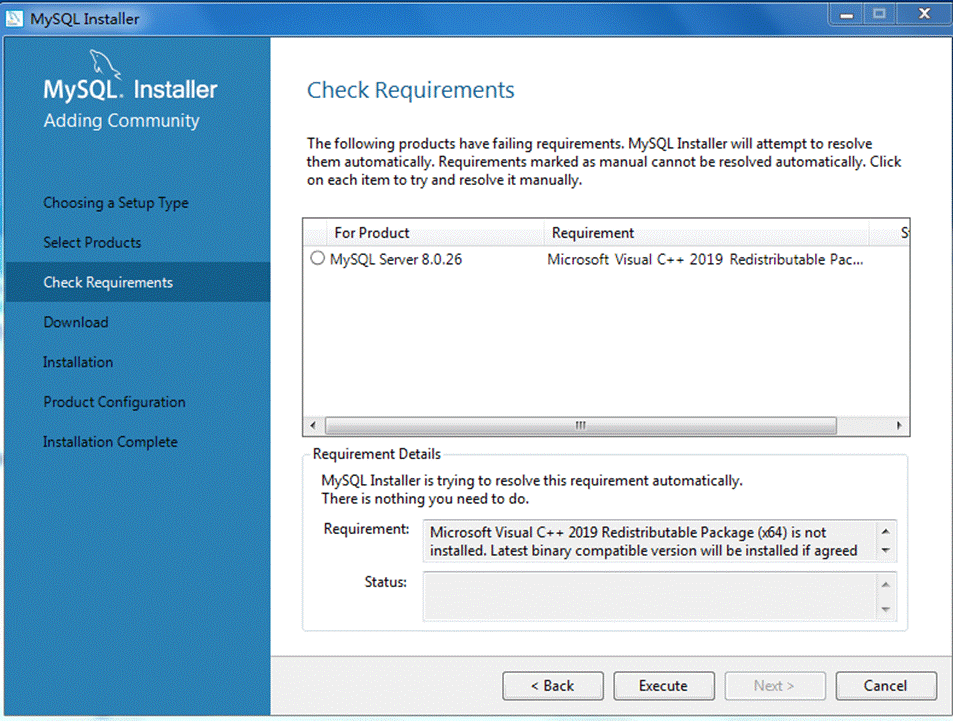

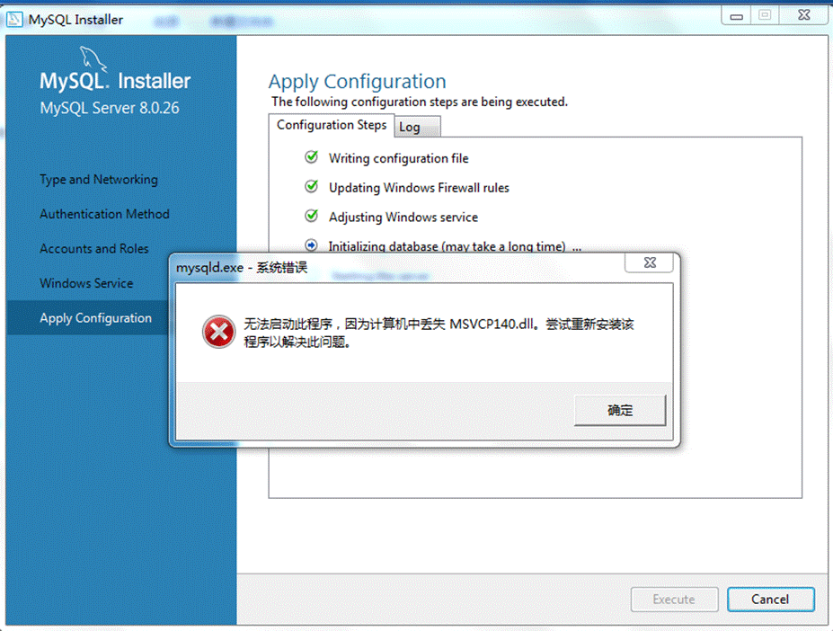

**✏️解决方案：**

同样是，提前到微软官网 [https://support.microsoft.com/en-us/topic/the-latest-supported-visual-c-downloads-2647da03-1eea-4433-9aff-95f26a218cc0](https://support.microsoft.com/en-us/topic/the-latest-supported-visual-c-downloads-2647da03-1eea-4433-9aff-95f26a218cc0) 下载相应的环境。

## **问题2：卸载重装 MySQL 失败？**

该问题通常是因为 MySQL 卸载时，没有完全清除相关信息导致的。

**✏️解决办法：**

把以前的安装目录删除。如果之前安装并未单独指定过服务安装目录，则默认安装目录是 `C:\\Program Files\\MySQL`，彻底删除该目录。同时删除 MySQL 的 Data 目录，如果之前安装并未单独指定过数据目录，则默认安装目录是 `C:\ProgramData\MySQL`，该目录一般为隐藏目录。删除后，重新安装即可。

## **问题3：如何在 Windows 系统删除之前的未卸载干净的 MySQL 服务列表？**

操作方法如下，在系统「搜索框」中输入「cmd」，按「Enter」（回车）键确认，弹出命令提示符界面。然后输入「sc delete MySQL服务名」，按「Enter（回车）键」，就能彻底删除残余的 MySQL 服务了。

---
