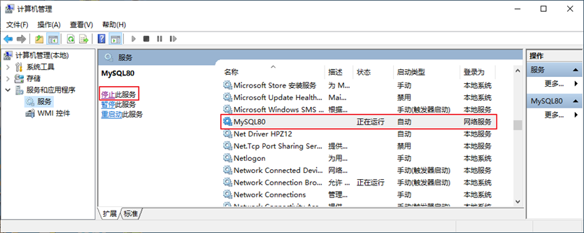
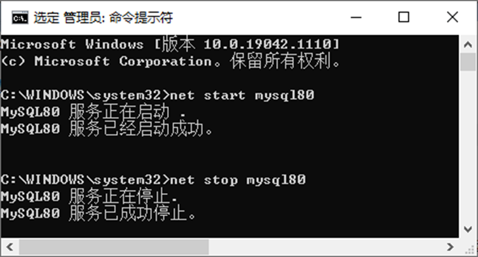
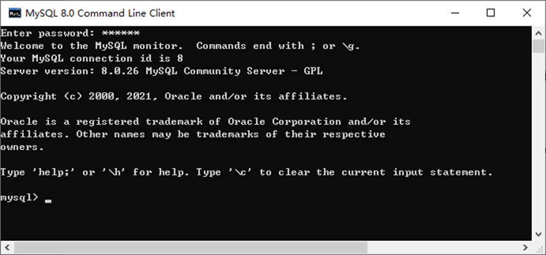
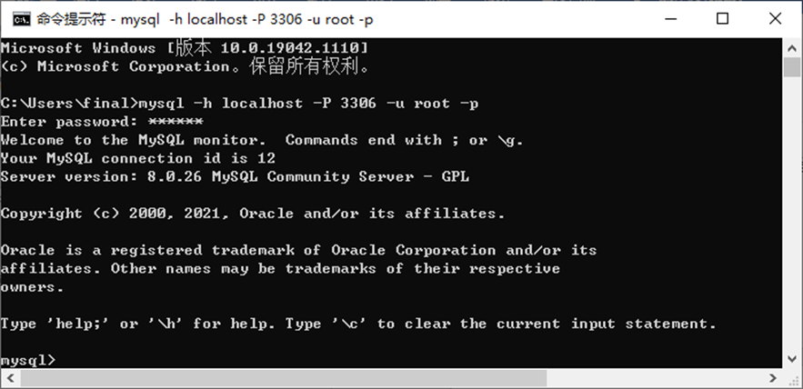

# 3 MySQL 的登录

> - 所属章节：MySQL 基础篇 / 第二章_MySQL环境搭建
> - 建议回查情境：忘记如何启动 MySQL 服务、忘记命令行登录格式、需要确认 `-p` 和密码的写法、想查看 MySQL 版本、退出登录，或排查“命令无法识别”“服务未启动”“密码错误”等问题时
> - 上一节：[2 MySQL 的下载、安装、配置](./2%20MySQL%20的下载、安装、配置.md)
> - 下一节：[4 MySQL 演示使用](./4%20MySQL%20演示使用.md)

## 本节导读

这一节只解决一个核心问题：

**MySQL 安装完成后，怎样确认服务已经正常运行，并用正确的方式登录进去。**

对初学者来说，登录 MySQL 最容易混乱的，不是“不会输入命令”，而是下面这几类问题：

- 其实 MySQL 服务根本还没启动
- `mysql` 命令无法识别，以为是密码错了
- 记不住 `-h`、`-P`、`-u`、`-p` 分别代表什么
- 把 `-p` 和密码的写法写错
- 不知道本机登录时哪些参数可以省略
- 登录成功后，不知道怎么确认版本或退出

所以这篇不会只是把几条命令列出来，而是按更实用的顺序整理成：

**先确认服务状态 → 再选择登录方式 → 再理解命令格式 → 再学会查看版本与退出 → 最后回查常见问题。**

> ✏️ 说明：
>
> 这一节默认你已经完成前一节的安装和环境变量配置。  
> 如果你在命令行中输入 `mysql` 后提示“不是内部或外部命令”，先回看 [2 MySQL 的下载、安装、配置](./2%20MySQL%20的下载、安装、配置.md) 中的环境变量设置部分。

## 你会在这篇学到什么

- 登录 MySQL 前，为什么要先确认服务已经启动。
- 如何通过 Windows 图形界面或命令行启动、停止 MySQL 服务。
- 如何通过 MySQL 自带客户端登录。
- 如何通过 Windows 命令行登录 MySQL。
- 命令行登录时 `-h`、`-P`、`-u`、`-p` 分别表示什么。
- 本机登录时，哪些参数通常可以省略。
- 如何在登录前和登录后查看 MySQL 版本。
- 如何安全地输入密码，以及如何退出登录。

## 一句话先抓核心

**登录 MySQL 的正确顺序是：先确认 MySQL 服务已启动，再执行登录命令；如果是本机默认端口登录，通常直接用 `mysql -u root -p` 就够了。**

## 快速定位

- `先做判断`：我现在卡在哪一种情况？
- `3.1`：先确认 MySQL 服务有没有启动
- `3.2`：选择登录方式
- `3.3`：理解命令行登录格式
- `3.4`：查看 MySQL 版本
- `3.5`：退出登录
- `常见风险点`：登录时最容易写错或误判的地方
- `常见回查问题`：适合临时忘记时快速定位

## 关键字

- `MySQL 服务`：登录前必须确认是否已启动
- `services.msc`：Windows 服务管理入口
- `MySQL80`：Windows 下常见的 MySQL 服务名
- `net start`：启动 MySQL 服务
- `net stop`：停止 MySQL 服务
- `mysql -h -P -u -p`：命令行登录 MySQL 的基本格式
- `localhost` `127.0.0.1`：本机常用连接地址
- `3306`：MySQL 默认端口
- `root`：常见管理员账户
- `mysql -V` `mysql --version`：查看客户端版本
- `select version()`：查看服务端版本
- `exit` `quit`：退出 MySQL 登录

## 建议阅读顺序

- 第一次练习时：看 `先做判断` → `3.1` → `3.2` → `3.3` → `3.4` → `3.5`
- 如果你只是忘记命令格式：直接看 `3.3`
- 如果你已经输入了命令但连不上：先回到 `3.1` 检查服务状态
- 如果你遇到“命令无法识别”“密码问题”或“没有选择数据库”：看完本篇后继续回查 [7 常见问题的解决（课外内容）](./7%20常见问题的解决(课外内容).md)

---

## 先做判断：我现在到底卡在哪一种情况？

在登录 MySQL 之前，先判断你属于下面哪一种情况：

### 情况 1：我还没确认 MySQL 服务有没有启动

先看 `3.1`。  
因为只要服务没启动，后面登录命令写得再正确，也连接不上。

### 情况 2：我知道服务已经启动，但忘记怎么登录

直接看 `3.2` 和 `3.3`。

### 情况 3：我输入 `mysql` 后，系统说不是内部或外部命令

这通常不是登录命令本身的问题，而是环境变量 `Path` 没有配置好。  
先回看前一节的环境变量部分。

### 情况 4：我可以登录，但不确定自己连到哪个版本

直接看 `3.4`。

### 情况 5：我已经登录成功，但不知道怎么退出

直接看 `3.5`。

---

## 3.1 先确认 MySQL 服务有没有启动

MySQL 登录之前，必须先有一个前提：

**MySQL 服务已经启动。**

如果服务没启动，客户端就找不到可连接的数据库服务进程。

### 方式 1：通过图形界面查看服务状态

Windows 下常见有几个入口：

1. 在“计算机”上右键，进入【管理】→【服务和应用程序】→【服务】
2. 打开【控制面板】→【系统和安全】→【管理工具】→【服务】
3. 在开始菜单搜索框输入：

```text
services.msc
```

打开服务列表后，找到你安装时配置的 MySQL 服务名。课程中常见的服务名是：



```text
MySQL80
```

如果看到它当前是“正在运行”，说明服务已经启动；如果没有启动，就先手动启动。

### 方式 2：通过命令行启动或停止服务

如果你更习惯用命令行，也可以直接执行：

```bash
# 启动 MySQL 服务
net start MySQL服务名

# 停止 MySQL 服务
net stop MySQL服务名
```

例如课程中的常见服务名是：



```bash
net start MySQL80
net stop MySQL80
```

### 这里最容易忽略的两个点

1. `MySQL80` 只是常见示例，不一定每台机器都完全一样
2. 如果执行后提示“拒绝访问”或“拒绝服务”，通常要用**管理员身份**重新打开命令提示符再执行

> ⚠️ 注意：
>
> 登录失败时，不要一上来就怀疑密码。
> 先确认服务有没有启动，这是最高频也最容易忽略的前置条件。

---

## 3.2 选择登录方式

当 MySQL 服务已经启动后，就可以开始登录。

对初学者来说，常用登录方式有两种：

### 方式 1：使用 MySQL 自带客户端

可以通过开始菜单进入：

```text
开始菜单 → 所有程序 → MySQL → MySQL 8.0 Command Line Client
```



这种方式的特点是：

* 进入快
* 更适合初学阶段快速验证是否能登录
* 通常直接以 `root` 用户登录

如果你现在的目标只是先确认“我能不能正常进入 MySQL”，这种方式最直接。

### 方式 2：使用 Windows 命令行

你也可以直接在命令提示符中执行登录命令。



这种方式的优点是：

* 更通用
* 更接近后续开发中常用的操作方式
* 方便你明确理解每个参数的意义

如果你以后要经常手动连接数据库，建议重点掌握这种方式。

---

## 3.3 理解命令行登录格式

### 基本格式

MySQL 命令行登录的基本格式如下：

```bash
mysql -h 主机名 -P 端口号 -u 用户名 -p密码
```

示例：

```bash
mysql -h localhost -P 3306 -u root -pabc123
```

这条命令表示：

* `-h localhost`：连接本机
* `-P 3306`：连接 MySQL 默认端口
* `-u root`：使用 `root` 用户登录
* `-pabc123`：密码是 `abc123`

### 每个参数到底是什么意思？

#### `-h`

表示主机名，也就是你要连接哪一台机器。

常见写法：

* `localhost`
* `127.0.0.1`

如果 MySQL 就装在你自己的电脑上，这两个都很常见。

#### `-P`

表示端口号。
MySQL 常见默认端口是：

```text
3306
```

如果你安装时没有改过端口，通常就是这个值。

#### `-u`

表示用户名。
初学阶段最常用的是：

```text
root
```

#### `-p`

表示密码。
这是最容易写错的部分。

### `-p` 的两种常见写法

#### 写法 1：直接把密码接在 `-p` 后面

```bash
mysql -h localhost -P 3306 -u root -pabc123
```

这种写法可以执行，但不够安全，因为密码会直接出现在命令里。

#### 写法 2：只写 `-p`，下一行再输入密码

```bash
mysql -h localhost -P 3306 -u root -p
Enter password: ****
```

这才是更推荐的写法，因为密码不会直接暴露在命令行参数中。

### `-p` 后面到底能不能加空格？

这里要记住一个高频规则：

* `-p` 和密码**直接连写**时，中间**不能有空格**
* 如果你想把密码分开输入，那就只写 `-p`，然后按回车再输入密码

也就是说，下面这样是错误重点之一：

```bash
mysql -h localhost -P 3306 -u root -p abc123
```

因为这会把 `abc123` 当成别的参数处理，而不是密码。

### 本机登录时，哪些参数可以省略？

如果你连接的是本机，而且：

* 服务就在当前电脑
* 端口没有改过
* 你用的是常见账户

那么下面两个参数通常都可以省略：

* `-h localhost`
* `-P 3306`

这时最常见的简写就是：

```bash
mysql -u root -p
Enter password: ****
```

这也是初学阶段最值得记住的一条登录命令。

### 连接成功后会看到什么？

如果登录成功，命令行通常会显示：

* MySQL Server 的版本信息
* 当前连接的会话 `id`
* 命令提示符变成 MySQL 交互环境

这表示你已经成功进入 MySQL。

---

## 3.4 查看 MySQL 版本

登录 MySQL 时，很多人会混淆一件事：

**客户端版本** 和 **服务端版本** 不一定要用同一种方式查看。

### 方式 1：还没登录前，查看客户端版本

在命令行直接执行：

```bash
mysql -V
mysql --version
```

这适合你在进入 MySQL 之前，先确认系统是否已经能识别 `mysql` 命令。

### 方式 2：登录后，查看服务端版本

如果你已经进入 MySQL，可以执行：

```sql
select version();
```

这更适合确认你当前连接到的 MySQL Server 版本。

> ✏️ 记忆方式：
>
> * `mysql --version`：更像“命令行程序本身的版本确认”
> * `select version();`：更像“当前连到的数据库服务版本确认”

---

## 3.5 退出登录

退出 MySQL 登录很简单，下面任一命令都可以：

```bash
exit
# 或
quit
```

只要退出成功，就会回到系统命令行环境。

---

## 常见风险点

### 风险 1：服务没启动，就直接开始输登录命令

这是最常见的误判。
只要服务没启动，后面所有登录命令都会失败。

### 风险 2：把“命令无法识别”误认为是密码错了

如果系统连 `mysql` 这个命令都不认识，那通常是 `Path` 没配置好，不是密码问题。

### 风险 3：把 `-p` 和密码写错

最典型的错误就是在 `-p` 和密码之间乱加空格。

### 风险 4：本机登录时把命令写得过长，却不知道哪些其实能省略

对本机默认配置来说，通常记住：

```bash
mysql -u root -p
```

就够了。

### 风险 5：把客户端版本和服务端版本混为一谈

`mysql --version` 和 `select version();` 都能看版本，但它们所在的场景不同。

---

## 常见回查问题

### 1. MySQL 安装好了，为什么还是连不上？

先检查这三件事：

1. MySQL 服务有没有启动
2. `mysql` 命令能不能被系统识别
3. 用户名、密码、端口是不是写对了

### 2. Windows 服务里应该找哪个服务名？

课程中的常见名称是：

```text
MySQL80
```

但你最终应以自己安装时设置的服务名为准。

### 3. `net start` 和 `net stop` 分别做什么？

* `net start MySQL服务名`：启动服务
* `net stop MySQL服务名`：停止服务

### 4. `mysql -h localhost -P 3306 -u root -p` 中每个参数是什么意思？

* `-h`：主机名
* `-P`：端口号
* `-u`：用户名
* `-p`：密码

### 5. `-p` 后面能不能加空格？

如果密码直接写在命令后面，不能加空格。
更推荐只写 `-p`，然后下一行再输入密码。

### 6. 本机登录时哪些参数可以省略？

通常 `-h localhost` 和 `-P 3306` 可以省略，所以最常见简写是：

```bash
mysql -u root -p
```

### 7. 登录前和登录后分别怎么查看版本？

* 登录前：`mysql -V` 或 `mysql --version`
* 登录后：`select version();`

---

## 小结

这一节最重要的，不是死记命令，而是记住这条主线：

1. 先确认 MySQL 服务已经启动
2. 再决定用自带客户端还是命令行登录
3. 记住 `mysql -h -P -u -p` 的含义
4. 本机默认登录优先记住 `mysql -u root -p`
5. 登录前后分别会用不同方式确认版本
6. 用 `exit` 或 `quit` 退出

只要这条顺序不乱，MySQL 的登录通常不会有太大问题。

## 延伸阅读

* [2 MySQL 的下载、安装、配置](./2%20MySQL%20的下载、安装、配置.md)
* [4 MySQL 演示使用](./4%20MySQL%20演示使用.md)
* [7 常见问题的解决（课外内容）](./7%20常见问题的解决%28课外内容%29.md)

---