# 5 MySQL 图形化管理工具

> 所属章节：MySQL 基礎篇 / 第二章_MySQL環境搭建
> 建议回查情境：想选择 MySQL 图形化管理工具、忘记 Workbench 的入口和界面分区、旧版工具连接 MySQL 8 出现认证插件报错时
> 上一节：[4 MySQL 演示使用](./4%20MySQL%20演示使用.md)
> 下一节：[6 MySQL 目录结构与源码](./6%20MySQL%20目录结构与源码.md)

## 本节导读

这一节主要介绍几种常见的 MySQL 图形化管理工具，以及它们在连接数据库、浏览对象、执行 SQL 和可视化管理上的使用方式。

如果你已经能用命令行完成基础 SQL 操作，这篇可以帮助你建立“图形化工具到底替你省了哪些步骤”的直观认识；如果你只是想快速找到某个工具的入口，也可以直接按工具名称跳读。

如果你还不熟悉命令行里的基础操作，可以先回看 [4 MySQL 演示使用](./4%20MySQL%20演示使用.md)；如果图形化工具连接 `MySQL 8` 失败，可以直接跳到 `常见连接问题`。

## 你会在这篇学到什么

- MySQL Workbench、Navicat、SQLyog、DBeaver 分别是什么类型的工具。
- 如何打开并使用 MySQL Workbench 连接本地 MySQL。
- Workbench 界面中导航栏、工作区、输出区分别承担什么作用。
- DBeaver 为什么可能需要 Java / JDK 环境。
- 旧版图形化工具连接 `MySQL 8` 时，为什么可能出现 `caching_sha2_password` 相关报错。
- 如何通过升级工具或修改用户认证插件处理连接问题。

## 快速定位

- `工具概览`：先认识这一节会出现哪些图形化工具
- `工具1：MySQL Workbench`：了解官方工具的定位、入口与界面
- `工具2：Navicat`：了解常见商业化数据库管理工具
- `工具3：SQLyog`：了解轻量型 MySQL 管理工具
- `工具4：DBeaver`：了解多数据库通用工具与 Java 环境要求
- `常见连接问题`：处理 `caching_sha2_password` 认证插件报错

## 关键字

- `MySQL Workbench`：MySQL 官方图形化管理工具
- `Navicat`：常见的 MySQL 图形化管理与开发工具
- `SQLyog`：轻量且常见的 MySQL 图形化管理工具
- `DBeaver`：支持多种数据库的通用管理工具
- `GUI`：图形用户界面，适合可视化管理数据库
- `ER 模型`：Workbench 支持的数据建模功能
- `正向工程` `逆向工程`：数据库设计与还原常见操作
- `caching_sha2_password`：MySQL 8 常见认证插件
- `mysql_native_password`：旧版本常见认证方式
- `ALTER USER`：修改用户认证方式与密码
- `FLUSH PRIVILEGES`：刷新权限使修改生效

## 建议阅读顺序

- 如果你是第一次接触图形化工具，先看 `工具1：MySQL Workbench`，因为它是官方工具，也最容易和前面课程内容接上。
- 如果你只是想比较不同工具的定位，重点看 `工具概览` 和四个工具小节的第一段说明即可。
- 如果你的重点是“为什么图形化工具连不上 MySQL 8”，可以直接跳到 `常见连接问题`。

## 工具概览

MySQL 图形化管理工具能把数据库连接、对象浏览、SQL 执行和部分管理操作做成可视化界面，降低刚入门时的操作门槛。

常见的图形化管理工具包括：

- `MySQL Workbench`
- `phpMyAdmin`
- `Navicat Premium`
- `MySQLDumper`
- `SQLyog`
- `DBeaver`
- `MySQL ODBC Connector`

这一节重点介绍课程里最常见的 4 个桌面工具：`MySQL Workbench`、`Navicat`、`SQLyog`、`DBeaver`。

## 工具1：MySQL Workbench

`MySQL Workbench` 是 MySQL 官方提供的图形化管理工具，支持 `MySQL 5.0` 以上版本。

它分为：

- `社区版`：免费
- `商业版`：按年收费

`MySQL Workbench` 适合数据库管理员、开发者和系统设计人员使用，主要能力包括：

- 可视化数据库设计
- 建立和维护 `ER` 模型
- 正向工程与逆向工程
- 浏览数据库对象
- 执行 SQL
- 协助完成一部分文档化与管理工作

下载地址：[http://dev.mysql.com/downloads/workbench/](http://dev.mysql.com/downloads/workbench/)

### 如何打开 Workbench

在 Windows 中，可以按下面路径找到：

```text
开始菜单 -> MySQL -> MySQL Workbench 8.0 CE
```

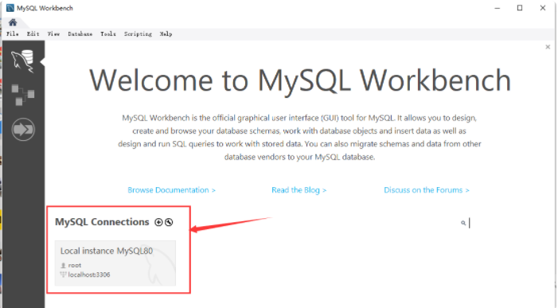

打开后，左下角通常会看到本地连接入口。点击后输入 `root` 密码，就可以连接本地 MySQL 服务器。

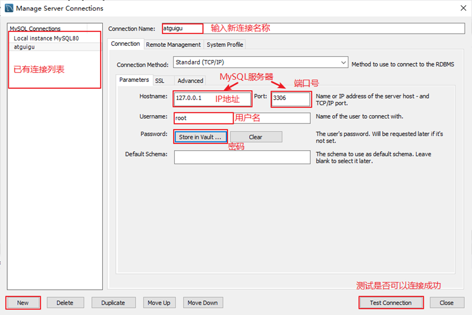
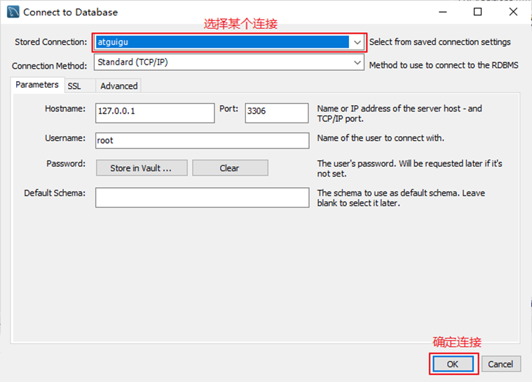

### Workbench 界面介绍

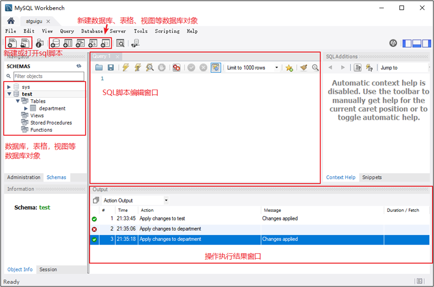

Workbench 的界面可以大致分成 3 个区域：

- `导航区`
  - 位于左侧
  - 用来浏览数据库、数据表、视图、存储过程、函数等对象
- `工作区`
  - 位于中间上方
  - 用来编写和执行 SQL
- `输出区`
  - 位于中间下方
  - 用来显示 SQL 的执行结果、执行时间和输出信息

如果你前面已经练习过 [4 MySQL 演示使用](./4%20MySQL%20演示使用.md) 里的 SQL，这里就可以直接在工作区继续执行同样的命令。

### Workbench 能做什么

除了执行 SQL 之外，Workbench 也常用来：

- 浏览现有数据库对象
- 创建数据库与表
- 查看对象结构
- 导入或导出数据
- 配合建模功能处理数据库设计

原教材接着提到，可以继续用 Workbench 创建数据库，并导入 Excel 数据文件来生成数据表。你可以把它理解成：Workbench 是把前面命令行做过的很多步骤，改成用图形界面辅助完成。

## 工具2：Navicat

`Navicat for MySQL` 是常见的数据库管理与开发工具，可以与 `MySQL 3.21` 及以上版本配合使用。

它支持的内容包括：

- 触发器
- 存储过程
- 函数
- 事件
- 视图
- 用户管理

对初学者来说，Navicat 的优势通常在于界面成熟、上手快、中文支持较完整。

下载地址：[http://www.navicat.com/](http://www.navicat.com/)

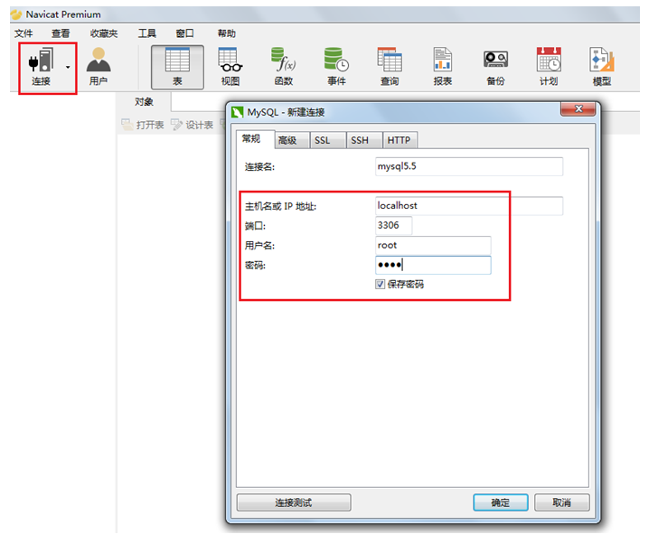
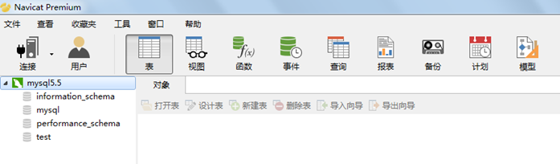

## 工具3：SQLyog

`SQLyog` 是 Webyog 公司推出的一款 MySQL 图形化管理工具，特点是轻量、直接、偏向高频数据库管理操作。

它适合处理的工作包括：

- 创建数据库、表、视图、索引
- 插入、更新、删除数据
- 数据库与数据表备份、还原
- 通过 SQL 文件导入导出
- 导入导出 `XML`、`HTML`、`CSV` 等格式数据

下载地址：[http://www.webyog.com/](http://www.webyog.com/)

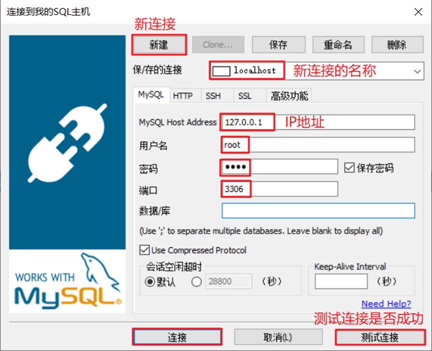
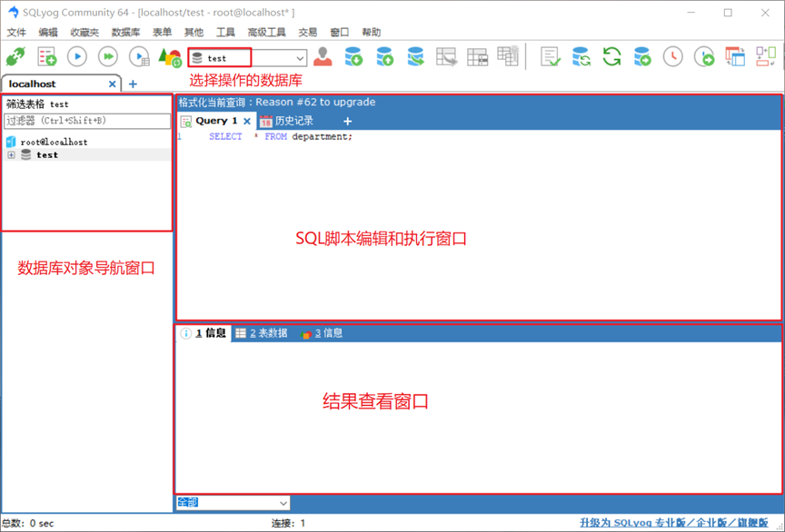

## 工具4：DBeaver

`DBeaver` 是一个通用数据库管理工具和 SQL 客户端，不只支持 MySQL，也支持很多其他数据库，例如：

- `PostgreSQL`
- `SQLite`
- `Oracle`
- `DB2`
- `SQL Server`
- `Sybase`
- `MS Access`
- `Teradata`
- `Firebird`
- `Apache Hive`
- `Phoenix`
- `Presto`

它的特点是：

- 支持多种数据库
- 相对轻量
- 支持中文界面
- 社区版免费开源

唯一需要特别注意的是：`DBeaver` 基于 Java 开发，因此通常需要 `JDK` 或可运行的 Java 环境。如果电脑上没有 Java，安装时可以勾选 `Include Java`。

下载地址：[https://dbeaver.io/download/](https://dbeaver.io/download/)

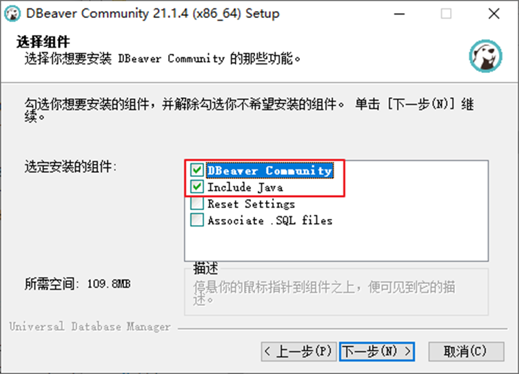
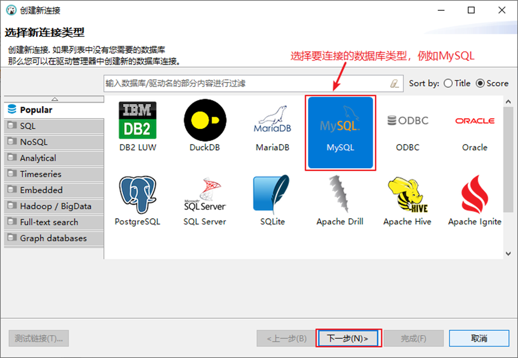
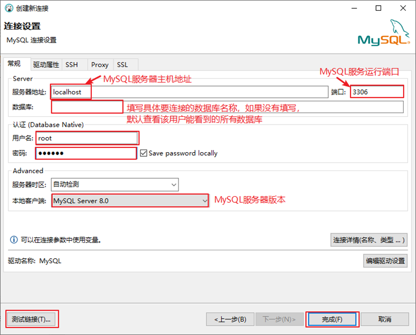
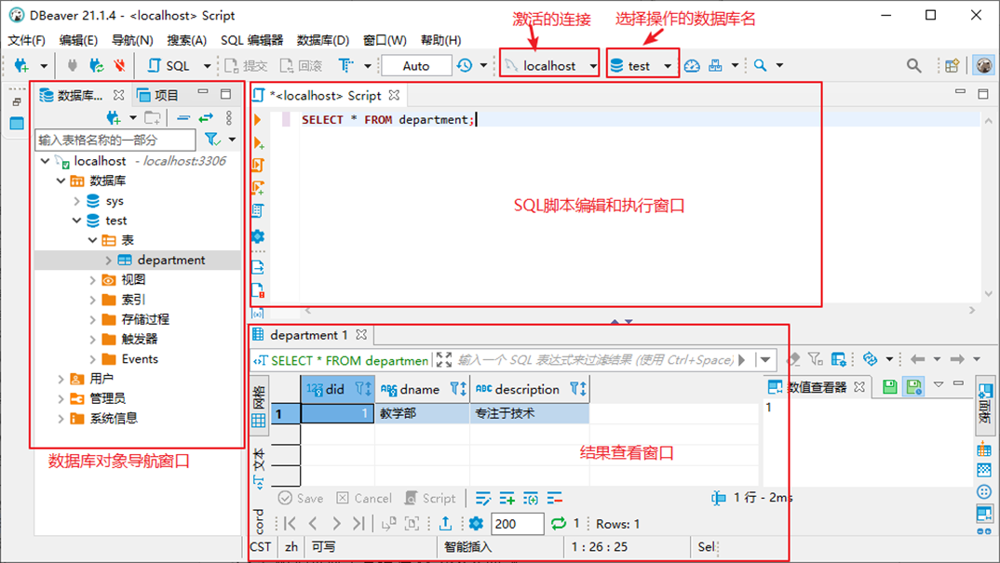

## 常见连接问题

有些旧版图形化工具在连接 `MySQL 8` 时，可能会出现下面这类错误：

```text
Authentication plugin 'caching_sha2_password' cannot be loaded
```

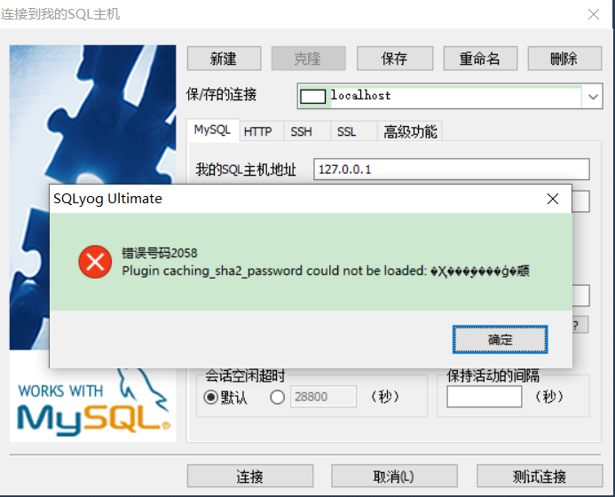

### 为什么会出现这个问题

这是因为在 `MySQL 8` 之前，常见的密码认证方式是 `mysql_native_password`；而从 `MySQL 8` 开始，默认认证插件变成了 `caching_sha2_password`。

如果图形化工具版本较旧，就可能不支持新的认证方式，从而导致连接失败。

### 处理思路

通常有两种解决方向：

1. 升级图形化工具版本
2. 把指定 MySQL 用户的认证方式改回 `mysql_native_password`

一般来说，优先升级工具会更稳妥；只有在课程环境、旧工具限制或兼容性需求明确时，才考虑改用户认证方式。

### 修改用户认证方式的示例

如果你已经确认需要改回旧认证方式，可以先用命令行登录 MySQL，再执行下面的 SQL：

```sql
USE mysql;

ALTER USER 'root'@'localhost'
IDENTIFIED WITH mysql_native_password BY 'abc123';

FLUSH PRIVILEGES;
```

上面这组 SQL 的作用是：

- 进入 `mysql` 系统库
- 把 `'root'@'localhost'` 的认证插件改成 `mysql_native_password`
- 同时把密码更新为 `abc123`
- 刷新权限，让修改立即生效

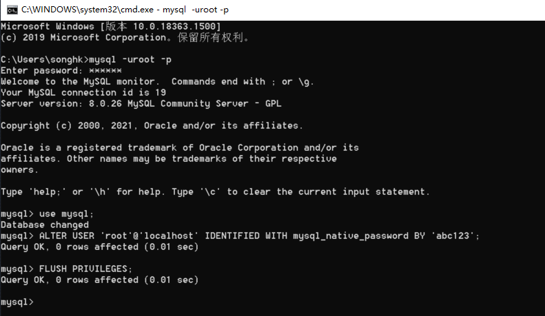

## 常见回查问题

- MySQL 官方的图形化管理工具是哪一个？
- Workbench 的导航栏、工作区、输出区分别有什么作用？
- Navicat、SQLyog、DBeaver 大致适合做什么？
- DBeaver 为什么可能需要 Java / JDK 环境？
- 图形化工具连接 `MySQL 8` 时出现 `caching_sha2_password` 报错是什么原因？
- 处理 `MySQL 8` 认证插件报错时，优先升级工具还是修改用户认证方式？
- 如果要改回 `mysql_native_password`，需要执行哪些 SQL？

## 延伸阅读

- [3 MySQL 的登录](./3%20MySQL%20的登录.md)
- [4 MySQL 演示使用](./4%20MySQL%20演示使用.md)
- [7 常见问题的解决（课外内容）](./7%20常见问题的解决(课外内容).md)
