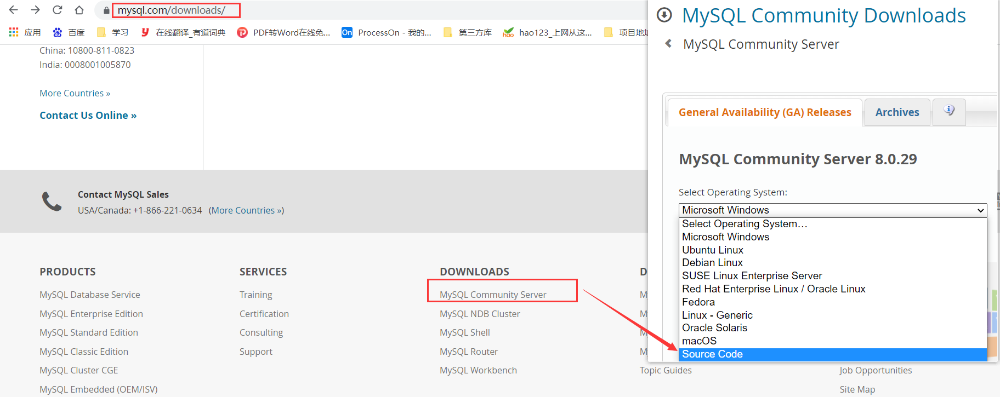
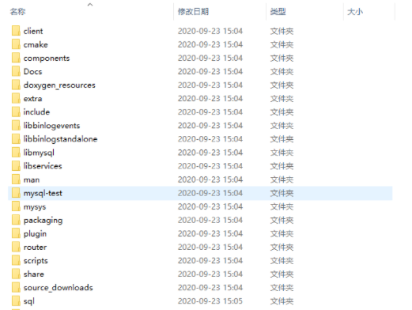
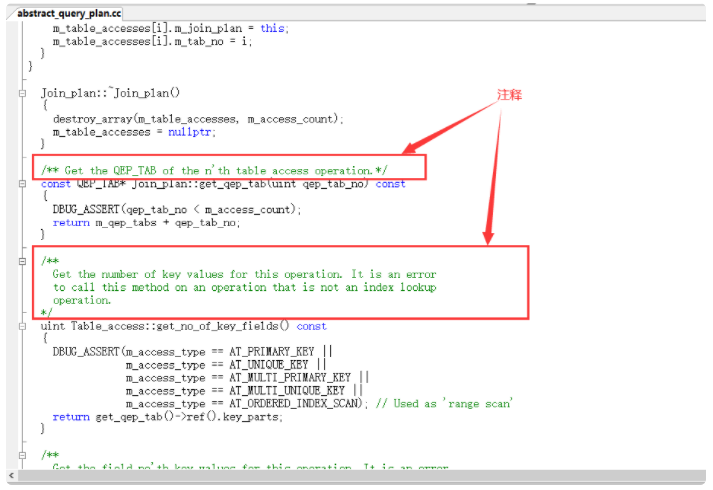

# 6 MySQL 目录结构与源码

> 所属章节：[第二章_MySQL環境搭建](./README.md)

## 本节导读

这一节主要帮助你认识 MySQL 安装目录里常见的文件和文件夹分别是做什么的，并对源码目录建立一个基础印象。

这篇不一定是高频操作内容，但很适合在你想弄清楚 `bin`、`data`、`my.ini` 或源码目录分别承担什么角色时回来看。

## 关键字

- `bin`：MySQL 可执行文件目录
- `mysql.exe`：常用的 MySQL 命令行客户端程序
- `data`：MySQL 数据文件目录
- `my.ini`：MySQL 主要配置文件
- `ProgramData`：Windows 下常见的数据目录位置
- `Source Code`：下载 MySQL 源代码时需要选择的类型
- `C++`：MySQL 主要使用的开发语言
- `sql`：MySQL 核心代码目录
- `libmysql`：客户端程序 API 相关目录
- `mysql-test`：测试工具目录
- `mysys`：操作系统相关函数和辅助函数目录

## 6.1 主要目录结构

| MySQL的目录结构 | 说明 |
| --- | --- |
| bin 目录 | 所有 MySQL 的可执行文件。如：`mysql.exe` |
| MySQLInstanceConfig.exe | 数据库的配置向导，在安装时出现的内容 |
| data目录 | 系统数据库所在的目录 |
| `my.ini` 文件 | MySQL的主要配置文件 |
| `C:\ProgramData\MySQL\MySQL Server 8.0\data\` | 用户创建的数据库所在的目录 |

## 6.2 MySQL 源代码获取

首先，你要进入 MySQL下载界面。 这里你不要选择用默认的「Microsoft Windows」，而是要通过下拉栏，找到「Source Code」，在下面的操作系统版本里面， 选择 Windows（Architecture Independent），然后点击下载。

接下来，把下载下来的压缩文件解压，我们就得到了 MySQL 的源代码。

MySQL 是用 C++ 开发而成的，我简单介绍一下源代码的组成。

`mysql-8.0.22` 目录下的各个子目录，包含了 MySQL 各部分组件的源代码：

- sql 子目录是 MySQL 核心代码；
- libmysql 子目录是客户端程序 API；
- mysql-test 子目录是测试工具；
- mysys 子目录是操作系统相关函数和辅助函数；

源代码可以用记事本打开查看，如果你有 C++ 的开发环境，也可以在开发环境中打开查看。

如上图所示，源代码并不神秘，就是普通的 C++ 代码，跟你熟悉的一样，而且有很多注释，可以帮助你理解。阅读源代码就像在跟 MySQL 的开发人员对话一样，十分有趣。
