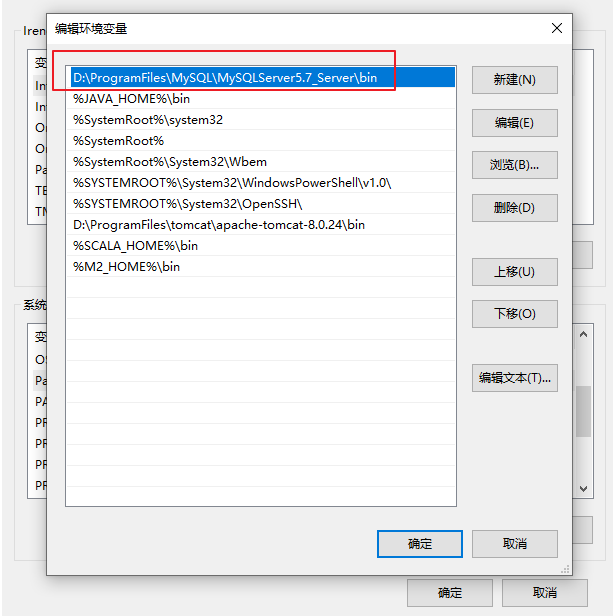
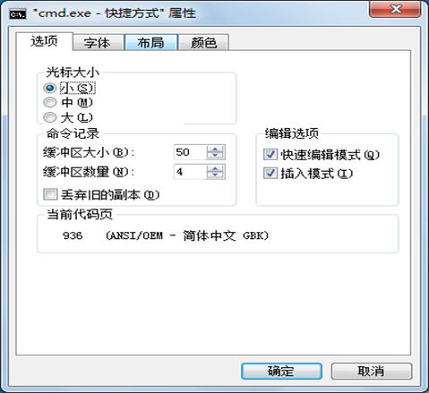
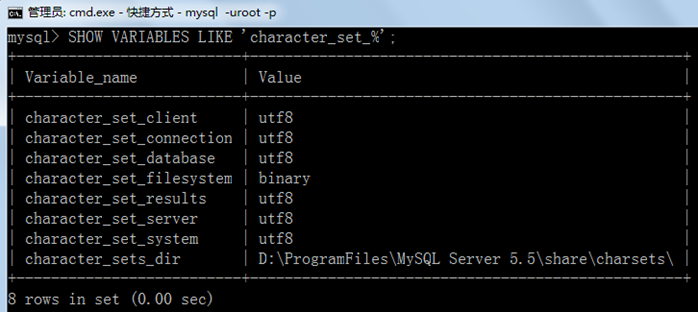
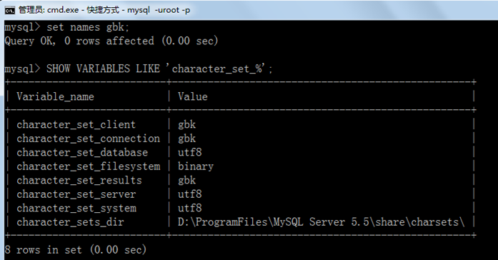

# 7 常见问题的解决（课外内容）

## 关键字

- `root密码重置`：忘记 `root` 密码时的处理思路
- `mysqld`：MySQL 服务进程，可用特殊参数启动
- `--skip-grant-tables`：跳过权限表校验，常用于紧急重置密码
- `PATH`：`mysql` 命令无法识别时需检查环境变量
- `ERROR 1046 (3D000)`：没有选择数据库
- `USE 数据库名`：切换当前默认数据库
- `character_set_%`：查看当前字符集相关配置
- `SET NAMES GBK`：设置当前连接的客户端字符集
- `my.ini`：MySQL 配置文件，可修改默认字符编码
- `latin1` `utf8`：数据库、表、字段常见字符编码
- `ALTER DATABASE`：修改数据库字符编码
- `ALTER TABLE`：修改表或字段字符编码

## 问题1：root 用户密码忘记，重置的操作

1. 通过任务管理器或者服务管理，关掉 mysqld(服务进程)
2. 通过命令行 + 特殊参数开启 mysqld
    
    ```bash
    shell mysqld --defaults-file="D:\\ProgramFiles\\mysql\\MySQLServer5.7Data\\my.ini" --skip-grant-tables
    ```
    
3. 此时，mysqld 服务进程已经打开。并且不需要权限检查
4. `mysql -uroot` 无密码登陆服务器。另启动一个客户端进行
5. 修改权限表
    
    ```sql
    use mysql;
    update user set authentication_string=password('新密码') where user='root' and Host='localhost';
    flush privileges;
    ```
    
6. 通过任务管理器，关掉 mysqld 服务进程。
7. 再次通过服务管理，打开 mysql 服务。
8. 即可用修改后的新密码登陆。

## 问题2：mysql命令报「不是内部或外部命令」

如果输入 mysql 命令报 「不是内部或外部命令」，把 mysql 安装目录的 bin 目录配置到环境变量 path 中。如下：



## 问题3：错误ERROR ：没有选择数据库就操作表格和数据

`ERROR 1046 (3D000): No database selected`

解决方案一：就是使用「USE 数据库名;」语句，这样接下来的语句就默认针对这个数据库进行操作

解决方案二：就是所有的表对象前面都加上「数据库.」

## 问题4：命令行客户端的字符集问题

```bash
mysql> INSERT INTO t_stu VALUES(1,'张三','男');
ERROR 1366 (HY000): Incorrect string value: '\\xD5\\xC5\\xC8\\xFD' for column 'sname' at row 1
```

原因：服务器端认为你的客户端的字符集是 `utf-8`，而实际上你的客户端的字符集是 `GBK`。



查看所有字符集：**SHOW VARIABLES LIKE 'character_set_%';**



解决方案，设置当前连接的客户端字符集 **“SET NAMES GBK;”**



## 问题5：修改数据库和表的字符编码

### 修改编码：

(1)先停止服务  ⇒  (2) 修改 `my.ini` 文件  ⇒  (3) 重新启动服务

### 说明：

如果是在修改 `my.ini` 之前建的库和表，那么库和表的编码还是原来的 `Latin1`，要么删了重建，要么使用 alter 语句修改编码。

```sql
mysql> create database 0728db charset Latin1;
Query OK, 1 row affected (0.00 sec)
```

```sql
mysql> use 0728db;
Database changed
```

```sql
mysql> create table student (id int , name varchar(20)) charset Latin1;
Query OK, 0 rows affected (0.02 sec)

mysql> show create table student\G
*************************** 1. row ***************************
       Table: student
Create Table: CREATE TABLE `student` (
  `id` int(11) NOT NULL,
  `name` varchar(20) DEFAULT NULL,
  PRIMARY KEY (`id`)
) ENGINE=InnoDB DEFAULT CHARSET=latin1
1 row in set (0.00 sec)
```

```sql
mysql> alter table student charset utf8; #修改表字符编码为UTF8
Query OK, 0 rows affected (0.01 sec)
Records: 0  Duplicates: 0  Warnings: 0

mysql> show create table student\G
*************************** 1. row ***************************
       Table: student
Create Table: CREATE TABLE `student` (
  `id` int(11) NOT NULL,
  `name` varchar(20) CHARACTER SET latin1 DEFAULT NULL,  #字段仍然是latin1编码
  PRIMARY KEY (`id`)
) ENGINE=InnoDB DEFAULT CHARSET=utf8
1 row in set (0.00 sec)

mysql> alter table student modify name varchar(20) charset utf8; #修改字段字符编码为UTF8
Query OK, 0 rows affected (0.05 sec)
Records: 0  Duplicates: 0  Warnings: 0

mysql> show create table student\G
*************************** 1. row ***************************
       Table: student
Create Table: CREATE TABLE `student` (
  `id` int(11) NOT NULL,
  `name` varchar(20) DEFAULT NULL,
  PRIMARY KEY (`id`)
) ENGINE=InnoDB DEFAULT CHARSET=utf8
1 row in set (0.00 sec)
```

```sql
mysql> show create database 0728db;;
+--------+-----------------------------------------------------------------+
|Database| Create Database                                                 |
+------+-------------------------------------------------------------------+
|0728db| CREATE DATABASE `0728db` /*!40100 DEFAULT CHARACTER SET latin1 */ |
+------+-------------------------------------------------------------------+
1 row in set (0.00 sec)

mysql> alter database 0728db charset utf8; #修改数据库的字符编码为utf8
Query OK, 1 row affected (0.00 sec)

mysql> show create database 0728db;
+--------+-----------------------------------------------------------------+
|Database| Create Database                                                 |
+--------+-----------------------------------------------------------------+
| 0728db | CREATE DATABASE `0728db` /*!40100 DEFAULT CHARACTER SET utf8 */ |
+--------+-----------------------------------------------------------------+
1 row in set (0.00 sec)
```
