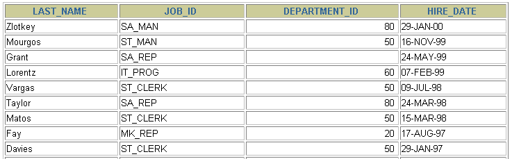
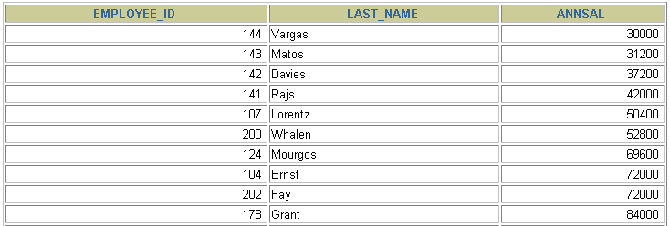
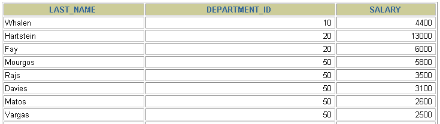

# 1 排序数据

> 所属章节：[第五章_排序与分页](./README.md)
> 建议回查情境：忘记排序子句写在哪里、升序和降序怎么写、能否按别名排序，或需要按多个字段排序时
## 本节导读

这一节主要说明如何使用 `ORDER BY` 子句对查询结果排序。排序不会改变表中数据的存储顺序，它只影响本次查询结果的显示顺序。

第一次阅读时，建议先理解 `ORDER BY` 的基本规则，再依次看单列排序、别名排序、字段位置排序的风险和多列排序。复习时可以重点回查 `ASC`、`DESC`、`ORDER BY` 的位置，以及多列排序时字段的先后关系。

## 你会在这篇学到什么

- 为什么查询结果需要显式指定排序规则。
- `ORDER BY` 子句的基本写法与位置。
- 如何按单个字段进行升序或降序排序。
- 如何使用查询结果中的列别名排序。
- 如何用查询列的位置排序，以及为什么不建议依赖这种写法。
- 如何按多个字段组合排序。

## 快速定位

- `1.1 排序规则`：看为什么不能依赖默认顺序，以及 `ORDER BY` 的基本位置。
- `1.2 单列排序`：看按单个字段升序或降序排序的写法。
- `1.3 使用列别名排序`：看如何按计算字段或派生列排序。
- `1.4 使用查询列的位置排序（不推荐）`：看 `ORDER BY 3` 是什么意思，以及为什么维护风险高。
- `1.5 多列排序`：看多个字段从左到右逐级排序的规则。
- `常见混淆点`：看 `ASC`、`DESC`、列别名排序和字段位置排序的易错点。

## 建议阅读顺序

- 第一次学习时，建议按 `1.1 -> 1.2 -> 1.3 -> 1.4 -> 1.5` 的顺序阅读，先掌握排序语法骨架，再看别名排序、位置排序和多列排序。
- 如果你只是忘了 `ORDER BY` 应该写在哪，直接看 `1.1 排序规则`。
- 如果你要处理年薪、折扣后金额这类计算字段排序，优先看 `1.3 使用列别名排序`。
- 如果你看到 `ORDER BY 3` 这类写法不确定含义，直接看 `1.4 使用查询列的位置排序（不推荐）`。
- 如果你主要在排相同部门内的工资高低，优先看 `1.5 多列排序`。

## 关键字

- `ORDER BY`：用于指定查询结果排序规则的子句。
- `ASC`：升序排序，也是默认排序方向。
- `DESC`：降序排序。
- `AS`：定义列别名时常用的关键字。
- `单列排序`：按一个字段决定结果顺序。
- `多列排序`：按多个字段从左到右逐级决定顺序。
- `别名排序`：按 `SELECT` 中定义的列别名排序。
- `字段位置排序`：按查询结果中的列位置编号排序，例如 `ORDER BY 3`。

## 快速回查表

| 场景 | 写法 | 说明 |
| --- | --- | --- |
| 默认升序排序 | `ORDER BY hire_date` | 不写方向时，默认按升序排序 |
| 明确升序排序 | `ORDER BY hire_date ASC` | `ASC` 表示升序 |
| 降序排序 | `ORDER BY hire_date DESC` | `DESC` 表示降序 |
| 按别名排序 | `ORDER BY annsal` | `annsal` 是 `SELECT` 中定义的列别名 |
| 按查询列位置排序（不推荐） | `ORDER BY 3 DESC` | `3` 表示 `SELECT` 列表中的第三列；字段顺序变动时容易出错 |
| 多列排序 | `ORDER BY department_id, salary DESC` | 先按部门排序；部门相同时，再按工资降序排序 |

## 1.1 排序规则

如果没有使用排序操作，查询返回的数据可能看起来像是按添加数据的顺序显示，但不应该依赖这种默认顺序。只要业务上关心结果顺序，就应该显式使用 `ORDER BY`。

使用 `ORDER BY` 子句排序时，需要注意：

- `ASC`（ascend）：升序，也是默认排序方向。
- `DESC`（descend）：降序。
- `ORDER BY` 通常写在查询语句靠后的位置；如果同时使用分页子句，`ORDER BY` 应写在 `LIMIT` 之前。
- `ORDER BY` 可以按一个字段排序，也可以按多个字段排序。

### 回查提示

如果业务上在意“最新、最早、最高、最低、按编号顺序”，就不要依赖数据库默认返回顺序，直接写 `ORDER BY`。

## 1.2 单列排序

下面的例子查询员工的姓名、职位、部门和入职日期，并按 `hire_date` 升序排序。


```sql
SELECT   last_name, job_id, department_id, hire_date
FROM     employees
ORDER BY hire_date;
```

如果没有显式写排序方向，`ORDER BY hire_date` 等价于 `ORDER BY hire_date ASC`。




下面的例子改为按入职日期降序排序，也就是较晚入职的记录排在前面。

```sql
SELECT   last_name, job_id, department_id, hire_date
FROM     employees
ORDER BY hire_date DESC;
```

### 回查提示

如果你只需要一个明确顺序，先从单列排序开始，不要一上来就写多列。

## 1.3 使用列别名排序

`ORDER BY` 可以使用 `SELECT` 列表中定义的列别名。下面的例子把 `salary * 12` 命名为 `annsal`，再按 `annsal` 排序。




```sql
SELECT employee_id, last_name, salary * 12 AS annsal
FROM   employees
ORDER BY annsal;
```

如果需要按年薪由高到低排序，可以继续在别名后指定排序方向：

```sql
SELECT employee_id, last_name, salary * 12 AS annsal
FROM   employees
ORDER BY annsal DESC;
```

这种写法适合用于排序派生字段，例如年薪、折扣后金额、计算后的统计值等。它能避免在 `ORDER BY` 中重复写同一段表达式。

例如下面这种写法，也能表达同样的排序意图：

```sql
SELECT employee_id, last_name, salary * 12 AS annsal
FROM   employees
ORDER BY salary * 12 DESC;
```

但当表达式变长时，`ORDER BY` 中重复写整段计算逻辑会让 SQL 更难读，也更不利于维护。只要排序对象是计算字段或较长表达式，通常更适合先定义别名，再按别名排序。

不同数据库对别名可用位置的支持可能不同；本节以 MySQL 中 `ORDER BY` 支持使用 `SELECT` 列别名的写法为准。

### 回查提示

排序计算字段时，优先给它一个清楚的别名，再按别名排序，通常比重复写表达式更清楚。

## 1.4 使用查询列的位置排序（不推荐）

除了字段名称与列别名，`ORDER BY` 也可以使用查询结果中的列位置编号。例如下面的 `ORDER BY 3 DESC`，表示按 `SELECT` 列表中的第三列，也就是 `annsal`，进行降序排序。

```sql
SELECT employee_id, last_name, salary * 12 AS annsal
FROM   employees
ORDER BY 3 DESC;
```

这种写法虽然简短，但不建议作为常规写法。原因是它依赖 `SELECT` 列表的顺序：一旦前面的字段增删或调整位置，`ORDER BY 3` 指向的字段就可能变化，导致排序结果和原本预期不一致。为了可读性和维护性，实务中优先写字段名或列别名。

### 回查提示

看到 `ORDER BY 3` 这类写法时，先去数它对应的是 `SELECT` 里的第几列，再判断这种写法是否值得保留。

## 1.5 多列排序

当一个排序字段无法完全决定结果顺序时，可以使用多列排序。排序字段的先后顺序很重要：先按第一个字段排序；第一个字段的值相同时，才继续按第二个字段排序。

```sql
SELECT last_name, department_id, salary
FROM   employees
ORDER BY department_id, salary DESC;
```

上面的查询会先按 `department_id` 排序。只有在 `department_id` 相同的记录之间，才会继续按 `salary DESC` 排序。




使用多列排序时需要注意：

- 可以使用不在 `SELECT` 列表中的字段排序。
- 多列排序从左到右依次生效。
- 如果第一列的值已经全部不同，后续排序字段通常就没有机会影响结果顺序。
- 每个排序字段都可以单独指定 `ASC` 或 `DESC`；没有指定时默认使用 `ASC`。

### 回查提示

多列排序的关键不是字段数量，而是优先级顺序。越靠左的字段，越先决定结果顺序。

## 常见混淆点

- 不写 `ORDER BY` 时，不要依赖查询结果的默认显示顺序。
- `ASC` 是升序，`DESC` 是降序；不写排序方向时默认是 `ASC`。
- `ORDER BY` 可以使用 `SELECT` 中定义的列别名。
- `ORDER BY annsal` 是按列别名排序；`ORDER BY 3` 是按查询结果的第三列排序，后者更依赖列顺序，不推荐作为常规写法。
- 多列排序不是同时平均生效，而是按字段顺序逐级排序。
- `DESC employees;` 中的 `DESC` 是 `DESCRIBE` 的缩写；`ORDER BY salary DESC` 中的 `DESC` 才表示降序排序。

## 常见回查问题

- `ORDER BY` 子句应该写在 SQL 的哪个位置？
- `ASC` 和 `DESC` 分别表示什么？
- 不写 `ASC` 或 `DESC` 时默认是什么排序方向？
- 能不能按 `SELECT` 中的列别名排序？
- 能不能按查询结果中的字段位置排序？为什么不推荐？
- 多列排序时，第二个字段什么时候才会生效？

## 一句话抓核心

排序数据的核心是：只要查询结果需要稳定顺序，就用 `ORDER BY` 明确指定排序字段和方向；多列排序时，字段从左到右逐级决定结果顺序。

## 小结

这一节你需要记住：

- 查询结果需要稳定顺序时，应显式使用 `ORDER BY`。
- `ASC` 表示升序，`DESC` 表示降序，默认方向是 `ASC`。
- `ORDER BY` 可以按单列排序，也可以按多列排序。
- `ORDER BY` 可以使用 `SELECT` 中定义的列别名。
- `ORDER BY` 也可以使用查询列的位置编号，但这种写法依赖字段顺序，维护风险较高。
- 多列排序时，只有前一列出现相同值，后一列的排序才会进一步影响结果。

## 延伸阅读

- [第三章_基本的SELECT语句](../第三章_基本的SELECT语句/README.md)
- [第四章_运算符](../第四章_运算符/README.md)
- [第五章导航](./README.md)
