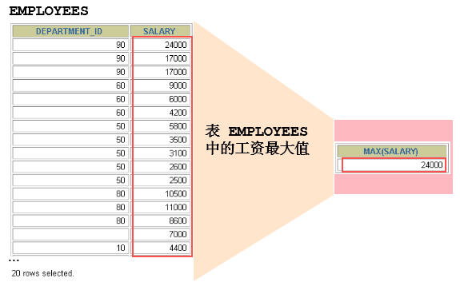

# 1 聚合函数

> 所属章节：MySQL 基础篇 / 第 08 章 聚合函数

## 本节导读

本节介绍 SQL 中最常用的一组聚合函数。聚合函数会对一组数据做汇总计算，输入是一组记录，输出是一个值，常见用途包括求平均值、求和、找最大值、找最小值，以及统计记录数。

建议阅读顺序：

1. 先理解什么是聚合函数，以及它和单行函数的区别。
2. 再分别掌握 `AVG()`、`SUM()`、`MIN()`、`MAX()`、`COUNT()` 的适用场景。
3. 最后重点回查 `COUNT(*)`、`COUNT(1)`、`COUNT(列名)` 的差异。

## 关键字

`聚合函数` `AVG()` `SUM()` `MIN()` `MAX()` `COUNT()` `COUNT(*)` `COUNT(expr)` `COUNT(列名)`

## 建议回查情境

- 想快速确认聚合函数的定义与语法限制时。
- 忘记 `AVG()`、`SUM()` 能用于哪些数据类型时。
- 想确认 `MIN()`、`MAX()` 是否只适用于数值类型时。
- 想复习 `COUNT(*)` 与 `COUNT(列名)` 在 `NULL` 统计上的差别时。

## 内容导航

- [1.1 聚合函数介绍](#11-聚合函数介绍)
- [1.2 AVG 和 SUM 函数](#12-avg-和-sum-函数)
- [1.3 MIN 和 MAX 函数](#13-min-和-max-函数)
- [1.4 COUNT 函数](#14-count-函数)

我们上一章讲到了 SQL 单行函数。实际上，SQL 函数还有一类，叫做聚合函数（也叫聚集函数、分组函数）。它是对一组数据进行汇总的函数，输入的是一组数据的集合，输出的是单个值。

## 1.1 聚合函数介绍

### 什么是聚合函数

聚合函数作用于一组数据，并对这一组数据返回一个值。



### 聚合函数类型

- `AVG()`
- `SUM()`
- `MAX()`
- `MIN()`
- `COUNT()`

### 聚合函数语法


### 使用限制

聚合函数不能嵌套调用，比如不能出现 `AVG(SUM(字段名称))` 这样的写法。

## 1.2 AVG 和 SUM 函数

`AVG()` 和 `SUM()` 可以用于**数值型数据**。

```sql
SELECT AVG(salary), MAX(salary), MIN(salary), SUM(salary)
FROM employees
WHERE job_id LIKE '%REP%';
```


## 1.3 MIN 和 MAX 函数

`MIN()` 和 `MAX()` 可以用于**任意数据类型**。

```sql
SELECT MIN(hire_date), MAX(hire_date)
FROM employees;
```


## 1.4 COUNT 函数

### `COUNT(*)`

`COUNT(*)` 返回表中记录总数，适用于**任意数据类型**。

```sql
SELECT COUNT(*)
FROM employees
WHERE department_id = 50;
```


### `COUNT(expr)`

`COUNT(expr)` 返回 **expr 不为空** 的记录总数。

```sql
SELECT COUNT(commission_pct)
FROM employees
WHERE department_id = 50;
```


### `COUNT(*)`、`COUNT(1)`、`COUNT(列名)` 谁更合适

对于 MyISAM 引擎的表，这几种写法通常没有区别，因为该引擎内部会维护行数计数器。

对于 InnoDB 引擎的表，`COUNT(*)` 和 `COUNT(1)` 都需要实际扫描记录，时间复杂度是 `O(n)`，因为 InnoDB 需要真的去统计一遍。但它们通常仍优于 `COUNT(列名)`。

### 能不能用 `COUNT(列名)` 替代 `COUNT(*)`

不建议用 `COUNT(列名)` 替代 `COUNT(*)`。`COUNT(*)` 是 SQL92 定义的标准统计行数语法，与数据库实现无关，也不受列值是否为 `NULL` 的影响。

需要注意的是：

- `COUNT(*)` 会统计值为 `NULL` 的行。
- `COUNT(列名)` 不会统计该列值为 `NULL` 的行。
