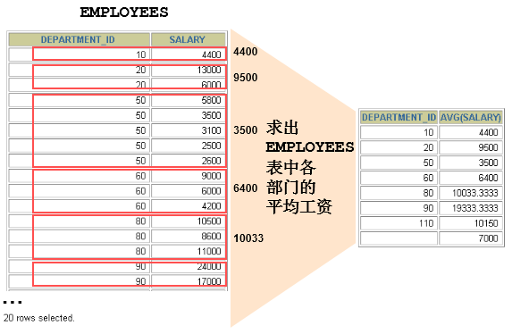
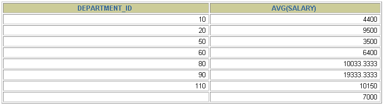
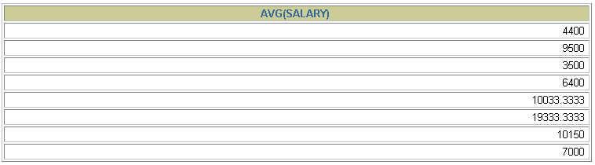
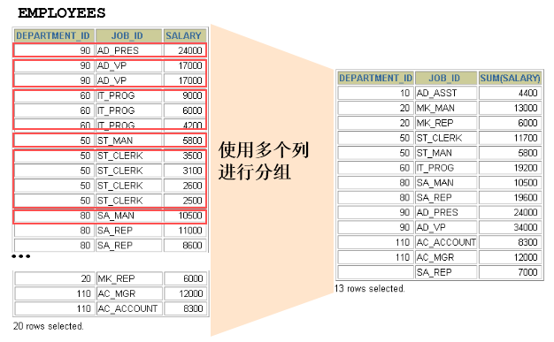

# 2 GROUP BY

> 所属章节：MySQL 基础篇 / 第 08 章 聚合函数

## 本节导读

本节介绍 `GROUP BY` 的基本用途，也就是如何把查询结果按某个字段或多个字段分组，再配合聚合函数对每组数据做统计。这里会依序说明单列分组、多列分组，以及 `WITH ROLLUP` 的用法与限制。

建议阅读顺序：

1. 先掌握 `GROUP BY` 的基本语法与执行位置。
2. 再理解 `SELECT` 列表与分组字段之间的约束关系。
3. 最后复习多列分组与 `WITH ROLLUP` 的应用场景。

## 前置知识

- 建议先读：[1 聚合函数](./1%20聚合函数.md)

## 关键字

`GROUP BY` `分组查询` `多列分组` `WITH ROLLUP` `聚合函数`

## 建议回查情境

- 想确认 `GROUP BY` 该放在 SQL 语句的哪个位置时。
- 忘记 `SELECT` 中哪些字段必须写进 `GROUP BY` 时。
- 想快速比较单列分组与多列分组的差别时。
- 需要回查 `WITH ROLLUP` 的用途与限制时。

## 内容导航

- [2.1 基本使用](#21-基本使用)
- [2.2 使用多个列分组](#22-使用多个列分组)
- [2.3 GROUP BY 中使用 WITH ROLLUP](#23-group-by-中使用-with-rollup)
- [2.4 结论](#24-结论)

## 2.1 基本使用



可以使用 `GROUP BY` 子句将表中的数据划分成若干组。

```sql
SELECT
    column,
    group_function(column)
FROM table
[WHERE condition]
[GROUP BY group_by_expression]
[ORDER BY column];
```

需要明确的是：`WHERE` 一定放在 `FROM` 后面。

> 在 `SELECT` 列表中，所有未包含在组函数中的列都应该包含在 `GROUP BY` 子句中；反过来，`GROUP BY` 中声明的字段可以不出现在 `SELECT` 中。

```sql
SELECT department_id, AVG(salary)
FROM employees
GROUP BY department_id;
```




包含在 `GROUP BY` 子句中的列，不一定要包含在 `SELECT` 列表中。

```sql
SELECT AVG(salary)
FROM employees
GROUP BY department_id;
```



## 2.2 使用多个列分组



如果需要更细粒度地划分数据，可以在 `GROUP BY` 中写多个字段。

```sql
SELECT
    department_id dept_id,
    job_id,
    SUM(salary)
FROM employees
GROUP BY department_id, job_id;
```

上面的写法表示先按 `department_id` 分组，再在每个 `department_id` 分组内部按 `job_id` 继续分组。

## 2.3 GROUP BY 中使用 WITH ROLLUP

使用 `WITH ROLLUP` 关键字之后，会在所有查询出的分组记录之后额外增加一条汇总记录，用于计算所有分组结果的整体汇总值。

```sql
SELECT
    department_id,
    AVG(salary)
FROM employees
WHERE department_id > 80
GROUP BY department_id WITH ROLLUP;
```

> 注意：使用 `ROLLUP` 时，不能同时使用 `ORDER BY` 子句进行结果排序，也就是 `ROLLUP` 和 `ORDER BY` 互相排斥。

## 2.4 结论

- `SELECT` 中出现的非组函数字段必须声明在 `GROUP BY` 中；反过来，`GROUP BY` 中声明的字段可以不出现在 `SELECT` 中。
- `GROUP BY` 声明在 `FROM` 后面、`WHERE` 后面、`ORDER BY` 前面、`LIMIT` 前面。
- MySQL 中可以在 `GROUP BY` 后使用 `WITH ROLLUP`。
