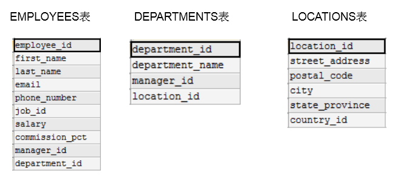
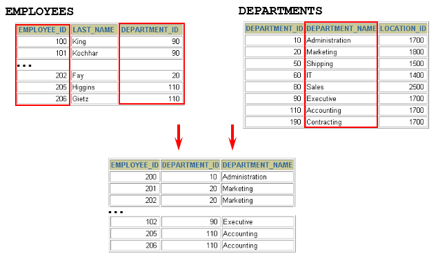
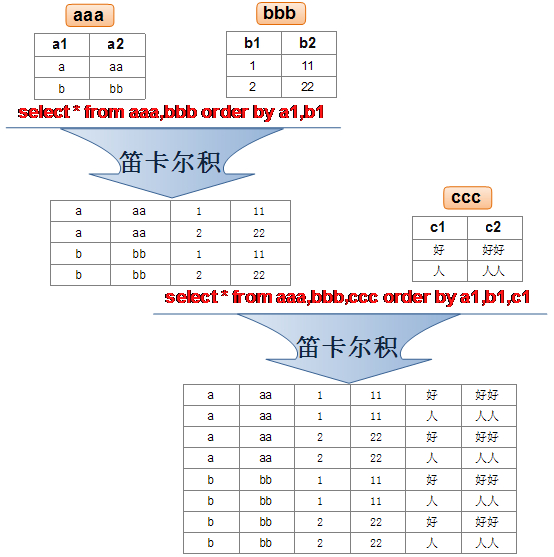

# 1 一个案例引发的多表连接

> 所属章节：第六章_多表查询
> 关键字：多表连接、笛卡尔积、交叉连接、连接条件、WHERE、CROSS JOIN
> 建议回查情境：查询多个表时结果行数异常暴增、不确定笛卡尔积是怎么产生的，或忘记 SQL92 风格多表连接该把连接条件写在哪里时

## 本节导读

这一节用一个最常见的错误案例，说明为什么多表查询不能只把多个表写进 `FROM`，还必须补上有效的连接条件。

第一次阅读时，建议先看错误案例和结果，再看为什么会出现笛卡尔积，最后再看如何通过连接条件修正查询。复习时如果只想快速定位问题，可以直接看 `1.1 案例说明`、`1.2 笛卡尔积的理解` 和 `1.3 正确写法`。

## 你会在这篇学到什么

- 只把两个表写进 `FROM`，但没有写连接条件时，会出现笛卡尔积。
- 笛卡尔积的结果行数，等于两个表行数的乘积。
- 笛卡尔积也可以理解为交叉连接。
- 多表查询要得到正确结果，必须写出有效的连接条件。
- 在 SQL92 风格的写法中，连接条件通常写在 `WHERE` 子句中。

## 快速定位

- `1.1 案例说明`：看错误查询为什么会返回远超预期的结果。
- `1.2 笛卡尔积的理解`：看笛卡尔积的定义、结果规模和典型示例。
- `1.2.2 何时使用笛卡尔积`：看哪些特殊场景下会主动使用这种组合方式。
- `1.3 案例分析与问题解决`：看如何识别问题来源，并改写成正确查询。

## 快速回查表

| 场景 | 写法 | 说明 |
| --- | --- | --- |
| 错误的多表查询 | `FROM employees, departments` | 只有把表放在一起，没有写连接条件，会得到笛卡尔积 |
| 笛卡尔积行数 | `员工表行数 × 部门表行数` | 如果是 `107 × 27`，结果就是 `2889` 行 |
| SQL92 风格补连接条件 | `WHERE e.department_id = d.department_id` | 用关联字段把两张表正确连接起来 |
| 显式交叉连接 | `CROSS JOIN` | 明确表示要做所有可能组合 |
| 修正后的查询 | `FROM employees e, departments d WHERE e.department_id = d.department_id` | 只保留真正匹配的员工与部门 |

## 建议阅读顺序

- 第一次学习时，建议按 `1.1 -> 1.2 -> 1.3` 的顺序阅读，先看到错误现象，再理解原因，最后记住修正方法。
- 如果你现在最困惑的是“为什么结果突然变几千行”，优先看 `1.1 案例说明` 和 `1.2 笛卡尔积的理解`。
- 如果你已经知道是笛卡尔积，只是忘了怎么修正，直接看 `1.3.2 加入连接条件后的查询语法` 和 `1.3.3 正确写法`。

## 1.1 案例说明

下面先看一个典型的多表查询需求。



目标是从多个表中获取数据：



例如，查询员工的姓名及其部门名称：

```sql
# 案例：查询员工的姓名及其部门名称
SELECT last_name, department_name
FROM employees, departments;
```

执行结果如下：


```sql
+-----------+----------------------+
| last_name | department_name      |
+-----------+----------------------+
| King      | Administration       |
| King      | Marketing            |
| King      | Purchasing           |
| King      | Human Resources      |
| King      | Shipping             |
| King      | IT                   |
| King      | Public Relations     |
| King      | Sales                |
| King      | Executive            |
| King      | Finance              |
| King      | Accounting           |
| King      | Treasury             |
...
| Gietz     | IT Support           |
| Gietz     | NOC                  |
| Gietz     | IT Helpdesk          |
| Gietz     | Government Sales     |
| Gietz     | Retail Sales         |
| Gietz     | Recruiting           |
| Gietz     | Payroll              |
+-----------+----------------------+
2889 rows in set (0.01 sec)
```

这个结果显然不对，因为每个员工并不会属于所有部门。这里的问题在于：查询把 `employees` 和 `departments` 两张表放进了 `FROM`，但没有写任何连接条件。

### 用行数验证问题

```sql
SELECT COUNT(employee_id) FROM employees;
# 输出 107 行

SELECT COUNT(department_id) FROM departments;
# 输出 27 行

SELECT 107 * 27 FROM dual;
```

`107 × 27 = 2889`，正好对应错误结果的总行数。也就是说，这个查询把员工表的每一行都和部门表的每一行做了组合。

我们把这种多表查询中出现的问题称为：笛卡尔积。

## 1.2 笛卡尔积（或交叉连接）的理解

笛卡尔积是一个数学概念。假设有两个集合 `X` 和 `Y`，那么 `X` 和 `Y` 的笛卡尔积就是它们所有可能的组合。组合数量等于两个集合元素个数的乘积。

放到 SQL 里理解，就是：当两个表在没有任何连接条件的情况下进行组合时，会得到所有可能的行组合。



在 SQL92 中，这类结果可以由逗号连接但缺少连接条件的写法触发；在 SQL99 中，也可以用 `CROSS JOIN` 明确表示交叉连接。

在 MySQL 中，下面这些写法都会得到笛卡尔积：

```sql
# 查询员工姓名和所在部门名称
SELECT last_name, department_name FROM employees, departments;
SELECT last_name, department_name FROM employees CROSS JOIN departments;
SELECT last_name, department_name FROM employees INNER JOIN departments;
SELECT last_name, department_name FROM employees JOIN departments;
```

### 1.2.1 笛卡尔积的基本概念

当我们对两个表 `A` 和 `B` 进行笛卡尔积运算时，SQL 会将 `A` 表的每一行与 `B` 表的每一行相组合，最终结果集大小为：

`行数 = A 表的行数 × B 表的行数`

示例：假设有两个表。

`employees` 表：

| id | name |
| --- | --- |
| 1 | Alice |
| 2 | Bob |

`departments` 表：

| dept_id | dept_name |
| --- | --- |
| 101 | HR |
| 102 | IT |

如果执行以下 SQL：

```sql
SELECT * FROM employees, departments;
```

那么得到的结果是：

| id | name | dept_id | dept_name |
| --- | --- | --- | --- |
| 1 | Alice | 101 | HR |
| 1 | Alice | 102 | IT |
| 2 | Bob | 101 | HR |
| 2 | Bob | 102 | IT |

可以看到，`employees` 表的每一行都会与 `departments` 表的每一行组合，形成笛卡尔积。

### 1.2.2 何时使用笛卡尔积？

笛卡尔积在大多数业务查询中通常不是我们想要的结果，但在少数场景下它是有意义的。例如：

1. 生成所有可能的组合。
2. 数据分析中补齐完整的组合空间。
3. 测试 SQL 逻辑时，确认组合行为是否符合预期。

例如，你有颜色表 `colors` 和尺寸表 `sizes`，就可以用笛卡尔积生成所有可能的商品规格组合。

## 1.3 案例分析与问题解决

前面的错误案例说明：多表查询本身不是问题，问题在于缺少有效的连接条件。

### 1.3.1 笛卡尔积通常在什么情况下产生

- 省略多个表之间的连接条件或关联条件。
- 写了连接条件，但条件无效或写错。
- 让所有表中的所有行彼此互相连接。

为了避免笛卡尔积，需要在查询中加入有效的连接条件。

### 1.3.2 加入连接条件后的查询语法

```sql
SELECT table1.column, table2.column
FROM   table1, table2
WHERE  table1.column1 = table2.column2;  # 连接条件
```

在 SQL92 风格的多表查询中，连接条件通常写在 `WHERE` 子句里。

### 1.3.3 正确写法

```sql
# 案例：查询员工的姓名及其部门名称
SELECT
    e.last_name,
    d.department_name
FROM
    atguigudb.employees e,
    atguigudb.departments d
WHERE
    e.department_id = d.department_id;
```

这里的 `e.department_id = d.department_id` 就是连接条件。它的作用是只保留真正属于同一部门的员工与部门记录，而不是让两张表做所有可能组合。

## 常见混淆点

- 把多个表同时写进 `FROM`，不等于已经完成了正确的多表连接。
- 多表查询返回很多行，不一定是数据多，也可能是缺少连接条件导致笛卡尔积。
- `CROSS JOIN` 是显式交叉连接；逗号连接缺少连接条件时，也可能得到同样的结果。
- 在 SQL92 风格中，连接条件通常写在 `WHERE` 子句中，而不是直接跟在表名后面。
- 表别名 `e`、`d` 不是必须，但能让 SQL 更短、更清楚。

## 常见回查问题

- 为什么我的多表查询结果比预期多很多？
- 笛卡尔积是怎么产生的？
- 笛卡尔积的结果行数怎么估算？
- SQL92 风格的多表连接，连接条件应该写在哪里？
- 为什么 `e.department_id = d.department_id` 能修正查询结果？

## 一句话抓核心

多表查询的核心不是把多个表放进 `FROM`，而是要用有效的连接条件把真正相关的记录对应起来；否则就会产生笛卡尔积。

## 小结

这一节需要记住：

- 多表查询如果缺少连接条件，会产生笛卡尔积。
- 笛卡尔积的结果行数等于参与组合的各表行数乘积。
- 笛卡尔积在业务查询里通常是错误现象，但在生成所有组合等特殊场景下可以主动使用。
- 避免笛卡尔积的关键，是写出有效的连接条件。
- 在 SQL92 风格中，连接条件通常写在 `WHERE` 子句中。
