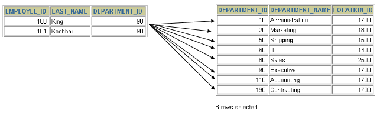

# 1 一个案例引发的多表连接

> - 所属章节：第六章_多表查询  
> 关键字：多表连接、多表查询、笛卡尔积、交叉连接、连接条件、SQL92、WHERE、CROSS JOIN  
> 建议回查情境：查询多个表时结果行数异常暴增、不确定笛卡尔积是怎么产生的、忘记 SQL92 风格的连接条件该写在哪里，或想快速判断一个多表查询是不是少了连接条件时

## 本节导读

这一节用一个最常见、也最容易犯的错误，引出多表查询的核心问题：

> 多表查询不是把多个表写进 `FROM` 就结束了，真正关键的是：必须写出有效的连接条件。

如果只把 `employees` 和 `departments` 两张表放在一起查询，却没有说明员工表和部门表应该如何对应，数据库就会把员工表中的每一行都和部门表中的每一行进行组合，最后得到远超预期的结果。

这种结果就是笛卡尔积，也可以理解为交叉连接。

第一次阅读时，建议按下面顺序理解：

1. 先看错误 SQL 为什么会查出 `2889` 行。
2. 再用 `107 × 27` 验证问题来源。
3. 接着理解什么是笛卡尔积。
4. 最后记住：避免错误笛卡尔积的关键，是写出正确的连接条件。

## 你会在这篇学到什么

- 只把多个表写进 `FROM`，不代表已经完成了正确的多表查询。
- 多表查询如果缺少连接条件，就会产生笛卡尔积。
- 笛卡尔积的结果行数，等于参与查询的各表行数相乘。
- 笛卡尔积本身不是 SQL 错误，但在普通业务查询中通常不是我们想要的结果。
- 在 SQL92 风格中，连接条件通常写在 `WHERE` 子句中。
- 在 MySQL 中，`JOIN` 如果没有写连接条件，也可能得到笛卡尔积；实务上不建议这样写。
- 如果确实想要所有组合，应明确使用 `CROSS JOIN` 表达意图。

## 快速定位

- `1.1 错误案例：只写表名，没有写连接条件`：看错误 SQL 为什么返回远超预期的结果。
- `1.2 用行数验证问题来源`：看为什么 `107 × 27 = 2889` 可以证明产生了笛卡尔积。
- `1.3 什么是笛卡尔积`：看数学概念如何对应到 SQL 查询。
- `1.4 哪些写法会产生笛卡尔积`：看逗号连接、`CROSS JOIN`、无条件 `JOIN` 的差异。
- `1.5 如何修正这个查询`：看 SQL92 风格如何通过 `WHERE` 加入连接条件。
- `1.6 什么时候会主动使用笛卡尔积`：看笛卡尔积不是永远错误。
- `1.7 排查多表查询异常的思路`：看结果行数异常时应该怎么检查。

## 快速回查表

| 场景 | 写法 | 说明 |
| --- | --- | --- |
| 错误多表查询 | `FROM employees, departments` | 只把两个表放在一起，没有说明两表如何对应 |
| 笛卡尔积行数 | `employees 行数 × departments 行数` | 如果是 `107 × 27`，结果就是 `2889` 行 |
| SQL92 风格修正 | `WHERE e.department_id = d.department_id` | 通过关联字段建立员工与部门的对应关系 |
| 显式交叉连接 | `CROSS JOIN` | 明确表示要取得所有可能组合 |
| MySQL 中无条件 JOIN | `JOIN departments` 但没有 `ON` | 可能得到笛卡尔积，实务上不建议省略连接条件 |
| 正确业务查询 | `FROM employees e, departments d WHERE e.department_id = d.department_id` | 只保留真正能匹配上的员工与部门 |

## 建议阅读顺序

- 第一次学习时，建议按 `1.1 -> 1.2 -> 1.3 -> 1.5` 的顺序阅读，先看到错误现象，再理解原因，最后记住修正方法。
- 如果你现在最困惑的是“为什么查询结果突然变成几千行”，优先看 `1.1` 和 `1.2`。
- 如果你已经知道是笛卡尔积，只是忘了怎么修正，直接看 `1.5 如何修正这个查询`。
- 如果你想分清 `CROSS JOIN` 和错误笛卡尔积的差异，重点看 `1.4 哪些写法会产生笛卡尔积`。
- 如果你是为了复习，直接看 `快速回查表`、`常见混淆点` 和 `一句话抓核心` 即可。

## 1.1 错误案例：只写表名，没有写连接条件

先看一个常见需求：

> 查询员工的姓名，以及员工所在部门的名称。

员工姓名来自 `employees` 表，部门名称来自 `departments` 表，所以这个需求需要同时查询两张表。

初学者可能会直接写出下面这条 SQL：

```sql
# 案例：查询员工的姓名及其部门名称
SELECT
    last_name,
    department_name
FROM employees, departments;
````

执行结果如下：



这条 SQL 看起来好像是在查询员工和部门，但它缺少一个关键部分：

> 它没有说明 `employees` 表中的员工，应该和 `departments` 表中的哪个部门对应。

执行结果可能如下：

```sql
+-----------+----------------------+
| last_name | department_name      |
+-----------+----------------------+
| King      | Administration       |
| King      | Marketing            |
| King      | Purchasing           |
| King      | Human Resources      |
| King      | Shipping             |
| King      | IT                   |
| King      | Public Relations     |
| King      | Sales                |
| King      | Executive            |
| King      | Finance              |
| King      | Accounting           |
| King      | Treasury             |
...
| Gietz     | IT Support           |
| Gietz     | NOC                  |
| Gietz     | IT Helpdesk          |
| Gietz     | Government Sales     |
| Gietz     | Retail Sales         |
| Gietz     | Recruiting           |
| Gietz     | Payroll              |
+-----------+----------------------+
2889 rows in set (0.01 sec)
```

这个结果明显不合理。

因为一个员工不可能同时属于所有部门。
例如，`King` 不应该同时出现在 `Administration`、`Marketing`、`Purchasing`、`IT`、`Sales` 等所有部门中。

问题不在于查询了两张表，而在于：

> 查询只写了两张表，却没有写两张表之间的连接条件。

## 1.2 用行数验证问题来源

可以通过行数快速判断这个结果为什么异常。

假设：

```sql
SELECT COUNT(employee_id) FROM employees;
# 输出 107 行
```

表示员工表有 `107` 笔数据。

再查询部门表：

```sql
SELECT COUNT(department_id) FROM departments;
# 输出 27 行
```

表示部门表有 `27` 笔数据。

如果把两个数字相乘：

```sql
SELECT 107 * 27 FROM dual;
```

结果是：

```text
2889
```

这正好等于错误查询返回的结果行数。

也就是说，刚才那条 SQL 实际上做了下面这件事：

> 把 `employees` 表中的每一位员工，都和 `departments` 表中的每一个部门组合了一次。

所以结果行数变成：

```text
员工表行数 × 部门表行数 = 107 × 27 = 2889
```

这就是笛卡尔积。

## 1.3 什么是笛卡尔积

笛卡尔积原本是数学中的概念。

假设有两个集合：

```text
A = {a1, a2}
B = {b1, b2, b3}
```

那么 `A` 和 `B` 的笛卡尔积就是所有可能组合：

```text
(a1, b1)
(a1, b2)
(a1, b3)
(a2, b1)
(a2, b2)
(a2, b3)
```

组合数量是：

```text
A 的元素数量 × B 的元素数量 = 2 × 3 = 6
```

放到 SQL 中也是同样的逻辑。

如果有两张表：

`employees` 表：

| id | name  |
| -- | ----- |
| 1  | Alice |
| 2  | Bob   |

`departments` 表：

| dept_id | dept_name |
| ------- | --------- |
| 101     | HR        |
| 102     | IT        |

执行下面的 SQL：

```sql
SELECT *
FROM employees, departments;
```

得到的结果会是：

| id | name  | dept_id | dept_name |
| -- | ----- | ------- | --------- |
| 1  | Alice | 101     | HR        |
| 1  | Alice | 102     | IT        |
| 2  | Bob   | 101     | HR        |
| 2  | Bob   | 102     | IT        |

可以看到，`employees` 表中的每一行，都会和 `departments` 表中的每一行组合。

所以结果行数是：

```text
2 × 2 = 4
```

这就是 SQL 中的笛卡尔积。

## 1.4 哪些写法会产生笛卡尔积

在 SQL 中，笛卡尔积通常出现在下面几种情况。

### 1.4.1 SQL92 逗号连接但没有连接条件

```sql
SELECT
    last_name,
    department_name
FROM employees, departments;
```

这是一种典型情况。

`FROM employees, departments` 只是把两张表放在一起，但没有说明两张表之间如何匹配，因此会产生所有可能组合。

### 1.4.2 显式使用 CROSS JOIN

```sql
SELECT
    last_name,
    department_name
FROM employees
CROSS JOIN departments;
```

`CROSS JOIN` 的意思就是交叉连接。

它不是错误写法，而是明确告诉数据库：

> 我就是想要两张表的所有可能组合。

所以如果业务需求真的需要完整组合，例如颜色 × 尺寸，使用 `CROSS JOIN` 是合理的。

### 1.4.3 MySQL 中 JOIN 没有写 ON 条件

在 MySQL 中，下面这种写法也可能得到笛卡尔积：

```sql
SELECT
    last_name,
    department_name
FROM employees
JOIN departments;
```

或者：

```sql
SELECT
    last_name,
    department_name
FROM employees
INNER JOIN departments;
```

需要特别注意：

> `JOIN` 或 `INNER JOIN` 如果没有写连接条件，在 MySQL 中可能表现得像交叉连接。

但从实务开发角度来看，不建议这样写。

如果你真的想要所有组合，请明确写：

```sql
CROSS JOIN
```

如果你想做正常业务查询，就应该写出连接条件，例如：

```sql
ON e.department_id = d.department_id
```

或者在 SQL92 风格中写：

```sql
WHERE e.department_id = d.department_id
```

## 1.5 如何修正这个查询

前面的错误 SQL 是：

```sql
SELECT
    last_name,
    department_name
FROM employees, departments;
```

问题是：缺少连接条件。

员工表和部门表之间可以通过 `department_id` 对应：

* `employees.department_id`：员工所属部门编号。
* `departments.department_id`：部门编号。

所以应该补上连接条件：

```sql
employees.department_id = departments.department_id
```

### 1.5.1 SQL92 风格写法

在 SQL92 风格中，多表查询通常把多个表写在 `FROM` 后面，再把连接条件写在 `WHERE` 子句中。

```sql
SELECT
    e.last_name,
    d.department_name
FROM employees e, departments d
WHERE e.department_id = d.department_id;
```

这条 SQL 的含义是：

1. 从 `employees` 表中取员工资料，并起别名为 `e`。
2. 从 `departments` 表中取部门资料，并起别名为 `d`。
3. 只保留 `e.department_id = d.department_id` 的记录。
4. 最后输出员工姓名和部门名称。

这里的核心是：

```sql
WHERE e.department_id = d.department_id
```

这一句让数据库知道：

> 员工只能和自己所属的部门组合，而不是和所有部门组合。

### 1.5.2 修正后的结果意义

修正之后，查询结果不再是：

```text
每个员工 × 每个部门
```

而是：

```text
每个员工 × 该员工真正所属的部门
```

也就是说，连接条件会把无意义的组合过滤掉，只保留真正匹配的员工与部门。

### 1.5.3 SQL99 风格预告

后面学习 SQL99 时，更推荐把连接条件写在 `ON` 子句中：

```sql
SELECT
    e.last_name,
    d.department_name
FROM employees e
JOIN departments d
    ON e.department_id = d.department_id;
```

这条 SQL 和前面的 SQL92 写法表达的是同一个业务逻辑。

差别在于：

* SQL92：连接条件写在 `WHERE`。
* SQL99：连接条件写在 `ON`。

本节先重点理解 SQL92 风格，因为它能帮助你看懂旧代码，也能帮助你理解连接条件的本质。
后面学习 `JOIN ... ON` 时，会发现它只是把连接关系写得更清楚。

## 1.6 什么时候会主动使用笛卡尔积

笛卡尔积在普通业务查询中通常是错误现象，但它本身不是永远错误。

有些场景下，我们会主动使用笛卡尔积。

### 1.6.1 生成所有商品规格组合

假设有两个表：

`colors` 表：

| color |
| ----- |
| Black |
| White |

`sizes` 表：

| size |
| ---- |
| S    |
| M    |
| L    |

如果想生成所有颜色和尺寸组合，就可以使用 `CROSS JOIN`：

```sql
SELECT
    c.color,
    s.size
FROM colors c
CROSS JOIN sizes s;
```

结果是：

| color | size |
| ----- | ---- |
| Black | S    |
| Black | M    |
| Black | L    |
| White | S    |
| White | M    |
| White | L    |

这个结果就是有意义的笛卡尔积。

### 1.6.2 数据分析中补齐完整维度

例如要分析：

```text
每个日期 × 每个商品
```

即使某些商品在某些日期没有销售，也希望结果中出现这组组合，方便后续补 `0`。

这种场景也可能会用到交叉连接。

### 1.6.3 测试 SQL 或生成样本数据

有时为了测试数据量、生成组合数据，也会主动使用笛卡尔积。

所以要记住：

> 笛卡尔积不是语法错误。
> 错的是：你本来不想要所有组合，却因为少写连接条件而产生了所有组合。

## 1.7 排查多表查询异常的思路

当你写多表查询时，如果发现结果行数远大于预期，可以按下面步骤检查。

### 第一步：确认查询涉及几张表

例如：

```sql
FROM employees, departments
```

或者：

```sql
FROM employees e
JOIN departments d
```

只要涉及两张或更多表，就要开始检查连接关系。

### 第二步：检查是否有连接条件

SQL92 风格中，看 `WHERE` 是否有类似条件：

```sql
e.department_id = d.department_id
```

SQL99 风格中，看每个 `JOIN` 后面是否有对应的 `ON`：

```sql
JOIN departments d
    ON e.department_id = d.department_id
```

### 第三步：确认连接字段是否合理

不要只看字段名称像不像，还要看业务含义是否一致。

例如下面这个条件是合理的：

```sql
e.department_id = d.department_id
```

因为两个字段都表示部门编号。

但如果随便拿两个字段连接，即使 SQL 能执行，结果也可能没有业务意义。

### 第四步：用行数反推是否产生笛卡尔积

如果两张表分别有：

```text
A 表 100 行
B 表 50 行
```

而查询结果接近：

```text
100 × 50 = 5000 行
```

就要高度怀疑是不是少了连接条件。

### 第五步：检查多表查询是否少了某一段连接链路

如果查询三张表，通常至少需要两个连接条件。

例如：

```sql
FROM employees e, departments d, locations l
WHERE e.department_id = d.department_id
  AND d.location_id = l.location_id;
```

这里有两段连接：

1. 员工表连接部门表。
2. 部门表连接地点表。

如果少了其中一段，就可能产生局部笛卡尔积。

## 1.8 本节完整示例对照

### 错误写法

```sql
SELECT
    last_name,
    department_name
FROM employees, departments;
```

问题：

```text
没有连接条件，每个员工都会和每个部门组合。
```

### SQL92 正确写法

```sql
SELECT
    e.last_name,
    d.department_name
FROM employees e, departments d
WHERE e.department_id = d.department_id;
```

重点：

```text
连接条件写在 WHERE 中。
```

### SQL99 正确写法

```sql
SELECT
    e.last_name,
    d.department_name
FROM employees e
JOIN departments d
    ON e.department_id = d.department_id;
```

重点：

```text
连接条件写在 ON 中。
```

### 显式交叉连接写法

```sql
SELECT
    e.last_name,
    d.department_name
FROM employees e
CROSS JOIN departments d;
```

重点：

```text
明确表示要取得所有员工和所有部门的组合。
```

## 常见混淆点

* 把多个表写进 `FROM`，不等于已经完成了正确的多表查询。
* 多表查询返回很多行，不一定是数据真的很多，也可能是缺少连接条件导致了笛卡尔积。
* 笛卡尔积本身不是语法错误，但普通业务查询中通常不是我们想要的结果。
* `CROSS JOIN` 是明确的交叉连接；逗号连接缺少连接条件时，也会得到类似结果。
* 在 MySQL 中，`JOIN` 不写 `ON` 条件也可能得到笛卡尔积，但实务上不建议这样写。
* 如果真的要所有组合，应明确写 `CROSS JOIN`，不要用省略连接条件的方式表达。
* SQL92 风格中，连接条件通常写在 `WHERE`。
* SQL99 风格中，连接条件通常写在 `ON`。
* 表别名 `e`、`d` 不是必须，但可以让 SQL 更短、更清楚。
* 判断连接条件是否正确，不能只看字段名，还要看字段的业务含义是否对应。

## 常见回查问题

* 为什么我的多表查询结果比预期多很多？
* 笛卡尔积是怎么产生的？
* 笛卡尔积的结果行数怎么估算？
* `FROM employees, departments` 为什么会产生所有组合？
* SQL92 风格的连接条件应该写在哪里？
* 为什么 `e.department_id = d.department_id` 可以修正查询结果？
* `CROSS JOIN` 是不是错误写法？
* `JOIN` 不写 `ON` 会怎样？
* 什么时候会主动使用笛卡尔积？
* 多表查询结果异常时应该怎么排查？

## 一句话抓核心

多表查询的核心不是把多个表放进 `FROM`，而是要用正确的连接条件说明表与表之间如何对应；如果缺少连接条件，就会得到所有可能组合，也就是笛卡尔积。

## 小结

这一节需要记住：

* 多表查询必须关注表与表之间的对应关系。
* 只把多个表写进 `FROM`，但没有写连接条件，会产生笛卡尔积。
* 笛卡尔积的结果行数等于参与查询的各表行数相乘。
* `107 × 27 = 2889` 可以用来验证错误查询为什么返回 `2889` 行。
* 笛卡尔积在普通业务查询中通常是错误现象，但在生成所有组合等特殊场景中可以主动使用。
* 在 SQL92 风格中，连接条件通常写在 `WHERE` 子句中。
* 在 SQL99 风格中，连接条件通常写在 `ON` 子句中。
* 实务上，如果想表达交叉连接，应明确使用 `CROSS JOIN`；如果不是刻意要所有组合，就必须补上有效的连接条件。

---