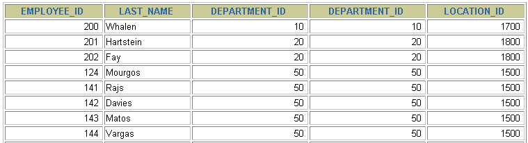
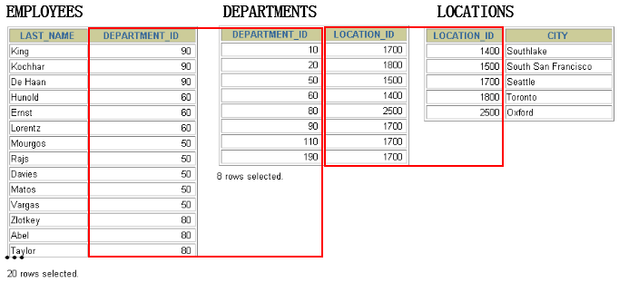
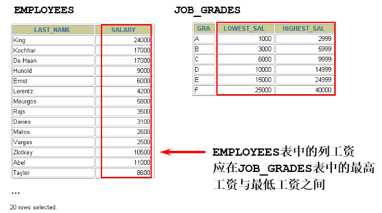
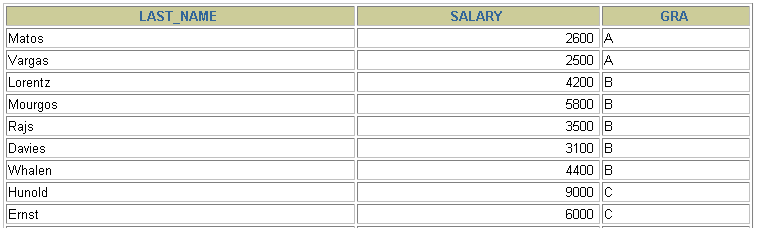
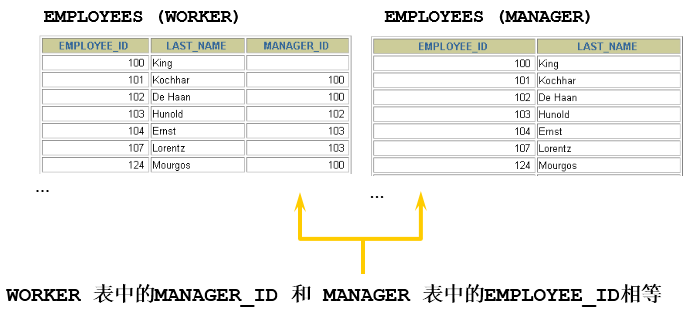
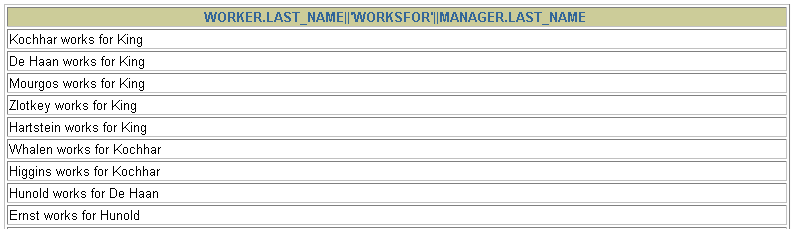
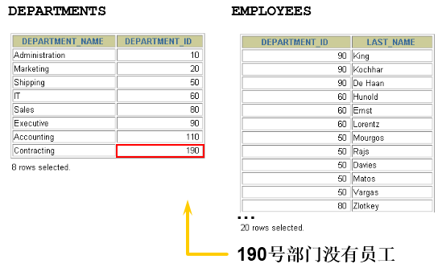

# 2 多表查询分类讲解

> 所属章节：第六章_多表查询
> 关键字：等值连接、非等值连接、自连接、非自连接、内连接、外连接、左外连接、右外连接、满外连接、表别名
> 建议回查情境：分不清多表查询有哪些分类、忘记等值连接和非等值连接的差别、不确定自连接是什么意思，或想快速区分内连接与外连接时

## 本节导读

这一节是在已经知道笛卡尔积与连接条件之后，继续建立多表查询的分类地图。重点不是死记名词，而是理解不同分类是在从不同角度描述“表与表怎么连”。

第一次阅读时，建议先看三种分类总览，再依序看 `等值连接 / 非等值连接`、`自连接 / 非自连接`、`内连接 / 外连接`。复习时如果你只想快速判断某个查询属于哪一类，可以先看 `快速回查表` 和对应小节。

## 你会在这篇学到什么

- 多表查询可以从不同角度分类，而不是只有一种分法。
- 按连接条件的形式，可以分成等值连接和非等值连接。
- 按参与连接的表是否为同一张表，可以分成自连接和非自连接。
- 按是否保留不匹配记录，可以分成内连接和外连接。
- 使用表别名可以让多表查询更短、更清楚，也更适合处理自连接。

## 快速定位

- `2.1 分类1：等值连接 vs 非等值连接`：看连接条件是“相等”还是“区间 / 比较条件”。
- `2.1.1.2 区分重复的列名`：看多表中同名字段为什么要加表名前缀。
- `2.1.1.3 表的别名`：看为什么多表查询里几乎都会用别名。
- `2.1.1.4 连接多个表`：看连接 `n` 个表至少需要多少个连接条件。
- `2.2 分类2：自连接 vs 非自连接`：看同一张表如何当成两张表来查询。
- `2.3 分类3：内连接 vs 外连接`：看是否保留没有匹配上的记录。
- `SQL92：使用 (+) 创建外连接`：看旧语法长什么样，以及为什么 MySQL 不支持。

## 快速回查表

| 分类角度 | 类型 | 核心判断方式 | 典型特征 |
| --- | --- | --- | --- |
| 按连接条件分类 | 等值连接 | 连接条件使用 `=` | 常见于主键、外键对应 |
| 按连接条件分类 | 非等值连接 | 连接条件不是 `=` | 常见于区间匹配，例如薪资等级 |
| 按表是否相同分类 | 自连接 | 本质上是一张表连自己 | 需要给同一张表起两个别名 |
| 按表是否相同分类 | 非自连接 | 来自两张或多张不同的表 | 最常见的多表查询形式 |
| 按结果保留方式分类 | 内连接 | 只保留匹配成功的记录 | 不保留不匹配行 |
| 按结果保留方式分类 | 外连接 | 除匹配成功外，还保留某一侧未匹配的记录 | 左外连接、右外连接、满外连接 |

## 建议阅读顺序

- 第一次学习时，建议按 `2.1 -> 2.2 -> 2.3` 的顺序阅读，先看连接条件，再看是否同表，最后看结果集保留规则。
- 如果你主要在写普通多表查询，优先掌握 `2.1.1 等值连接`、`2.1.1.3 表的别名` 和 `2.1.1.4 连接多个表`。
- 如果你看到“员工和经理都来自 employees 表”这类题目，直接看 `2.2 分类2：自连接 vs 非自连接`。
- 如果你开始接触“即使没有匹配也要显示出来”的需求，重点看 `2.3 分类3：内连接 vs 外连接`。

## 2.1 分类1：等值连接 vs 非等值连接

这一类分类是从“连接条件长什么样”来区分。最常见的是等值连接，也就是用相等关系把两张表对应起来；如果连接条件不是相等，而是区间、大小比较等，就属于非等值连接。

### 2.1.1 等值连接

等值连接指的是：连接条件使用 `=`，把两个表中值相等的记录对应起来。


```sql
SELECT
    e.employee_id,
    e.last_name,
    e.department_id,
    d.department_id,
    d.location_id
FROM
    employees e,
    departments d
WHERE
    e.department_id = d.department_id;
```




这里的 `e.department_id = d.department_id` 就是典型的等值连接条件。它通过部门编号把员工表和部门表关联起来。

### 2.1.1.1 拓展1：多个连接条件与 `AND` 操作符

实际查询中，连接关系不一定只靠一个字段。有时需要多个条件同时成立，才能真正确定两张表之间的对应关系。

假设有以下两个表：

`orders` 表（订单表）：

| order_id | customer_id | product_id | quantity |
| --- | --- | --- | --- |
| 1 | 101 | 2001 | 2 |
| 2 | 102 | 2002 | 1 |
| 3 | 101 | 2003 | 3 |

`customers` 表（客户表）：

| customer_id | name | region |
| --- | --- | --- |
| 101 | Alice | East |
| 102 | Bob | West |
| 103 | Charlie | North |

如果不仅要求 `customer_id` 匹配，还要限定客户属于 `East` 区域，可以这样写：

```sql
SELECT
    orders.order_id,
    customers.name,
    customers.region,
    orders.product_id,
    orders.quantity
FROM
    orders,
    customers
WHERE
    orders.customer_id = customers.customer_id
    AND customers.region = 'East';
```

这段 SQL 的作用是：

1. `orders.customer_id = customers.customer_id` 先建立订单与客户之间的对应关系。
2. `AND customers.region = 'East'` 再进一步筛选，只保留 `East` 区域的客户。

结果如下：

| order_id | name | region | product_id | quantity |
| --- | --- | --- | --- | --- |
| 1 | Alice | East | 2001 | 2 |
| 3 | Alice | East | 2003 | 3 |

如果去掉 `AND customers.region = 'East'`，那么所有匹配上的客户都会被连接进来。

### 2.1.1.2 拓展2：区分重复的列名

多表查询中，如果多个表里存在同名列，就必须在列名前加上表名或表别名，否则 SQL 无法判断你到底指的是哪一个字段。

- 多个表中有相同列名时，必须在列名前加上表名前缀。
- 同名字段可以通过 `表名.列名` 或 `别名.列名` 的方式区分。

```sql
SELECT
    employees.last_name,
    departments.department_name,
    employees.department_id
FROM
    employees,
    departments
WHERE
    employees.department_id = departments.department_id;
```

### 2.1.1.3 拓展3：表的别名

表别名的作用是让 SQL 更短，也更容易阅读。在多表查询、自连接、长表名场景中尤其常见。

- 使用别名可以简化查询。
- 在多表查询中，列名前加表别名有助于提高可读性。

```sql
SELECT
    e.employee_id,
    e.last_name,
    e.department_id,
    d.department_id,
    d.location_id
FROM
    employees e,
    departments d
WHERE
    e.department_id = d.department_id;
```

需要注意：

- 如果已经给表起了别名，在查询字段和过滤条件中通常就应该继续使用别名，而不是混用原表名。

阿里开发规范也强调：

- 只要 SQL 涉及多个表，列名前都应该使用表别名或表名进行限定。
- 如果没有限定字段来源，而多个表后来新增了同名列，就可能引发歧义错误，例如 `1052 Column 'name' in field list is ambiguous`。

### 2.1.1.4 拓展4：连接多个表

当查询涉及三个或更多表时，核心原则是：连接 `n` 个表，至少需要 `n - 1` 个连接条件。



例如，连接员工表、部门表和地点表：

```sql
SELECT
    e.last_name,
    d.department_name,
    l.city
FROM
    employees e,
    departments d,
    locations l
WHERE
    e.department_id = d.department_id
    AND d.location_id = l.location_id;
```

这条 SQL 中：

- `e.department_id = d.department_id` 把员工和部门连起来。
- `d.location_id = l.location_id` 再把部门和地点连起来。

### 2.1.2 非等值连接

非等值连接指的是：连接条件不是 `=`，而是范围、区间或其他比较关系。



```sql
SELECT
    e.last_name,
    e.salary,
    j.grade_level
FROM
    employees e,
    job_grades j
WHERE
    e.salary BETWEEN j.lowest_sal AND j.highest_sal;
```




这里不是用相等关系连接，而是通过 `salary` 是否落在某个薪资区间里，把员工映射到对应的工资等级，因此属于非等值连接。

## 2.2 分类2：自连接 vs 非自连接

这一类分类是从“参与连接的是不是同一张表”来区分。

如果 `table1` 和 `table2` 本质上其实是同一张表，只是通过不同别名把它虚拟成两张表，分别扮演不同角色，那么这种查询就叫自连接。



### 2.2.1 题目：查询 employees 表，返回 “Xxx works for Xxx”

这个问题的关键在于：员工和经理都来自 `employees` 表，只是语义角色不同。




```sql
SELECT
    CONCAT(worker.last_name, ' works for ', manager.last_name)
FROM
    employees worker,
    employees manager
WHERE
    worker.manager_id = manager.employee_id;
```

这里：

- `employees worker` 表示把员工表当作“员工”角色来使用。
- `employees manager` 表示把同一张员工表当作“经理”角色来使用。
- `worker.manager_id = manager.employee_id` 用来表示员工和其经理之间的对应关系。

### 2.2.2 练习：查询出 `last_name` 为 `Chen` 的员工的 manager 信息

```sql
SELECT
    worker.last_name AS "Worker Name",
    manager.last_name AS "Manager Name"
FROM
    employees worker,
    employees manager
WHERE
    worker.manager_id = manager.employee_id
    AND worker.last_name LIKE '%Chen%';
```

这仍然是自连接，因为查询的两侧本质上都是 `employees` 表。

### 自连接与非自连接怎么区分

- 自连接：一张表通过不同别名，扮演两个或多个角色后再连接。
- 非自连接：连接的是两张或多张不同的表，例如 `employees` 和 `departments`。

## 2.3 分类3：内连接 vs 外连接

这一类分类是从“结果集中是否保留没有匹配上的记录”来区分。

内连接包括：

- 等值连接
- 非等值连接
- 自连接

外连接包括：

- 左外连接
- 右外连接
- 满外连接

除了查询满足条件的记录以外，外连接还可以查询某一方不满足条件的记录。



- 内连接：合并具有相同关联条件的两个或多个表的行，结果集中不包含彼此不匹配的行。
- 外连接：除了返回满足连接条件的行以外，还会保留左表或右表中不满足条件的记录；没有匹配的一侧会以 `NULL` 填充。
- 左外连接中，左边的表通常可视为主表，右边的表可视为从表。
- 右外连接中，右边的表通常可视为主表，左边的表可视为从表。

### SQL92：使用 `(+)` 创建外连接

需要特别注意：MySQL 不支持 SQL92 语法中的外连接写法，而支持 SQL99 风格的外连接语法。

- 在 SQL92 中，`(+)` 代表从表所在的位置。
- Oracle 对 SQL92 外连接支持较好，但 MySQL 不支持这种写法。

```sql
# 左外连接
SELECT last_name, department_name
FROM employees, departments
WHERE employees.department_id = departments.department_id(+);

# 右外连接
SELECT last_name, department_name
FROM employees, departments
WHERE employees.department_id(+) = departments.department_id;
```

另外，在 SQL92 中只有左外连接和右外连接，没有满外连接。

## 常见混淆点

- 等值连接 / 非等值连接，关注的是“连接条件怎么写”；内连接 / 外连接，关注的是“结果是否保留不匹配记录”，它们不是同一组对立概念。
- 自连接不代表特殊语法，本质上只是同一张表起了两个别名后再连接。
- 多表查询里，字段同名时不加表名或别名，很容易出现歧义错误。
- 连接多个表时，不是表越多越难，关键是理清每两张表之间的关联链路。
- MySQL 不支持 SQL92 的 `(+)` 外连接写法，这部分更适合作为知识补充理解，不适合作为 MySQL 实战语法直接使用。

## 常见回查问题

- 等值连接和非等值连接到底差在哪里？
- 为什么同一张表也能做连接查询？
- 什么时候必须给表起别名？
- 连接三个表时，至少需要几个连接条件？
- 内连接和外连接最大的区别是什么？
- MySQL 能不能直接写 `(+)` 做外连接？

## 一句话抓核心

多表查询的分类不是只有一种标准；你可以从连接条件、参与表是否相同、结果是否保留不匹配记录这三个角度来理解它。

## 小结

这一节需要记住：

- 按连接条件分，多表查询有等值连接和非等值连接。
- 按参与表分，多表查询有自连接和非自连接。
- 按结果保留规则分，多表查询有内连接和外连接。
- 表别名是多表查询中的高频工具，尤其在自连接里几乎必不可少。
- 连接 `n` 个表，通常至少需要 `n - 1` 个连接条件。
- MySQL 不支持 SQL92 的 `(+)` 外连接写法，学习时要把“概念理解”和“实际可用语法”区分开来。
