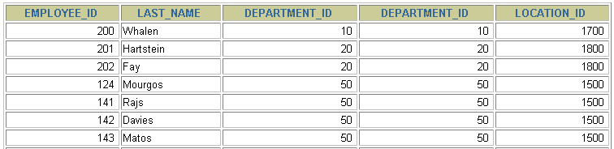
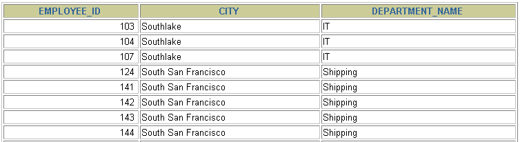
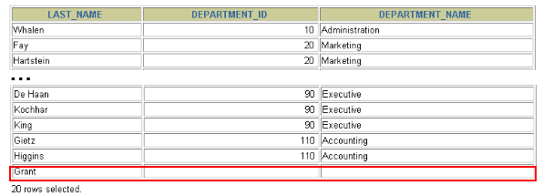
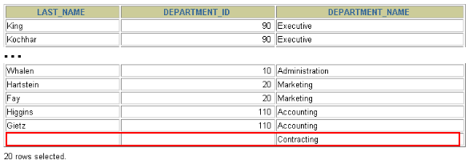

# 3 SQL99 语法实现多表查询

> 所属章节：第六章_多表查询
> 关键字：SQL99、JOIN、INNER JOIN、LEFT JOIN、RIGHT JOIN、FULL OUTER JOIN、ON、外连接
> 建议回查情境：忘记 SQL99 风格多表查询怎么写、不确定 `JOIN ... ON` 和 SQL92 写法的差别，或想快速确认左外连接、右外连接与满外连接在 MySQL 里的使用限制时

## 本节导读

这一节开始从 SQL92 的逗号连接写法，切换到 SQL99 的 `JOIN ... ON` 写法。重点不是只看语法长相，而是理解：SQL99 把“表怎么连”和“连接条件是什么”写得更清楚，因此在多表查询里通常更容易读、也更容易维护。

第一次阅读时，建议先看 `3.1 基本语法`，建立 `JOIN ... ON` 的整体结构，再看 `3.2 内连接` 和 `3.3 外连接`。复习时如果你已经知道要写哪类连接，可以直接跳到对应小节。

## 你会在这篇学到什么

- SQL99 常用 `JOIN ... ON` 来表达多表连接。
- `ON` 子句专门用于写连接条件，能让 SQL 结构更清晰。
- `JOIN` 和 `INNER JOIN` 在含义上等价，都表示内连接。
- SQL99 可以直接写左外连接、右外连接和满外连接的语法形式。
- MySQL 不支持 `FULL JOIN`，但可以用其他方式替代。

## 快速定位

- `3.1 基本语法`：看 SQL99 的 `JOIN ... ON` 骨架怎么写。
- `3.2 内连接（INNER JOIN）的实现`：看 SQL99 风格的内连接写法。
- `3.2.3 题目2`：看三张表如何连续使用 `JOIN ... ON`。
- `3.3 外连接（OUTER JOIN）的实现`：看左外连接、右外连接和满外连接的区别。
- `3.3.1 左外连接`：看如何保留左表中未匹配的记录。
- `3.3.2 右外连接`：看如何保留右表中未匹配的记录。
- `3.3.3 满外连接`：看标准语法长什么样，以及 MySQL 为什么不能直接写。

## 快速回查表

| 场景 | 写法 | 说明 |
| --- | --- | --- |
| SQL99 内连接 | `FROM A JOIN B ON 条件` | `JOIN` 默认就是内连接 |
| 显式内连接 | `FROM A INNER JOIN B ON 条件` | 与 `JOIN` 含义相同 |
| 左外连接 | `FROM A LEFT JOIN B ON 条件` | 保留左表全部记录 |
| 右外连接 | `FROM A RIGHT JOIN B ON 条件` | 保留右表全部记录 |
| 满外连接标准写法 | `FROM A FULL OUTER JOIN B ON 条件` | SQL 标准支持，但 MySQL 不支持 |
| MySQL 替代满外连接 | `LEFT JOIN ... UNION RIGHT JOIN ...` | 用并集模拟满外连接 |

## 建议阅读顺序

- 第一次学习时，建议按 `3.1 -> 3.2 -> 3.3` 的顺序阅读，先掌握语法骨架，再看内连接，最后看外连接。
- 如果你已经会写 SQL92 的 `FROM A, B WHERE ...`，可以重点看 `3.1 基本语法`，理解 SQL99 只是把连接结构写得更清楚。
- 如果你主要在处理员工、部门、地点这类普通关联查询，优先掌握 `3.2 内连接`。
- 如果你的需求是“即使没有匹配到部门，也要把员工列出来”，重点看 `3.3.1 左外连接`。

## 3.1 基本语法

SQL99 使用 `JOIN ... ON` 子句来创建连接，基本结构如下：

```sql
SELECT
  table1.column,
  table2.column,
  table3.column
FROM table1
    JOIN table2 ON table1 和 table2 的连接条件
    JOIN table3 ON table2 和 table3 的连接条件;
```

可以把它理解成一种逐步嵌套的连接过程，逻辑上类似下面这种循环结构：

```text
for t1 in table1:
    for t2 in table2:
        if condition1:
            for t3 in table3:
                if condition2:
                    output t1 + t2 + t3
```

这种写法的好处是：

- 表与表的连接关系写得更清楚。
- 每一段 `JOIN` 都可以直接看到自己对应的 `ON` 条件。
- 当连接的表越来越多时，可读性通常比 SQL92 更好。

### 语法说明

- 可以使用 `ON` 子句单独指定连接条件。
- `ON` 中写的是“表与表之间如何匹配”。
- 其他筛选条件通常可以继续写在 `WHERE` 子句中。
- `JOIN` 和 `INNER JOIN` 含义相同，都表示内连接。

## 3.2 内连接（INNER JOIN）的实现

内连接只返回满足连接条件的记录。换句话说，只有两张表能够成功匹配的行，才会出现在结果集中。

### 3.2.1 语法

```sql
SELECT 字段列表
FROM A表 INNER JOIN B表
ON 关联条件
WHERE 其他条件;
```

如果你把 `INNER` 省略掉，只写 `JOIN`，含义仍然是内连接。

### 3.2.2 题目1

```sql
SELECT
    e.employee_id,
    e.last_name,
    e.department_id,
    d.department_id,
    d.location_id
FROM
    employees e
JOIN departments d
ON
    (e.department_id = d.department_id);
```




这里通过 `e.department_id = d.department_id` 把员工和部门连接起来。只有部门编号能匹配上的员工记录，才会出现在查询结果中。

### 3.2.3 题目2

下面的例子把内连接扩展到三张表：

```sql
SELECT
    employee_id,
    city,
    department_name
FROM
    employees e
JOIN departments d
ON
    d.department_id = e.department_id
JOIN locations l
ON
    d.location_id = l.location_id;
```




这条 SQL 的连接链路是：

- 先通过 `d.department_id = e.department_id` 连接员工表和部门表。
- 再通过 `d.location_id = l.location_id` 连接部门表和地点表。

这也是 SQL99 写法的一个优势：每个连接条件都紧跟在对应的 `JOIN` 后面，不容易和其他条件混在一起。

## 3.3 外连接（OUTER JOIN）的实现

外连接除了返回匹配成功的记录外，还会保留某一侧没有匹配到的记录。没有匹配上的那一侧，会以 `NULL` 补齐相关列。

需要特别注意：

- `LEFT JOIN` 和 `RIGHT JOIN` 属于 SQL99 及之后的标准写法。
- SQL92 中没有 `LEFT JOIN` / `RIGHT JOIN` 这种语法形式，只能用 `(+)` 这类旧写法表示外连接。

### 3.3.1 左外连接（LEFT OUTER JOIN）

左外连接会保留左表中的所有记录。即使某一行在右表中找不到匹配项，这一行仍然会出现在结果里，只是右表对应字段会显示为 `NULL`。

#### 3.3.1.1 语法

```sql
# 实现查询结果是 A
SELECT 字段列表
FROM A表 LEFT JOIN B表
ON 关联条件
WHERE 其他条件;
```

#### 3.3.1.2 举例

```sql
SELECT
  e.last_name,
  e.department_id,
  d.department_name
FROM
  employees e
LEFT OUTER JOIN departments d
ON
  (e.department_id = d.department_id);
```



这条 SQL 的含义是：无论员工是否能匹配到部门，员工记录都会被保留，因此它适合处理“主表数据必须完整显示”的场景。

### 3.3.2 右外连接（RIGHT OUTER JOIN）

右外连接和左外连接是对称的：它会保留右表中的所有记录。

#### 3.3.2.1 语法

```sql
# 实现查询结果是 B
SELECT 字段列表
FROM A表 RIGHT JOIN B表
ON 关联条件
WHERE 其他条件;
```

#### 3.3.2.2 举例

```sql
SELECT
  e.last_name,
  e.department_id,
  d.department_name
FROM
  employees e
RIGHT OUTER JOIN departments d
ON
  (e.department_id = d.department_id);
```



这条 SQL 的含义是：无论某个部门下是否已经有员工，只要它在 `departments` 表中存在，就会出现在结果里。

### 3.3.3 满外连接（FULL OUTER JOIN）

满外连接的结果可以理解为：

- 左右表匹配成功的数据；
- 左表中没有匹配到的数据；
- 右表中没有匹配到的数据。

SQL 标准支持使用 `FULL JOIN` 或 `FULL OUTER JOIN` 来实现满外连接。

```sql
SELECT 字段列表
FROM A表 FULL OUTER JOIN B表
ON 关联条件;
```

不过需要注意：

- SQL99 标准支持满外连接。
- MySQL 不支持 `FULL JOIN` / `FULL OUTER JOIN`。
- 在 MySQL 中，通常可以用 `LEFT JOIN ... UNION RIGHT JOIN ...` 来模拟满外连接。

## 常见混淆点

- `JOIN` 默认就是内连接，不写 `INNER` 不代表变成别的连接类型。
- `ON` 主要负责写连接条件，`WHERE` 更适合放连接完成后的筛选条件。
- 左外连接和右外连接的区别，不在于条件写法，而在于“保留哪一侧的全部记录”。
- SQL 标准支持 `FULL OUTER JOIN`，但 MySQL 本身不支持这条语法，学习标准概念时要和实际数据库支持情况分开看。
- SQL99 不是推翻 SQL92，而是把连接语法写得更结构化、更容易阅读。

## 常见回查问题

- `JOIN` 和 `INNER JOIN` 有区别吗？
- 为什么 SQL99 通常比 SQL92 更容易读？
- `ON` 子句应该写什么，`WHERE` 子句又该写什么？
- 左外连接和右外连接各自保留哪一边的数据？
- MySQL 能不能直接写 `FULL JOIN`？

## 一句话抓核心

SQL99 的核心优势是用 `JOIN ... ON` 把“谁和谁连接”以及“怎么连接”写得更清楚；其中 `JOIN` 处理内连接，`LEFT / RIGHT JOIN` 处理外连接，而 `FULL JOIN` 在 MySQL 中不能直接使用。

## 小结

这一节需要记住：

- SQL99 常用 `JOIN ... ON` 来实现多表查询。
- `ON` 子句专门写连接条件，可读性通常比 SQL92 更好。
- `JOIN` 和 `INNER JOIN` 含义相同，都会返回匹配成功的记录。
- `LEFT JOIN` 保留左表全部记录，`RIGHT JOIN` 保留右表全部记录。
- SQL 标准支持 `FULL OUTER JOIN`，但 MySQL 不支持这条语法。
- 在 MySQL 中，如果需要满外连接效果，通常要改用其他写法模拟。
