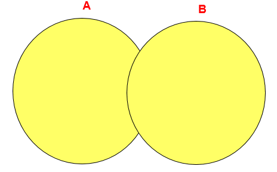
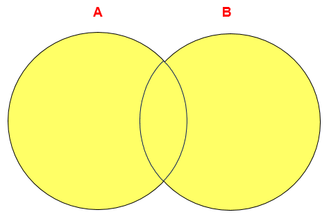

# 4 UNION 的使用

> 所属章节：第六章_多表查询
> 关键字：UNION、UNION ALL、合并查询结果、去重、并集
> 建议回查情境：忘记 `UNION` 和 `UNION ALL` 的区别、不确定多个 `SELECT` 合并时有哪些限制，或想快速判断什么时候该优先用 `UNION ALL` 时

## 本节导读

这一节讲的是如何把多条 `SELECT` 语句的结果合并成一个结果集。它处理的重点不是“表怎么连接”，而是“多个查询结果怎么拼在一起”。

第一次阅读时，建议先理解 `UNION` 和 `UNION ALL` 的共同点与差别，再看它们的语法限制和使用例题。复习时如果你只想快速判断要不要去重，直接看 `快速回查表` 即可。

## 你会在这篇学到什么

- `UNION` 和 `UNION ALL` 都可以用来合并多条 `SELECT` 的结果。
- 合并时，各个 `SELECT` 返回的列数和对应数据类型需要兼容。
- `UNION` 会去除重复记录。
- `UNION ALL` 不会去除重复记录。
- 如果明确不需要去重，通常优先考虑 `UNION ALL`，效率更高。

## 快速定位

- `基本作用`：看 `UNION` 系列语法到底在解决什么问题。
- `语法格式`：看多条 `SELECT` 如何拼接。
- `UNION 操作符`：看为什么它会去重。
- `UNION ALL 操作符`：看为什么它通常更省资源。
- `例子：部门编号 >90 或邮箱包含 a`：看它和 `OR` 条件的关系。
- `例子：中国男性 + 美国男性`：看跨表合并结果时怎么写。

## 快速回查表

| 场景 | 写法 | 说明 |
| --- | --- | --- |
| 合并并去重 | `SELECT ... UNION SELECT ...` | 返回并集，并去除重复记录 |
| 合并但不去重 | `SELECT ... UNION ALL SELECT ...` | 返回并集，保留重复记录 |
| 明确不需要去重 | 优先用 `UNION ALL` | 一般比 `UNION` 更省资源 |
| 多个结果集合并 | 多段 `SELECT` 用 `UNION` 或 `UNION ALL` 连接 | 每段 `SELECT` 的列数和类型要对应 |

## 建议阅读顺序

- 第一次学习时，建议按 `基本作用 -> UNION -> UNION ALL -> 例子` 的顺序阅读。
- 如果你现在最困惑的是“为什么有时结果会少几行”，优先看 `UNION 操作符`。
- 如果你更关心性能和效率，优先看 `UNION ALL 操作符`。

## 基本作用

利用 `UNION` 关键字，可以给出多条 `SELECT` 语句，并将它们的结果组合成单个结果集。

这类操作适合处理这样的场景：

- 两个查询逻辑彼此独立，但最终希望放进同一个结果集。
- 不同表中结构相近的数据，需要统一输出。
- 某些条件写成一条复杂查询不直观，拆成多条 `SELECT` 再合并更清楚。

## 使用前提

合并时，各个 `SELECT` 返回结果需要满足以下要求：

- 对应列数必须相同。
- 对应位置的数据类型需要相同或兼容。
- 各列之间需要一一对应。

也就是说，`UNION` 不是随便把两个查询拼起来，而是要保证它们在结果结构上能够对齐。

## 语法格式

```sql
SELECT column, ...
FROM table1
UNION [ALL]
SELECT column, ...
FROM table2;
```

其中：

- 使用 `UNION` 时，会去重。
- 使用 `UNION ALL` 时，不去重。

## UNION 操作符

`UNION` 返回两个查询结果集的并集，并且会去除重复记录。



如果两段 `SELECT` 中有完全相同的结果行，最终输出时只会保留一份。

## UNION ALL 操作符

`UNION ALL` 也会返回两个查询结果集的并集，但不会去除重复记录。



这意味着：如果两段 `SELECT` 产生了相同的结果行，这些重复行会全部保留下来。

### 使用建议

- 执行 `UNION ALL` 所需资源通常比 `UNION` 少。
- 如果明确知道结果不会重复，或者业务上允许重复结果存在，尽量优先使用 `UNION ALL`，这样通常能提高查询效率。

## 例子：查询部门编号 `> 90` 或邮箱包含 `a` 的员工信息

下面这两个写法表达的是相近的查询意图。

方式 1：直接使用 `OR`

```sql
SELECT *
FROM employees
WHERE email LIKE '%a%' OR department_id > 90;
```

方式 2：拆成两条查询后再用 `UNION` 合并

```sql
SELECT *
FROM employees
WHERE email LIKE '%a%'
UNION
SELECT *
FROM employees
WHERE department_id > 90;
```

这里使用 `UNION` 的含义是：

- 先查出邮箱包含 `a` 的员工。
- 再查出部门编号大于 `90` 的员工。
- 最后把两批结果合并，并自动去重。

如果某位员工同时满足这两个条件，`UNION` 最终只会保留一条记录。

## 例子：查询中国男性用户以及美国男性用户信息

这个例子体现的是跨表合并结果集。

```sql
SELECT id, cname
FROM t_chinamale
WHERE csex = '男'
UNION ALL
SELECT id, tname
FROM t_usmale
WHERE tGender = 'male';
```

这里使用 `UNION ALL`，表示把两张表中符合条件的数据直接拼接起来，不做去重。

这也说明：

- `UNION` 系列不仅可以合并同一张表上的不同查询；
- 也可以合并不同表上的查询结果，只要输出列结构能够对应即可。

## 常见混淆点

- `UNION` 和 `UNION ALL` 都是在合并结果集，不是在做表连接。
- `UNION` 会去重，`UNION ALL` 不会去重；这通常也是它们最核心的区别。
- 写成两条 `SELECT` 再 `UNION`，和写成一条 `WHERE ... OR ...`，有时能表达相近意思，但并不代表任何场景都完全等价。
- 使用 `UNION` 时，不是原表去重，而是最终结果集去重。
- 不同 `SELECT` 能否合并，关键不是表名是否相同，而是输出结果结构是否一致。

## 常见回查问题

- `UNION` 和 `UNION ALL` 到底差在哪里？
- 什么时候应该优先用 `UNION ALL`？
- 为什么我合并后的结果比预期少？
- 不同表的查询结果可以直接 `UNION` 吗？
- `UNION` 和 `OR` 是不是一样的？

## 一句话抓核心

`UNION` 和 `UNION ALL` 都用来合并多个查询结果；前者会去重，后者不会去重，而在明确不需要去重时，通常优先使用 `UNION ALL`。

## 小结

这一节需要记住：

- `UNION` 和 `UNION ALL` 都可以把多条 `SELECT` 合并成一个结果集。
- 合并前，各个 `SELECT` 的列数和对应数据类型要能对齐。
- `UNION` 会去除重复记录。
- `UNION ALL` 会保留重复记录。
- 如果不需要去重，通常优先用 `UNION ALL`，效率更高。
