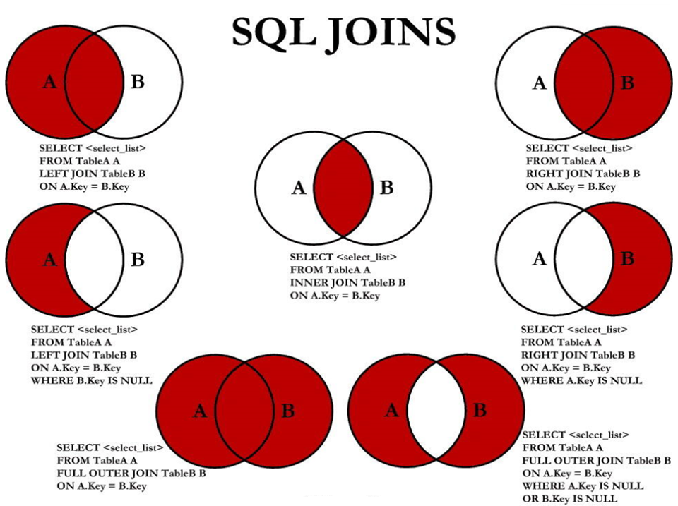

# 5 7 种 SQL JOINS 的实现

> 所属章节：第六章_多表查询
> 关键字：INNER JOIN、LEFT JOIN、RIGHT JOIN、FULL OUTER JOIN、左外连接、右外连接、左独有、右独有、UNION ALL
> 建议回查情境：看到 7 种 JOIN 图示时忘记每一块区域对应哪种 SQL、想快速实现左表独有或右表独有数据，或需要在 MySQL 中模拟满外连接时

## 本节导读

这一节把前面学过的内连接、左外连接、右外连接和 `UNION` 串起来，专门回答一个实战问题：图里的每一块区域，SQL 到底该怎么写。

第一次阅读时，建议先看 `快速回查表`，先把 7 种结果集和对应 SQL 类型对应起来，再回头看每段代码实现。复习时，这篇可以直接当作 JOIN 速查页使用。

## 你会在这篇学到什么

- 常见的 JOIN 图示，本质上是在讨论 A 表、B 表及其交集的不同结果组合。
- 内连接对应的是 `A ∩ B`。
- 左外连接与右外连接分别保留左表或右表的全部记录。
- 左表独有与右表独有，可以通过外连接再加 `IS NULL` 条件实现。
- MySQL 不支持 `FULL OUTER JOIN`，但可以用 `LEFT JOIN`、`RIGHT JOIN` 与 `UNION ALL` 组合模拟。

## 快速定位

- `5.1 代码实现`：看 7 种 JOIN 图示分别对应什么 SQL。
- `中图：内连接`：看交集 `A ∩ B` 的写法。
- `左上图：左外连接`：看如何保留 A 表全部记录。
- `右上图：右外连接`：看如何保留 B 表全部记录。
- `左中图：A - A∩B`：看左表独有数据怎么查。
- `右中图：B - A∩B`：看右表独有数据怎么查。
- `左下图：A ∪ B`：看如何在 MySQL 中模拟满外连接。
- `右下图：A ∪ B - A∩B`：看如何只保留左右两边各自独有的数据。
- `5.2 语法格式小结`：看这些写法的一般模板。

## 快速回查表

| 图示含义 | 集合关系 | 实现方式 | 核心写法 |
| --- | --- | --- | --- |
| 中图 | `A ∩ B` | 内连接 | `JOIN ... ON ...` |
| 左上图 | 左表全部 | 左外连接 | `LEFT JOIN ... ON ...` |
| 右上图 | 右表全部 | 右外连接 | `RIGHT JOIN ... ON ...` |
| 左中图 | `A - A∩B` | 左外连接后筛空 | `LEFT JOIN ... WHERE B.关联字段 IS NULL` |
| 右中图 | `B - A∩B` | 右外连接后筛空 | `RIGHT JOIN ... WHERE A.关联字段 IS NULL` |
| 左下图 | `A ∪ B` | 左右外连接合并 | `LEFT JOIN ... UNION ALL RIGHT JOIN ...` |
| 右下图 | `A ∪ B - A∩B` | 左独有 + 右独有 | `LEFT JOIN ... WHERE ... IS NULL UNION ALL RIGHT JOIN ... WHERE ... IS NULL` |

## 建议阅读顺序

- 第一次学习时，建议按 `中图 -> 左上图 / 右上图 -> 左中图 / 右中图 -> 左下图 / 右下图` 的顺序阅读，先看基础连接，再看只保留某一部分的数据。
- 如果你现在只想查“匹配成功的数据”，直接看内连接。
- 如果你要找“没有对应部门的员工”或“没有员工的部门”，重点看左中图与右中图。
- 如果你正在 MySQL 中模拟满外连接，直接看左下图。

## 结果图总览



这张图可以把 `employees` 看成 A 表，把 `departments` 看成 B 表。不同区域代表不同结果集，SQL 的本质就是决定最终要保留哪一部分。

## 5.1 代码实现

下面按图中的区域顺序，逐一给出 SQL 实现。

### 中图：内连接 `A ∩ B`

内连接只保留两张表都能成功匹配的记录。

```sql
SELECT
    employee_id,
    last_name,
    department_name
FROM
    employees e
JOIN departments d
ON
    e.department_id = d.department_id;
```

### 左上图：左外连接

左外连接会保留左表 A 的全部记录，即使右表 B 中没有对应项，也会保留下来。

```sql
SELECT
    employee_id,
    last_name,
    department_name
FROM
    employees e
LEFT JOIN departments d
ON
    e.department_id = d.department_id;
```

### 右上图：右外连接

右外连接会保留右表 B 的全部记录，即使左表 A 中没有对应项，也会保留下来。

```sql
SELECT
    employee_id,
    last_name,
    department_name
FROM
    employees e
RIGHT JOIN departments d
ON
    e.department_id = d.department_id;
```

### 左中图：`A - A∩B`

这一部分表示“只要左表独有的数据”，也就是左表有、右表没有匹配上的记录。

实现方法是：

- 先做左外连接；
- 再筛出右表关联字段为 `NULL` 的记录。

```sql
SELECT
    employee_id,
    last_name,
    department_name
FROM
    employees e
LEFT JOIN departments d
ON
    e.department_id = d.department_id
WHERE
    d.department_id IS NULL;
```

### 右中图：`B - A∩B`

这一部分表示“只要右表独有的数据”，也就是右表有、左表没有匹配上的记录。

实现方法是：

- 先做右外连接；
- 再筛出左表关联字段为 `NULL` 的记录。

```sql
SELECT
    employee_id,
    last_name,
    department_name
FROM
    employees e
RIGHT JOIN departments d
ON
    e.department_id = d.department_id
WHERE
    e.department_id IS NULL;
```

### 左下图：满外连接 `A ∪ B`

这一部分表示左右两张表的全部结果，也就是：

- 匹配成功的数据；
- 左表独有的数据；
- 右表独有的数据。

在标准 SQL 中这通常叫满外连接，但 MySQL 不支持直接写 `FULL OUTER JOIN`，所以这里用组合方式来模拟。

原理是：

- 左表独有部分；
- 加上右外连接结果；
- 合起来得到 `A ∪ B`。

```sql
SELECT
    employee_id,
    last_name,
    department_name
FROM
    employees e
LEFT JOIN departments d
ON
    e.department_id = d.department_id
WHERE
    d.department_id IS NULL
UNION ALL
SELECT
    employee_id,
    last_name,
    department_name
FROM
    employees e
RIGHT JOIN departments d
ON
    e.department_id = d.department_id;
```

这里使用 `UNION ALL`，是因为不做去重时通常效率更高。

### 右下图：`A ∪ B - A∩B`

这一部分表示“左右两边各自独有的数据”，也就是：

- 左表独有；
- 加上右表独有；
- 不包含交集。

换个写法也可以理解为：

- `(A - A∩B) ∪ (B - A∩B)`

```sql
SELECT
    employee_id,
    last_name,
    department_name
FROM
    employees e
LEFT JOIN departments d
ON
    e.department_id = d.department_id
WHERE
    d.department_id IS NULL
UNION ALL
SELECT
    employee_id,
    last_name,
    department_name
FROM
    employees e
RIGHT JOIN departments d
ON
    e.department_id = d.department_id
WHERE
    e.department_id IS NULL;
```

## 5.2 语法格式小结

前面的例子可以抽象成下面这些通用模板。

### 5.2.1 左中图

实现 `A - A∩B`：

```sql
SELECT 字段列表
FROM A表 LEFT JOIN B表
ON 关联条件
WHERE B表关联字段 IS NULL
  AND 其他条件;
```

### 5.2.2 右中图

实现 `B - A∩B`：

```sql
SELECT 字段列表
FROM A表 RIGHT JOIN B表
ON 关联条件
WHERE A表关联字段 IS NULL
  AND 其他条件;
```

### 5.2.3 左下图

实现 `A ∪ B`：

```sql
SELECT 字段列表
FROM A表 LEFT JOIN B表
ON 关联条件
WHERE 其他条件

UNION

SELECT 字段列表
FROM A表 RIGHT JOIN B表
ON 关联条件
WHERE 其他条件;
```

### 5.2.4 右下图

实现 `A ∪ B - A∩B`，或 `(A - A∩B) ∪ (B - A∩B)`：

```sql
SELECT 字段列表
FROM A表 LEFT JOIN B表
ON 关联条件
WHERE B表关联字段 IS NULL
  AND 其他条件

UNION

SELECT 字段列表
FROM A表 RIGHT JOIN B表
ON 关联条件
WHERE A表关联字段 IS NULL
  AND 其他条件;
```

## 常见混淆点

- 左外连接不等于左表独有；左外连接包含交集加左表独有。
- 右外连接不等于右表独有；右外连接包含交集加右表独有。
- 想查“只存在于某一边”的数据，关键不是只写外连接，而是还要再配合 `IS NULL` 过滤。
- MySQL 不支持直接写 `FULL OUTER JOIN`，所以满外连接通常要靠 `LEFT JOIN`、`RIGHT JOIN` 和 `UNION` / `UNION ALL` 组合出来。
- `UNION` 与 `UNION ALL` 的差别仍然存在于这里：前者去重，后者不去重。

## 常见回查问题

- 内连接、左外连接、右外连接在图上分别是哪一块？
- 为什么“左表独有”要写 `LEFT JOIN ... WHERE B表字段 IS NULL`？
- 为什么“右表独有”要写 `RIGHT JOIN ... WHERE A表字段 IS NULL`？
- MySQL 里怎么模拟满外连接？
- `A ∪ B` 和 `A ∪ B - A∩B` 的 SQL 差别在哪里？

## 一句话抓核心

7 种 JOIN 图示的本质，是在决定要保留交集、左表全部、右表全部，还是左右两边各自独有的数据；而 MySQL 中这些结果都可以通过 `JOIN`、`IS NULL` 和 `UNION` 组合出来。

## 小结

这一节需要记住：

- 内连接对应 `A ∩ B`。
- 左外连接与右外连接分别保留左表或右表的全部记录。
- 左表独有和右表独有都要靠外连接加 `IS NULL` 条件来筛。
- MySQL 不支持直接写满外连接，但可以通过 `LEFT JOIN`、`RIGHT JOIN` 与 `UNION` / `UNION ALL` 来模拟。
- 看到 JOIN 图时，先想清楚你要的是交集、并集，还是某一边独有的数据，再决定 SQL 写法。
