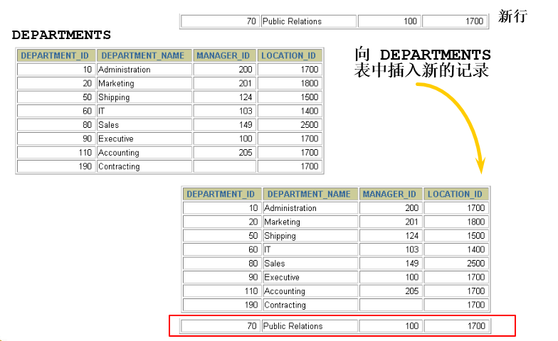

# 1 插入数据

返回章节：[第十一章_数据处理之增删改](./README.md)

## 本节导读

这一节开始学习 DML 中最常见的操作之一：**把新数据写入数据表**。

`INSERT` 表面上只是“新增一笔资料”，但实际开发中会遇到很多不同场景：

- 新增一笔完整资料；
- 只新增部分字段，其他字段使用默认值；
- 一次新增多笔资料；
- 从另一张表查询资料后，批量插入到目标表；
- 插入时遇到主键或唯一键重复；
- 插入时字段类型、字段顺序、默认值不符合要求。

所以本节重点不是单纯背语法，而是要建立一个判断流程：

> 我要插入的是「手写固定值」，还是「查询结果」？  
> 我要插入「所有字段」，还是「指定字段」？  
> 有没有主键、自增字段、非空字段、默认值、唯一约束需要注意？

掌握这个思路之后，`INSERT` 就不只是会写，而是能写得安全、稳定、好维护。

---

## 学习目标

学完本节后，应能掌握：

1. `INSERT INTO ... VALUES ...` 的基本用法。
2. 全字段插入与指定字段插入的差异。
3. 为什么实际开发中更推荐「指定字段插入」。
4. 如何一次插入多行数据。
5. 如何使用 `INSERT ... SELECT` 把查询结果插入另一张表。
6. `NULL`、`DEFAULT`、`AUTO_INCREMENT` 在插入时的差异。
7. 插入数据时常见错误的原因。

---

## 关键字

- 主题：插入数据、`INSERT INTO`、`VALUES`、多行插入、查询结果插入
- 英文：insert into, values, multi-row insert, insert into select
- 常见搜寻：
  - MySQL 怎么插入数据
  - MySQL 指定字段插入
  - MySQL 一次插入多行
  - MySQL INSERT SELECT
  - MySQL AUTO_INCREMENT 插入
- 易混淆：
  - 全字段插入 vs 指定字段插入
  - 单行插入 vs 多行插入
  - `VALUES` 插入 vs `INSERT ... SELECT`
  - `NULL` vs `DEFAULT`
  - 省略字段 vs 主动插入 `NULL`

---

## 建议回查情境

遇到以下情况时，可以回来看本节：

- 想快速写出最基本的 `INSERT` 语法。
- 不确定 `INSERT INTO 表名 VALUES (...)` 为什么容易出错。
- 想知道为什么实际开发更推荐写字段名。
- 想一次插入多笔资料。
- 想把查询结果直接导入另一张表。
- 插入数据时遇到字段数量不匹配、类型不匹配、非空约束错误。
- 对 `DEFAULT`、`NULL`、`AUTO_INCREMENT` 的行为不确定。

---

## 30 秒复习入口

- `INSERT` 是用来向表中新增记录的 DML 语句。
- 最常见写法是：

```sql
INSERT INTO 表名(字段1, 字段2, 字段3)
VALUES (值1, 值2, 值3);
```

* 如果不写字段名，就必须按照表结构顺序提供所有字段的值。
* 实际开发中更推荐写字段名，因为可读性高，也比较不容易因为表结构变化而出错。
* 一次插入多行时，可以在一个 `INSERT` 后面接多组 `VALUES`。
* `INSERT ... SELECT` 可以把查询结果直接插入目标表。
* 插入时要特别注意字段顺序、字段类型、非空约束、默认值、主键重复问题。

---

## 速查区

### 1. 插入一行，指定字段

```sql
INSERT INTO 表名(字段1, 字段2)
VALUES (值1, 值2);
```

### 2. 插入一行，不指定字段

```sql
INSERT INTO 表名
VALUES (值1, 值2, 值3, ...);
```

> 不推荐作为日常开发首选，因为必须完全依赖表字段的定义顺序。

### 3. 一次插入多行

```sql
INSERT INTO 表名(字段1, 字段2)
VALUES
    (值1, 值2),
    (值3, 值4),
    (值5, 值6);
```

### 4. 使用默认值

```sql
INSERT INTO 表名(字段1, 字段2, 字段3)
VALUES (值1, DEFAULT, 值3);
```

### 5. 查询结果插入

```sql
INSERT INTO 目标表(字段1, 字段2)
SELECT 字段A, 字段B
FROM 来源表
WHERE 条件;
```

---

## 1.1 实际问题



假设现在有一张部门表 `departments`，我们想新增一个部门资料。

例如：

| department_id | department_name | manager_id | location_id |
| ------------- | --------------- | ---------- | ----------- |
| 70            | Pub             | 100        | 1700        |

这时就需要使用 `INSERT` 语句，把这笔资料写入数据表。

---

## 1.2 `INSERT` 的核心概念

`INSERT` 的作用是：

> 向一张已经存在的数据表中新增一行或多行记录。

基本语法可以分成两大类：

### 第一类：直接写入明确的值

```sql
INSERT INTO 表名(字段1, 字段2, 字段3)
VALUES (值1, 值2, 值3);
```

这种方式适合：

* 手动新增固定资料；
* 后端接收到前端表单数据后写入数据库；
* 测试时插入几笔假资料；
* 初始化基础数据。

---

### 第二类：把查询结果插入目标表

```sql
INSERT INTO 目标表(字段1, 字段2)
SELECT 字段A, 字段B
FROM 来源表;
```

这种方式适合：

* 从旧表搬资料到新表；
* 根据查询结果批量产生新资料；
* 做数据备份或数据转换；
* 把符合条件的数据复制到另一张表。

---

## 1.3 方式一：使用 `VALUES` 插入数据

### 1.3.1 标准语法

```sql
INSERT INTO 表名(字段1, 字段2, ..., 字段n)
VALUES (值1, 值2, ..., 值n);
```

重点：

* 字段数量和 `VALUES` 中的值数量必须一致。
* 字段顺序必须和对应值顺序一致。
* 字符串、日期、时间类型通常要使用单引号。
* 数字类型通常不需要加单引号。
* 如果字段有默认值，可以省略该字段，或使用 `DEFAULT`。

---

## 1.4 情况一：为表的所有字段插入数据

### 写法

```sql
INSERT INTO 表名
VALUES (value1, value2, ..., valuen);
```

这种写法没有指定字段名，因此 MySQL 会按照表结构中字段定义的顺序，把值依次放进去。

### 示例

假设 `departments` 表字段顺序为：

```text
department_id
department_name
manager_id
location_id
```

那么可以这样插入：

```sql
INSERT INTO departments
VALUES (70, 'Pub', 100, 1700);
```

也可以插入 `NULL`：

```sql
INSERT INTO departments
VALUES (100, 'Finance', NULL, NULL);
```

---

### 这种写法的问题

虽然这种写法很短，但实际开发中不太推荐。

原因是它高度依赖表字段顺序。

例如表结构是：

```text
department_id
department_name
manager_id
location_id
```

你写：

```sql
INSERT INTO departments
VALUES (70, 'Pub', 100, 1700);
```

现在看起来没问题。

但如果以后表结构调整成：

```text
department_id
department_name
description
manager_id
location_id
```

原本的 `INSERT` 就可能出错，因为值的数量和字段数量不一致。

即使数量刚好一致，也可能把值塞到错误字段中。

---

### 建议

除非是临时测试，否则更推荐使用指定字段写法：

```sql
INSERT INTO departments(department_id, department_name, manager_id, location_id)
VALUES (70, 'Pub', 100, 1700);
```

这样可读性更高，也比较不怕表字段顺序变化。

---

## 1.5 情况二：为指定字段插入数据

### 写法

```sql
INSERT INTO 表名(字段1, 字段2, ..., 字段n)
VALUES (值1, 值2, ..., 值n);
```

示例：

```sql
INSERT INTO departments(department_id, department_name)
VALUES (80, 'IT');
```

这表示只给 `department_id` 和 `department_name` 赋值。

其他没有指定的字段，例如：

```text
manager_id
location_id
```

会根据表定义决定值：

* 如果字段有默认值，就使用默认值；
* 如果字段允许为 `NULL`，可能会变成 `NULL`；
* 如果字段是 `NOT NULL` 且没有默认值，在严格模式下通常会报错。

---

### 字段和值的对应关系

指定字段插入时，重点是：

> 字段顺序和 `VALUES` 中的值顺序要一一对应。

例如：

```sql
INSERT INTO departments(department_id, department_name)
VALUES (80, 'IT');
```

对应关系是：

| 字段              | 值    |
| --------------- | ---- |
| department_id   | 80   |
| department_name | 'IT' |

如果写成：

```sql
INSERT INTO departments(department_name, department_id)
VALUES ('IT', 80);
```

也是可以的，因为字段顺序变了，值的顺序也跟着变了。

对应关系变成：

| 字段              | 值    |
| --------------- | ---- |
| department_name | 'IT' |
| department_id   | 80   |

所以判断标准不是表结构原本顺序，而是 `INSERT INTO 表名(...)` 中列出来的字段顺序。

---

## 1.6 `NULL`、`DEFAULT`、省略字段的差异

插入数据时，很多初学者会混淆这三种情况：

```sql
NULL
DEFAULT
省略字段
```

它们的意思并不完全一样。

---

### 1.6.1 插入 `NULL`

```sql
INSERT INTO departments(department_id, department_name, manager_id)
VALUES (90, 'HR', NULL);
```

意思是：

> 明确告诉 MySQL：`manager_id` 这个字段我要放 `NULL`。

前提是该字段必须允许 `NULL`。

如果字段定义为：

```sql
manager_id INT NOT NULL
```

那么插入 `NULL` 就会失败。

---

### 1.6.2 使用 `DEFAULT`

```sql
INSERT INTO departments(department_id, department_name, manager_id)
VALUES (90, 'HR', DEFAULT);
```

意思是：

> 明确告诉 MySQL：`manager_id` 使用表定义中的默认值。

例如字段定义为：

```sql
manager_id INT DEFAULT 100;
```

那么插入后 `manager_id` 就会是 `100`。

---

### 1.6.3 省略字段

```sql
INSERT INTO departments(department_id, department_name)
VALUES (90, 'HR');
```

意思是：

> 我没有提供 `manager_id`，让 MySQL 根据字段定义自行处理。

可能结果是：

| 字段定义                             | 插入结果      |
| -------------------------------- | --------- |
| `manager_id INT DEFAULT 100`     | 使用 `100`  |
| `manager_id INT NULL`            | 使用 `NULL` |
| `manager_id INT NOT NULL` 且没有默认值 | 可能报错      |

---

### 小结

| 写法        | 意思               |
| --------- | ---------------- |
| `NULL`    | 明确插入空值           |
| `DEFAULT` | 明确使用默认值          |
| 省略字段      | 让 MySQL 根据字段定义决定 |

---

## 1.7 `AUTO_INCREMENT` 字段怎么插入

如果某个字段是自增主键，例如：

```sql
CREATE TABLE users (
    id INT PRIMARY KEY AUTO_INCREMENT,
    username VARCHAR(50) NOT NULL
);
```

通常不需要手动插入 `id`。

推荐写法：

```sql
INSERT INTO users(username)
VALUES ('Alice');
```

MySQL 会自动产生 `id`。

---

### 也可以写成 `NULL`

```sql
INSERT INTO users(id, username)
VALUES (NULL, 'Bob');
```

如果 `id` 是 `AUTO_INCREMENT` 字段，MySQL 通常会自动产生新的编号。

---

### 不建议手动指定自增 ID

虽然技术上可以这样写：

```sql
INSERT INTO users(id, username)
VALUES (100, 'Charlie');
```

但一般不建议随意手动指定自增主键，因为可能造成：

* 主键冲突；
* 自增序号跳号；
* 后续维护困难；
* 测试资料和正式资料混乱。

除非你很清楚自己在做数据迁移、初始化资料或特殊修复，否则让数据库自动产生比较安全。

---

## 1.8 情况三：一次插入多条记录

### 写法一：不指定字段

```sql
INSERT INTO 表名
VALUES
    (value1, value2, ..., valuen),
    (value1, value2, ..., valuen),
    (value1, value2, ..., valuen);
```

### 写法二：指定字段

```sql
INSERT INTO 表名(字段1, 字段2, ..., 字段n)
VALUES
    (值1, 值2, ..., 值n),
    (值1, 值2, ..., 值n),
    (值1, 值2, ..., 值n);
```

实际开发中更推荐第二种。

---

### 示例

```sql
INSERT INTO emp(emp_id, emp_name)
VALUES
    (1001, 'shkstart'),
    (1002, 'atguigu'),
    (1003, 'Tom');
```

执行结果可能类似：

```text
Query OK, 3 rows affected (0.00 sec)
Records: 3  Duplicates: 0  Warnings: 0
```

---

### 返回信息说明

| 信息           | 说明                |
| ------------ | ----------------- |
| `Records`    | 本次处理的记录数          |
| `Duplicates` | 因重复键等原因没有成功插入的记录数 |
| `Warnings`   | 插入过程中产生的警告数量      |

例如：

```text
Records: 3  Duplicates: 0  Warnings: 0
```

表示：

* 处理了 3 笔资料；
* 没有遇到重复键；
* 没有警告。

---

## 1.9 为什么多行插入通常比多次单行插入更有效率

假设要插入 3 笔资料，有两种写法。

---

### 方式一：多次执行单行 `INSERT`

```sql
INSERT INTO users(id, name, age) VALUES (1, 'Alice', 25);
INSERT INTO users(id, name, age) VALUES (2, 'Bob', 30);
INSERT INTO users(id, name, age) VALUES (3, 'Charlie', 28);
```

这种写法的问题是：

* SQL 要解析多次；
* 客户端和数据库之间要发送多次请求；
* 如果每条语句都自动提交，事务提交成本也会增加；
* 代码较长，不利于维护。

---

### 方式二：一条 `INSERT` 插入多行

```sql
INSERT INTO users(id, name, age)
VALUES
    (1, 'Alice', 25),
    (2, 'Bob', 30),
    (3, 'Charlie', 28);
```

这种写法的优点是：

* SQL 只需要解析一次；
* 客户端只需要发送一次请求；
* 插入语句更短；
* 批量插入时通常效率更好。

---

### 小结

如果要插入多笔明确数据，优先考虑：

```sql
INSERT INTO 表名(字段1, 字段2)
VALUES
    (值1, 值2),
    (值3, 值4),
    (值5, 值6);
```

不要写成大量重复的单行 `INSERT`，除非每一笔资料都需要独立处理。

---

## 1.10 方式二：将查询结果插入到表中

除了直接写死 `VALUES`，`INSERT` 还可以把 `SELECT` 查询结果直接插入另一张表。

这种写法叫：

```sql
INSERT ... SELECT
```

---

### 基本语法

```sql
INSERT INTO 目标表(目标字段1, 目标字段2, ..., 目标字段n)
SELECT 来源字段1, 来源字段2, ..., 来源字段n
FROM 来源表
WHERE 条件;
```

注意：

* 这里不需要写 `VALUES`。
* `INSERT INTO` 后面写的是目标表和目标字段。
* `SELECT` 后面写的是来源字段。
* 目标字段数量必须和查询结果字段数量一致。
* 字段类型要能对应。
* `SELECT` 查询出几行，就会尝试插入几行。

---

### 示例一：复制整个部门的数据

```sql
INSERT INTO emp2
SELECT *
FROM employees
WHERE department_id = 90;
```

这表示：

> 从 `employees` 表中查出 `department_id = 90` 的员工资料，然后插入到 `emp2` 表。

但是这种写法有一个前提：

> `emp2` 表的字段数量、字段顺序、字段类型，要能和 `employees` 查询结果对应。

如果两个表结构不同，使用 `SELECT *` 就很容易出错。

---

### 更推荐的写法

```sql
INSERT INTO emp2(employee_id, last_name, salary, department_id)
SELECT employee_id, last_name, salary, department_id
FROM employees
WHERE department_id = 90;
```

这种写法虽然比较长，但更清楚：

| 目标表字段              | 来源表字段                   |
| ------------------ | ----------------------- |
| emp2.employee_id   | employees.employee_id   |
| emp2.last_name     | employees.last_name     |
| emp2.salary        | employees.salary        |
| emp2.department_id | employees.department_id |

---

### 示例二：把业务代表插入销售代表表

```sql
INSERT INTO sales_reps(id, name, salary, commission_pct)
SELECT employee_id, last_name, salary, commission_pct
FROM employees
WHERE job_id LIKE '%REP%';
```

这表示：

> 从 `employees` 表中找出 `job_id` 包含 `REP` 的员工，然后把他们插入到 `sales_reps` 表中。

对应关系如下：

| 目标表字段          | 查询结果字段         |
| -------------- | -------------- |
| id             | employee_id    |
| name           | last_name      |
| salary         | salary         |
| commission_pct | commission_pct |

---

## 1.11 `INSERT ... SELECT` 的常见错误

### 错误一：目标字段数量和查询字段数量不同

错误示例：

```sql
INSERT INTO sales_reps(id, name, salary)
SELECT employee_id, last_name, salary, commission_pct
FROM employees;
```

问题：

```text
目标表字段：3 个
SELECT 查询字段：4 个
```

字段数量不一致，容易报错。

---

### 错误二：字段类型无法对应

错误示例：

```sql
INSERT INTO sales_reps(id, salary)
SELECT last_name, salary
FROM employees;
```

问题：

```text
id 通常是数字
last_name 通常是字符串
```

如果把字符串插入数字字段，就可能类型转换失败或产生不符合预期的结果。

---

### 错误三：直接使用 `SELECT *`

```sql
INSERT INTO emp2
SELECT *
FROM employees;
```

这不是一定错，但风险较高。

只有在以下情况比较适合：

* 两张表结构完全一致；
* 字段数量一致；
* 字段顺序一致；
* 字段类型一致；
* 你明确知道 `SELECT *` 会查出哪些字段。

实际开发中，为了可读性和稳定性，更推荐明确列出字段。

---

## 1.12 插入时遇到重复键怎么办？

如果插入的字段包含主键或唯一键，可能会遇到重复键错误。

例如：

```sql
CREATE TABLE users (
    id INT PRIMARY KEY,
    username VARCHAR(50) UNIQUE
);
```

已经有一笔资料：

```sql
INSERT INTO users(id, username)
VALUES (1, 'Alice');
```

再插入：

```sql
INSERT INTO users(id, username)
VALUES (1, 'Bob');
```

可能会因为 `id = 1` 已经存在而失败。

---

### 常见处理方式

| 写法                        | 作用             | 是否建议初学阶段深入 |
| ------------------------- | -------------- | ---------- |
| 普通 `INSERT`               | 遇到重复键直接报错      | 要掌握        |
| `INSERT IGNORE`           | 遇到部分错误时转成警告并忽略 | 先知道即可      |
| `ON DUPLICATE KEY UPDATE` | 重复时改为更新旧资料     | 先知道即可      |
| `REPLACE INTO`            | 删除旧资料再插入新资料    | 谨慎使用       |

本节重点是普通 `INSERT`，其他写法后续可以在「约束、主键、唯一键、批量导入」相关章节再深入。

---

## 1.13 常见错误整理

| 错误情况                   | 可能原因                 | 修正方式                      |
| ---------------------- | -------------------- | ------------------------- |
| 字段数量不匹配                | 字段名数量和 `VALUES` 数量不同 | 检查字段和值是否一一对应              |
| 数据类型不匹配                | 把字符串插入数字字段，或日期格式错误   | 检查字段类型                    |
| 非空约束错误                 | `NOT NULL` 字段没有提供值   | 提供值，或设置默认值                |
| 主键重复                   | 插入了已经存在的主键值          | 换主键，或使用重复键处理语法            |
| 字段顺序错误                 | 没写字段名，完全依赖表结构顺序      | 改成指定字段插入                  |
| 插入日期失败                 | 日期格式不正确              | 使用 `'YYYY-MM-DD'` 或合法日期格式 |
| 字符串未加引号                | 字符串被当成字段名或表达式        | 字符串使用单引号                  |
| `INSERT ... SELECT` 报错 | 目标字段和查询字段数量或类型不一致    | 检查两边字段对应关系                |

---

## 1.14 写 `INSERT` 时的建议习惯

### 建议一：尽量指定字段名

推荐：

```sql
INSERT INTO users(username, age)
VALUES ('Alice', 25);
```

不太推荐：

```sql
INSERT INTO users
VALUES (1, 'Alice', 25);
```

原因：

* 可读性更好；
* 比较不怕表结构调整；
* 容易看出每个值对应哪个字段；
* 方便团队协作和代码维护。

---

### 建议二：批量资料使用多行 `INSERT`

推荐：

```sql
INSERT INTO users(username, age)
VALUES
    ('Alice', 25),
    ('Bob', 30),
    ('Charlie', 28);
```

不推荐：

```sql
INSERT INTO users(username, age) VALUES ('Alice', 25);
INSERT INTO users(username, age) VALUES ('Bob', 30);
INSERT INTO users(username, age) VALUES ('Charlie', 28);
```

---

### 建议三：大量迁移资料时使用 `INSERT ... SELECT`

如果资料已经存在于另一张表，不要手动一笔一笔写：

```sql
INSERT INTO sales_reps(id, name, salary, commission_pct)
SELECT employee_id, last_name, salary, commission_pct
FROM employees
WHERE job_id LIKE '%REP%';
```

---

### 建议四：测试插入前可以先查表结构

```sql
DESC departments;
```

或：

```sql
DESCRIBE departments;
```

先确认：

* 字段名称；
* 字段顺序；
* 字段类型；
* 是否允许 `NULL`；
* 是否有默认值；
* 是否为主键或自增字段。

---

## 1.15 一句话对比

| 写法                                   | 适合场景           |
| ------------------------------------ | -------------- |
| `INSERT INTO 表名 VALUES (...)`        | 临时测试，且确定表字段顺序  |
| `INSERT INTO 表名(字段...) VALUES (...)` | 日常开发最常用、最推荐    |
| 多行 `VALUES`                          | 一次插入多笔明确资料     |
| `INSERT ... SELECT`                  | 把查询结果批量插入目标表   |
| `INSERT IGNORE`                      | 遇到错误或重复时忽略部分资料 |
| `ON DUPLICATE KEY UPDATE`            | 主键或唯一键重复时改成更新  |

---

## 1.16 本节重点总结

本节核心是掌握 `INSERT` 的三种常见使用场景：

### 场景一：新增一笔明确资料

```sql
INSERT INTO departments(department_id, department_name)
VALUES (80, 'IT');
```

### 场景二：一次新增多笔明确资料

```sql
INSERT INTO emp(emp_id, emp_name)
VALUES
    (1001, 'shkstart'),
    (1002, 'atguigu'),
    (1003, 'Tom');
```

### 场景三：把查询结果插入另一张表

```sql
INSERT INTO sales_reps(id, name, salary, commission_pct)
SELECT employee_id, last_name, salary, commission_pct
FROM employees
WHERE job_id LIKE '%REP%';
```

最重要的原则是：

> 插入数据时，不只要关心语法能不能执行，更要关心字段和值是否正确对应。

---

## 自测问题

1. `INSERT INTO 表名 VALUES (...)` 和 `INSERT INTO 表名(字段...) VALUES (...)` 有什么差异？
2. 为什么实际开发中更推荐指定字段插入？
3. 如果某个字段没有写在 `INSERT` 字段列表中，MySQL 会如何处理？
4. `NULL`、`DEFAULT`、省略字段有什么不同？
5. `AUTO_INCREMENT` 字段通常要不要手动插入值？
6. 为什么一次插入多行通常比多次执行单行 `INSERT` 更有效率？
7. `INSERT ... SELECT` 适合什么场景？
8. `INSERT ... SELECT` 中，目标字段和查询字段需要满足什么条件？
9. 为什么 `INSERT INTO emp2 SELECT * FROM employees` 有风险？
10. 插入数据时遇到主键重复，可能有哪些处理方式？

---

## 自测答案提示

1. 不写字段名时，必须按照表结构顺序提供所有字段的值；写字段名时，只需要提供指定字段的值。
2. 因为可读性更高，也比较不怕表字段顺序变化。
3. 会使用默认值、`NULL`，或在不符合约束时产生错误。
4. `NULL` 是明确插入空值；`DEFAULT` 是明确使用默认值；省略字段是让 MySQL 根据表定义决定。
5. 通常不要手动插入，让 MySQL 自动产生即可。
6. 因为可以减少 SQL 解析次数、网络请求次数和事务提交成本。
7. 适合把一张表的查询结果批量写入另一张表。
8. 字段数量要一致，字段类型要能对应。
9. 因为两张表字段数量、顺序、类型只要不一致，就可能出错。
10. 可以报错处理、使用 `INSERT IGNORE`、使用 `ON DUPLICATE KEY UPDATE`，或谨慎使用 `REPLACE INTO`。

---