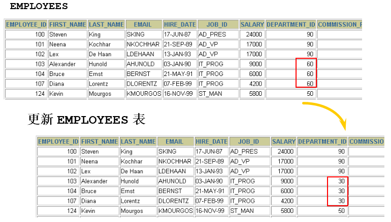
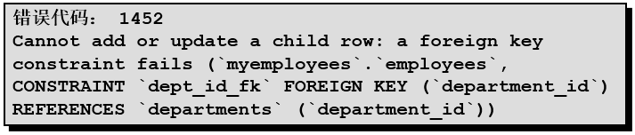

# 2 更新数据

返回章节：[第十一章_数据处理之增删改](./README.md)

## 本节导读

这一节学习 DML 中第二个重要操作：**更新既有数据**。

`UPDATE` 的语法本身不难，核心就是：

```sql
UPDATE 表名
SET 字段 = 新值
WHERE 条件;
```

但是，`UPDATE` 的风险通常比 `INSERT` 更高。

因为 `INSERT` 是新增资料，出错时通常比较容易发现；
而 `UPDATE` 是修改已经存在的资料，一旦条件写错，可能会把大量正确资料改坏。

例如：

```sql
UPDATE employees
SET salary = 10000
WHERE employee_id = 100;
```

这是更新指定员工。

但是如果少写 `WHERE`：

```sql
UPDATE employees
SET salary = 10000;
```

这就可能把整张员工表的薪资都改成 `10000`。

所以本节重点不是只记住 `UPDATE` 的语法，而是要建立一个安全更新资料的思路：

> 先确认要改哪些字段。
> 再确认要改哪些资料。
> 最后确认新值是否符合约束。
> 执行前最好先用 `SELECT` 检查范围。

---

## 学习目标

学完本节后，应能掌握：

1. `UPDATE ... SET ... WHERE ...` 的基本写法。
2. 如何更新单个字段。
3. 如何一次更新多个字段。
4. 为什么 `WHERE` 是 `UPDATE` 中最关键的安全条件。
5. 省略 `WHERE` 会造成什么结果。
6. 如何在更新前先用 `SELECT` 检查影响范围。
7. 如何使用表达式更新字段值。
8. 如何处理 `NULL`、`DEFAULT`。
9. 为什么更新时可能发生数据完整性错误。
10. 如何使用事务降低误更新风险。

---

## 关键字

* 主题：更新数据、修改数据、`UPDATE`、`SET`、`WHERE`
* 英文：update, set, where clause, data integrity, transaction
* 常见搜寻：

  * MySQL 怎么更新数据
  * MySQL UPDATE WHERE
  * MySQL UPDATE 多个字段
  * MySQL UPDATE 忘记 WHERE
  * MySQL UPDATE 外键约束失败
  * MySQL UPDATE 回滚
* 易混淆：

  * 更新单笔资料 vs 更新多笔资料
  * 带 `WHERE` 更新 vs 不带 `WHERE` 更新
  * 修改字段值 vs 修改主键值
  * 语法错误 vs 约束错误
  * `Rows matched` vs `Changed`

---

## 建议回查情境

遇到以下情况时，可以回来看本节：

* 想修改某一笔资料，但不确定 `UPDATE` 怎么写。
* 想一次修改多个字段。
* 想批量修改符合条件的资料。
* 不确定 `WHERE` 条件会影响几笔资料。
* 想知道为什么 `UPDATE` 执行成功但 `Changed: 0`。
* 更新资料时报外键约束错误。
* 想知道误更新后是否可以回滚。
* 想知道如何让更新操作更安全。

---

## 30 秒复习入口

* `UPDATE` 用来修改表中已经存在的数据。
* 基本语法是：

```sql
UPDATE 表名
SET 字段1 = 值1, 字段2 = 值2
WHERE 条件;
```

* `SET` 决定要改哪些字段。
* `WHERE` 决定要改哪些行。
* 如果省略 `WHERE`，通常会更新整张表。
* 更新前最好先写一条 `SELECT`，确认 `WHERE` 找到的资料是否正确。
* 更新失败不一定是语法错，也可能是违反主键、唯一约束、外键约束或非空约束。
* 如果担心误更新，建议配合事务使用 `START TRANSACTION`、`COMMIT`、`ROLLBACK`。

---

## 速查区

### 1. 更新单个字段

```sql
UPDATE 表名
SET 字段 = 新值
WHERE 条件;
```

### 2. 更新多个字段

```sql
UPDATE 表名
SET 字段1 = 新值1,
    字段2 = 新值2
WHERE 条件;
```

### 3. 使用表达式更新

```sql
UPDATE employees
SET salary = salary * 1.1
WHERE department_id = 90;
```

### 4. 更新为 `NULL`

```sql
UPDATE employees
SET manager_id = NULL
WHERE employee_id = 113;
```

前提是该字段允许为 `NULL`。

### 5. 更新为默认值

```sql
UPDATE employees
SET commission_pct = DEFAULT
WHERE employee_id = 113;
```

### 6. 更新前先检查范围

```sql
SELECT *
FROM employees
WHERE employee_id = 113;
```

确认资料正确后，再执行：

```sql
UPDATE employees
SET department_id = 70
WHERE employee_id = 113;
```

### 7. 使用事务保护更新

```sql
START TRANSACTION;

UPDATE employees
SET department_id = 70
WHERE employee_id = 113;

SELECT *
FROM employees
WHERE employee_id = 113;

COMMIT;
-- 或 ROLLBACK;
```

---

## 2.1 实际问题



假设现在有一张员工表 `employees`，里面有员工资料。

现在我们想把员工 `113` 的部门编号改成 `70`。

原本资料可能是：

| employee_id | last_name | department_id |
| ----------- | --------- | ------------- |
| 113         | Popp      | 110           |

希望更新后变成：

| employee_id | last_name | department_id |
| ----------- | --------- | ------------- |
| 113         | Popp      | 70            |

这时就需要使用 `UPDATE`。

```sql
UPDATE employees
SET department_id = 70
WHERE employee_id = 113;
```

这条 SQL 的意思是：

> 找到 `employee_id = 113` 的员工，
> 把他的 `department_id` 改成 `70`。

---

## 2.2 `UPDATE` 的核心概念

`UPDATE` 的作用是：

> 修改表中已经存在的一行或多行数据。

它主要由三个部分组成：

```sql
UPDATE 表名
SET 修改内容
WHERE 修改范围;
```

可以理解成：

| 部分            | 作用            |
| ------------- | ------------- |
| `UPDATE 表名`   | 指定要修改哪一张表     |
| `SET 字段 = 新值` | 指定要把哪些字段改成什么值 |
| `WHERE 条件`    | 指定要修改哪些记录     |

其中最危险、也最重要的是：

```sql
WHERE 条件
```

因为它决定这次更新会影响多少笔资料。

---

## 2.3 基本语法

### 标准语法

```sql
UPDATE table_name
SET column1 = value1,
    column2 = value2,
    ...
WHERE condition;
```

中文理解：

```sql
UPDATE 表名
SET 字段1 = 新值1,
    字段2 = 新值2
WHERE 条件;
```

重点：

* `UPDATE` 后面写要修改的表。
* `SET` 后面写要修改的字段和值。
* 可以一次修改一个字段，也可以一次修改多个字段。
* `WHERE` 用来限制更新范围。
* 如果没有 `WHERE`，通常会更新表中所有记录。

---

## 2.4 更新单个字段

### 示例

```sql
UPDATE employees
SET department_id = 70
WHERE employee_id = 113;
```

这条 SQL 可以拆成三部分理解：

| SQL 片段                    | 意思                        |
| ------------------------- | ------------------------- |
| `UPDATE employees`        | 修改 `employees` 表          |
| `SET department_id = 70`  | 把 `department_id` 改成 `70` |
| `WHERE employee_id = 113` | 只修改员工编号为 `113` 的资料        |

---

### 执行前建议先查一次

更新前可以先执行：

```sql
SELECT employee_id, last_name, department_id
FROM employees
WHERE employee_id = 113;
```

确认查出来的确实是要修改的员工，再执行：

```sql
UPDATE employees
SET department_id = 70
WHERE employee_id = 113;
```

这是实际开发中非常重要的习惯。

---

## 2.5 更新多个字段

`UPDATE` 可以一次修改多个字段。

### 示例

```sql
UPDATE employees
SET department_id = 70,
    job_id = 'SA_REP',
    salary = 8000
WHERE employee_id = 113;
```

这表示：

> 找到员工编号为 `113` 的员工，
> 同时修改他的部门、职位和薪资。

对应关系如下：

| 字段            | 新值       |
| ------------- | -------- |
| department_id | 70       |
| job_id        | 'SA_REP' |
| salary        | 8000     |

---

### 注意逗号位置

多个字段之间要用逗号分隔：

```sql
SET department_id = 70,
    job_id = 'SA_REP',
    salary = 8000
```

最后一个字段后面不要再加逗号。

错误示例：

```sql
UPDATE employees
SET department_id = 70,
    job_id = 'SA_REP',
    salary = 8000,
WHERE employee_id = 113;
```

问题是：

```text
salary = 8000 后面多了一个逗号
```

---

## 2.6 使用表达式更新字段

`UPDATE` 不只能把字段改成固定值，也可以根据原本的值进行计算。

### 示例一：薪资增加 10%

```sql
UPDATE employees
SET salary = salary * 1.1
WHERE department_id = 90;
```

这表示：

> 把部门编号为 `90` 的所有员工薪资增加 10%。

如果某员工原本薪资是 `10000`，更新后就是：

```text
10000 * 1.1 = 11000
```

---

### 示例二：年龄加 1

```sql
UPDATE users
SET age = age + 1
WHERE id = 1;
```

这表示：

> 把 `id = 1` 的用户年龄加 1。

---

### 示例三：字符串拼接

假设有一张商品表 `products`：

```sql
UPDATE products
SET product_name = CONCAT('[停售] ', product_name)
WHERE status = 'inactive';
```

这表示：

> 把所有已停用商品的名称前面加上 `[停售]`。

---

### 小结

| 写法                          | 意思         |
| --------------------------- | ---------- |
| `salary = 8000`             | 改成固定值      |
| `salary = salary * 1.1`     | 根据原本值计算后更新 |
| `age = age + 1`             | 在原本值上增加    |
| `name = CONCAT('前缀', name)` | 根据原本字符串加工  |

---

## 2.7 使用 `WHERE` 更新指定记录

`WHERE` 是 `UPDATE` 中最重要的安全条件。

### 示例一：根据主键更新

```sql
UPDATE employees
SET department_id = 70
WHERE employee_id = 113;
```

这种写法通常最安全，因为 `employee_id` 通常是主键或唯一值。

---

### 示例二：根据部门批量更新

```sql
UPDATE employees
SET commission_pct = 0.1
WHERE department_id = 80;
```

这表示：

> 把部门编号为 `80` 的所有员工佣金比例改成 `0.1`。

这不是更新一笔，而是更新多笔。

所以执行前应该先确认：

```sql
SELECT employee_id, last_name, commission_pct
FROM employees
WHERE department_id = 80;
```

---

### 示例三：使用多个条件

```sql
UPDATE employees
SET salary = salary * 1.05
WHERE department_id = 80
  AND job_id = 'SA_REP';
```

这表示：

> 只帮 `80` 部门中职位为 `SA_REP` 的员工加薪 5%。

---

## 2.8 如果省略 `WHERE` 会怎样？

这是 `UPDATE` 最容易出事故的地方。

### 示例

```sql
UPDATE copy_emp
SET department_id = 110;
```

这条 SQL 没有 `WHERE`。

意思是：

> 把 `copy_emp` 表中所有员工的 `department_id` 都改成 `110`。

也就是说，只要表中有 1000 笔资料，就可能改掉 1000 笔。

---

### 对比

有 `WHERE`：

```sql
UPDATE copy_emp
SET department_id = 110
WHERE employee_id = 113;
```

只更新：

```text
employee_id = 113 的资料
```

没有 `WHERE`：

```sql
UPDATE copy_emp
SET department_id = 110;
```

更新：

```text
整张 copy_emp 表
```

---

### 重要提醒

不带 `WHERE` 的 `UPDATE` 不是语法错误。

它是合法 SQL。

危险之处在于：

> 它会正常执行，并且可能把整张表都改掉。

所以执行 `UPDATE` 前，最好先问自己：

1. 我是不是故意要更新整张表？
2. 如果不是，我的 `WHERE` 条件在哪里？
3. 这个 `WHERE` 条件会不会选到太多资料？
4. 有没有先用 `SELECT` 检查过？

---

## 2.9 更新前先用 `SELECT` 检查范围

这是写 `UPDATE` 时最重要的实务习惯之一。

### 第一步：先写 `SELECT`

```sql
SELECT employee_id, last_name, department_id
FROM employees
WHERE department_id = 110;
```

确认查出来的资料确实是你要修改的资料。

---

### 第二步：再改成 `UPDATE`

```sql
UPDATE employees
SET department_id = 70
WHERE department_id = 110;
```

---

### 为什么这样比较安全？

因为 `SELECT` 不会修改资料。

你可以先确认：

* 条件有没有写错；
* 会影响几笔资料；
* 有没有查到不该改的资料；
* 条件是否太宽；
* 条件是否太窄。

---

### 推荐写法流程

```sql
-- 1. 先确认影响范围
SELECT *
FROM employees
WHERE employee_id = 113;

-- 2. 确认无误后再更新
UPDATE employees
SET department_id = 70
WHERE employee_id = 113;

-- 3. 更新后再次确认
SELECT *
FROM employees
WHERE employee_id = 113;
```

---

## 2.10 更新成 `NULL` 或 `DEFAULT`

### 2.10.1 更新成 `NULL`

```sql
UPDATE employees
SET manager_id = NULL
WHERE employee_id = 113;
```

这表示：

> 把员工 `113` 的直属主管改成空值。

前提是 `manager_id` 字段允许 `NULL`。

如果字段定义为：

```sql
manager_id INT NOT NULL
```

那么更新成 `NULL` 会失败。

---

### 2.10.2 更新成默认值

```sql
UPDATE employees
SET commission_pct = DEFAULT
WHERE employee_id = 113;
```

这表示：

> 把 `commission_pct` 改回表结构定义中的默认值。

例如字段定义为：

```sql
commission_pct DECIMAL(4,2) DEFAULT 0.00
```

执行后就会变成：

```text
0.00
```

---

### 小结

| 写法                 | 意思      |
| ------------------ | ------- |
| `SET 字段 = NULL`    | 明确改成空值  |
| `SET 字段 = DEFAULT` | 改成字段默认值 |
| `SET 字段 = 字段 + 1`  | 根据原本值计算 |
| `SET 字段 = 固定值`     | 改成指定值   |

---

## 2.11 `Rows matched` 和 `Changed` 的差异

执行 `UPDATE` 后，可能会看到类似结果：

```text
Query OK, 0 rows affected
Rows matched: 1  Changed: 0  Warnings: 0
```

这并不一定代表没有找到资料。

它的意思可能是：

| 信息                | 说明                    |
| ----------------- | --------------------- |
| `Rows matched: 1` | `WHERE` 条件找到了 1 笔资料   |
| `Changed: 0`      | 但是更新后的值和原本一样，所以实际没有改变 |
| `Warnings: 0`     | 没有警告                  |

---

### 示例

假设员工 `113` 的 `department_id` 本来就是 `70`。

你执行：

```sql
UPDATE employees
SET department_id = 70
WHERE employee_id = 113;
```

结果可能是：

```text
Rows matched: 1  Changed: 0
```

因为资料有找到，但新值和旧值一样，所以没有实际变化。

---

### 判断方式

| 情况                            | 可能原因             |
| ----------------------------- | ---------------- |
| `Rows matched: 0`             | `WHERE` 条件没有找到资料 |
| `Rows matched: 1, Changed: 0` | 有找到资料，但值没有变化     |
| `Rows matched: 1, Changed: 1` | 有找到资料，而且成功修改     |
| `Warnings > 0`                | 可能发生类型转换、截断或其他警告 |

---

## 2.12 更新中的数据完整性错误

更新失败不一定是语法错误，也可能是违反了数据完整性约束。

例如：

```sql
UPDATE employees
SET department_id = 55
WHERE department_id = 110;
```



这条 SQL 的语法本身可能没有问题。

但是如果 `employees.department_id` 是外键，引用 `departments.department_id`，而 `departments` 表中不存在 `55` 号部门，那么更新就会失败。

---

### 为什么会失败？

因为外键约束要求：

> 子表中的外键值，必须能在父表中找到对应资料。

例如：

```text
employees.department_id  →  departments.department_id
```

如果 `departments` 表中没有：

```text
department_id = 55
```

那么员工表就不能把 `department_id` 更新成 `55`。

否则资料会变成：

```text
员工属于 55 号部门，但部门表中根本没有 55 号部门。
```

这会破坏资料一致性。

---

### 如何检查？

更新前可以先查父表：

```sql
SELECT *
FROM departments
WHERE department_id = 55;
```

如果查不到资料，就不要直接更新员工表。

可以选择：

1. 先新增 `55` 号部门；
2. 改成一个已经存在的部门编号；
3. 检查业务上是不是根本不应该有这个部门。

---

## 2.13 根据子查询更新数据

有时候新值不是固定写死的，而是从另一张表查出来的。

### 示例

假设我们想把员工 `113` 的部门改成和员工 `100` 一样。

可以写：

```sql
UPDATE employees
SET department_id = (
    SELECT department_id
    FROM employees
    WHERE employee_id = 100
)
WHERE employee_id = 113;
```

意思是：

> 先查出员工 `100` 的部门编号，
> 再把员工 `113` 的部门编号改成同一个值。

---

### 注意事项

子查询更新时要特别注意：

* 子查询最好只返回一个值；
* 如果子查询返回多行，可能会报错；
* 子查询结果的类型要和被更新字段匹配；
* 仍然要写好外层 `WHERE`，避免更新过多资料。

---

## 2.14 根据另一张表更新数据

实际开发中，也常见根据另一张表的资料来更新当前表。

### 示例

假设有两张表：

```text
employees
departments
```

想把员工表中的部门名称更新成部门表中的部门名称，可以使用 `JOIN` 更新。

```sql
UPDATE employees e
JOIN departments d
  ON e.department_id = d.department_id
SET e.department_name = d.department_name
WHERE e.department_id = 90;
```

这表示：

> 找出员工表和部门表中部门编号相同的资料，
> 把员工表中的 `department_name` 改成部门表中的 `department_name`。

---

### 注意事项

多表更新虽然很方便，但风险更高。

执行前建议先写成 `SELECT` 检查：

```sql
SELECT e.employee_id,
       e.department_id,
       e.department_name AS old_department_name,
       d.department_name AS new_department_name
FROM employees e
JOIN departments d
  ON e.department_id = d.department_id
WHERE e.department_id = 90;
```

确认结果正确后，再改成：

```sql
UPDATE employees e
JOIN departments d
  ON e.department_id = d.department_id
SET e.department_name = d.department_name
WHERE e.department_id = 90;
```

---

## 2.15 使用 `ORDER BY` 和 `LIMIT` 控制更新范围

MySQL 的单表 `UPDATE` 可以搭配 `ORDER BY` 和 `LIMIT`。

### 示例

```sql
UPDATE employees
SET salary = salary * 1.1
WHERE department_id = 80
ORDER BY salary ASC
LIMIT 3;
```

这表示：

> 在 `80` 部门员工中，
> 按照薪资由低到高排序，
> 只更新前 3 笔资料。

---

### 注意事项

这种写法要谨慎使用。

因为如果排序条件不稳定，或者没有明确的唯一排序依据，实际更新哪几笔资料可能不够直观。

比较推荐加上明确排序字段，例如：

```sql
ORDER BY salary ASC, employee_id ASC
```

这样当薪资相同时，还可以用员工编号决定顺序。

---

### 小结

| 写法         | 作用           |
| ---------- | ------------ |
| `WHERE`    | 限制哪些资料有资格被更新 |
| `ORDER BY` | 决定更新顺序       |
| `LIMIT`    | 限制最多更新几笔     |

---

## 2.16 使用事务降低误更新风险

如果你担心更新错资料，可以使用事务。

### 推荐流程

```sql
START TRANSACTION;

UPDATE employees
SET department_id = 70
WHERE employee_id = 113;

SELECT employee_id, last_name, department_id
FROM employees
WHERE employee_id = 113;

COMMIT;
```

如果检查后发现更新正确，就执行：

```sql
COMMIT;
```

如果发现更新错了，就执行：

```sql
ROLLBACK;
```

---

### 示例：发现更新错了

```sql
START TRANSACTION;

UPDATE employees
SET department_id = 70
WHERE department_id = 110;

SELECT employee_id, last_name, department_id
FROM employees
WHERE department_id = 70;

ROLLBACK;
```

`ROLLBACK` 表示撤销这次交易中尚未提交的修改。

---

### `autocommit` 观念

MySQL 默认通常是自动提交模式。

也就是说，如果 `autocommit = 1`，每条 DML 执行后就会自动提交。

如果希望自己控制提交或回滚，可以使用：

```sql
START TRANSACTION;
```

或者：

```sql
SET autocommit = 0;
```

但实际练习时，更推荐先使用：

```sql
START TRANSACTION;
```

因为它语意清楚：

> 从这里开始，我要手动控制这一组操作。

---

## 2.17 安全更新模式：`sql_safe_updates`

MySQL 可以开启安全更新模式，降低误更新风险。

```sql
SET sql_safe_updates = 1;
```

开启后，如果 `UPDATE` 或 `DELETE` 没有使用合适的 key 条件，或没有限制范围，可能会被 MySQL 拒绝执行。

例如：

```sql
UPDATE employees
SET department_id = 110;
```

这种没有 `WHERE` 的更新，在安全模式下可能会被阻止。

---

### 关闭安全更新模式

```sql
SET sql_safe_updates = 0;
```

不过不建议为了方便就长期关闭。

正确做法应该是：

* 写清楚 `WHERE` 条件；
* 尽量使用主键、唯一键或索引字段限制范围；
* 执行前先 `SELECT` 检查；
* 重要更新配合事务。

---

## 2.18 常见错误整理

| 错误情况         | 可能原因                     | 修正方式           |
| ------------ | ------------------------ | -------------- |
| 忘记写 `WHERE`  | 更新范围没有限制                 | 补上明确条件         |
| 更新太多资料       | `WHERE` 条件太宽             | 先用 `SELECT` 检查 |
| 没有更新任何资料     | `WHERE` 条件找不到资料          | 检查条件是否正确       |
| `Changed: 0` | 新值和旧值一样                  | 检查原本资料         |
| 外键约束错误       | 更新成父表不存在的值               | 先确认父表资料存在      |
| 非空约束错误       | 把 `NOT NULL` 字段改成 `NULL` | 改成合法值          |
| 类型错误         | 把字符串写入数字字段等              | 检查字段类型         |
| 多字段更新语法错误    | 字段之间少逗号或多逗号              | 检查 `SET` 写法    |
| 子查询返回多行      | `SET 字段 = (子查询)` 需要单值    | 限制子查询结果        |
| 误更新后无法回滚     | 已经自动提交                   | 重要更新前使用事务      |

---

## 2.19 写 `UPDATE` 时的建议习惯

### 建议一：先 `SELECT`，再 `UPDATE`

推荐流程：

```sql
SELECT *
FROM employees
WHERE employee_id = 113;
```

确认无误后：

```sql
UPDATE employees
SET department_id = 70
WHERE employee_id = 113;
```

---

### 建议二：`WHERE` 尽量使用主键或唯一条件

推荐：

```sql
UPDATE employees
SET department_id = 70
WHERE employee_id = 113;
```

风险较高：

```sql
UPDATE employees
SET department_id = 70
WHERE last_name = 'Chen';
```

因为可能有很多人都叫 `Chen`。

---

### 建议三：批量更新前先确认数量

```sql
SELECT COUNT(*)
FROM employees
WHERE department_id = 110;
```

确认数量合理后，再执行：

```sql
UPDATE employees
SET department_id = 70
WHERE department_id = 110;
```

---

### 建议四：重要更新使用事务

```sql
START TRANSACTION;

UPDATE employees
SET department_id = 70
WHERE department_id = 110;

SELECT COUNT(*)
FROM employees
WHERE department_id = 70;

COMMIT;
-- 或 ROLLBACK;
```

---

### 建议五：不要随便更新主键

虽然技术上可以更新主键，但通常不建议随便这样做：

```sql
UPDATE employees
SET employee_id = 999
WHERE employee_id = 113;
```

原因：

* 可能违反主键唯一性；
* 可能影响其他表的外键关联；
* 可能让历史资料或业务流程混乱；
* 维护成本高。

除非是资料修复、迁移或明确业务需求，否则不要随意修改主键。

---

## 2.20 一句话对比

| 写法                                             | 作用          | 风险  |
| ---------------------------------------------- | ----------- | --- |
| `UPDATE 表 SET 字段=值 WHERE 主键=值`                 | 更新单笔资料      | 较低  |
| `UPDATE 表 SET 字段=值 WHERE 条件`                   | 更新符合条件的多笔资料 | 中等  |
| `UPDATE 表 SET 字段=值`                            | 更新整张表       | 高   |
| `UPDATE 表 SET 字段=字段+1 WHERE 条件`                | 根据原值计算后更新   | 中等  |
| `UPDATE 表 JOIN 其他表 SET ... WHERE ...`          | 根据其他表批量更新   | 较高  |
| `START TRANSACTION + UPDATE + COMMIT/ROLLBACK` | 可检查后提交或回滚   | 较安全 |

---

## 2.21 本节重点总结

本节核心是掌握 `UPDATE` 的三个重点：

### 重点一：`SET` 决定改什么

```sql
UPDATE employees
SET department_id = 70
WHERE employee_id = 113;
```

这里改的是：

```text
department_id
```

---

### 重点二：`WHERE` 决定改谁

```sql
WHERE employee_id = 113
```

这里表示只改：

```text
employee_id = 113 的员工
```

如果省略 `WHERE`：

```sql
UPDATE employees
SET department_id = 70;
```

就可能改掉整张表。

---

### 重点三：更新前要确认，重要更新要用事务

推荐流程：

```sql
SELECT *
FROM employees
WHERE employee_id = 113;

START TRANSACTION;

UPDATE employees
SET department_id = 70
WHERE employee_id = 113;

SELECT *
FROM employees
WHERE employee_id = 113;

COMMIT;
```

如果发现错误：

```sql
ROLLBACK;
```

---

## 自测问题

1. `UPDATE` 的基本语法是什么？
2. `SET` 的作用是什么？
3. `WHERE` 的作用是什么？
4. 如果省略 `WHERE`，会发生什么？
5. 为什么更新前建议先写 `SELECT`？
6. 如何一次更新多个字段？
7. `salary = salary * 1.1` 这种写法是什么意思？
8. `Rows matched: 1, Changed: 0` 代表什么？
9. 为什么把 `department_id` 改成不存在的部门编号可能会失败？
10. `NULL` 和 `DEFAULT` 在更新时有什么差异？
11. 为什么不建议随便更新主键？
12. 事务中的 `COMMIT` 和 `ROLLBACK` 分别是什么意思？
13. `sql_safe_updates` 可以降低哪一种风险？

---

## 自测答案提示

1. `UPDATE 表名 SET 字段 = 新值 WHERE 条件;`
2. `SET` 用来指定要修改哪些字段，以及改成什么值。
3. `WHERE` 用来限制哪些记录会被更新。
4. 通常会更新整张表。
5. 因为 `SELECT` 可以先确认条件会影响哪些资料，避免误更新。
6. 在 `SET` 后面用逗号分隔多个字段，例如 `SET a=1, b=2`。
7. 表示根据原本薪资计算，把薪资增加 10%。
8. 代表有找到符合条件的资料，但新值和旧值一样，所以没有实际修改。
9. 因为可能违反外键约束，子表不能引用父表不存在的资料。
10. `NULL` 是明确改成空值；`DEFAULT` 是改成字段定义中的默认值。
11. 因为主键通常被其他资料引用，随便修改可能破坏关联关系。
12. `COMMIT` 是提交修改；`ROLLBACK` 是撤销尚未提交的修改。
13. 可以降低没有明确条件就大量更新或删除资料的风险。

---