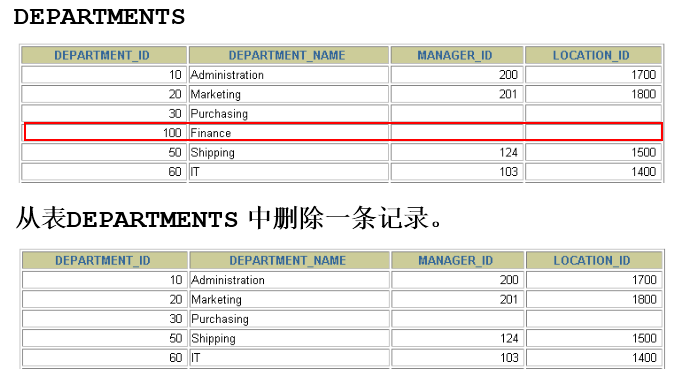
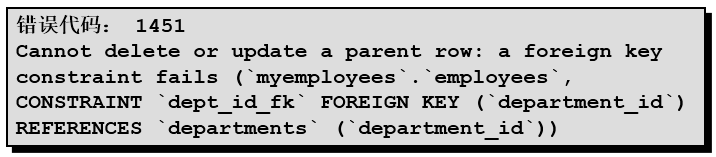

# 3 删除数据

返回章节：[第十一章_数据处理之增删改](./README.md)

## 本节导读

这一节学习 DML 中第三个重要操作：**删除既有数据**。

`DELETE` 的语法本身很简单：

```sql
DELETE FROM 表名
WHERE 条件;
```

但是，`DELETE` 的危险性通常比 `INSERT` 更高，甚至不输给 `UPDATE`。

因为 `INSERT` 是新增数据，新增错了通常还比较容易定位；  
而 `DELETE` 是把既有数据移除，一旦条件写错，可能会直接删除大量正确资料。

例如：

```sql
DELETE FROM employees
WHERE employee_id = 113;
```

这是删除指定员工。

但是如果少写 `WHERE`：

```sql
DELETE FROM employees;
```

这就可能把整张员工表的数据全部删掉。

所以本节重点不是只背 `DELETE FROM ... WHERE ...`，而是要建立一个安全删除数据的判断流程：

> 我要删除的是哪几笔数据？  
> 是否已经先用 `SELECT` 确认范围？  
> 这些数据有没有被其他表通过外键引用？  
> 这次应该用 `DELETE`、`TRUNCATE`，还是 `DROP TABLE`？  
> 如果删错了，是否还有机会通过事务回滚？

---

## 学习目标

学完本节后，应能掌握：

1. `DELETE FROM ... WHERE ...` 的基本写法。
2. 如何删除指定记录。
3. 省略 `WHERE` 会造成什么结果。
4. 为什么删除前一定要先用 `SELECT` 检查影响范围。
5. 删除数据时为什么可能发生外键约束错误。
6. `DELETE`、`TRUNCATE TABLE`、`DROP TABLE` 的差异。
7. 如何使用事务降低误删除风险。
8. 如何使用 `ORDER BY`、`LIMIT` 控制单表删除范围。
9. 如何理解真实删除与逻辑删除。
10. 删除数据时的常见错误与安全习惯。

---

## 关键字

- 主题：删除数据、`DELETE FROM`、`WHERE`、外键约束、事务、清空表、删除表
- 英文：delete from, where clause, truncate table, drop table, foreign key, transaction, rollback
- 常见搜寻：
  - MySQL 怎么删除数据
  - MySQL DELETE WHERE
  - MySQL DELETE 忘记 WHERE
  - MySQL 删除全部资料
  - MySQL DELETE 外键约束失败
  - MySQL DELETE 和 TRUNCATE 差异
  - MySQL DELETE 可以回滚吗
- 易混淆：
  - 删除资料 vs 删除表
  - `DELETE` vs `TRUNCATE`
  - `DELETE` vs `DROP TABLE`
  - 物理删除 vs 逻辑删除
  - 带 `WHERE` 删除 vs 不带 `WHERE` 删除
  - 外键 `RESTRICT` vs `CASCADE` vs `SET NULL`

---

## 建议回查情境

遇到以下情况时，可以回来看本节：

- 想删除某一笔资料，但不确定 `DELETE` 怎么写。
- 想批量删除符合条件的数据。
- 不确定 `WHERE` 条件会影响几笔资料。
- 想知道省略 `WHERE` 会发生什么。
- 删除失败时，怀疑和外键约束有关。
- 想清空整张表，但不确定该用 `DELETE` 还是 `TRUNCATE`。
- 想删除整张表，但不确定 `DROP TABLE` 的影响。
- 想知道误删除后是否可以回滚。
- 想建立比较安全的删除流程。

---

## 30 秒复习入口

- `DELETE FROM` 用来删除表中的数据，不会删除表结构。
- 基本语法是：

```sql
DELETE FROM 表名
WHERE 条件;
```

- `WHERE` 决定要删除哪些资料。
- 如果省略 `WHERE`，通常会删除整张表中的所有记录。
- 删除前最好先用相同条件写 `SELECT`，确认范围正确后再删除。
- 删除失败不一定是语法错，也可能是资料被其他表通过外键引用。
- `DELETE` 是 DML，通常可以配合事务控制。
- `TRUNCATE TABLE` 是 DDL，常用于快速清空整张表。
- `DROP TABLE` 是删除整张表，表结构和数据都会消失。

---

## 速查区

### 1. 删除指定资料

```sql
DELETE FROM 表名
WHERE 条件;
```

示例：

```sql
DELETE FROM employees
WHERE employee_id = 113;
```

---

### 2. 删除多笔符合条件的数据

```sql
DELETE FROM employees
WHERE department_id = 90;
```

---

### 3. 删除整张表中的所有资料

```sql
DELETE FROM employees;
```

> 表结构还在，但表中的资料会被删除。

---

### 4. 清空整张表

```sql
TRUNCATE TABLE employees;
```

> 通常比 `DELETE FROM employees` 更快，但它不是普通 DML，不适合当作一般可回滚删除来理解。

---

### 5. 删除整张表

```sql
DROP TABLE employees;
```

> 表结构和资料都会被删除。

---

### 6. 删除前先检查范围

```sql
SELECT *
FROM employees
WHERE employee_id = 113;
```

确认无误后再执行：

```sql
DELETE FROM employees
WHERE employee_id = 113;
```

---

### 7. 使用事务保护删除

```sql
START TRANSACTION;

DELETE FROM employees
WHERE employee_id = 113;

SELECT *
FROM employees
WHERE employee_id = 113;

ROLLBACK;
-- 或 COMMIT;
```

---

## 3.1 实际问题



假设现在有一张部门表 `departments`，里面有一笔部门资料：

| department_id | department_name |
|---|---|
| 70 | Pub |

如果这个部门已经不需要了，我们想把它从 `departments` 表中删除，就可以使用 `DELETE`：

```sql
DELETE FROM departments
WHERE department_id = 70;
```

这条 SQL 的意思是：

> 从 `departments` 表中，  
> 删除 `department_id = 70` 的那一笔资料。

---

## 3.2 `DELETE` 的核心概念

`DELETE` 的作用是：

> 从一张已经存在的数据表中删除一行或多行记录。

基本结构可以理解成：

```sql
DELETE FROM 表名
WHERE 删除范围;
```

其中最重要的是：

```sql
WHERE 删除范围
```

因为它决定这次删除会影响多少笔资料。

---

### 三个核心问题

写 `DELETE` 前，应该先问自己三个问题：

| 问题 | 意义 |
|---|---|
| 我要删哪张表？ | `DELETE FROM 表名` |
| 我要删哪些资料？ | `WHERE 条件` |
| 这些资料能不能删？ | 是否被外键引用、是否符合业务规则 |

如果只知道第一个问题，不知道第二和第三个问题，就不要直接执行删除。

---

## 3.3 基本语法


### 标准语法

```sql
DELETE FROM table_name
[WHERE condition];
```

中文理解：

```sql
DELETE FROM 表名
WHERE 条件;
```

说明：

| 语法部分 | 作用 |
|---|---|
| `DELETE FROM` | 表示要删除资料 |
| `table_name` | 指定要从哪张表删除 |
| `WHERE condition` | 指定要删除哪些资料 |

其中 `WHERE` 是可选的。

但是注意：

> 语法上可选，不代表实务上可以随便省略。

---

## 3.4 删除指定记录

### 示例

```sql
DELETE FROM departments
WHERE department_name = 'Finance';
```

这条 SQL 的意思是：

> 删除部门名称为 `Finance` 的部门资料。

---

### 拆解理解

| SQL 片段 | 意思 |
|---|---|
| `DELETE FROM departments` | 从 `departments` 表删除资料 |
| `WHERE department_name = 'Finance'` | 只删除部门名称为 `Finance` 的资料 |

---

### 执行前建议先查一次

删除前可以先执行：

```sql
SELECT *
FROM departments
WHERE department_name = 'Finance';
```

确认查出来的资料确实是要删除的资料，再执行：

```sql
DELETE FROM departments
WHERE department_name = 'Finance';
```

这是非常重要的习惯。

---

## 3.5 根据主键删除资料

如果表中有主键，最推荐使用主键删除指定资料。

例如：

```sql
DELETE FROM employees
WHERE employee_id = 113;
```

这种写法通常比较安全，因为 `employee_id` 通常是唯一的。

---

### 为什么主键条件比较安全？

因为主键具有唯一性。

也就是说：

```sql
WHERE employee_id = 113
```

通常只会找到一笔资料。

但是如果写成：

```sql
WHERE last_name = 'Chen'
```

就可能找到多笔资料，因为很多人都可能姓 `Chen`。

---

### 对比

| 删除条件 | 风险 |
|---|---|
| `WHERE employee_id = 113` | 较低，通常只删除一笔 |
| `WHERE email = 'xxx@example.com'` | 较低，前提是 email 唯一 |
| `WHERE department_id = 90` | 中等，可能删除多笔 |
| `WHERE last_name = 'Chen'` | 较高，可能误删同名资料 |
| 没有 `WHERE` | 极高，可能删除整张表资料 |

---

## 3.6 删除多笔符合条件的数据

`DELETE` 不一定只删除一笔资料。

如果 `WHERE` 条件符合多笔资料，就会删除多笔。

### 示例

```sql
DELETE FROM employees
WHERE department_id = 90;
```

这表示：

> 删除所有 `department_id = 90` 的员工资料。

---

### 删除前一定要先确认数量

```sql
SELECT COUNT(*)
FROM employees
WHERE department_id = 90;
```

如果结果是：

```text
COUNT(*)
---------
3
```

代表这次删除会影响 3 笔资料。

也可以先查看明细：

```sql
SELECT employee_id, last_name, department_id
FROM employees
WHERE department_id = 90;
```

确认无误后再执行：

```sql
DELETE FROM employees
WHERE department_id = 90;
```

---

## 3.7 如果省略 `WHERE` 会怎样？

这是 `DELETE` 最危险的地方。

### 示例

```sql
DELETE FROM copy_emp;
```

这条 SQL 没有 `WHERE`。

意思是：

> 删除 `copy_emp` 表中的所有资料。

注意：

这不是语法错误。

它是合法 SQL。

危险之处在于：

> 它会正常执行，并且可能把整张表资料全部删除。

---

### 对比

有 `WHERE`：

```sql
DELETE FROM copy_emp
WHERE employee_id = 113;
```

只删除：

```text
employee_id = 113 的资料
```

没有 `WHERE`：

```sql
DELETE FROM copy_emp;
```

删除：

```text
copy_emp 表中的全部资料
```

---

### 重要提醒

执行 `DELETE` 前，最好先问自己：

1. 我是不是故意要删除整张表的资料？
2. 如果不是，我的 `WHERE` 条件在哪里？
3. 这个 `WHERE` 条件会不会选到太多资料？
4. 有没有先用 `SELECT` 检查过？
5. 有没有开启事务，方便必要时回滚？

---

## 3.8 删除前先用 `SELECT` 检查范围

这是写 `DELETE` 时最重要的安全习惯。

### 第一步：先写 `SELECT`

```sql
SELECT *
FROM employees
WHERE employee_id = 113;
```

确认查出来的资料确实是要删除的资料。

---

### 第二步：再改成 `DELETE`

```sql
DELETE FROM employees
WHERE employee_id = 113;
```

---

### 为什么这样比较安全？

因为 `SELECT` 不会修改资料。

你可以先确认：

- 条件有没有写错；
- 会影响几笔资料；
- 有没有查到不该删的资料；
- 条件是否太宽；
- 条件是否太窄。

---

### 推荐流程

```sql
-- 1. 先确认删除范围
SELECT *
FROM employees
WHERE employee_id = 113;

-- 2. 确认无误后再删除
DELETE FROM employees
WHERE employee_id = 113;

-- 3. 删除后再次确认
SELECT *
FROM employees
WHERE employee_id = 113;
```

删除后如果查不到资料，代表该笔资料已经被删除。

---

## 3.9 使用事务降低误删除风险

如果你担心删除错资料，可以使用事务。

### 推荐流程

```sql
START TRANSACTION;

DELETE FROM employees
WHERE employee_id = 113;

SELECT *
FROM employees
WHERE employee_id = 113;

COMMIT;
```

如果检查后确认删除正确，就执行：

```sql
COMMIT;
```

如果发现删除错了，就执行：

```sql
ROLLBACK;
```

---

### 示例：发现删除错了

```sql
START TRANSACTION;

DELETE FROM employees
WHERE department_id = 90;

SELECT *
FROM employees
WHERE department_id = 90;

ROLLBACK;
```

`ROLLBACK` 表示撤销这次交易中尚未提交的删除操作。

---

### 注意 `autocommit`

MySQL 默认通常是自动提交模式。

也就是说，如果 `autocommit = 1`，每一条 DML 执行后就会自动提交。

如果删除已经提交，通常就不能再靠普通 `ROLLBACK` 撤回。

所以重要删除建议先使用：

```sql
START TRANSACTION;
```

然后再执行：

```sql
DELETE ...
```

确认无误后再：

```sql
COMMIT;
```

如果不对就：

```sql
ROLLBACK;
```

---

## 3.10 删除中的数据完整性错误

删除失败不一定是语法错误，也可能是违反了数据完整性约束。

例如：

```sql
DELETE FROM departments
WHERE department_id = 60;
```



这条 SQL 的语法本身可能没有问题。

但是如果 `employees.department_id` 是外键，引用 `departments.department_id`，而员工表中仍然有员工属于 `60` 号部门，那么删除部门 `60` 就可能失败。

---

### 为什么会失败？

因为外键约束要求：

> 子表中的外键值，必须能在父表中找到对应资料。

例如：

```text
employees.department_id  →  departments.department_id
```

如果你删除了 `departments` 中的 `60` 号部门，员工表中原本属于 `60` 号部门的员工就会变成：

```text
员工属于 60 号部门，但部门表中已经没有 60 号部门。
```

这会破坏资料一致性。

所以 MySQL 可能会拒绝这次删除。

---

## 3.11 外键的 `ON DELETE` 行为

删除父表资料时，子表资料会怎样，取决于外键定义中的 `ON DELETE` 行为。

常见有三种：

| 行为 | 意思 |
|---|---|
| `RESTRICT` / `NO ACTION` | 如果子表仍有资料引用父表，就拒绝删除父表资料 |
| `CASCADE` | 删除父表资料时，自动删除子表中相关资料 |
| `SET NULL` | 删除父表资料时，把子表外键字段改成 `NULL` |

---

### 1. `RESTRICT` / `NO ACTION`

```sql
FOREIGN KEY (department_id)
REFERENCES departments(department_id)
ON DELETE RESTRICT
```

意思是：

> 如果还有员工属于这个部门，就不能删除这个部门。

这是比较保守、也比较安全的行为。

---

### 2. `CASCADE`

```sql
FOREIGN KEY (department_id)
REFERENCES departments(department_id)
ON DELETE CASCADE
```

意思是：

> 删除部门时，自动删除属于这个部门的员工资料。

这个行为很方便，但也很危险。

因为你可能以为只是删除一个部门，结果连员工资料也一起被删掉。

---

### 3. `SET NULL`

```sql
FOREIGN KEY (department_id)
REFERENCES departments(department_id)
ON DELETE SET NULL
```

意思是：

> 删除部门时，把员工表中的 `department_id` 改成 `NULL`。

前提是子表的外键字段必须允许 `NULL`。

如果字段定义为：

```sql
department_id INT NOT NULL
```

那就不能使用这种方式。

---

### 小结

| `ON DELETE` | 删除父表资料时的结果 |
|---|---|
| `RESTRICT` | 有子表引用就不准删 |
| `NO ACTION` | 对 InnoDB 来说通常类似 `RESTRICT` |
| `CASCADE` | 连子表资料一起删 |
| `SET NULL` | 子表外键改成 `NULL` |

---

## 3.12 删除父表资料前如何检查子表依赖

假设要删除部门 `60`：

```sql
DELETE FROM departments
WHERE department_id = 60;
```

删除前应该先检查是否还有员工属于这个部门：

```sql
SELECT employee_id, last_name, department_id
FROM employees
WHERE department_id = 60;
```

如果查得到资料，代表这个部门仍然被员工表引用。

这时不要直接删除部门。

可以根据业务需求选择：

1. 不删除该部门；
2. 先把员工转移到其他部门；
3. 先删除或处理相关员工资料；
4. 调整外键规则，但这属于表结构设计层面的事情；
5. 如果业务允许，改用逻辑删除。

---

## 3.13 使用 `ORDER BY` 和 `LIMIT` 控制删除范围

MySQL 的单表 `DELETE` 可以搭配 `ORDER BY` 和 `LIMIT`。

这在删除日志、历史数据时很常见。

---

### 示例：删除最旧的一笔日志

```sql
DELETE FROM system_logs
WHERE user_id = 1001
ORDER BY created_at ASC
LIMIT 1;
```

这表示：

> 找出 `user_id = 1001` 的日志，  
> 按建立时间由旧到新排序，  
> 只删除最旧的一笔。

---

### 示例：分批删除旧资料

```sql
DELETE FROM system_logs
WHERE created_at < '2024-01-01'
ORDER BY created_at ASC
LIMIT 1000;
```

这表示：

> 删除 2024 年以前的旧日志，  
> 但一次最多删除 1000 笔。

---

### 为什么要分批删除？

如果一次删除大量资料，可能会造成：

- 事务太大；
- 锁定时间太长；
- 影响线上系统性能；
- 回滚成本很高；
- binlog 或 redo log 压力增加。

所以大量删除时，常见做法是分批删除。

---

### 注意事项

`ORDER BY` 和 `LIMIT` 适合单表删除。

如果是多表删除，语法限制和风险都更高，初学阶段建议先掌握单表删除即可。

---

## 3.14 根据子查询删除数据

有时候要删除的数据，需要根据另一张表或查询结果决定。

### 示例：删除没有订单的测试用户

假设有两张表：

```text
users
orders
```

想删除没有订单的测试用户：

```sql
DELETE FROM users
WHERE username LIKE 'test_%'
  AND id NOT IN (
      SELECT user_id
      FROM orders
  );
```

这表示：

> 删除用户名以 `test_` 开头，  
> 且没有出现在订单表中的用户。

---

### 更推荐先写成 `SELECT`

```sql
SELECT *
FROM users
WHERE username LIKE 'test_%'
  AND id NOT IN (
      SELECT user_id
      FROM orders
  );
```

确认结果正确后，再改成：

```sql
DELETE FROM users
WHERE username LIKE 'test_%'
  AND id NOT IN (
      SELECT user_id
      FROM orders
  );
```

---

### 注意事项

子查询删除时要特别小心：

- 子查询结果是否正确；
- 是否会包含 `NULL`；
- 条件是否太宽；
- 删除的资料是否被其他表引用；
- 是否需要先备份或使用事务。

---

## 3.15 `DELETE`、`TRUNCATE`、`DROP TABLE` 的差异

这是本节非常重要的对比。

很多初学者会把它们都理解成“删除”，但它们删除的对象不同。

---

### 对照表

| 指令 | 删除对象 | 表结构是否保留 | 可否加 `WHERE` | 是否属于 DML | 常见用途 |
|---|---|---:|---:|---:|---|
| `DELETE FROM 表 WHERE 条件` | 指定资料列 | 保留 | 可以 | 是 | 删除部分资料 |
| `DELETE FROM 表` | 全部资料列 | 保留 | 没有条件 | 是 | 删除整表资料，但保留表 |
| `TRUNCATE TABLE 表` | 全部资料列 | 保留 | 不可以 | 否，属于 DDL | 快速清空表 |
| `DROP TABLE 表` | 整张表 | 不保留 | 不适用 | 否，属于 DDL | 删除表结构和资料 |

---

## 3.16 `DELETE FROM 表` 和 `TRUNCATE TABLE 表` 的差异

两者都可以让表变成空表，但行为不同。

---

### `DELETE FROM 表`

```sql
DELETE FROM employees;
```

特点：

- 删除表中所有资料；
- 表结构保留；
- 本质上仍是 DML；
- 可以放在事务中控制；
- 通常会逐行删除；
- 可能触发相关删除行为；
- 不一定重置 `AUTO_INCREMENT`。

---

### `TRUNCATE TABLE 表`

```sql
TRUNCATE TABLE employees;
```

特点：

- 清空整张表；
- 表结构保留；
- 属于 DDL；
- 通常速度较快；
- 不能加 `WHERE`；
- 会隐式提交；
- 通常会重置 `AUTO_INCREMENT`；
- 不适合当作普通可回滚删除来使用。

---

### 什么时候用哪个？

| 场景 | 建议 |
|---|---|
| 删除少量指定资料 | `DELETE ... WHERE ...` |
| 删除符合条件的数据 | `DELETE ... WHERE ...` |
| 清空测试表资料 | 可以考虑 `TRUNCATE TABLE` |
| 清空正式表资料 | 非常谨慎，通常需要备份和确认 |
| 需要可回滚 | 优先考虑事务中的 `DELETE` |
| 需要保留表结构但快速清空 | 可以考虑 `TRUNCATE TABLE` |
| 要删除整张表结构 | `DROP TABLE` |

---

## 3.17 `DROP TABLE` 是删除表，不是删除资料

`DROP TABLE` 和 `DELETE` 完全不同。

```sql
DROP TABLE employees;
```

这表示：

> 删除 `employees` 这张表。

删除后：

- 表结构不存在；
- 表中的资料不存在；
- 索引、约束等表相关定义也会消失；
- 程序如果还查询这张表，会报错。

---

### 对比

```sql
DELETE FROM employees;
```

执行后：

```text
employees 表还在，只是资料被删光。
```

```sql
DROP TABLE employees;
```

执行后：

```text
employees 表本身不见了。
```

---

### 判断口诀

| 你想做什么 | 应该考虑 |
|---|---|
| 删除几笔资料 | `DELETE ... WHERE ...` |
| 清空表资料 | `DELETE FROM 表` 或 `TRUNCATE TABLE 表` |
| 删除整张表 | `DROP TABLE 表` |

---

## 3.18 物理删除 vs 逻辑删除

实际开发中，并不是所有“删除”都会真的从数据库删除。

有时候会使用逻辑删除。

---

### 物理删除

```sql
DELETE FROM users
WHERE id = 1;
```

意思是：

> 直接把这笔资料从表中删除。

优点：

- 表中资料减少；
- 查询时不会再看到这笔资料；
- 逻辑简单。

缺点：

- 删除后不容易恢复；
- 可能影响历史记录；
- 可能破坏审计需求；
- 可能因为外键约束而失败。

---

### 逻辑删除

逻辑删除不是使用 `DELETE`，而是使用 `UPDATE` 修改状态。

例如：

```sql
UPDATE users
SET deleted = 1
WHERE id = 1;
```

或：

```sql
UPDATE users
SET deleted_at = NOW()
WHERE id = 1;
```

意思是：

> 资料仍然保留在表中，只是标记为已删除。

---

### 逻辑删除常见字段

| 字段 | 意思 |
|---|---|
| `deleted` | 是否删除，通常 `0` 表示未删除，`1` 表示已删除 |
| `is_deleted` | 是否删除 |
| `deleted_at` | 删除时间 |
| `deleted_by` | 删除人 |

---

### 什么时候适合逻辑删除？

| 场景 | 适合程度 |
|---|---|
| 用户账号 | 常见使用逻辑删除 |
| 订单资料 | 通常不建议物理删除 |
| 金融交易记录 | 通常不应随便物理删除 |
| 系统日志 | 可根据需求定期物理删除 |
| 测试资料 | 可以物理删除 |

---

## 3.19 删除后的影响确认

删除后，不是执行完就结束。

建议再确认一次。

### 删除前

```sql
SELECT *
FROM employees
WHERE employee_id = 113;
```

### 删除

```sql
DELETE FROM employees
WHERE employee_id = 113;
```

### 删除后

```sql
SELECT *
FROM employees
WHERE employee_id = 113;
```

如果删除成功，通常查不到资料。

---

### 也可以用数量确认

删除前：

```sql
SELECT COUNT(*)
FROM employees
WHERE department_id = 90;
```

删除后：

```sql
SELECT COUNT(*)
FROM employees
WHERE department_id = 90;
```

确认数量是否符合预期。

---

## 3.20 常见错误整理

| 错误情况 | 可能原因 | 修正方式 |
|---|---|---|
| 忘记写 `WHERE` | 删除范围没有限制 | 补上明确条件 |
| 删除太多资料 | `WHERE` 条件太宽 | 先用 `SELECT` 检查 |
| 没有删除任何资料 | `WHERE` 条件找不到资料 | 检查条件是否正确 |
| 删除失败 | 资料被其他表通过外键引用 | 先检查子表依赖 |
| 误以为 `DELETE` 会删除表 | `DELETE` 只删除资料 | 若要删表才用 `DROP TABLE` |
| 误以为 `TRUNCATE` 可随便回滚 | `TRUNCATE` 属于 DDL，会隐式提交 | 不要当作普通 DML 使用 |
| 删除后自增编号没重置 | `DELETE` 不一定重置 `AUTO_INCREMENT` | 若要清空并重置，可评估 `TRUNCATE` |
| 子查询删除范围错误 | 子查询结果不符合预期 | 先把子查询写成 `SELECT` 检查 |
| 删除正式资料无法恢复 | 已提交或没有备份 | 重要删除前先备份、开启事务 |
| 逻辑上不该物理删除 | 业务需要保留历史 | 改用逻辑删除 |

---

## 3.21 写 `DELETE` 时的建议习惯

### 建议一：先 `SELECT`，再 `DELETE`

推荐流程：

```sql
SELECT *
FROM employees
WHERE employee_id = 113;
```

确认无误后：

```sql
DELETE FROM employees
WHERE employee_id = 113;
```

---

### 建议二：尽量使用主键或唯一条件删除单笔资料

推荐：

```sql
DELETE FROM employees
WHERE employee_id = 113;
```

风险较高：

```sql
DELETE FROM employees
WHERE last_name = 'Chen';
```

---

### 建议三：批量删除前先确认数量

```sql
SELECT COUNT(*)
FROM employees
WHERE department_id = 90;
```

确认数量合理后，再执行：

```sql
DELETE FROM employees
WHERE department_id = 90;
```

---

### 建议四：重要删除使用事务

```sql
START TRANSACTION;

DELETE FROM employees
WHERE employee_id = 113;

SELECT *
FROM employees
WHERE employee_id = 113;

COMMIT;
-- 或 ROLLBACK;
```

---

### 建议五：删除父表资料前先检查子表

例如要删除部门前，先查员工：

```sql
SELECT *
FROM employees
WHERE department_id = 60;
```

如果还有员工属于该部门，就不要直接删除部门资料。

---

### 建议六：大量删除时考虑分批

```sql
DELETE FROM system_logs
WHERE created_at < '2024-01-01'
ORDER BY created_at ASC
LIMIT 1000;
```

分批执行可以降低一次删除太多资料造成的系统压力。

---

### 建议七：正式业务资料优先考虑逻辑删除

例如：

```sql
UPDATE orders
SET deleted = 1,
    deleted_at = NOW()
WHERE order_id = 10001;
```

对于订单、交易、客户资料这类需要追踪历史的数据，不要随便物理删除。

---

## 3.22 一句话对比

| 写法 | 作用 | 风险 |
|---|---|---|
| `DELETE FROM 表 WHERE 主键 = 值` | 删除单笔资料 | 较低 |
| `DELETE FROM 表 WHERE 条件` | 删除符合条件的多笔资料 | 中等 |
| `DELETE FROM 表` | 删除整张表所有资料 | 高 |
| `DELETE ... ORDER BY ... LIMIT ...` | 分批或限制删除数量 | 中等 |
| `TRUNCATE TABLE 表` | 快速清空整张表 | 高 |
| `DROP TABLE 表` | 删除整张表结构和资料 | 极高 |
| `UPDATE 表 SET deleted = 1 WHERE ...` | 逻辑删除 | 较安全，适合保留历史 |

---

## 3.23 本节重点总结

本节核心是掌握 `DELETE` 的三个重点。

---

### 重点一：`DELETE` 删除的是资料，不是表结构

```sql
DELETE FROM employees
WHERE employee_id = 113;
```

这会删除符合条件的资料列。

但是 `employees` 表本身仍然存在。

---

### 重点二：`WHERE` 决定删除范围

```sql
WHERE employee_id = 113
```

表示只删除：

```text
employee_id = 113 的员工
```

如果省略 `WHERE`：

```sql
DELETE FROM employees;
```

就会删除：

```text
employees 表中的全部资料
```

---

### 重点三：删除前检查，重要删除用事务

推荐流程：

```sql
SELECT *
FROM employees
WHERE employee_id = 113;

START TRANSACTION;

DELETE FROM employees
WHERE employee_id = 113;

SELECT *
FROM employees
WHERE employee_id = 113;

COMMIT;
```

如果发现错误：

```sql
ROLLBACK;
```

---

## 自测问题

1. `DELETE FROM` 的基本语法是什么？
2. `WHERE` 在 `DELETE` 中的作用是什么？
3. 如果省略 `WHERE`，会发生什么？
4. 为什么删除前建议先用 `SELECT`？
5. `DELETE FROM employees WHERE employee_id = 113;` 和 `DELETE FROM employees;` 有什么差异？
6. 为什么删除父表资料时可能会失败？
7. 外键的 `ON DELETE RESTRICT` 是什么意思？
8. 外键的 `ON DELETE CASCADE` 有什么风险？
9. `DELETE` 和 `TRUNCATE` 有什么差异？
10. `DELETE` 和 `DROP TABLE` 有什么差异？
11. 为什么重要删除建议使用事务？
12. `COMMIT` 和 `ROLLBACK` 在删除操作中分别是什么意思？
13. 什么是逻辑删除？
14. 为什么订单、交易、客户资料通常不建议随便物理删除？
15. 大量删除资料时，为什么可以考虑 `LIMIT` 分批删除？

---

## 自测答案提示

1. `DELETE FROM 表名 WHERE 条件;`
2. `WHERE` 用来决定要删除哪些记录。
3. 通常会删除整张表中的所有资料。
4. 因为 `SELECT` 可以先确认条件会影响哪些资料，避免误删。
5. 前者只删除员工编号为 `113` 的资料；后者删除整张员工表中的所有资料。
6. 因为该资料可能仍被其他表通过外键引用。
7. 如果子表仍引用父表资料，就拒绝删除父表资料。
8. 删除父表资料时，会自动删除子表相关资料，可能造成连锁误删。
9. `DELETE` 是 DML，可加 `WHERE`；`TRUNCATE` 是 DDL，用来快速清空整张表，不能加 `WHERE`。
10. `DELETE` 删除资料但保留表；`DROP TABLE` 删除整张表结构和资料。
11. 因为事务可以让尚未提交的删除操作在发现错误时通过 `ROLLBACK` 撤销。
12. `COMMIT` 是提交删除；`ROLLBACK` 是撤销尚未提交的删除。
13. 逻辑删除是用状态字段标记资料已删除，而不是实际从表中删除。
14. 因为这些资料通常有审计、历史追踪、对账或业务凭证需求。
15. 因为一次删除太多资料可能造成锁定时间长、事务过大、系统压力增加。

---