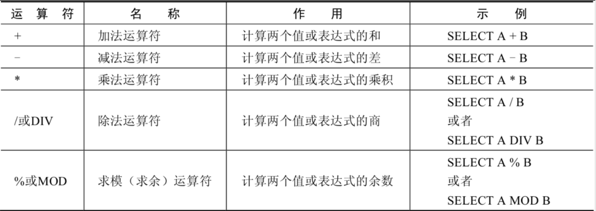

# 1 算术运算符

> 所属章节：[第四章_运算符](./README.md)
> 关键字：算术运算符、加法、减法、乘法、除法、`DIV`、取模、`MOD`、`NULL`
> 建议回查情境：忘记 MySQL 中 `+` 是否能拼接字符串、除法结果类型、除以 `0` 的结果，或需要用取模筛选奇偶数时

## 本节导读

这一节主要说明 MySQL 中常见的算术运算符，包括加法、减法、乘法、除法和求模。算术运算符可以连接运算符前后的两个数值或表达式，并返回对应的数学运算结果。

第一次阅读时，建议先看运算符总览，再依次理解加减、乘除和求模的行为。复习时可以重点回查 `+` 在 MySQL 中只表示数值相加、除法结果通常是浮点数、除以 `0` 得到 `NULL`、以及 `%` 和 `MOD` 的求余写法。

## 你会在这篇学到什么

- MySQL 中加法、减法、乘法、除法和求模的基本写法。
- 整数与浮点数一起参与运算时，结果类型如何变化。
- `+` 在 MySQL 中和 Java 字符串拼接语义的差异。
- 普通除法、`DIV` 与除以 `0` 时的结果表现。
- 如何使用 `MOD` 筛选满足奇偶条件的数据。

## 快速回查表

| 场景 | 写法 | 需要注意 |
| --- | --- | --- |
| 加法 | `100 + 50` | MySQL 中 `+` 只表示数值相加，不表示字符串拼接 |
| 减法 | `100 - 35.5` | 整数与浮点数运算时，结果是浮点数 |
| 乘法 | `salary * 12` | 常用于计算年薪等派生数值 |
| 普通除法 | `100 / 2` | 结果通常以浮点数形式返回 |
| 整数除法 | `100 DIV 0` | 除以 `0` 时结果为 `NULL` |
| 求模 | `12 % 3`、`12 MOD 5` | `%` 和 `MOD` 都可用于求余 |

## 1.1 运算符总览

算术运算符主要用于数学运算，其可以连接运算符前后的两个数值或表达式，对数值或表达式进行加（`+`）、减（`-`）、乘（`*`）、除（`/`）和取模（`%`）运算。



## 1.2 加法与减法运算符

```sql
mysql> SELECT 100, 100 + 0, 100 - 0, 100 + 50, 100 + 50 -30, 100 + 35.5, 100 - 35.5 FROM dual;
+-----+---------+---------+----------+--------------+------------+------------+
| 100 | 100 + 0 | 100 - 0 | 100 + 50 | 100 + 50 -30 | 100 + 35.5 | 100 - 35.5 |
+-----+---------+---------+----------+--------------+------------+------------+
| 100 |     100 |     100 |      150 |          120 |      135.5 |       64.5 |
+-----+---------+---------+----------+--------------+------------+------------+
1 row in set (0.00 sec)
```

由运算结果可以得出如下结论：

- 一个整数类型的值对整数进行加法和减法操作，结果还是一个整数。
- 一个整数类型的值对浮点数进行加法和减法操作，结果是一个浮点数。
- 加法和减法的优先级相同，进行先加后减操作与进行先减后加操作的结果是一样的。
- 在 Java 中，`+` 的左右两边如果有字符串，那么表示字符串的拼接。但是在 MySQL 中，`+` 只表示数值相加。如果遇到非数值类型，MySQL 会先尝试转成数值；如果转换失败，就按 `0` 计算。
- MySQL 中字符串拼接要使用字符串函数 `CONCAT()` 实现。

## 1.3 乘法与除法运算符

```sql
mysql> SELECT 100, 100 * 1, 100 * 1.0, 100 / 1.0, 100 / 2,100 + 2 * 5 / 2,100 /3, 100 DIV 0 FROM dual;
+-----+---------+-----------+-----------+---------+-----------------+---------+-----------+
| 100 | 100 * 1 | 100 * 1.0 | 100 / 1.0 | 100 / 2 | 100 + 2 * 5 / 2 | 100 /3  | 100 DIV 0 |
+-----+---------+-----------+-----------+---------+-----------------+---------+-----------+
| 100 |     100 |     100.0 |  100.0000 | 50.0000 |        105.0000 | 33.3333 |      NULL |
+-----+---------+-----------+-----------+---------+-----------------+---------+-----------+
1 row in set (0.00 sec)
```

计算出员工的年基本工资：

```sql
SELECT
    employee_id,
    salary,
    salary * 12 annual_sal
FROM employees;
```

由运算结果可以得出如下结论：

- 一个数乘以整数 `1` 和除以整数 `1` 后仍得原数。
- 一个数乘以浮点数 `1` 和除以浮点数 `1` 后变成浮点数，数值与原数相等。
- 一个数除以整数后，不管是否能除尽，结果都为一个浮点数。
- 一个数除以另一个数，除不尽时，结果为一个浮点数，并保留到小数点后 `4` 位。
- 乘法和除法的优先级相同，进行先乘后除操作与先除后乘操作，得出的结果相同。
- 在数学运算中，`0` 不能用作除数；在 MySQL 中，一个数除以 `0` 为 `NULL`。

## 1.4 求模（求余）运算符

```sql
mysql> SELECT 12 % 3, 12 MOD 5 FROM dual;
+--------+----------+
| 12 % 3 | 12 MOD 5 |
+--------+----------+
|      0 |        2 |
+--------+----------+
1 row in set (0.00 sec)
```

筛选出 `employee_id` 是偶数的员工：

```sql
SELECT
    *
FROM employees
WHERE employee_id MOD 2 = 0;
```

求模运算适合用来判断是否能整除，也常用于筛选奇数、偶数或按固定周期分组的数据。上面的例子中，`employee_id MOD 2 = 0` 表示员工编号除以 `2` 的余数为 `0`，也就是筛选偶数编号的员工。

## 常见混淆点

- MySQL 中 `+` 不是字符串拼接运算符；需要拼接字符串时，应使用 `CONCAT()`。
- 整数除以整数时，普通除法 `/` 的结果也通常是浮点数，不要按其他语言的整数除法习惯理解。
- 除以 `0` 时，MySQL 返回 `NULL`，不是正常的数值结果。
- `%` 和 `MOD` 都可以表示求模，实际写查询时要保持风格一致。

## 常见回查问题

- MySQL 中 `+` 遇到字符串时会怎样处理？
- 整数和浮点数一起做加减运算时，结果是什么类型？
- 普通除法 `/` 的结果为什么会带小数？
- 除以 `0` 的结果是什么？
- 如何用 `MOD` 筛选 `employee_id` 为偶数的员工？

## 一句话抓核心

算术运算符的核心是：MySQL 会按数值运算处理 `+`、`-`、`*`、`/`、`%` 和 `MOD`，其中类型转换、浮点结果与除以 `0` 返回 `NULL` 是最需要回查的细节。

## 小结

这一节你需要记住：

- `+`、`-`、`*`、`/`、`%` 分别对应加、减、乘、除和求模。
- MySQL 中 `+` 只表示数值相加，字符串拼接使用 `CONCAT()`。
- 整数与浮点数混合运算时，结果通常会变成浮点数。
- 普通除法 `/` 的结果通常是浮点数；除以 `0` 的结果为 `NULL`。
- `%` 和 `MOD` 都可以求余，常用于整除判断和奇偶筛选。

## 延伸阅读

- [第三章_基本的SELECT语句](../第三章_基本的SELECT语句/README.md)
- [第四章导航](./README.md)
