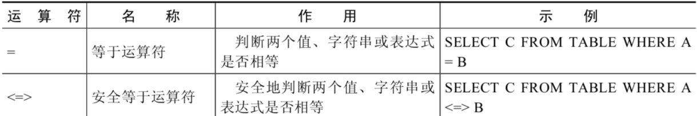
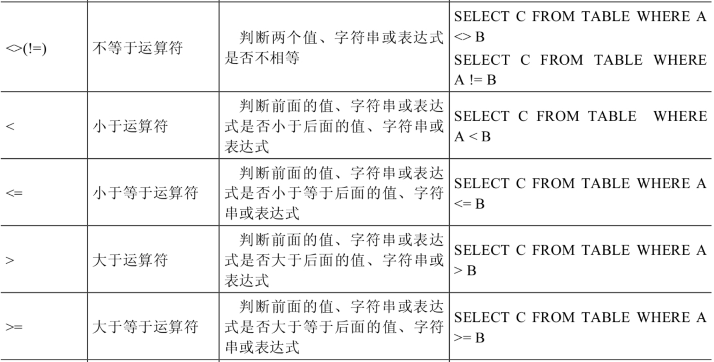
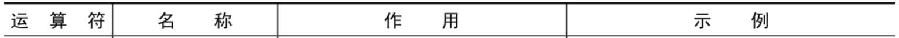
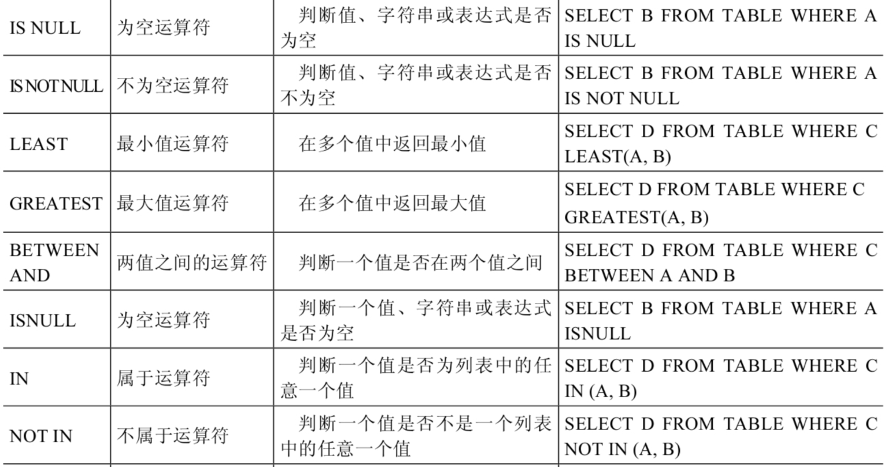
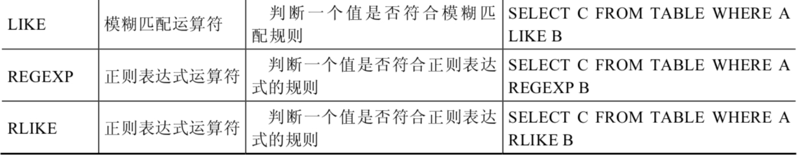

# 2 比较运算符

> 所属章节：[第四章_运算符](./README.md)
> 建议回查情境：忘记 `NULL` 如何参与比较、`=` 和 `<=>` 的差异、范围筛选、列表筛选、模糊匹配或正则匹配写法时
> 上一节：[1 算术运算符](./1%20算术运算符.md)

## 本节导读

这一节主要说明 MySQL 中常见的比较运算符。比较运算符用来比较表达式左边和右边的操作数，比较结果为真时返回 `1`，比较结果为假时返回 `0`，其他无法判断的情况通常返回 `NULL`。

比较运算符经常作为 `SELECT` 查询语句中的过滤条件使用，用来返回符合条件的结果记录。第一次阅读时，建议先理解 `=`、`<=>`、`IS NULL` 这一组和 `NULL` 相关的规则，再看 `BETWEEN AND`、`IN`、`LIKE`、`REGEXP` 等更常用于业务筛选的写法。

## 你会在这篇学到什么

- 比较运算符为什么常用于 `WHERE` 条件。
- `=`、`<=>`、`<>`、`!=` 对普通值和 `NULL` 的处理差异。
- 如何使用 `IS NULL`、`IS NOT NULL` 判断空值和非空值。
- `LEAST()`、`GREATEST()` 如何返回一组值中的最小值或最大值。
- 如何使用 `BETWEEN AND`、`IN`、`NOT IN` 做范围或列表筛选。
- 如何使用 `LIKE`、`ESCAPE` 和 `REGEXP` 做字符串模式匹配。

## 快速定位

- `2.1 比较运算符总览`：先看这一节涵盖哪些比较运算符类别。
- `2.2 等号运算符`：看 `=` 对普通值、字符串和 `NULL` 的处理。
- `2.3 安全等于运算符`：看 `<=>` 为什么适合处理空值比较。
- `2.4 不等于运算符`：看 `<>`、`!=` 的基本行为和 `NULL` 限制。
- `2.5 空运算符`、`2.6 非空运算符`：看判断空值与非空值的标准写法。
- `2.7 最小值运算符`、`2.8 最大值运算符`：看 `LEAST()`、`GREATEST()` 的返回规则。
- `2.9 BETWEEN AND 运算符`：看范围判断和边界是否包含。
- `2.10 IN 运算符`、`2.11 NOT IN 运算符`：看列表筛选以及 `NULL` 风险。
- `2.12 LIKE 运算符`：看 `%`、`_` 和转义写法。
- `2.13 REGEXP 运算符`：看正则匹配的常见符号和用法。

## 建议阅读顺序

- 第一次学习时，建议按 `2.2 -> 2.3 -> 2.5 -> 2.6 -> 2.9 -> 2.10 -> 2.11 -> 2.12 -> 2.13` 的顺序阅读，先把 `NULL` 相关规则读稳，再看常见筛选方式。
- 如果你现在最常卡在“为什么 `NULL = NULL` 不是 `1`”，优先看 `2.2`、`2.3`、`2.5`。
- 如果你主要是在写 `WHERE` 条件，优先回查 `BETWEEN AND`、`IN`、`NOT IN`、`LIKE` 这几节。
- 如果你只是要做复杂字符串匹配，可以直接跳到 `2.12 LIKE 运算符` 和 `2.13 REGEXP 运算符`。

## 关键字

- `比较运算符`：比较左右表达式并返回 `1`、`0` 或 `NULL` 的运算符。
- `=`：普通相等比较，遇到 `NULL` 时结果通常为 `NULL`。
- `<=>`：安全等于运算符，可以正确比较 `NULL`。
- `<>`、`!=`：不等于运算符。
- `IS NULL`：判断值是否为空。
- `IS NOT NULL`：判断值是否非空。
- `BETWEEN AND`：判断值是否落在指定范围内，包含边界。
- `IN`：判断值是否在给定列表中。
- `NOT IN`：判断值是否不在给定列表中。
- `LIKE`：用通配符做简单模式匹配。
- `REGEXP`：用正则表达式做更复杂的字符串匹配。

## 快速回查表

| 场景 | 写法 | 需要注意 |
| --- | --- | --- |
| 判断相等 | `salary = 10000` | 遇到 `NULL` 时结果为 `NULL` |
| 安全相等 | `commission_pct <=> NULL` | 两边都为 `NULL` 时返回 `1` |
| 判断不等 | `job_id <> 'IT_PROG'`、`job_id != 'IT_PROG'` | 不能用来判断 `NULL` |
| 判断空值 | `commission_pct IS NULL`、`ISNULL(commission_pct)` | 推荐用来查询空值 |
| 判断非空 | `commission_pct IS NOT NULL` | 查询不为 `NULL` 的记录 |
| 取最小值 | `LEAST(1, 0, 2)` | 参数中有 `NULL` 时返回 `NULL` |
| 取最大值 | `GREATEST(1, 0, 2)` | 参数中有 `NULL` 时返回 `NULL` |
| 范围筛选 | `salary BETWEEN 2500 AND 3500` | 包含边界值 |
| 列表筛选 | `manager_id IN (100, 101, 201)` | 列表中有 `NULL` 时要特别小心 |
| 排除列表 | `job_id NOT IN ('IT_PROG', 'SA_REP')` | 与 `NULL` 一起使用时容易得到非预期结果 |
| 模糊匹配 | `first_name LIKE 'S%'` | `%` 匹配多个字符，`_` 匹配单个字符 |
| 正则匹配 | `last_name REGEXP '^S'` | 适合更复杂的字符串模式判断 |

## 2.1 比较运算符总览

比较运算符经常被用来作为 `SELECT` 查询语句的条件，返回符合条件的结果记录。





此外，还有非符号类型的运算符：







### 回查提示

如果你只记得“这一章讲比较”，但忘了到底有哪些写法，先看这里再跳到具体运算符。

## 2.2 等号运算符

等号运算符 `=` 判断等号两边的值、字符串或表达式是否相等。如果相等则返回 `1`，不相等则返回 `0`。

使用等号运算符时，遵循如下规则：

- 如果等号两边的值、字符串或表达式都为字符串，则 MySQL 会按照字符串进行比较，比较的是每个字符串中字符的 ANSI 编码是否相等。
- 如果等号两边的值都是整数，则 MySQL 会按照整数比较两个值的大小。
- 如果等号两边的值一个是整数，另一个是字符串，则 MySQL 会将字符串转化为数字进行比较。
- 如果等号两边的值、字符串或表达式中有一个为 `NULL`，则比较结果为 `NULL`。
- 对比 Java 中的比较写法：SQL 中判断相等使用 `=`。

```sql
mysql> SELECT 1 = 1, 1 = '1', 1 = 0, 'a' = 'a', (5 + 3) = (2 + 6), '' = NULL , NULL = NULL;
+-------+---------+-------+-----------+-------------------+-----------+-------------+
| 1 = 1 | 1 = '1' | 1 = 0 | 'a' = 'a' | (5 + 3) = (2 + 6) | '' = NULL | NULL = NULL |
+-------+---------+-------+-----------+-------------------+-----------+-------------+
|    1  |     1   |   0   |      1    |             1     |    NULL   |        NULL |
+-------+---------+-------+-----------+-------------------+-----------+-------------+
1 row in set (0.00 sec)
```

```sql
mysql> SELECT 1 = 2, 0 = 'abc', 1 = 'abc' FROM dual;
+-------+-----------+-----------+
| 1 = 2 | 0 = 'abc' | 1 = 'abc' |
+-------+-----------+-----------+
|     0 |         1 |         0 |
+-------+-----------+-----------+
1 row in set, 2 warnings (0.00 sec)
```

查询 `salary = 10000` 的员工。注意在 Java 中比较相等通常使用 `==`，但 SQL 中使用 `=`：

```sql
SELECT
    employee_id,
    salary
FROM employees
WHERE salary = 10000;
```

字符串存在隐式转换。如果转换数值不成功，则看作 `0`：

```sql
SELECT
    1 = 2,
    1 != 2,
    1 = '1',
    1 = 'a',
    0 = 'a'
FROM DUAL;
```

如果两边都是字符串，则按照 ANSI 的比较规则进行比较：

```sql
SELECT
    'a' = 'a',
    'ab' = 'ab',
    'a' = 'b'
FROM DUAL;
```

只要有 `NULL` 参与判断，结果就为 `NULL`：

```sql
SELECT
    1 = NULL,
    NULL = NULL
FROM DUAL;
```

### 回查提示

如果你看到条件里用了 `=` 却查不出空值，先检查比较对象里是不是有 `NULL`。

## 2.3 安全等于运算符

安全等于运算符 `<=>` 是 MySQL 中特有的运算符，用来比较两个值是否安全相等，也就是会考虑 `NULL` 的情况。

传统的等号 `=` 在遇到 `NULL` 时，结果总是 `NULL`，也就是未知；`<=>` 则可以明确判断两个值是否安全相等。

| 表达式 | 结果 |
| --- | --- |
| `NULL = NULL` | `NULL` |
| `NULL <=> NULL` | `1` |
| `1 <=> NULL` | `0` |
| `1 <=> 1` | `1` |
| `1 = 1` | `1` |
| `1 = NULL` | `NULL` |

```sql
mysql> SELECT 1 <=> '1', 1 <=> 0, 'a' <=> 'a', (5 + 3) <=> (2 + 6), '' <=> NULL,NULL <=> NULL FROM dual;
+-----------+---------+-------------+---------------------+-------------+---------------+
| 1 <=> '1' | 1 <=> 0 | 'a' <=> 'a' | (5 + 3) <=> (2 + 6) | '' <=> NULL | NULL <=> NULL |
+-----------+---------+-------------+---------------------+-------------+---------------+
|         1 |       0 |           1 |                   1 |           0 |             1 |
+-----------+---------+-------------+---------------------+-------------+---------------+
1 row in set (0.00 sec)
```

查询 `commission_pct` 等于 `0.40`：

```sql
SELECT employee_id, commission_pct
FROM employees
WHERE commission_pct = 0.40;

SELECT employee_id, commission_pct
FROM employees
WHERE commission_pct <=> 0.40;
```

如果把 `0.40` 改成 `NULL`，`=` 无法判断空值相等，而 `<=> NULL` 可以匹配值为 `NULL` 的记录。

可以看到，使用安全等于运算符时，两边操作数的值都为 `NULL` 时，返回结果为 `1` 而不是 `NULL`；其他返回结果与等于运算符相同。

### 回查提示

你只要有“既想比较相等，又想把 `NULL` 也纳入明确判断”的需求，就优先想到 `<=>`。

## 2.4 不等于运算符

不等于运算符 `<>` 和 `!=` 用于判断两边的数字、字符串或者表达式的值是否不相等。如果不相等则返回 `1`，相等则返回 `0`。

不等于运算符不能判断 `NULL` 值。如果两边的值有任意一个为 `NULL`，或两边都为 `NULL`，则结果为 `NULL`。

SQL 语句示例如下：

```sql
mysql> SELECT 1 <> 1, 1 != 2, 'a' != 'b', (3+4) <> (2+6), 'a' != NULL, NULL <> NULL;
+--------+--------+------------+----------------+-------------+--------------+
| 1 <> 1 | 1 != 2 | 'a' != 'b' | (3+4) <> (2+6) | 'a' != NULL | NULL <> NULL |
+--------+--------+------------+----------------+-------------+--------------+
|      0 |   1    |       1    |            1   |     NULL    |         NULL |
+--------+--------+------------+----------------+-------------+--------------+
1 row in set (0.00 sec)
```

### 回查提示

如果条件里用了 `<>` 或 `!=`，但又掺杂了空值，先不要假设它会按普通真假逻辑工作。

## 2.5 空运算符

空运算符 `IS NULL` 或者 `ISNULL()` 用于判断一个值是否为 `NULL`。如果为 `NULL` 则返回 `1`，否则返回 `0`。

SQL 语句示例如下：

```sql
mysql> SELECT NULL IS NULL, ISNULL(NULL), ISNULL('a'), 1 IS NULL;
+--------------+--------------+-------------+-----------+
| NULL IS NULL | ISNULL(NULL) | ISNULL('a') | 1 IS NULL |
+--------------+--------------+-------------+-----------+
|            1 |            1 |           0 |         0 |
+--------------+--------------+-------------+-----------+
1 row in set (0.00 sec)
```

查询 `commission_pct` 等于 `NULL`，比较如下四种写法：

```sql
SELECT employee_id, commission_pct FROM employees WHERE commission_pct IS NULL;
SELECT employee_id, commission_pct FROM employees WHERE commission_pct <=> NULL;
SELECT employee_id, commission_pct FROM employees WHERE ISNULL(commission_pct);
SELECT employee_id, commission_pct FROM employees WHERE commission_pct = NULL;
```

前三种写法可以用于判断空值；最后一种 `commission_pct = NULL` 的结果不是普通的真假判断，实际筛选时不应这样写。

查询所有没有主管的员工：

```sql
SELECT last_name, manager_id
FROM employees
WHERE manager_id IS NULL;
```

### 回查提示

只要需求是“找出空值”，标准写法优先用 `IS NULL`，不要写成 `= NULL`。

## 2.6 非空运算符

非空运算符 `IS NOT NULL` 用于判断一个值是否不为 `NULL`。如果不为 `NULL` 则返回 `1`，否则返回 `0`。

SQL 语句示例如下：

```sql
mysql> SELECT NULL IS NOT NULL, 'a' IS NOT NULL,  1 IS NOT NULL;
+------------------+-----------------+---------------+
| NULL IS NOT NULL | 'a' IS NOT NULL | 1 IS NOT NULL |
+------------------+-----------------+---------------+
|                0 |               1 |             1 |
+------------------+-----------------+---------------+
1 row in set (0.01 sec)
```

查询 `commission_pct` 不等于 `NULL`：

```sql
SELECT employee_id, commission_pct FROM employees WHERE commission_pct IS NOT NULL;
SELECT employee_id, commission_pct FROM employees WHERE NOT commission_pct <=> NULL;
SELECT employee_id, commission_pct FROM employees WHERE NOT ISNULL(commission_pct);
```

### 回查提示

“找非空值”对应的第一反应应该是 `IS NOT NULL`，而不是 `!= NULL`。

## 2.7 最小值运算符

`LEAST()` 的语法格式为：

```sql
LEAST(值1, 值2, ..., 值n)
```

其中，`值n` 表示参数列表中有 `n` 个值。在有两个或多个参数的情况下，`LEAST()` 返回最小值。

```sql
mysql> SELECT LEAST (1, 0, 2), LEAST('b', 'a', 'c'), LEAST(1, NULL, 2);
+---------------+--------------------+-----------------+
| LEAST (1,0,2) | LEAST('b','a','c') | LEAST(1,NULL,2) |
+---------------+--------------------+-----------------+
|       0       |        a           |      NULL       |
+---------------+--------------------+-----------------+
1 row in set (0.00 sec)
```

由结果可以看到：

- 当参数是整数或者浮点数时，`LEAST()` 将返回其中最小的值。
- 当参数为字符串时，返回字母表中顺序最靠前的字符。
- 当比较值列表中有 `NULL` 时，不能判断大小，返回值为 `NULL`。

### 回查提示

如果你只是想在一组值里取最小值，不一定非要写多段条件判断，先考虑 `LEAST()`。

## 2.8 最大值运算符

`GREATEST()` 的语法格式为：

```sql
GREATEST(值1, 值2, ..., 值n)
```

其中，`值n` 表示参数列表中有 `n` 个值。当有两个或多个参数时，返回值为最大值。

假如任意一个自变量为 `NULL`，则 `GREATEST()` 的返回值为 `NULL`。

```sql
mysql> SELECT GREATEST(1,0,2), GREATEST('b','a','c'), GREATEST(1,NULL,2);
+-----------------+-----------------------+--------------------+
| GREATEST(1,0,2) | GREATEST('b','a','c') | GREATEST(1,NULL,2) |
+-----------------+-----------------------+--------------------+
|               2 | c                     |               NULL |
+-----------------+-----------------------+--------------------+
1 row in set (0.00 sec)
```

由结果可以看到：

- 当参数中是整数或者浮点数时，`GREATEST()` 将返回其中最大的值。
- 当参数为字符串时，返回字母表中顺序最靠后的字符。
- 当比较值列表中有 `NULL` 时，不能判断大小，返回值为 `NULL`。

### 回查提示

如果你在表达式里只是想取最大值，`GREATEST()` 往往比手写一串比较更直接。

## 2.9 BETWEEN AND 运算符

`BETWEEN AND` 运算符常见格式如下：

```sql
SELECT D
FROM TABLE
WHERE C BETWEEN A AND B;
```

当 `C` 大于或等于 `A`，并且 `C` 小于或等于 `B` 时，结果为 `1`，否则结果为 `0`。也就是说，`BETWEEN A AND B` 包含左右边界。

```sql
mysql> SELECT 1 BETWEEN 0 AND 1, 10 BETWEEN 11 AND 12, 'b' BETWEEN 'a' AND 'c';
+-------------------+----------------------+-------------------------+
| 1 BETWEEN 0 AND 1 | 10 BETWEEN 11 AND 12 | 'b' BETWEEN 'a' AND 'c' |
+-------------------+----------------------+-------------------------+
|                 1 |                    0 |                       1 |
+-------------------+----------------------+-------------------------+
1 row in set (0.00 sec)
```

查询薪资介于 `2500` 到 `3500` 之间的员工：

```sql
SELECT last_name, salary
FROM employees
WHERE salary BETWEEN 2500 AND 3500;
```

### 回查提示

如果你要判断“介于两个值之间”，先确认自己是否需要包含边界；`BETWEEN AND` 默认包含两端。

## 2.10 IN 运算符

`IN` 运算符用于判断给定的值是否是 `IN` 列表中的一个值。如果是则返回 `1`，否则返回 `0`。

如果给定的值为 `NULL`，结果为 `NULL`。如果 `IN` 列表中存在 `NULL`，且前面的值没有匹配成功，也可能得到 `NULL`，因此列表筛选中要特别注意空值。

```sql
mysql> SELECT 'a' IN ('a','b','c'), 1 IN (2,3), NULL IN ('a','b'), 'a' IN ('a', NULL);
+----------------------+------------+-------------------+--------------------+
| 'a' IN ('a','b','c') | 1 IN (2,3) | NULL IN ('a','b') | 'a' IN ('a', NULL) |
+----------------------+------------+-------------------+--------------------+
|            1         |        0   |         NULL      |         1          |
+----------------------+------------+-------------------+--------------------+
1 row in set (0.00 sec)
```

查询主管为 `100`、`101` 或 `201` 的员工信息：

```sql
SELECT
    e.employee_id,
    e.last_name,
    e.salary,
    e.manager_id
FROM employees e
WHERE e.manager_id IN (100, 101, 201);
```

### 回查提示

多个离散值的筛选条件，不要连写一串 `OR`；先考虑 `IN` 会更清楚。

## 2.11 NOT IN 运算符

`NOT IN` 运算符用于判断给定的值是否不是 `IN` 列表中的一个值。如果不是 `IN` 列表中的一个值，则返回 `1`，否则返回 `0`。

```sql
mysql> SELECT 'a' NOT IN ('a','b','c'), 1 NOT IN (2,3);
+--------------------------+----------------+
| 'a' NOT IN ('a','b','c') | 1 NOT IN (2,3) |
+--------------------------+----------------+
|                 0        |            1   |
+--------------------------+----------------+
1 row in set (0.00 sec)
```

查询不属于 `IT_PROG`、`SA_REP` 职位的员工：

```sql
SELECT
    employee_id,
    last_name,
    job_id
FROM employees
WHERE job_id NOT IN ('IT_PROG', 'SA_REP');
```

使用 `NOT IN` 时也要注意 `NULL`。如果被比较值或列表中存在 `NULL`，结果可能变成 `NULL`，从而影响 `WHERE` 过滤结果。

### 回查提示

`NOT IN` 一旦和 `NULL` 混在一起就容易出问题，写之前先确认列表和字段里是否可能出现空值。

## 2.12 LIKE 运算符

`LIKE` 运算符主要用来匹配字符串，通常用于模糊匹配。如果满足条件则返回 `1`，否则返回 `0`。

如果给定的值或者匹配条件为 `NULL`，则返回结果为 `NULL`。

`LIKE` 运算符通常使用如下通配符：

- `%`：匹配 `0` 个或多个字符。
- `_`：只能匹配一个字符。

SQL 语句示例如下：

```sql
mysql> SELECT NULL LIKE 'abc', 'abc' LIKE NULL;
+-----------------+-----------------+
| NULL LIKE 'abc' | 'abc' LIKE NULL |
+-----------------+-----------------+
|          NULL   |          NULL   |
+-----------------+-----------------+
1 row in set (0.00 sec)
```

查询名字以 `S` 开头的员工：

```sql
SELECT
    e.first_name
FROM employees e
WHERE e.first_name LIKE 'S%';
```

查询第二个字母为 `o` 的员工姓氏：

```sql
SELECT
    e.last_name
FROM employees e
WHERE e.last_name LIKE '_o%';
```

### ESCAPE

当需要匹配 `%` 或 `_` 这类特殊符号本身时，可以使用转义符。

查询 `job_id` 以 `IT_` 开头的职位代码，其中 `_` 为实际字符，不是通配符：

```sql
SELECT
    e.job_id
FROM employees e
WHERE e.job_id LIKE 'IT$_%' ESCAPE '$';
```

如果使用 `\` 表示转义，可以省略 `ESCAPE`；如果不是 `\`，则要加上 `ESCAPE`。

```sql
SELECT
    e.job_id
FROM employees e
WHERE e.job_id LIKE 'IT\_%';
```

### 回查提示

只要需求里出现“以什么开头、包含什么模式、某个位置是什么字符”，先想到 `LIKE`；只有模式复杂到普通通配符不够时，再上 `REGEXP`。

## 2.13 REGEXP 运算符

`REGEXP` 运算符用来匹配字符串，语法格式如下：

```sql
expr REGEXP pattern
```

返回值：

- `1`：表示符合正则表达式 `pattern`。
- `0`：表示不符合。
- `NULL`：若 `expr` 或 `pattern` 为 `NULL`。

`REGEXP` 运算符在进行匹配时，常用的通配符如下：

| 符号 | 说明 | 示例 | 结果说明 |
| --- | --- | --- | --- |
| `^` | 匹配开头 | `'abc' REGEXP '^a'` | `1`，以 `a` 开头 |
| `$` | 匹配结尾 | `'test' REGEXP 't$'` | `1`，以 `t` 结尾 |
| `.` | 匹配任意一个字符 | `'abc' REGEXP 'a.c'` | `1`，`a` 开头，`c` 结尾，中间任一字符 |
| `[...]` | 匹配指定集合中的任一字符 | `'a' REGEXP '[abc]'` | `1`，`a`、`b`、`c` 任一皆可 |
| `[a-z]` | 匹配范围内字符 | `'f' REGEXP '[a-z]'` | `1`，在 `a-z` 范围内 |
| `[0-9]` | 匹配数字 | `'8' REGEXP '[0-9]'` | `1`，`0` 到 `9` 间任一数字 |
| `*` | 匹配零个或多个前一字符 | `'aaa' REGEXP 'a*'` | `1`，零个或多个 `a` |

SQL 语句示例如下：

```sql
mysql> SELECT 'shkstart' REGEXP '^s', 'shkstart' REGEXP 't$', 'shkstart' REGEXP 'hk';
+------------------------+------------------------+-------------------------+
| 'shkstart' REGEXP '^s' | 'shkstart' REGEXP 't$' | 'shkstart' REGEXP 'hk'  |
+------------------------+------------------------+-------------------------+
|                      1 |                      1 |                       1 |
+------------------------+------------------------+-------------------------+
1 row in set (0.01 sec)
```

```sql
mysql> SELECT 'atguigu' REGEXP 'gu.gu', 'atguigu' REGEXP '[ab]';
+--------------------------+-------------------------+
| 'atguigu' REGEXP 'gu.gu' | 'atguigu' REGEXP '[ab]' |
+--------------------------+-------------------------+
|                        1 |                       1 |
+--------------------------+-------------------------+
1 row in set (0.00 sec)
```

### 回查提示

当 `LIKE` 已经不够表达你的匹配规则时，再切到 `REGEXP`；否则优先用更直观的 `LIKE`。

## 常见混淆点

- `=` 不能用来判断 `NULL` 是否相等；判断空值应优先使用 `IS NULL` 或 `<=> NULL`。
- `<=>` 是安全等于运算符，两边都为 `NULL` 时返回 `1`。
- `<>` 和 `!=` 都表示不等于，但它们也不能正常判断 `NULL`。
- `BETWEEN A AND B` 包含 `A` 和 `B` 两个边界。
- `LIKE` 中 `%` 和 `_` 是通配符；要匹配它们本身时需要转义。
- `IN`、`NOT IN` 遇到 `NULL` 时要特别小心，结果可能不是简单的 `1` 或 `0`。
- `LIKE` 适合简单模式匹配，`REGEXP` 适合更复杂的正则匹配。

## 常见回查问题

- 比较运算符返回的 `1`、`0`、`NULL` 分别代表什么？
- 为什么 `NULL = NULL` 的结果不是 `1`？
- `<=>` 和 `=` 的差异是什么？
- 查询空值应该用 `IS NULL`、`ISNULL()` 还是 `= NULL`？
- `BETWEEN 2500 AND 3500` 是否包含 `2500` 和 `3500`？
- `IN` 和 `NOT IN` 遇到 `NULL` 时为什么容易出问题？
- `LIKE 'S%'` 和 `LIKE '_o%'` 分别匹配什么？
- `LIKE` 中想匹配实际的 `_` 字符应该怎么写？
- `REGEXP '^s'`、`REGEXP 't$'`、`REGEXP 'hk'` 分别检查什么？

## 一句话抓核心

比较运算符的核心是：把表达式比较结果转成 `1`、`0` 或 `NULL`，并常放在 `WHERE` 中控制哪些记录能进入查询结果；其中 `NULL` 判断、范围筛选、列表筛选和字符串模式匹配是最常回查的部分。

## 小结

这一节你需要记住：

- 比较运算符常用于 `WHERE` 条件中，决定记录是否被筛选出来。
- `=`、`<>`、`!=` 遇到 `NULL` 时通常返回 `NULL`，不能当作普通相等或不等判断。
- 判断空值应使用 `IS NULL`、`ISNULL()` 或安全等于 `<=> NULL`。
- `BETWEEN AND` 用于范围判断，并且包含边界值。
- `IN` 和 `NOT IN` 用于列表判断，但要注意列表或被比较值中的 `NULL`。
- `LIKE` 使用 `%` 和 `_` 做模糊匹配，`REGEXP` 使用正则表达式做更复杂的匹配。

## 延伸阅读

- [1 算术运算符](./1%20算术运算符.md)
- [第三章_基本的SELECT语句](../第三章_基本的SELECT语句/README.md)
- [第四章导航](./README.md)
