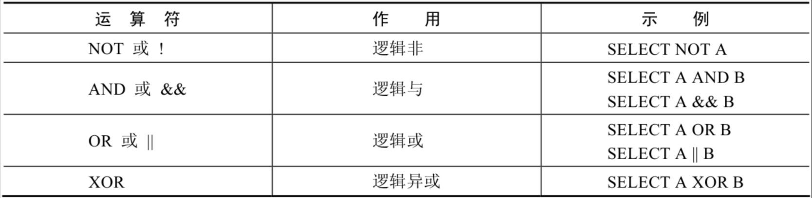

# 3 逻辑运算符

> 所属章节：[第四章_运算符](./README.md)
> 建议回查情境：需要组合多个筛选条件、分不清 `NOT` / `AND` / `OR` / `XOR` 的返回结果，或遇到 `NULL` 参与逻辑判断时
> 上一节：[2 比较运算符](./2%20比较运算符.md)
> 下一章：[第五章_排序与分页](../第五章_排序与分页/README.md)

## 本节导读

这一节主要说明 MySQL 中的逻辑运算符。逻辑运算符常用于判断表达式真假、组合多个条件，或对现有条件取反。在 MySQL 中，逻辑运算符的返回结果通常是 `1`、`0` 或 `NULL`。

第一次阅读时，建议先看逻辑运算符总览，先建立“真 / 假 / 未知”的整体概念，再依次理解 `NOT`、`AND`、`OR`、`XOR` 的判断规则。复习时可以重点回查 `NULL` 参与逻辑计算时的结果、`AND` 和 `OR` 的优先级，以及“取反”“同时满足”“满足其一”“只能满足一个”这四类典型场景。

## 你会在这篇学到什么

- MySQL 中逻辑运算符为什么会返回 `1`、`0` 或 `NULL`。
- `NOT` 如何对条件取反，以及 `NULL` 参与时为什么仍然得到 `NULL`。
- `AND` 和 `OR` 如何组合多个筛选条件。
- `XOR` 为什么适合“两个条件只能满足一个”的场景。
- 写复杂 `WHERE` 条件时，如何通过括号避免优先级误判。

## 快速定位

- `3.1 逻辑运算符总览`：先看本节包含哪些逻辑运算符，以及逻辑判断的基本返回值。
- `3.2 逻辑非运算符`：看 `NOT` / `!` 如何对单个条件取反。
- `3.3 逻辑与运算符`：看 `AND` / `&&` 如何要求多个条件同时成立。
- `3.4 逻辑或运算符`：看 `OR` 如何表示多个条件满足其一即可。
- `3.5 逻辑异或运算符`：看 `XOR` 如何表示“有且只能有一个条件成立”。
- `常见混淆点`：看 `NULL`、优先级和 `||` 写法的注意事项。

## 建议阅读顺序

- 第一次学习时，建议按 `3.1 -> 3.2 -> 3.3 -> 3.4 -> 3.5` 的顺序阅读，先建立整体概念，再分别理解四类逻辑关系。
- 如果你最常卡在“为什么条件里有 `NULL` 后结果怪怪的”，优先看 `3.2`、`3.3`、`3.4`。
- 如果你现在是在写复合查询条件，优先回查 `3.3 逻辑与运算符` 和 `3.4 逻辑或运算符`。
- 如果你的需求是“两个条件只能满足一个”，直接看 `3.5 逻辑异或运算符`。

## 关键字

- `逻辑运算符`：用于判断表达式真假或组合多个条件的运算符。
- `1`：逻辑判断结果为真。
- `0`：逻辑判断结果为假。
- `NULL`：逻辑判断结果未知，常见于空值参与运算时。
- `NOT`、`!`：对条件取反。
- `AND`、`&&`：多个条件同时满足才为真。
- `OR`：多个条件只要满足一个就为真。
- `XOR`：两个条件中有且只能有一个为真。

## 快速回查表

| 场景 | 写法 | 需要注意 |
| --- | --- | --- |
| 对条件取反 | `NOT status = 'ACTIVE'` | `NOT NULL` 的结果仍然是 `NULL` |
| 排除多个值 | `job_id NOT IN ('IT_PROG', 'ST_CLERK', 'SA_REP')` | 本质上也是对条件结果取反 |
| 同时满足多个条件 | `salary >= 10000 AND job_id LIKE '%MAN%'` | 只要有一个条件为 `0`，结果就是 `0` |
| 满足任一条件 | `salary < 9000 OR salary > 12000` | 推荐显式写 `OR`，不要依赖 `||` |
| 只能满足一个条件 | `department_id IN (10, 20) XOR salary > 8000` | 两边只要有一边是 `NULL`，结果通常为 `NULL` |
| 对复合条件取反 | `NOT (salary >= 9000 AND salary <= 12000)` | 复杂条件建议加括号，避免优先级误判 |

## 3.1 逻辑运算符总览

逻辑运算符主要用来判断表达式的真假。在 MySQL 中，逻辑运算符的返回结果为 `1`、`0` 或 `NULL`。

MySQL 中支持的逻辑运算符如下：



### 回查提示

如果你只记得“这篇讲的是条件组合”，但一时忘了有哪些逻辑运算符，先回到这里看总览。

## 3.2 逻辑非运算符

逻辑非（`NOT` 或 `!`）运算符表示对已有条件取反：

- 当给定的值为 `0` 时，返回 `1`。
- 当给定的值为非 `0` 值时，返回 `0`。
- 当给定的值为 `NULL` 时，返回 `NULL`。

```sql
mysql> SELECT NOT 1, NOT 0, NOT (1 + 1), NOT !1, NOT NULL;
+-------+-------+-------------+--------+----------+
| NOT 1 | NOT 0 | NOT (1 + 1) | NOT !1 | NOT NULL |
+-------+-------+-------------+--------+----------+
|     0 |     1 |           0 |      1 |     NULL |
+-------+-------+-------------+--------+----------+
1 row in set, 1 warning (0.00 sec)
```

查询职位不是 `IT_PROG`、`ST_CLERK` 或 `SA_REP` 的员工：

```sql
SELECT
    e.last_name,
    e.job_id
FROM employees e
WHERE e.job_id NOT IN ('IT_PROG', 'ST_CLERK', 'SA_REP');
```

### 回查提示

当你的需求是“排除某类条件”时，优先想到 `NOT`。如果条件本身比较复杂，记得用括号把原条件包起来。

## 3.3 逻辑与运算符

逻辑与（`AND` 或 `&&`）运算符表示多个条件必须同时满足：

- 当给定的所有值均为非 `0` 值，并且都不为 `NULL` 时，返回 `1`。
- 当给定的一个值或者多个值为 `0` 时，返回 `0`。
- 其他情况返回 `NULL`。

```sql
mysql> SELECT 1 AND -1, 0 AND 1, 0 AND NULL, 1 AND NULL;
+----------+---------+------------+------------+
| 1 AND -1 | 0 AND 1 | 0 AND NULL | 1 AND NULL |
+----------+---------+------------+------------+
|        1 |       0 |          0 |       NULL |
+----------+---------+------------+------------+
1 row in set (0.00 sec)
```

查询薪资大于等于 `10000`，且职位代号包含 `MAN` 的员工：

```sql
SELECT
    e.employee_id,
    e.last_name,
    e.job_id,
    e.salary
FROM employees e
WHERE e.salary >= 10000
  AND e.job_id LIKE '%MAN%';
```

### 回查提示

只要你的需求里出现“并且”“同时满足”“两个条件都要成立”，就应该先检查是不是该用 `AND`。

## 3.4 逻辑或运算符

逻辑或（`OR`）运算符表示多个条件中只要有一个成立即可：

- 当给定的值都不为 `NULL`，并且任何一个值为非 `0` 值时，返回 `1`，否则返回 `0`。
- 当一个值为 `NULL`，另一个值为非 `0` 值时，返回 `1`。
- 当两个值都为 `NULL`，或者一个值为 `NULL` 且另一个值为 `0` 时，返回 `NULL`。

```sql
mysql> SELECT 1 OR -1, 1 OR 0, 1 OR NULL, 0 OR NULL, NULL OR NULL;
+---------+--------+-----------+-----------+--------------+
| 1 OR -1 | 1 OR 0 | 1 OR NULL | 0 OR NULL | NULL OR NULL |
+---------+--------+-----------+-----------+--------------+
|       1 |      1 |         1 |      NULL |         NULL |
+---------+--------+-----------+-----------+--------------+
1 row in set (0.00 sec)
```

下面三种写法都表示“查询基本薪资不在 `9000` 到 `12000` 之间的员工编号和基本薪资”：

```sql
SELECT
    e.employee_id,
    e.salary
FROM employees e
WHERE NOT (e.salary >= 9000 AND e.salary <= 12000);

SELECT
    e.employee_id,
    e.salary
FROM employees e
WHERE e.salary < 9000
   OR e.salary > 12000;

SELECT
    e.employee_id,
    e.salary
FROM employees e
WHERE e.salary NOT BETWEEN 9000 AND 12000;
```

> **注意：** `OR` 可以和 `AND` 一起使用，但要注意优先级。由于 `AND` 的优先级高于 `OR`，因此复杂条件最好显式加括号。
>
> 另外，虽然某些情况下 `||` 也会被当作逻辑或使用，但为了避免和 SQL 模式差异混淆，实际写查询时更推荐直接使用 `OR`。

### 回查提示

如果你的需求里出现“或者”“任意一个满足即可”，先考虑 `OR`，然后再检查是否需要配合括号控制优先级。

## 3.5 逻辑异或运算符

逻辑异或（`XOR`）运算符表示两个条件中有且只能有一个成立：

- 当给定的值中任意一个值为 `NULL` 时，返回 `NULL`。
- 如果两个非 `NULL` 的值都是 `0`，或者都不等于 `0`，则返回 `0`。
- 如果一个值为 `0`，另一个值不为 `0`，则返回 `1`。

它最适合的场景是：有两个条件进行比较时，有且只能有一个条件满足。

```sql
SELECT
    e.department_id,
    e.salary
FROM employees e
WHERE e.department_id IN (10, 20)
XOR e.salary > 8000;
```

上面这条语句表示：员工要么属于 `10` 或 `20` 号部门，要么薪资高于 `8000`，但不能同时满足这两个条件。

### 回查提示

如果你不是要“都满足”或“满足其一”，而是明确要求“只能命中一个条件”，就该想到 `XOR`。

## 常见混淆点

- 逻辑运算符返回的不是程序语言里的 `true` / `false`，而通常是 `1`、`0`、`NULL`。
- 只要 `NULL` 参与逻辑判断，结果就可能变成 `NULL`，这也是很多查询条件看起来“没报错但结果不对”的原因。
- `AND` 的优先级高于 `OR`。只要条件稍微复杂，就加括号，不要依赖自己临时记忆优先级。
- 为了避免和 SQL 模式差异混淆，实际开发中更推荐写 `OR`，不要把 `||` 当成默认可移植写法。

## 本节小结

- `NOT` 适合对已有条件取反。
- `AND` 适合“多个条件必须同时满足”的场景。
- `OR` 适合“多个条件满足其一即可”的场景。
- `XOR` 适合“两个条件有且只能满足一个”的场景。
- 写复合逻辑条件时，要特别关注 `NULL` 和运算符优先级。
