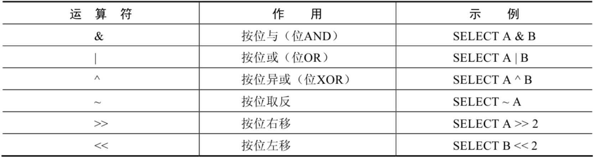
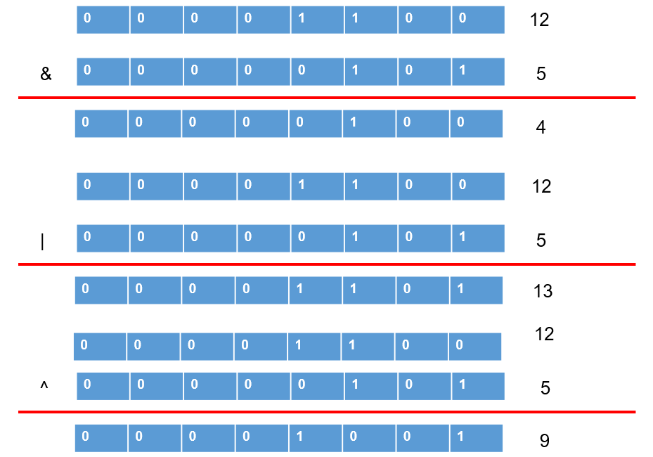

# 4 位运算符

> 所属章节：[第四章_运算符](./README.md)
> 建议回查情境：需要看懂 `&`、`|`、`^`、`~`、`<<`、`>>` 的含义，或想确认某个十进制数做位运算后的结果时
> 上一节：[3 逻辑运算符](./3%20逻辑运算符.md)
> 下一章：[第五章_排序与分页](../第五章_排序与分页/README.md)

## 本节导读

这一节主要说明 MySQL 中的位运算符。位运算符不是直接在十进制数上做普通加减乘除，而是先把操作数转换成二进制，再逐位进行计算，最后再把结果转换回十进制。

第一次阅读时，建议先看位运算符总览，再按“按位与、按位或、按位异或、按位取反、位移”这个顺序往下读。复习时可以重点回查每个运算符的逐位规则，以及右移、左移后为什么会得到完全不同的数值结果。

## 你会在这篇学到什么

- 位运算符为什么要先把十进制数转换成二进制。
- `&`、`|`、`^` 分别表示什么样的逐位计算规则。
- `~` 为什么是对每一位做取反。
- `>>` 和 `<<` 为什么会改变数值大小。
- 如何通过简单二进制拆解快速判断位运算结果。

## 快速定位

- `4.1 位运算符总览`：先看本节包含哪些位运算符。
- `4.2 按位与运算符`：看 `&` 如何保留两个数中同为 `1` 的位。
- `4.3 按位或运算符`：看 `|` 如何保留任一侧为 `1` 的位。
- `4.4 按位异或运算符`：看 `^` 如何保留不同位。
- `4.5 按位取反运算符`：看 `~` 如何把 `1` 变 `0`、把 `0` 变 `1`。
- `4.6 按位右移运算符`：看 `>>` 如何整体右移并丢弃低位。
- `4.7 按位左移运算符`：看 `<<` 如何整体左移并在低位补 `0`。
- `常见混淆点`：看位运算与逻辑运算的差异，以及为什么阅读示例时最好先写出二进制。

## 建议阅读顺序

- 第一次学习时，建议按 `4.1 -> 4.2 -> 4.3 -> 4.4 -> 4.5 -> 4.6 -> 4.7` 的顺序阅读，先理解逐位计算，再看取反与位移。
- 如果你现在最常卡在“为什么 `20 & 30 = 20` 这种结果会出现”，优先看 `4.2` 到 `4.4`。
- 如果你已经会看 `&`、`|`、`^`，但不理解位移后数值为什么变化，直接看 `4.6` 和 `4.7`。
- 如果你只是想快速确认某个符号的意义，可以先看“快速回查表”再跳到对应小节。

## 关键字

- `位运算符`：把数字转换成二进制后，按位进行计算的运算符。
- `二进制`：只由 `0` 和 `1` 组成的数字表示方式。
- `&`：按位与，只有同一位都为 `1` 时结果才为 `1`。
- `|`：按位或，同一位只要有一个为 `1`，结果就是 `1`。
- `^`：按位异或，同一位不相同才为 `1`。
- `~`：按位取反，把每一位的 `0` 和 `1` 对调。
- `>>`：按位右移。
- `<<`：按位左移。

## 快速回查表

| 场景 | 写法 | 需要注意 |
| --- | --- | --- |
| 取两个数共同为 `1` 的位 | `12 & 5` | 常用于保留重叠的位标记 |
| 合并两个数中任一为 `1` 的位 | `12` | `5` | 结果中的 `1` 会更多 |
| 判断两个数哪些位不同 | `12 ^ 5` | 相同位为 `0`，不同位为 `1` |
| 对所有二进制位取反 | `~1` | 实际结果要结合二进制补码理解 |
| 向右移动二进制位 | `4 >> 2` | 低位会被丢弃 |
| 向左移动二进制位 | `4 << 2` | 右侧补 `0`，数值通常变大 |

## 4.1 位运算符总览

位运算符是在二进制数上进行计算的运算符。位运算符会先将操作数转换成二进制数，然后进行位运算，最后将计算结果从二进制转换回十进制数。

MySQL 支持的位运算符如下：



### 回查提示

如果你只记得“这一节讲的是按位计算”，但忘了有哪些符号，先回到这里看总览。

## 4.2 按位与运算符

按位与 `&` 运算符会把两个数对应的二进制位逐位做逻辑与运算：

- 当同一位都为 `1` 时，该位结果为 `1`。
- 只要其中一边为 `0`，该位结果就为 `0`。

```sql
mysql> SELECT 1 & 10, 20 & 30;
+--------+---------+
| 1 & 10 | 20 & 30 |
+--------+---------+
|      0 |      20 |
+--------+---------+
1 row in set (0.00 sec)
```

- `1` 的二进制数为 `0001`，`10` 的二进制数为 `1010`，所以 `1 & 10` 的结果为 `0000`，对应十进制数 `0`。
- `20` 的二进制数为 `10100`，`30` 的二进制数为 `11110`，所以 `20 & 30` 的结果为 `10100`，对应十进制数 `20`。

### 回查提示

当你想保留“两个值都同时具备”的位信息时，就先想到 `&`。

## 4.3 按位或运算符

按位或 `|` 运算符会把两个数对应的二进制位逐位做逻辑或运算：

- 当同一位中至少有一个为 `1` 时，该位结果为 `1`。
- 只有同一位都为 `0` 时，该位结果才为 `0`。

```sql
mysql> SELECT 1 | 10, 20 | 30;
+--------+---------+
| 1 | 10 | 20 | 30 |
+--------+---------+
|     11 |      30 |
+--------+---------+
1 row in set (0.00 sec)
```

- `1` 的二进制数为 `0001`，`10` 的二进制数为 `1010`，所以 `1 | 10` 的结果为 `1011`，对应十进制数 `11`。
- `20` 的二进制数为 `10100`，`30` 的二进制数为 `11110`，所以 `20 | 30` 的结果为 `11110`，对应十进制数 `30`。

### 回查提示

如果你的目标是把两个值里“任一为 `1` 的位”都保留下来，就应该看 `|`。

## 4.4 按位异或运算符

按位异或 `^` 运算符会把两个数对应的二进制位逐位做逻辑异或运算：

- 当同一位两个值不相同时，该位结果为 `1`。
- 当同一位两个值相同时，该位结果为 `0`。

```sql
mysql> SELECT 1 ^ 10, 20 ^ 30;
+--------+---------+
| 1 ^ 10 | 20 ^ 30 |
+--------+---------+
|     11 |      10 |
+--------+---------+
1 row in set (0.00 sec)
```

- `1` 的二进制数为 `0001`，`10` 的二进制数为 `1010`，所以 `1 ^ 10` 的结果为 `1011`，对应十进制数 `11`。
- `20` 的二进制数为 `10100`，`30` 的二进制数为 `11110`，所以 `20 ^ 30` 的结果为 `01010`，对应十进制数 `10`。

再看一组更直观的例子：

```sql
SELECT
    12 & 5,
    12 | 5,
    12 ^ 5
FROM DUAL;

+--------+--------+--------+
| 12 & 5 | 12 | 5 | 12 ^ 5 |
+--------+--------+--------+
|      4 |     13 |      9 |
+--------+--------+--------+
1 row in set (0.00 sec)
```



### 回查提示

如果你想知道两个数“哪些位不一样”，优先回来看 `^`。

## 4.5 按位取反运算符

按位取反 `~` 运算符会把给定值的二进制数逐位取反，也就是把 `1` 变成 `0`，把 `0` 变成 `1`。

```sql
mysql> SELECT 10 & ~1;
+---------+
| 10 & ~1 |
+---------+
|      10 |
+---------+
1 row in set (0.00 sec)
```

由于按位取反 `~` 运算符的优先级高于按位与 `&`，所以 `10 & ~1` 会先对数字 `1` 做按位取反，再与 `10` 进行按位与运算。最终结果为 `10`。

### 回查提示

如果你在一个表达式里同时看到了 `~` 和其他位运算符，先确认优先级，再判断实际计算顺序。

## 4.6 按位右移运算符

按位右移 `>>` 运算符会把给定值的二进制数整体向右移动指定的位数：

- 右边低位被移出后会直接丢弃。
- 左边空出来的高位用 `0` 补齐。

```sql
mysql> SELECT 1 >> 2, 4 >> 2;
+--------+--------+
| 1 >> 2 | 4 >> 2 |
+--------+--------+
|      0 |      1 |
+--------+--------+
1 row in set (0.00 sec)
```

- `1` 的二进制数为 `0000 0001`，右移 `2` 位后变成 `0000 0000`，对应十进制数 `0`。
- `4` 的二进制数为 `0000 0100`，右移 `2` 位后变成 `0000 0001`，对应十进制数 `1`。

### 回查提示

看到 `>>` 时，可以直接把它理解成“整体向右搬移位元，再丢掉右侧多出来的部分”。

## 4.7 按位左移运算符

按位左移 `<<` 运算符会把给定值的二进制数整体向左移动指定的位数：

- 左边高位被移出后会丢弃。
- 右边空出来的低位用 `0` 补齐。

```sql
mysql> SELECT 1 << 2, 4 << 2;
+--------+--------+
| 1 << 2 | 4 << 2 |
+--------+--------+
|      4 |     16 |
+--------+--------+
1 row in set (0.00 sec)
```

- `1` 的二进制数为 `0000 0001`，左移 `2` 位后变成 `0000 0100`，对应十进制数 `4`。
- `4` 的二进制数为 `0000 0100`，左移 `2` 位后变成 `0001 0000`，对应十进制数 `16`。

### 回查提示

如果你发现某个数经过 `<<` 后快速变大，先回到这里用二进制位移的方式重新看一遍。

## 常见混淆点

- 位运算符和逻辑运算符不是一回事。`&`、`|`、`^` 处理的是二进制位，`AND`、`OR`、`XOR` 处理的是条件真假。
- 看位运算结果时，不要只盯着十进制数，先把数字写成二进制，通常就会立刻看懂。
- `~` 的结果不适合只靠肉眼猜，最好结合完整的二进制表示和表达式优先级一起理解。
- `>>` 和 `<<` 本质上是“整体搬移位元”，不是普通的除法或乘法写法。

## 本节小结

- 位运算符会先把数字转成二进制，再逐位计算。
- `&` 看共同为 `1` 的位，`|` 看任一为 `1` 的位，`^` 看不同的位。
- `~` 是按位取反，阅读时要特别注意优先级。
- `>>` 和 `<<` 分别表示右移和左移，理解它们最好的方式是直接写出二进制过程。
