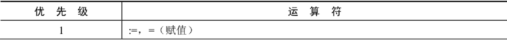
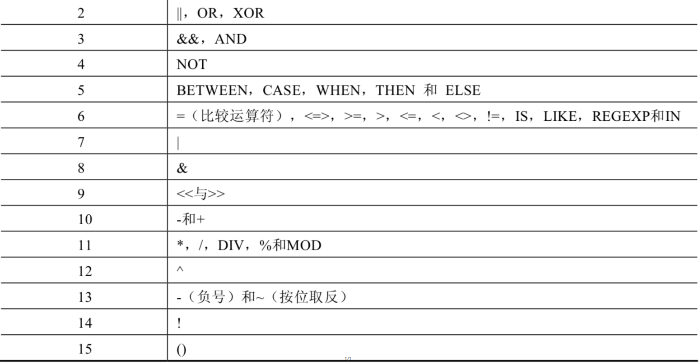

# 5 运算符的优先级

> - 所属章节：[第四章_运算符](./README.md)  
> - 建议回查情境：同时写了算术、比较、逻辑或位运算，不确定 MySQL 会先算哪一部分，或想确认什么时候必须加括号时  
> - 上一节：[4 位运算符](./4%20位运算符.md)  
> - 下一章：[第五章_排序与分页](../第五章_排序与分页/README.md)

## 本节导读

这一节讲的是 MySQL 中不同运算符的默认计算顺序，也就是“运算符优先级”。

它不是一章适合死背整张表的内容，而是一章很适合用来解决实际误判的内容。因为大多数人真正出错的时候，不是“不知道某个符号”，而是：

- 以为 MySQL 会从左到右顺着算
- 以为自己脑中的顺序和 MySQL 一样
- 以为 `AND`、`OR`、`NOT` 的顺序“差不多”
- 以为只靠语感就能看懂复杂表达式

所以这篇真正要掌握的，不是把整张优先级表背得滚瓜烂熟，而是：

> **先知道优先级决定的是“默认顺序”，再学会在容易误判的地方主动加括号。**

第一次学习时，建议先抓住最实用的主线：

- 括号会改变默认顺序
- 算术通常先于比较
- 比较通常先于逻辑
- `NOT`、`AND`、`XOR`、`OR` 之间也有先后关系
- `AND` 高于 `OR`
- 复杂表达式不要赌自己记忆，直接加括号

复习时，这一节最适合作为“速查 + 校正直觉”的页面：当你发现某个结果和直觉不一样时，就回到这里检查默认顺序。

## 先记 8 句话

- 运算符优先级决定的是“默认谁先算”。
- 括号 `()` 优先级最高，最适合显式控制顺序。
- 赋值运算符通常放在最后阶段参与。
- 算术运算通常先于比较运算。
- 比较运算通常先于逻辑运算。
- 逻辑运算里，`NOT` 高于 `AND`，`AND` 高于 `XOR`，`XOR` 高于 `OR`。
- `AND` 和 `OR` 混用时，是最容易看错的一类场景。
- 表达式只要稍微复杂，最稳的做法就是加括号，而不是赌自己记忆没错。

## 你会在这篇学到什么

- 什么是运算符优先级，以及它为什么会直接影响最终结果。
- 为什么优先级决定的是“默认顺序”，而不是唯一顺序。
- 第一次学习时，最值得先记住的那条“实用优先级链”。
- 为什么 `*`、`/` 往往会先于 `+`、`-` 计算。
- 为什么比较运算通常会先于逻辑运算。
- 为什么 `NOT`、`AND`、`XOR`、`OR` 混在一起时最容易误判。
- 写复杂 `WHERE` 条件时，什么时候应该停止心算，直接加括号。
- 如何把这一章当作“速查工具”使用，而不是当作单纯背诵内容。

## 快速定位

- `5.1 先搞懂：优先级到底在决定什么`：先建立本章最重要的底层概念。
- `5.2 第一次先记这条实用顺序`：先抓最常用的主线，而不是一开始就背整张表。
- `5.3 最常误判的第 1 类：算术运算的顺序`：看 `*`、`/`、`DIV`、`%` 和 `+`、`-` 的关系。
- `5.4 最常误判的第 2 类：比较和逻辑谁先算`：看为什么比较通常先于逻辑。
- `5.5 最常误判的第 3 类：`NOT`、`AND`、`XOR`、`OR``：看逻辑运算内部的默认先后顺序。
- `5.6 最常误判的第 4 类：复杂 `WHERE` 条件`：看为什么 `AND` 和 `OR` 一混用就该想到括号。
- `优先级总览图`：需要完整对照时，再回来看整张表。
- `常见混淆点`：看哪些表达式不该只靠语感去读。
- `一分钟自测`：快速检查自己是否真的掌握了本节重点。

## 建议阅读顺序

- 第一次学习时，建议按 `5.1 -> 5.2 -> 5.3 -> 5.4 -> 5.5 -> 5.6` 的顺序阅读，先抓主线，再看最容易错的四种情境。
- 如果你现在正在写 `WHERE` 条件，优先看 `5.5` 和 `5.6`，尤其注意 `AND`、`OR`、括号的关系。
- 如果你在看算术表达式为什么和直觉不同，优先看 `5.3`。
- 如果你在看 `NOT 1 = 1`、`salary > 8000 AND ... OR ...` 这类表达式为什么和想象不一样，优先看 `5.4`、`5.5`、`5.6`。
- 如果你只是想快速确认“谁先算”，先看 `5.2` 的实用顺序，再决定要不要回到总览图查完整表。

## 关键字

- `运算符优先级`：多个运算符同时出现时，MySQL 决定先后计算顺序的规则。
- `默认顺序`：在没有括号额外指定时，MySQL 会采用的计算顺序。
- `括号 ()`：优先级最高，最适合显式控制表达式的计算顺序。
- `赋值运算符`：优先级最低，通常最后才参与计算。
- `复杂表达式`：同时包含多种运算符的表达式，最容易因为优先级误判而读错结果。
- `算术运算`：如 `*`、`/`、`DIV`、`%`、`+`、`-`。
- `比较运算`：如 `=`、`<=>`、`>`、`<`、`BETWEEN`、`IN`、`LIKE`。
- `逻辑运算`：如 `NOT`、`AND`、`XOR`、`OR`。

## 快速回查表

| 场景 | 默认顺序 | 最容易错在哪里 | 最稳做法 |
| --- | --- | --- | --- |
| `1 + 2 * 3` | 先算 `2 * 3` | 误以为从左到右先算 `1 + 2` | 不确定时直接加括号 |
| `(1 + 2) * 3` | 先算括号 | 忘记括号能改变默认顺序 | 需要指定顺序时主动加括号 |
| `salary > 5000 AND dept_id = 10` | 先比较，再逻辑与 | 误把比较和逻辑看成同级 | 先分清“比较结果”再做逻辑组合 |
| `NOT 1 = 1` | 先算 `1 = 1`，再 `NOT` | 容易误读成 `(NOT 1) = 1` | 看到 `NOT` 先看它取反的对象 |
| `A OR B AND C` | 先算 `B AND C` | 误读成 `(A OR B) AND C` | 只要混用 `AND` 和 `OR` 就加括号 |
| `x & y + 1` | 不要靠猜 | 位运算和算术混用最容易错读 | 混用位运算时优先加括号 |
| 赋值表达式 | 通常最后才处理 | 容易忽略赋值不是优先阶段 | 先把前面表达式算清楚 |

## 5.1 先搞懂：优先级到底在决定什么

当一个表达式里只有一种运算时，优先级几乎不会成为问题。

例如：

```sql
SELECT 100 + 50 FROM DUAL;
```

这里没什么好争议的，就是直接做加法。

真正会出问题的，是一个表达式里同时出现多种运算符的时候。

例如：

```sql
SELECT 1 + 2 * 3 FROM DUAL;
```

这时问题就来了：

- 是先算 `1 + 2`？
- 还是先算 `2 * 3`？

优先级就是拿来决定这种“默认谁先算”的规则。

### 最重要的结论

> **优先级决定的是默认顺序，不是唯一顺序。**

也就是说：

- 不加括号时，MySQL 按默认优先级算
- 加了括号后，括号会显式改变顺序

所以优先级不是“你只能这样算”，而是“如果你没有明确指定，MySQL 会这样算”。

### 回查提示

如果你发现结果和自己预期不同，先不要怀疑 MySQL 出错，先检查自己是不是把默认顺序看错了。

## 5.2 第一次先记这条实用顺序

第一次学习时，不需要一开始就把完整优先级表逐个背下来。

你先记住下面这条最实用的主线就够了：

```text
()  >  单目运算  >  算术运算  >  比较运算  >  NOT  >  AND  >  XOR  >  OR  >  赋值
```

你可以这样理解：

1. **先看括号**：括号里先算。
2. **再看单目运算**：例如 `!`、单目负号、`~` 这类先作用在单个值上的运算。
3. **再看算术**：乘除模通常会先于加减。
4. **再看比较**：例如 `=`、`>`、`BETWEEN`、`IN`、`LIKE`。
5. **最后看逻辑**：其中 `NOT` 高于 `AND`，`AND` 高于 `XOR`，`XOR` 高于 `OR`。
6. **赋值放在最后**：通常不是表达式阅读时第一层要关心的对象。

### 这条主线为什么够用

因为你平常最常遇到的误判，几乎都集中在这几种关系：

- `*` 和 `+`
- 比较和逻辑
- `NOT`、`AND`、`OR`
- `AND` 和 `OR`

先把这些抓稳，你已经能处理绝大多数 SQL 阅读问题了。

### 额外提醒：位运算不要硬猜

位运算也有自己的顺序，但如果位运算和算术、比较、逻辑混在一起，最稳妥的做法通常不是死背顺序，而是直接加括号。

### 回查提示

如果你现在不想背整张表，至少先把这条“实用顺序链”记住，已经足够处理大多数题目。

## 5.3 最常误判的第 1 类：算术运算的顺序

这是最经典、也最容易在刚学时看错的一类。

### 例子 1

```sql
SELECT 1 + 2 * 3 FROM DUAL;
```

这里默认会先算：

```sql
2 * 3
```

然后再把结果和 `1` 相加。

也就是说，这个表达式不是：

```sql
(1 + 2) * 3
```

### 为什么

因为在算术运算里：

- `*`、`/`、`DIV`、`%`、`MOD`
- 优先级通常高于 `+`、`-`

### 例子 2

```sql
SELECT (1 + 2) * 3 FROM DUAL;
```

这里因为有括号，所以会先算：

```sql
1 + 2
```

再乘以 `3`。

### 你应该记住什么

- 不加括号时，乘除通常先于加减。
- 加了括号后，就按括号指定的顺序走。
- 如果你写的是想让别人一眼看懂的 SQL，哪怕你知道默认顺序，也可以主动加括号提高可读性。

### 回查提示

如果你看到一个表达式里同时有 `*`、`/`、`+`、`-`，先不要从左到右直接顺读，先分清乘除和加减谁先算。

## 5.4 最常误判的第 2 类：比较和逻辑谁先算

很多人会把比较和逻辑混成一层去看，但实际上，它们不是同一层。

### 例子

```sql
SELECT NOT 1 = 1 FROM DUAL;
```

这条语句最容易被误读成：

```sql
(NOT 1) = 1
```

但更合理的阅读方式是：

```sql
NOT (1 = 1)
```

也就是说，这里会先做比较：

```sql
1 = 1
```

得到比较结果后，再对整个结果做 `NOT`。

### 为什么

因为比较运算通常先于逻辑运算。

你可以把它理解成两层：

- 第一层：先算“条件本身成不成立”
- 第二层：再用逻辑运算把这些条件结果组合起来

### 再看一个常见写法

```sql
WHERE salary >= 10000 AND job_id LIKE '%MAN%'
```

这不是在同时胡乱混算，而是：

1. 先比较 `salary >= 10000`
2. 再比较 `job_id LIKE '%MAN%'`
3. 再把两个比较结果用 `AND` 连接起来

### 回查提示

如果一个表达式里既有比较运算，又有逻辑运算，先分层看：先比较，再组合逻辑。

## 5.5 最常误判的第 3 类：`NOT`、`AND`、`XOR`、`OR`

这部分是逻辑运算内部的默认顺序。

第一次学习时，最值得先记住的是：

```text
NOT  >  AND  >  XOR  >  OR
```

其中最常用、也最容易出错的核心是：

> **`AND` 高于 `OR`。**

### `NOT` 为什么要单独看

因为 `NOT` 是对后面的判断结果取反，它比 `AND` 和 `OR` 更靠前。

例如：

```sql
NOT (salary > 8000)
```

它的阅读方式不是“先 `AND` / `OR` 再说”，而是先看 `NOT` 取反的对象是谁。

### `AND` 和 `OR` 为什么最危险

因为这两个最常一起出现，而且人很容易下意识按从左到右顺读。

但 MySQL 默认不会只按从左到右机械地算，它会先看优先级。

### `XOR` 该怎么放

`XOR` 出现频率比 `AND`、`OR` 低很多，但它也有自己的位置：

- `AND` 高于 `XOR`
- `XOR` 高于 `OR`

所以它不是“和 `OR` 差不多”的存在，读到时也要按顺序判断。

### 回查提示

逻辑运算里，先别急着整体顺读，先确认是不是有 `NOT`，再看有没有 `AND` 和 `OR` 混用。

## 5.6 最常误判的第 4 类：复杂 `WHERE` 条件

这一类是实际 SQL 中最常踩坑的地方。

### 典型例子

```sql
WHERE department_id = 10
   OR department_id = 20
  AND salary > 8000
```

很多人会直觉把它理解成：

```sql
(department_id = 10 OR department_id = 20)
AND salary > 8000
```

但默认顺序其实会先算：

```sql
department_id = 20 AND salary > 8000
```

然后再和：

```sql
department_id = 10
```

做 `OR`。

也就是说，默认更接近：

```sql
WHERE department_id = 10
   OR (department_id = 20 AND salary > 8000)
```

### 为什么会这样

因为 `AND` 的优先级高于 `OR`。

### 如果你真正想表达的是：

> 部门是 `10` 或 `20`，而且薪资都要大于 `8000`

那就应该写成：

```sql
WHERE (department_id = 10 OR department_id = 20)
  AND salary > 8000
```

### 这类题最稳的阅读方式

1. 先找括号
2. 没有括号时，先找 `AND`
3. 再看 `OR` 怎么把前后的结果连起来

### 一条很实用的开发原则

> **只要 `AND` 和 `OR` 混用，就优先考虑加括号。**

这样不仅 MySQL 不会误解，未来的你和同事也不容易误读。

### 回查提示

如果一个 `WHERE` 条件里同时出现了 `AND` 和 `OR`，就不要只靠语感判断顺序，优先加括号。

## 优先级总览图

当你需要完整对照所有运算符时，再回来看这两张总览图：





### 如何使用这两张图

- 第一次学习时，不用强迫自己一次背完整张表。
- 真正遇到复杂表达式时，再回来对照。
- 查表时先看自己遇到的是哪一类：算术、比较、逻辑还是位运算。
- 只要表达式已经复杂到需要反复看表，通常就已经值得直接加括号了。

## 常见混淆点

- 运算符优先级决定的是“默认先后顺序”，不是说你不能改变顺序；只要加上括号，就能明确指定先算哪一部分。
- 阅读表达式时，最容易犯的错误就是从左到右直接顺读，而忽略了默认优先级。
- 算术、比较、逻辑通常不是同一层在同时乱算，而是常常分阶段：先算值，再比大小，再组合真假。
- `NOT`、`AND`、`OR` 虽然都属于逻辑运算，但它们之间也有默认先后顺序。
- `AND` 的优先级高于 `OR`，这是 `WHERE` 条件中最常见的误判来源。
- 位运算和其他运算混在一起时，如果你没有十足把握，不要硬猜，直接加括号最稳。
- 如果你发现自己必须一边回忆优先级、一边猜表达式含义，那通常代表这个表达式已经值得重写得更清楚。

## 常见回查问题

- 运算符优先级到底决定了什么？
- 为什么说优先级决定的是“默认顺序”，而不是唯一顺序？
- 为什么 `1 + 2 * 3` 不是从左到右先算 `1 + 2`？
- 为什么 `NOT 1 = 1` 应该理解成 `NOT (1 = 1)`？
- 为什么比较运算通常会先于逻辑运算？
- 为什么 `AND` 和 `OR` 混用时最容易出错？
- `AND`、`XOR`、`OR` 的默认先后顺序是什么？
- 什么时候该查优先级表，什么时候该直接加括号？

## 一分钟自测

先不要往下看答案，自己判断下面这些表达式应该怎样理解：

1. `SELECT 1 + 2 * 3 FROM DUAL;`
2. `SELECT (1 + 2) * 3 FROM DUAL;`
3. `SELECT NOT 1 = 1 FROM DUAL;`
4. `WHERE A OR B AND C`
5. `WHERE (A OR B) AND C`

### 参考答案

1. 默认会先算 `2 * 3`，再和 `1` 相加。
2. 会先算括号里的 `1 + 2`，再乘以 `3`。
3. 应理解成 `NOT (1 = 1)`，也就是先比较，再取反。
4. 默认应理解成 `A OR (B AND C)`。
5. 因为有括号，会先算 `(A OR B)`，再和 `C` 做 `AND`。

## 一句话抓核心

运算符优先级这一节真正要掌握的，不是把整张表死背下来，而是：**知道优先级决定的是默认顺序，知道 `()` 最高、赋值最低，知道算术通常先于比较、比较通常先于逻辑，知道 `NOT > AND > XOR > OR`，以及知道复杂表达式最稳妥的做法是显式加括号。**

## 小结

这一节你需要记住：

- 运算符优先级决定的是默认计算顺序。
- `()` 优先级最高，赋值运算符通常最低。
- 第一次学习时，先记住“括号 → 单目 → 算术 → 比较 → `NOT` → `AND` → `XOR` → `OR` → 赋值”这条实用顺序链。
- 算术里，乘除模通常先于加减。
- 比较运算通常先于逻辑运算。
- 逻辑运算里，`NOT` 高于 `AND`，`AND` 高于 `XOR`，`XOR` 高于 `OR`。
- `AND` 和 `OR` 混用时，是最常见、也最值得主动加括号的一类场景。
- 当表达式开始让你需要反复猜顺序时，最好的处理方式通常不是继续猜，而是直接重写得更清楚。

## 延伸阅读

- [1 算术运算符](./1%20算术运算符.md)
- [3 逻辑运算符](./3%20逻辑运算符.md)
- [4 位运算符](./4%20位运算符.md)
- [第四章导航](./README.md)

